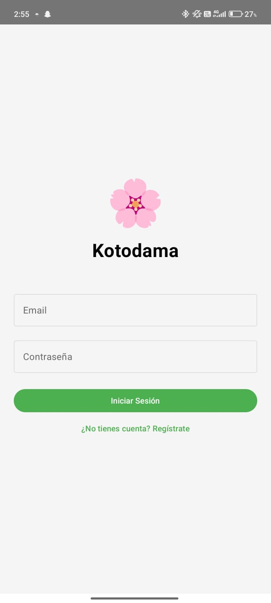
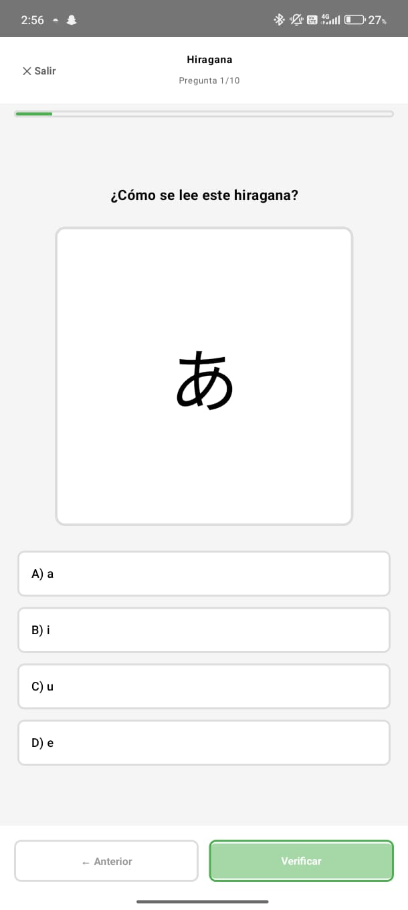
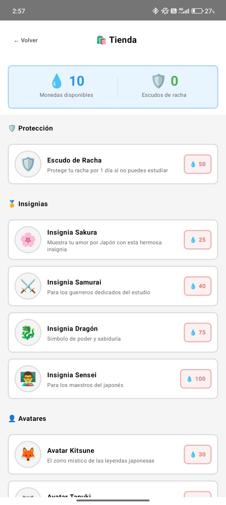
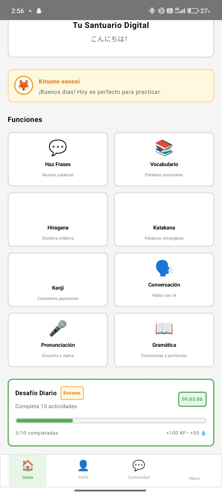
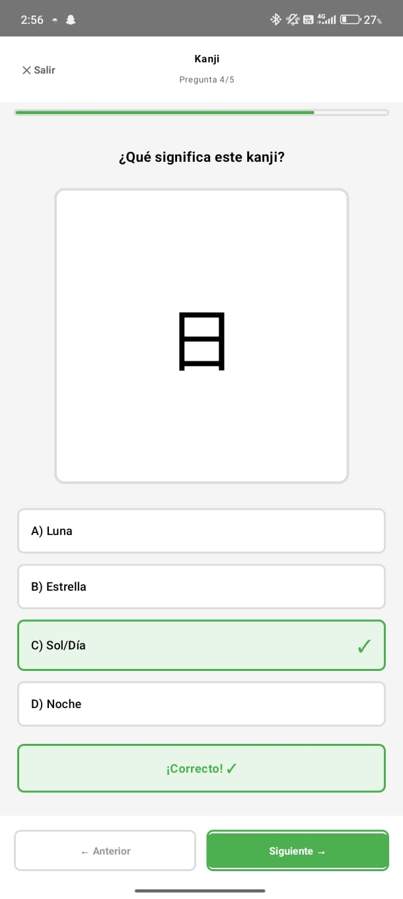
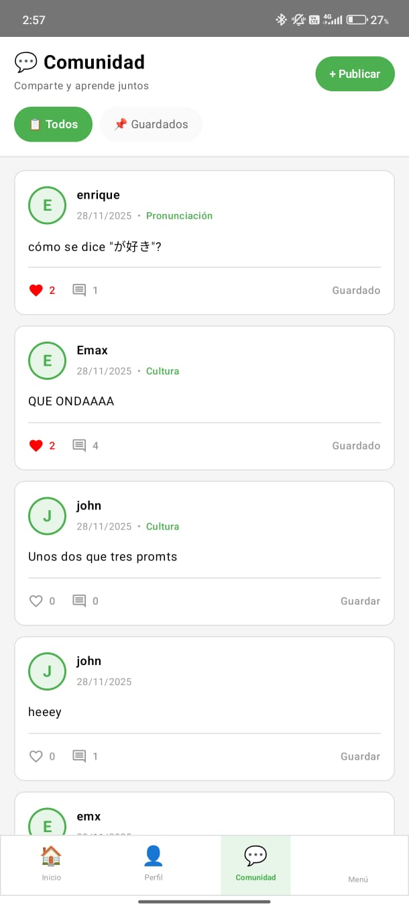

<div align="center">

# 🏯 Kotodama: Aprende Japonés

### *El camino del idioma comienza con una sola palabra*


[](https://github.com/Guarghuk/AprendeJapones)
[](https://github.com/Guarghuk/AprendeJapones/releases)
[](LICENSE)
[](https://kotlinlang.org/)
[](https://developer.android.com/)
[](https://developer.android.com/topic/architecture)

</div>

---

## 📱 Descripción del Proyecto

**Kotodama: Aprende Japonés** es una aplicación móvil educativa desarrollada en Android nativo con Kotlin, diseñada específicamente para hispanohablantes que desean iniciar o fortalecer su aprendizaje del idioma japonés. El nombre "Kotodama" (言霊) proviene del concepto japonés que significa "el espíritu de las palabras", reflejando nuestra filosofía de que cada palabra aprendida cobra vida y significado en el usuario.

El mercado actual de aplicaciones para aprender japonés presenta una problemática significativa: la mayoría de las herramientas disponibles están diseñadas para angloparlantes, carecen de explicaciones culturales contextualizadas, o implementan metodologías poco efectivas que resultan en altas tasas de abandono. **Kotodama** surge como respuesta a esta necesidad, ofreciendo una experiencia de aprendizaje inmersiva, gamificada y culturalmente relevante que conecta directamente con el usuario hispanohablante.

Nuestra aplicación está dirigida a estudiantes universitarios, profesionales interesados en la cultura japonesa, entusiastas del anime y manga, y cualquier persona que busque una herramienta efectiva y accesible para dominar los fundamentos del japonés. A través de lecciones estructuradas, ejercicios interactivos y un sistema de progresión motivador, **Kotodama** transforma el desafiante proceso de aprender japonés en una experiencia gratificante y sostenible.

---

## ✨ Características Principales

| Característica | Descripción |
|:--------------|:------------|
| 🎌 **Sistema de Escritura Completo** | Aprende Hiragana, Katakana y los Kanji más utilizados con trazos animados, pronunciación nativa y ejercicios de reconocimiento. |
| 🎮 **Gamificación Inteligente** | Sistema de puntos, rachas diarias, logros desbloqueables y niveles de progresión que mantienen la motivación del usuario. |
| 🏯 **Comunidad Integrada** | Comunidad virtual en la cual los usuarios pueden ayudarse a entender lecciones, preguntar sobre cultura y expresión dentro de la aplicación. |
| 📚 **Lecciones Contextualizadas** | Contenido organizado por situaciones reales: presentaciones, restaurantes, transporte, compras y conversaciones cotidianas. |
| 📊 **Seguimiento de Progreso** | Dashboard personalizado con estadísticas de aprendizaje, áreas de mejora identificadas y recomendaciones adaptativas. |
| 💾 **Funcionalidad Offline** | Lecciones para estudiar sin conexión a internet, ideal para transporte público o viajes. |

---

## 📸 Galería de Interfaz

<div align="center">

| 🏠 Inicio / Login | 📖 Funcionalidad Principal | 📋 Detalles |
|:-----------------:|:--------------------------:|:-----------:|
|  |  |  |
| *Pantalla de bienvenida* | *Lección de Hiragana* | *Sistema de Tienda* |
|  |  |  |
| *Dashboard de progreso* | *Aprendizaje de Kanji* | *Sistema de Comunidad* |

</div>

---

## 🛠 Stack Tecnológico y Arquitectura

### Tecnologías Utilizadas

| Categoría | Tecnología | Propósito |
|:----------|:-----------|:----------|
| **Lenguaje** |  | Lenguaje principal de desarrollo |
| **IDE** |  | Entorno de desarrollo integrado |
| **UI Framework** |  | Framework declarativo de UI |
| **Base de Datos** |  | Persistencia local de datos |
| **Async** |  | Programación asíncrona |
| **Diseño** |  | Sistema de diseño UI/UX |
| **Control de Versiones** |  | Gestión del código fuente |

### Arquitectura MVVM

```
┌─────────────────────────────────────────────────────────────┐
│                        📱 VIEW                              │
│              (Activities / Composables)                     │
│         Observa estados y emite eventos de usuario          │
└─────────────────────┬───────────────────────────────────────┘
                      │ ⬆️ StateFlow / LiveData
                      ▼
┌─────────────────────────────────────────────────────────────┐
│                    🧠 VIEWMODEL                             │
│              (Lógica de presentación)                       │
│      Procesa eventos, gestiona estado UI, coordina          │
└─────────────────────┬───────────────────────────────────────┘
                      │ ⬆️ Suspend Functions / Flow
                      ▼
┌─────────────────────────────────────────────────────────────┐
│                    📦 REPOSITORY                           │
│              (Abstracción de datos)                        │
│         Única fuente de verdad para el ViewModel           │
└──────────┬─────────────────────────────────────────────────┘
           │                                 
           ▼                                 
┌─────────────────────────────────────────────────────────────┐
│                    🗄️ LOCAL (Room Database)                │
│                    Base de datos SQLite                     │
└─────────────────────────────────────────────────────────────┘
```

La arquitectura **MVVM (Model-View-ViewModel)** fue seleccionada por las siguientes razones técnicas:

- **Separación de responsabilidades**: Cada capa tiene una función específica, facilitando el mantenimiento y las pruebas unitarias.
- **Reactividad**: El uso de `StateFlow` y `LiveData` permite que la UI reaccione automáticamente a cambios en los datos.
- **Lifecycle-aware**: Los ViewModels sobreviven a cambios de configuración, evitando pérdida de datos y llamadas redundantes.
- **Testabilidad**: La lógica de negocio aislada en ViewModels y Repositories permite pruebas unitarias sin dependencias de Android.

---

## 📁 Estructura del Proyecto

```
AprendeJapones/
├── app/
│   ├── src/
│   │   ├── main/
│   │   │   ├── java/com/guarghuk/aprendejapones/
│   │   │   │   ├── data/           # Capa de datos (Room, repositorios)
│   │   │   │   ├── domain/         # Lógica de negocio y casos de uso
│   │   │   │   ├── ui/             # Componentes de interfaz (Compose)
│   │   │   │   │   ├── screens/    # Pantallas de la aplicación
│   │   │   │   │   ├── components/ # Componentes reutilizables
│   │   │   │   │   └── theme/      # Configuración de tema
│   │   │   │   └── utils/          # Utilidades y extensiones
│   │   │   ├── res/                # Recursos (strings, drawables, etc.)
│   │   │   └── AndroidManifest.xml
│   │   └── test/                   # Tests unitarios
│   └── build.gradle.kts
├── docs/
│   └── screenshots/                # Capturas de pantalla
├── gradle/
├── build.gradle.kts
├── settings.gradle.kts
└── README.md
```

---


## 📝 Documentación Técnica

### 🛠️ Tutorial Completo: Creación de la Aplicación Kotodama

Esta guía contiene el código completo de todas las clases de la aplicación, organizado en el orden en que fueron creadas. Cada sección incluye una explicación del propósito del archivo seguido del código fuente completo.

---

### 📂 Configuración Inicial


#### 📄 `KotodamaApplication.kt`

Este es el punto de entrada de nuestra aplicación. Configura Hilt para la inyección de dependencias y WorkManager para tareas en segundo plano.


```kotlin
package com.example.aprendejapones

import android.app.Application
import androidx.hilt.work.HiltWorkerFactory
import androidx.work.Configuration
import com.example.aprendejapones.workers.WorkManagerScheduler
import dagger.hilt.android.HiltAndroidApp
import javax.inject.Inject

/**
 * Clase Application principal para la aplicación Kotodama.
 *
 * Esta clase inicializa los componentes fundamentales de la aplicación:
 * - **Hilt:** Inyección de dependencias mediante `@HiltAndroidApp`
 * - **WorkManager:** Configuración para workers con soporte de Hilt
 * - **Verificación de Racha:** Programación de verificación diaria
 *
 * ## Inicialización de WorkManager
 * Implementa [Configuration.Provider] para proporcionar una configuración
 * personalizada de WorkManager que usa [HiltWorkerFactory] para permitir
 * la inyección de dependencias en Workers.
 *
 * ## Lifecycle
 * - [onCreate]: Programa la verificación diaria de racha
 * - [workManagerConfiguration]: Configura WorkManager con HiltWorkerFactory
 *
 * ## Uso
 *
 * Esta clase debe declararse en el AndroidManifest.xml:
 *
 * ```xml
 * <application
 *     android:name=".KotodamaApplication"
 *     ...>
 * ```
 *
 * @property workerFactory Factory para crear Workers con inyección de dependencias.
 * @property workManagerScheduler Scheduler para programar verificación de racha.
 *
 * @see WorkManagerScheduler Para programación de workers.
 * @see HiltWorkerFactory Para inyección en workers.
 *
 * @author Kotodama Team
 * @since 1.0.0
 */
@HiltAndroidApp
class KotodamaApplication : Application(), Configuration.Provider {

    /** Factory de Hilt para crear workers con inyección de dependencias */
    @Inject
    lateinit var workerFactory: HiltWorkerFactory

    /** Scheduler para programar verificación de racha y recordatorios */
    @Inject
    lateinit var workManagerScheduler: WorkManagerScheduler

    /**
     * Inicializa la aplicación.
     *
     * Programa la verificación diaria de racha que se ejecuta a medianoche
     * para detectar si el usuario perdió su racha por no estudiar.
     */
    override fun onCreate() {
        super.onCreate()

        // Programar verificación diaria de racha
        workManagerScheduler.scheduleStreakCheck()
    }

    /**
     * Proporciona la configuración de WorkManager.
     *
     * Configura WorkManager para usar [HiltWorkerFactory], permitiendo
     * que los workers reciban dependencias mediante inyección de Hilt.
     *
     * @return Configuración de WorkManager con HiltWorkerFactory.
     */
    override val workManagerConfiguration: Configuration
        get() = Configuration.Builder()
            .setWorkerFactory(workerFactory)
            .build()
}
```


#### 📄 `MainActivity.kt`

La actividad principal que renderiza toda la interfaz usando Jetpack Compose. Implementa el patrón Single Activity.


```kotlin
package com.example.aprendejapones

import android.Manifest
import android.content.pm.PackageManager
import android.os.Build
import android.os.Bundle
import androidx.activity.ComponentActivity
import androidx.activity.compose.setContent
import androidx.activity.result.contract.ActivityResultContracts
import androidx.activity.viewModels
import androidx.compose.foundation.layout.Box
import androidx.compose.foundation.layout.fillMaxSize
import androidx.compose.material3.CircularProgressIndicator
import androidx.compose.material3.MaterialTheme
import androidx.compose.material3.Surface
import androidx.compose.runtime.collectAsState
import androidx.compose.runtime.getValue
import androidx.compose.ui.Alignment
import androidx.compose.ui.Modifier
import androidx.core.content.ContextCompat
import com.example.aprendejapones.presentation.navigation.KotodamaNavGraph
import com.example.aprendejapones.presentation.navigation.Screen
import com.example.aprendejapones.presentation.screens.splash.SplashViewModel
import com.example.aprendejapones.presentation.theme.KotodamaTheme
import com.example.aprendejapones.presentation.theme.PrimaryGreen
import dagger.hilt.android.AndroidEntryPoint

@AndroidEntryPoint
class MainActivity : ComponentActivity() {

    private val splashViewModel: SplashViewModel by viewModels()

    // ✅ Agregar launcher para permisos
    private val notificationPermissionLauncher = registerForActivityResult(
        ActivityResultContracts.RequestPermission()
    ) { isGranted ->
        // Permiso concedido o denegado
    }

    override fun onCreate(savedInstanceState: Bundle?) {
        super.onCreate(savedInstanceState)

        // ✅ Solicitar permiso de notificaciones (Android 13+)
        requestNotificationPermission()

        setContent {
            KotodamaTheme {
                Surface(
                    modifier = Modifier.fillMaxSize(),
                    color = MaterialTheme.colorScheme.background
                ) {
                    val destination by splashViewModel.navigationDestination.collectAsState()

                    when (destination) {
                        null -> {
                            Box(
                                modifier = Modifier.fillMaxSize(),
                                contentAlignment = Alignment.Center
                            ) {
                                CircularProgressIndicator(color = PrimaryGreen)
                            }
                        }
                        "onboarding" -> {
                            KotodamaNavGraph(startDestination = Screen.Onboarding.route)
                        }
                        "login" -> {
                            KotodamaNavGraph(startDestination = Screen.Login.route)
                        }
                        "home" -> {
                            KotodamaNavGraph(startDestination = Screen.Home.route)
                        }
                    }
                }
            }
        }
    }

    // ✅ Nueva función para solicitar permisos
    private fun requestNotificationPermission() {
        if (Build.VERSION.SDK_INT >= Build.VERSION_CODES.TIRAMISU) {
            if (ContextCompat.checkSelfPermission(
                    this,
                    Manifest.permission.POST_NOTIFICATIONS
                ) != PackageManager.PERMISSION_GRANTED
            ) {
                notificationPermissionLauncher.launch(Manifest.permission.POST_NOTIFICATIONS)
            }
        }
    }
}
```


### 📂 Modelos de Dominio


#### 📄 `domain/model/User.kt`

Modelos principales del usuario: User, DailyChallenge, LessonFunction y KitsuneMessage.


```kotlin
package com.example.aprendejapones.domain.model

/**
 * Modelo de dominio que representa a un usuario de la aplicación Kotodama.
 *
 * Este modelo es una entidad de negocio pura, sin dependencias de frameworks externos,
 * siguiendo los principios de Clean Architecture. Contiene toda la información
 * relacionada con el perfil del usuario y su progreso en la aplicación.
 *
 * @property id Identificador único del usuario (UUID).
 * @property username Nombre de usuario para mostrar en la aplicación.
 * @property rank Rango actual del usuario en japonés (ej: "初心者" = Principiante).
 * @property level Nivel actual del usuario basado en la experiencia acumulada.
 * @property currentXP Puntos de experiencia actuales en el nivel actual.
 * @property maxXP Puntos de experiencia necesarios para subir al siguiente nivel.
 * @property streak Racha de días consecutivos de estudio.
 * @property drops Moneda virtual del usuario (gotas/drops).
 * @property memberSince Fecha de registro del usuario formateada como "MMMM yyyy".
 * @property avatarLetter Primera letra del nombre de usuario para el avatar.
 *
 * @see DailyChallenge Para información sobre los desafíos diarios del usuario.
 * @see LessonFunction Para las lecciones disponibles.
 *
 * @author Kotodama Team
 * @since 1.0.0
 */
data class User(
    val id: String,
    val username: String,
    val rank: String,
    val level: Int,
    val currentXP: Int,
    val maxXP: Int,
    val streak: Int,
    val drops: Int,
    val memberSince: String,
    val avatarLetter: String = username.firstOrNull()?.toString() ?: "K"
) {
    /**
     * Calcula el progreso de experiencia como un valor entre 0.0 y 1.0.
     *
     * Este valor es útil para mostrar barras de progreso en la UI.
     *
     * @return Valor flotante entre 0.0 (sin progreso) y 1.0 (nivel completo).
     */
    val xpProgress: Float
        get() = if (maxXP > 0) currentXP.toFloat() / maxXP.toFloat() else 0f
}

/**
 * Modelo de dominio que representa un desafío diario.
 *
 * Los desafíos diarios son objetivos que el usuario debe completar cada día
 * para ganar recompensas de XP y monedas. Se reinician a medianoche.
 *
 * @property id Identificador único del desafío.
 * @property completed Número de tareas completadas del desafío.
 * @property total Número total de tareas para completar el desafío.
 * @property timeRemaining Tiempo restante hasta que expire el desafío (formato string).
 * @property rewardXP Cantidad de puntos de experiencia otorgados al completar.
 * @property rewardCoins Cantidad de monedas otorgadas al completar.
 * @property difficulty Nivel de dificultad del desafío.
 *
 * @see ChallengeDifficulty Para los niveles de dificultad disponibles.
 * @see User Para la información del usuario que completa el desafío.
 *
 * @author Kotodama Team
 * @since 1.0.0
 */
data class DailyChallenge(
    val id: String,
    val completed: Int,
    val total: Int,
    val timeRemaining: String,
    val rewardXP: Int = 50,
    val rewardCoins: Int = 20,
    val difficulty: ChallengeDifficulty = ChallengeDifficulty.MEDIUM
) {
    /**
     * Calcula el progreso del desafío como un valor entre 0.0 y 1.0.
     *
     * @return Valor flotante entre 0.0 (sin progreso) y 1.0 (completado).
     */
    val progress: Float
        get() = if (total > 0) completed.toFloat() / total.toFloat() else 0f

    /**
     * Indica si el desafío ha sido completado.
     *
     * @return `true` si todas las tareas del desafío están completadas, `false` en caso contrario.
     */
    val isCompleted: Boolean
        get() = completed >= total
}

/**
 * Enumeración que define los niveles de dificultad para los desafíos diarios.
 *
 * Cada nivel de dificultad tiene un nombre para mostrar en la UI y una
 * recompensa de monedas asociada. A mayor dificultad, mayor recompensa.
 *
 * @property displayName Nombre de la dificultad para mostrar al usuario (en español).
 * @property coinReward Cantidad de monedas adicionales por completar un desafío de esta dificultad.
 *
 * @author Kotodama Team
 * @since 1.0.0
 */
enum class ChallengeDifficulty(val displayName: String, val coinReward: Int) {
    /** Dificultad fácil: ideal para principiantes. Recompensa: 10 monedas. */
    EASY("Fácil", 10),

    /** Dificultad normal: nivel estándar. Recompensa: 20 monedas. */
    MEDIUM("Normal", 20),

    /** Dificultad difícil: para usuarios avanzados. Recompensa: 35 monedas. */
    HARD("Difícil", 35),

    /** Dificultad extrema: máximo desafío. Recompensa: 50 monedas. */
    EXTREME("Extremo", 50)
}

/**
 * Modelo de dominio que representa una función o lección disponible en la aplicación.
 *
 * Las funciones de lección son las diferentes categorías de contenido educativo
 * que el usuario puede estudiar, como Hiragana, Katakana, Kanji, etc.
 *
 * @property id Identificador único de la función/lección.
 * @property icon Emoji o código del icono para mostrar en la UI.
 * @property name Nombre de la lección (ej: "Hiragana", "Kanji").
 * @property subtitle Descripción breve del contenido de la lección.
 * @property isLocked Indica si la lección está bloqueada y requiere desbloqueo.
 * @property progress Porcentaje de progreso en la lección (0-100).
 *
 * @author Kotodama Team
 * @since 1.0.0
 */
data class LessonFunction(
    val id: String,
    val icon: String,
    val name: String,
    val subtitle: String,
    val isLocked: Boolean = false,
    val progress: Int = 0
)

/**
 * Modelo de dominio que representa un mensaje del personaje Kitsune.
 *
 * Kitsune es la mascota de la aplicación que proporciona mensajes motivacionales
 * y consejos al usuario durante su aprendizaje.
 *
 * @property message Contenido del mensaje del Kitsune.
 * @property timestamp Marca de tiempo Unix de cuando se generó el mensaje.
 *
 * @author Kotodama Team
 * @since 1.0.0
 */
data class KitsuneMessage(
    val message: String,
    val timestamp: Long = System.currentTimeMillis()
)
```


#### 📄 `domain/model/Response.kt`

Clase sellada para manejar estados de operaciones asíncronas: Loading, Success, Failure.


```kotlin
package com.example.aprendejapones.domain.model

/**
 * Clase sellada que representa el estado de una operación asíncrona.
 *
 * Este patrón se utiliza para manejar los diferentes estados de las operaciones
 * de red o base de datos, proporcionando una forma type-safe de representar
 * carga, éxito y error.
 *
 * ## Uso
 *
 * ```kotlin
 * when (response) {
 *     is Response.Loading -> showLoadingIndicator()
 *     is Response.Success -> displayData(response.data)
 *     is Response.Failure -> showError(response.e?.message)
 * }
 * ```
 *
 * @param T Tipo de dato que contendrá en caso de éxito.
 *
 * @see Loading Estado que indica que la operación está en progreso.
 * @see Success Estado que indica que la operación fue exitosa con datos.
 * @see Failure Estado que indica que la operación falló.
 *
 * @author Kotodama Team
 * @since 1.0.0
 */
sealed class Response<out T> {

    /**
     * Estado que indica que una operación está en progreso.
     *
     * Útil para mostrar indicadores de carga en la UI mientras
     * se espera el resultado de una operación asíncrona.
     */
    object Loading: Response<Nothing>()

    /**
     * Estado que indica que la operación fue exitosa.
     *
     * Contiene los datos resultantes de la operación.
     *
     * @property data Los datos obtenidos de la operación exitosa.
     */
    data class Success<out T>(val data: T): Response<T>()

    /**
     * Estado que indica que la operación falló.
     *
     * Contiene información sobre el error ocurrido.
     *
     * @property e La excepción que causó el fallo (puede ser null).
     */
    data class Failure<out T>(val e: Exception?): Response<T>()
}
```


#### 📄 `domain/model/FirebaseModels.kt`

Modelos para Firestore: Publicaciones, Comentarios, Likes y sus versiones legacy.


```kotlin
package com.example.aprendejapones.domain.model

/**
 * Modelo de usuario en Firestore con nomenclatura en español.
 *
 * Este modelo representa el perfil público del usuario almacenado en Firebase Firestore.
 * Utiliza convención de nombres en español (snake_case) para compatibilidad con
 * las reglas de seguridad de Firestore y el esquema de la base de datos.
 *
 * @property id_usuario Identificador único del usuario en Firestore.
 * @property nombre_usuario Nombre de usuario para mostrar públicamente.
 * @property foto_url URL de la foto de perfil del usuario (puede ser null).
 * @property rango Rango del usuario en japonés (por defecto "初心者" = Principiante).
 * @property nivel Nivel actual del usuario.
 * @property biografia Descripción o biografía del usuario (opcional).
 * @property fecha_registro Timestamp de cuando se registró el usuario.
 *
 * @see FirestoreUser Modelo legacy para compatibilidad durante la migración.
 *
 * @author Kotodama Team
 * @since 2.0.0
 */
data class UsuariosFirestore(
    val id_usuario: String = "",
    val nombre_usuario: String = "",
    val foto_url: String? = null,
    val rango: String = "初心者",
    val nivel: Int = 1,
    val biografia: String? = null,
    val fecha_registro: Long = System.currentTimeMillis()
)

/**
 * Modelo de publicación en Firestore con nomenclatura en español.
 *
 * Representa una publicación en la comunidad de la aplicación. Las publicaciones
 * pueden recibir likes y comentarios de otros usuarios.
 *
 * @property id_publicacion Identificador único de la publicación.
 * @property id_autor ID del usuario que creó la publicación.
 * @property nombre_autor Nombre del autor para mostrar.
 * @property contenido Texto de la publicación.
 * @property categoria Categoría de la publicación (ej: "General", "Preguntas").
 * @property fecha_publicacion Timestamp de creación de la publicación.
 * @property contador_likes Número total de likes en la publicación.
 * @property contador_comentarios Número total de comentarios en la publicación.
 *
 * @see Comentarios Para los comentarios de la publicación.
 * @see Likes Para los likes de la publicación.
 *
 * @author Kotodama Team
 * @since 2.0.0
 */
data class Publicaciones(
    val id_publicacion: String = "",
    val id_autor: String = "",
    val nombre_autor: String = "",
    val contenido: String = "",
    val categoria: String = "General",
    val fecha_publicacion: Long = System.currentTimeMillis(),
    val contador_likes: Int = 0,
    val contador_comentarios: Int = 0
)

/**
 * Modelo de comentario en Firestore con nomenclatura en español.
 *
 * Representa un comentario realizado por un usuario en una publicación.
 *
 * @property id_comentario Identificador único del comentario.
 * @property id_publicacion ID de la publicación a la que pertenece el comentario.
 * @property id_autor ID del usuario que escribió el comentario.
 * @property nombre_autor Nombre del autor para mostrar.
 * @property contenido Texto del comentario.
 * @property fecha_publicacion Timestamp de cuando se creó el comentario.
 *
 * @see Publicaciones Para la publicación padre del comentario.
 *
 * @author Kotodama Team
 * @since 2.0.0
 */
data class Comentarios(
    val id_comentario: String = "",
    val id_publicacion: String = "",
    val id_autor: String = "",
    val nombre_autor: String = "",
    val contenido: String = "",
    val fecha_publicacion: Long = System.currentTimeMillis()
)

/**
 * Modelo de like en Firestore con nomenclatura en español.
 *
 * Representa un "me gusta" dado por un usuario a una publicación.
 * Se almacena como subcolección dentro de cada publicación.
 *
 * @property id_usuario ID del usuario que dio el like.
 * @property fecha_reaccion Timestamp de cuando se dio el like.
 *
 * @see Publicaciones Para la publicación que recibió el like.
 *
 * @author Kotodama Team
 * @since 2.0.0
 */
data class Likes(
    val id_usuario: String = "",
    val fecha_reaccion: Long = System.currentTimeMillis()
)

// ============================================================
// Legacy models for backward compatibility during migration
// ============================================================

/**
 * Modelo de usuario legacy en Firestore para compatibilidad con versiones anteriores.
 *
 * **Nota:** Este modelo se mantiene por compatibilidad durante la migración de datos.
 * Para nuevas implementaciones, usar [UsuariosFirestore].
 *
 * Contiene información completa del perfil del usuario incluyendo datos de
 * autenticación, progreso y preferencias.
 *
 * @property id Identificador único del usuario (generalmente el UID de Firebase Auth).
 * @property username Nombre de usuario para mostrar.
 * @property email Correo electrónico del usuario.
 * @property photoUrl URL de la foto de perfil (opcional).
 * @property rank Rango del usuario en japonés.
 * @property level Nivel actual del usuario.
 * @property xp Puntos de experiencia totales.
 * @property streak Días consecutivos de estudio.
 * @property drops Monedas virtuales del usuario.
 * @property bio Biografía del usuario (opcional).
 * @property createdAt Timestamp de creación de la cuenta.
 * @property updatedAt Timestamp de la última actualización.
 *
 * @see UsuariosFirestore Nuevo modelo con nomenclatura en español.
 *
 * @author Kotodama Team
 * @since 1.0.0
 * @deprecated Usar [UsuariosFirestore] para nuevas implementaciones.
 */
data class FirestoreUser(
    val id: String = "",
    val username: String = "",
    val email: String = "",
    val photoUrl: String? = null,
    val rank: String = "初心者",
    val level: Int = 1,
    val xp: Int = 0,
    val streak: Int = 0,
    val drops: Int = 0,
    val bio: String? = null,
    val createdAt: Long = System.currentTimeMillis(),
    val updatedAt: Long = System.currentTimeMillis()

)

/**
 * Modelo de publicación legacy en Firestore para compatibilidad.
 *
 * **Nota:** Este modelo se mantiene por compatibilidad durante la migración.
 * Para nuevas implementaciones, usar [Publicaciones].
 *
 * @property id Identificador único de la publicación.
 * @property authorId ID del autor de la publicación.
 * @property authorName Nombre del autor para mostrar.
 * @property content Contenido textual de la publicación.
 * @property category Categoría de la publicación.
 * @property createdAt Timestamp de creación.
 * @property likes Lista de IDs de usuarios que dieron like.
 * @property comments Lista de IDs de comentarios.
 * @property isLiked Indica si el usuario actual dio like (calculado en cliente, no se almacena).
 * @property likesCount Contador de likes.
 * @property commentsCount Contador de comentarios.
 * @property savesCount Contador de guardados/bookmarks.
 *
 * @see Publicaciones Nuevo modelo con nomenclatura en español.
 *
 * @author Kotodama Team
 * @since 1.0.0
 * @deprecated Usar [Publicaciones] para nuevas implementaciones.
 */
data class FirestorePost(
    val id: String = "",
    val authorId: String = "",
    val authorName: String = "",
    val content: String = "",
    val category: String = "General",
    val createdAt: Long = System. currentTimeMillis(),
    val likes: List<String> = emptyList(),
    val comments: List<String> = emptyList(),
    val isLiked: Boolean = false,
    val likesCount: Int = 0,
    val commentsCount: Int = 0,
    val savesCount: Int = 0
)

/**
 * Modelo de comentario legacy en Firestore para compatibilidad.
 *
 * **Nota:** Este modelo se mantiene por compatibilidad durante la migración.
 * Para nuevas implementaciones, usar [Comentarios].
 *
 * @property id Identificador único del comentario.
 * @property postId ID de la publicación a la que pertenece.
 * @property authorId ID del autor del comentario.
 * @property authorName Nombre del autor para mostrar.
 * @property authorPhotoUrl URL de la foto del autor (opcional).
 * @property content Contenido textual del comentario.
 * @property createdAt Timestamp de creación.
 * @property parentCommentId ID del comentario padre si es una respuesta (opcional).
 *
 * @see Comentarios Nuevo modelo con nomenclatura en español.
 *
 * @author Kotodama Team
 * @since 1.0.0
 * @deprecated Usar [Comentarios] para nuevas implementaciones.
 */
data class FirestoreComment(
    val id: String = "",
    val postId: String = "",
    val authorId: String = "",
    val authorName: String = "",
    val authorPhotoUrl: String? = null,
    val content: String = "",
    val createdAt: Long = System.currentTimeMillis(),
    val parentCommentId: String? = null
)

/**
 * Modelo de like legacy en Firestore para compatibilidad.
 *
 * **Nota:** Este modelo se mantiene por compatibilidad durante la migración.
 * Para nuevas implementaciones, usar [Likes].
 *
 * @property userId ID del usuario que dio el like.
 * @property postId ID de la publicación que recibió el like.
 * @property createdAt Timestamp de cuando se dio el like.
 *
 * @see Likes Nuevo modelo con nomenclatura en español.
 *
 * @author Kotodama Team
 * @since 1.0.0
 * @deprecated Usar [Likes] para nuevas implementaciones.
 */
data class FirestoreLike(
    val userId: String = "",
    val postId: String = "",
    val createdAt: Long = System.currentTimeMillis()
)

/**
 * Modelo de publicación guardada (bookmark) legacy en Firestore.
 *
 * Representa cuando un usuario guarda una publicación para ver más tarde.
 *
 * **Nota:** Este modelo se mantiene por compatibilidad durante la migración.
 *
 * @property userId ID del usuario que guardó la publicación.
 * @property postId ID de la publicación guardada.
 * @property createdAt Timestamp de cuando se guardó.
 *
 * @author Kotodama Team
 * @since 1.0.0
 */
data class FirestoreSavedPost(
    val userId: String = "",
    val postId: String = "",
    val createdAt: Long = System.currentTimeMillis()
)
```


### 📂 Interfaces de Repositorios (Domain)


#### 📄 `domain/repository/UserRepository.kt`

Contrato para la gestión del usuario local.


```kotlin
package com.example.aprendejapones.domain.repository

import com.example.aprendejapones.domain.model.User
import kotlinx.coroutines.flow.Flow

/**
 * Repositorio para la gestión de usuarios locales.
 *
 * Esta interfaz define el contrato para las operaciones relacionadas con
 * el usuario local almacenado en Room Database. Gestiona el perfil del
 * usuario, progreso, experiencia y moneda virtual.
 *
 * ## Diferencia con [FirestoreUserRepository]
 * - Este repositorio maneja datos locales (Room Database)
 * - [FirestoreUserRepository] maneja datos en la nube (Firestore)
 *
 * ## Responsabilidades
 * - Crear y obtener el usuario local
 * - Gestionar puntos de experiencia (XP) y niveles
 * - Gestionar la racha de estudio
 * - Gestionar la moneda virtual (drops)
 *
 * @see User Modelo de dominio del usuario.
 * @see FirestoreUserRepository Para operaciones en Firestore.
 *
 * @author Kotodama Team
 * @since 1.0.0
 */
interface UserRepository {

    /**
     * Obtiene el usuario actual como un Flow reactivo.
     *
     * Permite observar cambios en tiempo real en los datos del usuario,
     * actualizándose automáticamente cuando hay modificaciones en la
     * base de datos local.
     *
     * @return Flow que emite el [User] actual o `null` si no existe.
     */
    fun getCurrentUserFlow(): Flow<User?>

    /**
     * Obtiene el usuario actual de forma única (no reactiva).
     *
     * Útil cuando solo se necesita el valor actual sin observar cambios.
     *
     * @return El [User] actual o `null` si no existe.
     */
    suspend fun getCurrentUser(): User?

    /**
     * Obtiene el usuario existente o crea uno nuevo.
     *
     * Si no existe un usuario en la base de datos local, crea uno
     * nuevo con valores por defecto y un UUID único.
     *
     * @return El [User] existente o el recién creado.
     */
    suspend fun getOrCreateUser(): User

    /**
     * Actualiza el perfil del usuario.
     *
     * Persiste los cambios del modelo [User] en la base de datos local.
     *
     * @param user El [User] con los datos actualizados.
     */
    suspend fun updateUser(user: User)

    /**
     * Añade puntos de experiencia al usuario y gestiona subidas de nivel.
     *
     * Cuando los XP superan el máximo del nivel actual, el usuario
     * sube de nivel automáticamente. Los XP sobrantes se conservan
     * para el nuevo nivel.
     *
     * @param xp Cantidad de puntos de experiencia a añadir.
     * @return El [User] actualizado con el nuevo XP y posible nuevo nivel.
     * @throws IllegalStateException Si no se encuentra el usuario.
     */
    suspend fun addXP(xp: Int): User

    /**
     * Actualiza la racha de días de estudio del usuario.
     *
     * La racha representa días consecutivos de estudio.
     * Un valor de 0 indica que la racha se ha roto.
     *
     * @param streak Nueva cantidad de días de racha.
     */
    suspend fun updateStreak(streak: Int)

    /**
     * Añade monedas (drops) al usuario.
     *
     * Los drops son la moneda virtual que se puede ganar
     * completando lecciones y desafíos.
     *
     * @param amount Cantidad de drops a añadir (debe ser positivo).
     */
    suspend fun addDrops(amount: Int)

    /**
     * Gasta monedas (drops) del usuario.
     *
     * Verifica que el usuario tenga suficientes drops antes de gastar.
     *
     * @param amount Cantidad de drops a gastar.
     * @return `true` si el gasto fue exitoso, `false` si no hay suficientes drops.
     */
    suspend fun spendDrops(amount: Int): Boolean
}

```


#### 📄 `domain/repository/AuthRepository.kt`

Contrato para operaciones de autenticación.


```kotlin
package com.example.aprendejapones.domain.repository

import com.example.aprendejapones.domain.model.FirestoreUser
import kotlinx.coroutines.flow.Flow

/**
 * Repositorio de autenticación para gestionar el login, registro y sesión de usuarios.
 *
 * Esta interfaz define el contrato para las operaciones de autenticación,
 * abstrayendo la implementación concreta de Firebase Auth u otros proveedores.
 *
 * ## Responsabilidades
 * - Autenticación con email y contraseña
 * - Autenticación con Google Sign-In
 * - Gestión de la sesión del usuario
 * - Creación de cuentas nuevas
 *
 * ## Uso
 *
 * ```kotlin
 * // Observar cambios de autenticación
 * authRepository.currentUser.collect { user ->
 *     if (user != null) navigateToHome() else navigateToLogin()
 * }
 *
 * // Iniciar sesión
 * val result = authRepository.loginWithEmail(email, password)
 * result.fold(
 *     onSuccess = { user -> println("Bienvenido ${user.username}") },
 *     onFailure = { error -> showError(error.message) }
 * )
 * ```
 *
 * @see FirestoreUser Modelo de usuario autenticado.
 * @see FirestoreUserRepository Para operaciones de perfil de usuario.
 *
 * @author Kotodama Team
 * @since 1.0.0
 */
interface AuthRepository {

    /**
     * Flow reactivo que emite el usuario actualmente autenticado.
     *
     * Emite `null` cuando no hay usuario autenticado, lo que permite
     * observar cambios en tiempo real del estado de autenticación.
     *
     * @return Flow que emite el [FirestoreUser] actual o `null`.
     */
    val currentUser: Flow<FirestoreUser?>

    /**
     * Inicia sesión con email y contraseña.
     *
     * Si el usuario no existe en Firestore, se crea un nuevo perfil
     * automáticamente.
     *
     * @param email Correo electrónico del usuario.
     * @param password Contraseña del usuario.
     * @return [Result] con el [FirestoreUser] si fue exitoso, o la excepción si falló.
     */
    suspend fun loginWithEmail(email: String, password: String): Result<FirestoreUser>

    /**
     * Inicia sesión con Google Sign-In.
     *
     * Utiliza el token de ID proporcionado por Google para autenticar
     * al usuario. Si es la primera vez, se crea un perfil en Firestore.
     *
     * @param idToken Token de ID de Google obtenido del proceso de Google Sign-In.
     * @return [Result] con el [FirestoreUser] si fue exitoso, o la excepción si falló.
     */
    suspend fun loginWithGoogle(idToken: String): Result<FirestoreUser>

    /**
     * Registra un nuevo usuario con email y contraseña.
     *
     * Crea una cuenta nueva en Firebase Auth y un perfil correspondiente
     * en Firestore con el nombre de usuario proporcionado.
     *
     * @param email Correo electrónico para la nueva cuenta.
     * @param password Contraseña para la nueva cuenta (mínimo 6 caracteres).
     * @param username Nombre de usuario para mostrar en la aplicación.
     * @return [Result] con el [FirestoreUser] creado si fue exitoso, o la excepción si falló.
     */
    suspend fun registerWithEmail(
        email: String,
        password: String,
        username: String
    ): Result<FirestoreUser>

    /**
     * Cierra la sesión del usuario actual.
     *
     * Después de llamar a este método, [currentUser] emitirá `null`.
     */
    suspend fun logout()

    /**
     * Verifica si hay un usuario con sesión activa.
     *
     * @return `true` si hay un usuario autenticado, `false` en caso contrario.
     */
    suspend fun isUserLoggedIn(): Boolean

    /**
     * Obtiene el ID del usuario actualmente autenticado.
     *
     * @return ID del usuario o `null` si no hay sesión activa.
     */
    suspend fun getCurrentUserId(): String?
}
```


#### 📄 `domain/repository/LessonRepository.kt`

Contrato para la gestión de lecciones.


```kotlin
package com.example.aprendejapones.domain.repository

import com.example.aprendejapones.domain.model.DailyChallenge
import kotlinx.coroutines.flow.Flow

/**
 * Modelo de datos que representa las estadísticas de lecciones del usuario.
 *
 * Contiene información agregada sobre el progreso del usuario en todas
 * las lecciones completadas.
 *
 * @property totalLessonsCompleted Número total de lecciones completadas.
 * @property totalStudyTimeMinutes Tiempo total de estudio en minutos.
 * @property totalXPEarned Total de puntos de experiencia ganados.
 *
 * @author Kotodama Team
 * @since 1.0.0
 */
data class LessonStats(
    val totalLessonsCompleted: Int,
    val totalStudyTimeMinutes: Int,
    val totalXPEarned: Int
)

/**
 * Repositorio para la gestión de lecciones y desafíos diarios.
 *
 * Esta interfaz define el contrato para las operaciones relacionadas con
 * las lecciones de aprendizaje de japonés y los desafíos diarios que
 * el usuario puede completar.
 *
 * ## Responsabilidades
 * - Guardar el progreso de lecciones completadas
 * - Obtener estadísticas de estudio
 * - Gestionar desafíos diarios (creación, actualización, progreso)
 *
 * ## Desafíos Diarios
 * Los desafíos se reinician cada día a medianoche y otorgan
 * recompensas de XP y monedas al completarse.
 *
 * @see LessonStats Estadísticas de lecciones.
 * @see DailyChallenge Modelo del desafío diario.
 * @see LessonContentRepository Para el contenido de las lecciones.
 *
 * @author Kotodama Team
 * @since 1.0.0
 */
interface LessonRepository {

    /**
     * Guarda una lección completada en el historial.
     *
     * Registra los detalles de la lección para estadísticas y tracking
     * del progreso del usuario.
     *
     * @param lessonType Tipo de lección (ej: "Hiragana", "Kanji").
     * @param lessonName Nombre específico de la lección.
     * @param totalQuestions Número total de preguntas en la lección.
     * @param correctAnswers Número de respuestas correctas.
     * @param xpEarned Puntos de experiencia ganados.
     * @param timeSpentSeconds Tiempo empleado en segundos.
     */
    suspend fun saveLesson(
        lessonType: String,
        lessonName: String,
        totalQuestions: Int,
        correctAnswers: Int,
        xpEarned: Int,
        timeSpentSeconds: Int
    )

    /**
     * Obtiene las estadísticas agregadas de todas las lecciones.
     *
     * @return [LessonStats] con las estadísticas totales del usuario.
     */
    suspend fun getLessonStats(): LessonStats

    /**
     * Obtiene el desafío diario de hoy.
     *
     * @return El [DailyChallenge] de hoy o `null` si no existe.
     */
    suspend fun getTodayChallenge(): DailyChallenge?

    /**
     * Obtiene el desafío diario como un Flow reactivo.
     *
     * Permite observar cambios en tiempo real del desafío diario,
     * actualizándose automáticamente cuando hay progreso.
     *
     * @return Flow que emite el [DailyChallenge] actual o `null`.
     */
    fun getTodayChallengeFlow(): Flow<DailyChallenge?>

    /**
     * Actualiza el progreso del desafío diario.
     *
     * Incrementa el contador de tareas completadas del desafío.
     * Debe llamarse cada vez que el usuario complete una actividad
     * que contribuya al desafío.
     */
    suspend fun updateChallengeProgress()

    /**
     * Inicializa el desafío del día si no existe.
     *
     * Crea un nuevo desafío diario con valores aleatorios si aún
     * no se ha creado uno para el día actual. Si ya existe, no
     * hace nada.
     */
    suspend fun initializeTodayChallenge()
}
```


#### 📄 `domain/repository/LessonContentRepository.kt`

Contrato para el contenido de las lecciones.


```kotlin
package com.example.aprendejapones.domain.repository

import com.example.aprendejapones.presentation.screens.lesson.Question
import javax.inject.Inject
import javax.inject.Singleton

/**
 * Repositorio para obtener el contenido de lecciones de japonés.
 *
 * Proporciona las preguntas y ejercicios para cada tipo de lección.
 * Actualmente utiliza datos hardcoded, pero está diseñado para
 * conectarse fácilmente a una API o base de datos local en el futuro.
 *
 * ## Lecciones Disponibles
 * - **Hiragana:** Lectura de los 46 caracteres básicos hiragana
 * - **Katakana:** Lectura de los 46 caracteres básicos katakana
 * - **Kanji:** Significado de kanji básicos (elementos, días)
 * - **Vocabulario:** Palabras y expresiones comunes
 * - **Gramática:** Partículas, verbos y estructuras
 * - **Haz Frases:** Construcción de oraciones
 * - **Conversación:** Respuestas a situaciones cotidianas
 * - **Pronunciación:** Vocalización y entonación correcta
 *
 * ## Formato de Preguntas
 * Cada pregunta sigue el formato de [Question]:
 * - `id`: Identificador único
 * - `text`: Pregunta al usuario
 * - `content`: Contenido visual (carácter, kanji, emoji)
 * - `options`: 4 opciones de respuesta
 * - `correctAnswer`: La opción correcta
 *
 * ## Uso
 *
 * ```kotlin
 * class LessonViewModel @Inject constructor(
 *     private val lessonContentRepository: LessonContentRepository
 * ) : ViewModel() {
 *
 *     fun loadLesson(lessonName: String) {
 *         val questions = lessonContentRepository.getQuestionsForLesson(lessonName)
 *         // Mostrar preguntas al usuario
 *     }
 * }
 * ```
 *
 * ## Extensibilidad
 * Para añadir nuevas lecciones:
 * 1. Crear un nuevo método `getXXXQuestions()`
 * 2. Añadir el caso en el `when` de [getQuestionsForLesson]
 *
 * @see Question Modelo de pregunta utilizado.
 * @see LessonRepository Para guardar el progreso de lecciones.
 *
 * @author Kotodama Team
 * @since 1.0.0
 */
@Singleton
class LessonContentRepository @Inject constructor() {

    /**
     * Obtiene las preguntas para una lección específica.
     *
     * @param lessonName Nombre de la lección (ej: "Hiragana", "Kanji").
     * @return Lista de [Question] para la lección solicitada.
     *         Si no se reconoce el nombre, retorna preguntas por defecto.
     */
    fun getQuestionsForLesson(lessonName: String): List<Question> {
        return when (lessonName) {
            "Hiragana" -> getHiraganaQuestions()
            "Katakana" -> getKatakanaQuestions()
            "Kanji" -> getKanjiQuestions()
            "Vocabulario" -> getVocabularyQuestions()
            "Gramática" -> getGrammarQuestions()
            "Haz Frases" -> getPhrasesQuestions()
            "Conversación" -> getConversationQuestions()
            "Pronunciación" -> getPronunciationQuestions()
            else -> getDefaultQuestions()
        }
    }

    /**
     * Obtiene las preguntas de la lección de Hiragana.
     *
     * Cubre las vocales básicas (あ, い, う, え, お) y la serie K (か, き, く, け, こ).
     *
     * @return Lista de 10 preguntas sobre lectura de hiragana.
     */
    private fun getHiraganaQuestions(): List<Question> {
        return listOf(
            Question(
                id = "h1",
                text = "¿Cómo se lee este hiragana?",
                content = "あ",
                options = listOf("A) a", "B) i", "C) u", "D) e"),
                correctAnswer = "A) a"
            ),
            Question(
                id = "h2",
                text = "¿Cómo se lee este hiragana?",
                content = "い",
                options = listOf("A) a", "B) i", "C) u", "D) e"),
                correctAnswer = "B) i"
            ),
            Question(
                id = "h3",
                text = "¿Cómo se lee este hiragana?",
                content = "う",
                options = listOf("A) a", "B) i", "C) u", "D) e"),
                correctAnswer = "C) u"
            ),
            Question(
                id = "h4",
                text = "¿Cómo se lee este hiragana?",
                content = "え",
                options = listOf("A) a", "B) i", "C) u", "D) e"),
                correctAnswer = "D) e"
            ),
            Question(
                id = "h5",
                text = "¿Cómo se lee este hiragana?",
                content = "お",
                options = listOf("A) o", "B) ka", "C) ki", "D) ku"),
                correctAnswer = "A) o"
            ),
            Question(
                id = "h6",
                text = "¿Cómo se lee este hiragana?",
                content = "か",
                options = listOf("A) o", "B) ka", "C) ki", "D) ku"),
                correctAnswer = "B) ka"
            ),
            Question(
                id = "h7",
                text = "¿Cómo se lee este hiragana?",
                content = "き",
                options = listOf("A) o", "B) ka", "C) ki", "D) ku"),
                correctAnswer = "C) ki"
            ),
            Question(
                id = "h8",
                text = "¿Cómo se lee este hiragana?",
                content = "く",
                options = listOf("A) o", "B) ka", "C) ki", "D) ku"),
                correctAnswer = "D) ku"
            ),
            Question(
                id = "h9",
                text = "¿Cómo se lee este hiragana?",
                content = "け",
                options = listOf("A) ke", "B) ko", "C) sa", "D) shi"),
                correctAnswer = "A) ke"
            ),
            Question(
                id = "h10",
                text = "¿Cómo se lee este hiragana?",
                content = "こ",
                options = listOf("A) ke", "B) ko", "C) sa", "D) shi"),
                correctAnswer = "B) ko"
            )
        )
    }

    /**
     * Obtiene las preguntas de la lección de Katakana.
     *
     * Cubre las vocales básicas y palabras extranjeras comunes escritas en katakana.
     *
     * @return Lista de 5 preguntas sobre lectura de katakana.
     */
    private fun getKatakanaQuestions(): List<Question> {
        return listOf(
            Question(
                id = "k1",
                text = "¿Cómo se lee este katakana?",
                content = "ア",
                options = listOf("A) a", "B) i", "C) u", "D) e"),
                correctAnswer = "A) a"
            ),
            Question(
                id = "k2",
                text = "¿Cómo se lee este katakana?",
                content = "イ",
                options = listOf("A) a", "B) i", "C) u", "D) e"),
                correctAnswer = "B) i"
            ),
            Question(
                id = "k3",
                text = "¿Cómo se lee este katakana?",
                content = "ウ",
                options = listOf("A) a", "B) i", "C) u", "D) e"),
                correctAnswer = "C) u"
            ),
            Question(
                id = "k4",
                text = "¿Cómo se escribe 'coffee' en katakana?",
                content = "コーヒー",
                options = listOf("A) koohii", "B) kohii", "C) koohi", "D) coffee"),
                correctAnswer = "A) koohii"
            ),
            Question(
                id = "k5",
                text = "¿Qué palabra es esta en katakana?",
                content = "テレビ",
                options = listOf("A) terefon", "B) terebi", "C) telefon", "D) camera"),
                correctAnswer = "B) terebi"
            )
        )
    }

    /**
     * Obtiene las preguntas de la lección de Kanji.
     *
     * Cubre kanji básicos relacionados con elementos naturales y días.
     *
     * @return Lista de 5 preguntas sobre significado de kanji.
     */
    private fun getKanjiQuestions(): List<Question> {
        return listOf(
            Question(
                id = "kj1",
                text = "¿Qué significa este kanji?",
                content = "水",
                options = listOf("A) Fuego", "B) Agua", "C) Tierra", "D) Aire"),
                correctAnswer = "B) Agua"
            ),
            Question(
                id = "kj2",
                text = "¿Qué significa este kanji?",
                content = "火",
                options = listOf("A) Fuego", "B) Agua", "C) Tierra", "D) Viento"),
                correctAnswer = "A) Fuego"
            ),
            Question(
                id = "kj3",
                text = "¿Qué significa este kanji?",
                content = "木",
                options = listOf("A) Metal", "B) Árbol", "C) Piedra", "D) Tierra"),
                correctAnswer = "B) Árbol"
            ),
            Question(
                id = "kj4",
                text = "¿Qué significa este kanji?",
                content = "日",
                options = listOf("A) Luna", "B) Estrella", "C) Sol/Día", "D) Noche"),
                correctAnswer = "C) Sol/Día"
            ),
            Question(
                id = "kj5",
                text = "¿Qué significa este kanji?",
                content = "月",
                options = listOf("A) Luna/Mes", "B) Sol", "C) Año", "D) Día"),
                correctAnswer = "A) Luna/Mes"
            )
        )
    }

    /**
     * Obtiene las preguntas de la lección de Vocabulario.
     *
     * Cubre saludos y expresiones básicas en japonés.
     *
     * @return Lista de 5 preguntas sobre vocabulario básico.
     */
    private fun getVocabularyQuestions(): List<Question> {
        return listOf(
            Question(
                id = "v1",
                text = "¿Cómo se dice 'gracias' en japonés?",
                content = "?",
                options = listOf("A) Konnichiwa", "B) Arigatou", "C) Sayonara", "D) Ohayou"),
                correctAnswer = "B) Arigatou"
            ),
            Question(
                id = "v2",
                text = "¿Cómo se dice 'buenos días'?",
                content = "?",
                options = listOf("A) Konbanwa", "B) Oyasumi", "C) Ohayou", "D) Konnichiwa"),
                correctAnswer = "C) Ohayou"
            ),
            Question(
                id = "v3",
                text = "¿Qué significa 'Sayonara'?",
                content = "さようなら",
                options = listOf("A) Hola", "B) Adiós", "C) Gracias", "D) Perdón"),
                correctAnswer = "B) Adiós"
            ),
            Question(
                id = "v4",
                text = "¿Cómo se dice 'sí'?",
                content = "?",
                options = listOf("A) Hai", "B) Iie", "C) Demo", "D) Sou"),
                correctAnswer = "A) Hai"
            ),
            Question(
                id = "v5",
                text = "¿Qué significa 'Sumimasen'?",
                content = "すみません",
                options = listOf("A) Gracias", "B) Perdón/Disculpe", "C) Adiós", "D) Por favor"),
                correctAnswer = "B) Perdón/Disculpe"
            )
        )
    }

    /**
     * Obtiene las preguntas de la lección de Gramática.
     *
     * Cubre partículas japonesas y conjugaciones verbales básicas.
     *
     * @return Lista de 5 preguntas sobre gramática japonesa.
     */
    private fun getGrammarQuestions(): List<Question> {
        return listOf(
            Question(
                id = "g1",
                text = "¿Cuál es la partícula de sujeto?",
                content = "?",
                options = listOf("A) は (wa)", "B) が (ga)", "C) を (wo)", "D) に (ni)"),
                correctAnswer = "B) が (ga)"
            ),
            Question(
                id = "g2",
                text = "¿Cuál es la partícula de tópico?",
                content = "?",
                options = listOf("A) は (wa)", "B) が (ga)", "C) を (wo)", "D) の (no)"),
                correctAnswer = "A) は (wa)"
            ),
            Question(
                id = "g3",
                text = "¿Cuál es la partícula de objeto directo?",
                content = "?",
                options = listOf("A) は (wa)", "B) が (ga)", "C) を (wo)", "D) に (ni)"),
                correctAnswer = "C) を (wo)"
            ),
            Question(
                id = "g4",
                text = "¿Cómo se forma el presente negativo de 'taberu' (comer)?",
                content = "食べる",
                options = listOf(
                    "A) tabenai",
                    "B) tabemasen",
                    "C) tabenakatta",
                    "D) tabemasen deshita"
                ),
                correctAnswer = "A) tabenai"
            ),
            Question(
                id = "g5",
                text = "¿Qué significa 'desu'?",
                content = "です",
                options = listOf(
                    "A) Verbo 'ser/estar' formal",
                    "B) Partícula",
                    "C) Pregunta",
                    "D) Negación"
                ),
                correctAnswer = "A) Verbo 'ser/estar' formal"
            )
        )
    }

    /**
     * Obtiene las preguntas de la lección "Haz Frases".
     *
     * Cubre construcción de oraciones básicas en japonés.
     *
     * @return Lista de 3 preguntas sobre construcción de frases.
     */
    private fun getPhrasesQuestions(): List<Question> {
        return listOf(
            Question(
                id = "p1",
                text = "¿Cómo se dice 'Me llamo Juan'?",
                content = "?",
                options = listOf(
                    "A) Watashi wa Juan desu",
                    "B) Juan wa watashi desu",
                    "C) Desu wa Juan watashi",
                    "D) Juan desu watashi wa"
                ),
                correctAnswer = "A) Watashi wa Juan desu"
            ),
            Question(
                id = "p2",
                text = "¿Cómo se dice 'Me gusta el sushi'?",
                content = "?",
                options = listOf(
                    "A) Sushi ga suki desu",
                    "B) Watashi wa sushi desu",
                    "C) Sushi wa suki desu",
                    "D) Suki wa sushi desu"
                ),
                correctAnswer = "A) Sushi ga suki desu"
            ),
            Question(
                id = "p3",
                text = "Completa: '_____ es estudiante'",
                content = "Watashi ___ gakusei desu",
                options = listOf("A) wa", "B) ga", "C) wo", "D) ni"),
                correctAnswer = "A) wa"
            )
        )
    }

    /**
     * Obtiene las preguntas de la lección de Conversación.
     *
     * Cubre respuestas apropiadas a situaciones cotidianas.
     *
     * @return Lista de 2 preguntas sobre conversación.
     */
    private fun getConversationQuestions(): List<Question> {
        return listOf(
            Question(
                id = "c1",
                text = "Responde a: 'Ogenki desu ka?' (¿Cómo estás?)",
                content = "お元気ですか？",
                options = listOf(
                    "A) Genki desu (Estoy bien)",
                    "B) Arigatou (Gracias)",
                    "C) Sumimasen (Perdón)",
                    "D) Sayonara (Adiós)"
                ),
                correctAnswer = "A) Genki desu (Estoy bien)"
            ),
            Question(
                id = "c2",
                text = "¿Cómo preguntas 'Cuánto cuesta?'",
                content = "?",
                options = listOf(
                    "A) Ikura desu ka?",
                    "B) Nan desu ka?",
                    "C) Doko desu ka?",
                    "D) Dare desu ka?"
                ),
                correctAnswer = "A) Ikura desu ka?"
            )
        )
    }

    /**
     * Obtiene las preguntas de la lección de Pronunciación.
     *
     * Cubre reglas de vocalización y entonación en japonés.
     *
     * @return Lista de 2 preguntas sobre pronunciación.
     */
    private fun getPronunciationQuestions(): List<Question> {
        return listOf(
            Question(
                id = "pr1",
                text = "¿Cómo se pronuncia correctamente?",
                content = "りょうり (ryouri)",
                options = listOf(
                    "A) rio-ri",
                    "B) ryo-u-ri",
                    "C) rio-uri",
                    "D) ryo-ri (largo)"
                ),
                correctAnswer = "B) ryo-u-ri"
            ),
            Question(
                id = "pr2",
                text = "¿Cuál vocal es larga en esta palabra?",
                content = "おかあさん (okaasan)",
                options = listOf(
                    "A) Primera 'o'",
                    "B) 'a' del medio",
                    "C) Última 'a'",
                    "D) Ninguna"
                ),
                correctAnswer = "B) 'a' del medio"
            )
        )
    }

    /**
     * Obtiene preguntas por defecto para lecciones no reconocidas.
     *
     * Proporciona una experiencia básica si se solicita una lección
     * que no está implementada.
     *
     * @return Lista con 1 pregunta introductoria.
     */
    private fun getDefaultQuestions(): List<Question> {
        return listOf(
            Question(
                id = "d1",
                text = "¿Listo para aprender?",
                content = "🎌",
                options = listOf("A) ¡Sí!", "B) Tal vez", "C) No estoy seguro", "D) Más tarde"),
                correctAnswer = "A) ¡Sí!"
            )
        )
    }
}
```


#### 📄 `domain/repository/ProgressRepository.kt`

Contrato para el seguimiento del progreso.


```kotlin
package com.example.aprendejapones.domain.repository

import kotlinx.coroutines.flow.Flow

/**
 * Modelo de datos que representa el progreso en una categoría de aprendizaje.
 *
 * Cada categoría (Hiragana, Katakana, Kanji, etc.) tiene su propio
 * registro de progreso que indica cuántos elementos ha aprendido
 * el usuario.
 *
 * @property category Nombre de la categoría (ej: "Hiragana", "Kanji").
 * @property progress Porcentaje de progreso (0-100).
 * @property itemsLearned Número de elementos aprendidos.
 * @property totalItems Número total de elementos en la categoría.
 *
 * @author Kotodama Team
 * @since 1.0.0
 */
data class CategoryProgress(
    val category: String,
    val progress: Int,
    val itemsLearned: Int,
    val totalItems: Int
)

/**
 * Repositorio para la gestión del progreso de aprendizaje.
 *
 * Esta interfaz define el contrato para las operaciones relacionadas
 * con el seguimiento del progreso del usuario en las diferentes
 * categorías de aprendizaje del japonés.
 *
 * ## Categorías de Progreso
 * - **Hiragana:** 46 caracteres básicos + variantes
 * - **Katakana:** 46 caracteres básicos + variantes
 * - **Kanji:** Kanji organizados por nivel JLPT
 * - **Vocabulario:** Palabras y expresiones
 * - **Gramática:** Reglas gramaticales
 *
 * @see CategoryProgress Modelo de progreso por categoría.
 *
 * @author Kotodama Team
 * @since 1.0.0
 */
interface ProgressRepository {

    /**
     * Obtiene el progreso de todas las categorías como Flow reactivo.
     *
     * Emite actualizaciones cuando cambia el progreso de cualquier
     * categoría, permitiendo actualizar la UI automáticamente.
     *
     * @return Flow que emite la lista de [CategoryProgress].
     */
    fun getUserProgressFlow(): Flow<List<CategoryProgress>>

    /**
     * Obtiene el progreso de todas las categorías de forma única.
     *
     * @return Lista de [CategoryProgress] con el estado actual.
     */
    suspend fun getAllProgress(): List<CategoryProgress>

    /**
     * Obtiene el progreso de una categoría específica.
     *
     * @param category Nombre de la categoría a consultar.
     * @return [CategoryProgress] de la categoría o `null` si no existe.
     */
    suspend fun getProgressByCategory(category: String): CategoryProgress?

    /**
     * Actualiza el progreso de una categoría.
     *
     * Se debe llamar cuando el usuario aprende nuevos elementos
     * o completa actividades en una categoría.
     *
     * @param category Nombre de la categoría a actualizar.
     * @param progressPercent Nuevo porcentaje de progreso (0-100).
     * @param itemsLearned Nuevo número de elementos aprendidos.
     */
    suspend fun updateProgress(
        category: String,
        progressPercent: Int,
        itemsLearned: Int
    )

    /**
     * Inicializa las categorías de progreso por defecto.
     *
     * Crea registros de progreso para todas las categorías con
     * valores iniciales de 0. Se debe llamar al crear un nuevo usuario.
     */
    suspend fun initializeDefaultProgress()
}
```


#### 📄 `domain/repository/AchievementRepository.kt`

Contrato para el sistema de logros.


```kotlin
package com.example.aprendejapones.domain.repository

import com.example.aprendejapones.utils.Achievement
import kotlinx.coroutines.flow.Flow

/**
 * Repositorio para la gestión de logros (achievements).
 *
 * Esta interfaz define el contrato para las operaciones relacionadas con
 * el sistema de logros de la aplicación. Los logros se desbloquean
 * automáticamente cuando el usuario cumple ciertos criterios.
 *
 * ## Sistema de Logros
 * - Los logros tienen un progreso que se actualiza según las acciones del usuario
 * - Cuando el progreso alcanza el objetivo, el logro se desbloquea
 * - Algunos logros pueden otorgar recompensas de XP o monedas
 *
 * ## Ejemplos de Logros
 * - "Primer paso" - Completar la primera lección
 * - "Racha de 7 días" - Estudiar 7 días consecutivos
 * - "Maestro del Hiragana" - Completar todas las lecciones de Hiragana
 *
 * @see Achievement Modelo de logro.
 *
 * @author Kotodama Team
 * @since 1.0.0
 */
interface AchievementRepository {

    /**
     * Obtiene todos los logros del usuario como Flow reactivo.
     *
     * Emite actualizaciones cuando cambia el estado de algún logro,
     * permitiendo actualizar la UI automáticamente.
     *
     * @return Flow que emite la lista de [Achievement].
     */
    fun getUserAchievementsFlow(): Flow<List<Achievement>>

    /**
     * Obtiene todos los logros del usuario de forma única.
     *
     * Útil cuando solo se necesita el valor actual sin observar cambios.
     *
     * @return Lista de [Achievement] del usuario.
     */
    suspend fun getUserAchievements(): List<Achievement>

    /**
     * Inicializa los logros por defecto para un usuario nuevo.
     *
     * Crea todos los logros disponibles con progreso inicial de 0.
     * Este método debe llamarse al crear un nuevo usuario.
     */
    suspend fun initializeDefaultAchievements()

    /**
     * Desbloquea un logro específico.
     *
     * Marca el logro como completado y registra la fecha de desbloqueo.
     * Puede otorgar recompensas asociadas al logro.
     *
     * @param achievementId ID del logro a desbloquear.
     */
    suspend fun unlockAchievement(achievementId: String)

    /**
     * Actualiza el progreso de un logro.
     *
     * Incrementa el contador de progreso del logro. Si el progreso
     * alcanza el objetivo, el logro debe desbloquearse automáticamente.
     *
     * @param achievementId ID del logro a actualizar.
     * @param progress Nuevo valor de progreso.
     */
    suspend fun updateAchievementProgress(achievementId: String, progress: Int)

    /**
     * Verifica y desbloquea logros basándose en las estadísticas del usuario.
     *
     * Este método debe llamarse después de acciones que puedan
     * contribuir a desbloquear logros, como completar lecciones,
     * subir de nivel, etc.
     */
    suspend fun checkAchievements()
}
```


#### 📄 `domain/repository/CommunityRepository.kt`

Contrato para funcionalidades de comunidad.


```kotlin
package com.example.aprendejapones.domain.repository

import com.example.aprendejapones.domain.model.FirestoreComment
import com.example.aprendejapones.domain.model.FirestorePost
import kotlinx.coroutines.flow.Flow

/**
 * Repositorio para las funcionalidades de comunidad.
 *
 * Esta interfaz define el contrato completo para las operaciones de la
 * comunidad de la aplicación, incluyendo publicaciones, comentarios,
 * likes y guardados (bookmarks).
 *
 * ## Funcionalidades
 * - **Publicaciones:** Crear, listar, eliminar
 * - **Likes:** Dar/quitar like, verificar estado
 * - **Comentarios:** Añadir, listar
 * - **Guardados:** Guardar/quitar publicaciones para ver después
 *
 * ## Flujos Reactivos
 * Varios métodos devuelven [Flow] para actualizaciones en tiempo real,
 * especialmente útil cuando se usan con Firestore listeners.
 *
 * @see FirestorePost Modelo de publicación.
 * @see FirestoreComment Modelo de comentario.
 * @see PostRepository Para obtención simple de publicaciones.
 *
 * @author Kotodama Team
 * @since 1.0.0
 */
interface CommunityRepository {

    /**
     * Obtiene el stream de publicaciones en tiempo real.
     *
     * Las publicaciones se ordenan por fecha de creación (más recientes primero).
     *
     * @return Flow que emite la lista actualizada de [FirestorePost].
     */
    fun getPostsFlow(): Flow<List<FirestorePost>>

    /**
     * Crea una nueva publicación.
     *
     * El autor se asigna automáticamente basándose en el usuario autenticado.
     *
     * @param content Contenido textual de la publicación.
     * @param category Categoría de la publicación (ej: "General", "Preguntas").
     * @return [Result] con éxito o la excepción si falló.
     */
    suspend fun createPost(content: String, category: String): Result<Unit>

    /**
     * Da "me gusta" a una publicación.
     *
     * Crea un registro de like en la subcolección de la publicación.
     * Si el usuario ya dio like, la operación no tiene efecto adicional.
     *
     * @param postId ID de la publicación.
     * @return [Result] con éxito o la excepción si falló.
     */
    suspend fun likePost(postId: String): Result<Unit>

    /**
     * Quita el "me gusta" de una publicación.
     *
     * Elimina el registro de like del usuario actual de la publicación.
     *
     * @param postId ID de la publicación.
     * @return [Result] con éxito o la excepción si falló.
     */
    suspend fun unlikePost(postId: String): Result<Unit>

    /**
     * Añade un comentario a una publicación.
     *
     * El autor del comentario se asigna automáticamente.
     *
     * @param postId ID de la publicación a comentar.
     * @param content Contenido del comentario.
     * @return [Result] con éxito o la excepción si falló.
     */
    suspend fun addComment(postId: String, content: String): Result<Unit>

    /**
     * Obtiene los comentarios de una publicación en tiempo real.
     *
     * Los comentarios se ordenan por fecha de creación.
     *
     * @param postId ID de la publicación.
     * @return Flow que emite la lista actualizada de [FirestoreComment].
     */
    fun getCommentsFlow(postId: String): Flow<List<FirestoreComment>>

    /**
     * Verifica si el usuario actual ha dado like a una publicación.
     *
     * @param postId ID de la publicación a verificar.
     * @return `true` si el usuario dio like, `false` en caso contrario.
     */
    suspend fun hasUserLikedPost(postId: String): Boolean

    /**
     * Elimina una publicación.
     *
     * Solo el autor de la publicación puede eliminarla. Esta operación
     * también elimina los likes y comentarios asociados.
     *
     * @param postId ID de la publicación a eliminar.
     * @return [Result] con éxito o la excepción si falló.
     */
    suspend fun deletePost(postId: String): Result<Unit>

    /**
     * Guarda una publicación (bookmark).
     *
     * Añade la publicación a la lista de guardados del usuario
     * para verla después.
     *
     * @param postId ID de la publicación a guardar.
     * @return [Result] con éxito o la excepción si falló.
     */
    suspend fun savePost(postId: String): Result<Unit>

    /**
     * Quita una publicación de guardados.
     *
     * Remueve la publicación de la lista de guardados del usuario.
     *
     * @param postId ID de la publicación a quitar de guardados.
     * @return [Result] con éxito o la excepción si falló.
     */
    suspend fun unsavePost(postId: String): Result<Unit>

    /**
     * Verifica si el usuario actual ha guardado una publicación.
     *
     * @param postId ID de la publicación a verificar.
     * @return `true` si está guardada, `false` en caso contrario.
     */
    suspend fun hasUserSavedPost(postId: String): Boolean

    /**
     * Obtiene las publicaciones guardadas del usuario actual.
     *
     * @return Flow que emite la lista actualizada de publicaciones guardadas.
     */
    fun getSavedPostsFlow(): Flow<List<FirestorePost>>

    /**
     * Obtiene los IDs de las publicaciones guardadas.
     *
     * Útil para verificar rápidamente el estado de guardado
     * sin cargar las publicaciones completas.
     *
     * @return Flow que emite el Set de IDs de publicaciones guardadas.
     */
    fun getSavedPostIdsFlow(): Flow<Set<String>>

    /**
     * Obtiene los IDs de las publicaciones con like del usuario.
     *
     * Útil para mostrar el estado de like en listas de publicaciones
     * sin consultar cada una individualmente.
     *
     * @return Flow que emite el Set de IDs de publicaciones con like.
     */
    fun getLikedPostIdsFlow(): Flow<Set<String>>

    /**
     * Obtiene las publicaciones de un usuario específico.
     *
     * Útil para mostrar las publicaciones en el perfil de usuario.
     *
     * @param userId ID del usuario cuyas publicaciones se quieren obtener.
     * @return Flow que emite la lista de publicaciones del usuario.
     */
    fun getUserPostsFlow(userId: String): Flow<List<FirestorePost>>
}

```


#### 📄 `domain/repository/PostRepository.kt`

Contrato para operaciones con publicaciones.


```kotlin
package com.example.aprendejapones.domain.repository

import com.example.aprendejapones.domain.model.FirestorePost
import com.example.aprendejapones.domain.model.Response
import kotlinx.coroutines.flow.Flow

/**
 * Alias de tipo para una lista de publicaciones de Firestore.
 *
 * @see FirestorePost Modelo individual de publicación.
 */
typealias Posts = List<FirestorePost>

/**
 * Repositorio para la obtención de publicaciones.
 *
 * Esta interfaz proporciona métodos para obtener publicaciones de la
 * comunidad, envueltas en el tipo [Response] que indica el estado de
 * la operación (cargando, éxito, error).
 *
 * ## Diferencia con [CommunityRepository]
 * - Este repositorio solo lee publicaciones con estado de respuesta
 * - [CommunityRepository] proporciona operaciones CRUD completas
 *
 * @see Response Para los estados de la respuesta.
 * @see FirestorePost Modelo de publicación.
 * @see CommunityRepository Para operaciones CRUD de comunidad.
 *
 * @author Kotodama Team
 * @since 1.0.0
 */
interface PostRepository {

    /**
     * Obtiene todas las publicaciones como un Flow reactivo.
     *
     * El Flow emite [Response.Loading] inicialmente, seguido de
     * [Response.Success] con las publicaciones o [Response.Failure]
     * si ocurre un error.
     *
     * @return Flow que emite el estado [Response] con la lista de [FirestorePost].
     */
    fun getPosts(): Flow<Response<Posts>>

    /**
     * Obtiene las publicaciones de un usuario específico.
     *
     * Útil para mostrar las publicaciones en el perfil de un usuario.
     *
     * @param userId ID del usuario cuyas publicaciones se quieren obtener.
     * @return Flow que emite el estado [Response] con las publicaciones del usuario.
     */
    fun getPostsByUserId(userId: String): Flow<Response<Posts>>
}
```


#### 📄 `domain/repository/FirestoreUserRepository.kt`

Contrato para sincronización con Firestore.


```kotlin
package com.example.aprendejapones.domain.repository

import android.net.Uri
import com.example.aprendejapones.domain.model.FirestoreUser
import kotlinx.coroutines.flow.Flow

/**
 * Repositorio para operaciones de usuario en Firestore.
 *
 * Esta interfaz define el contrato para las operaciones del perfil
 * de usuario almacenado en Firebase Firestore, incluyendo actualización
 * de perfil, subida de fotos, sincronización y gestión de XP.
 *
 * ## Diferencia con [UserRepository]
 * - Este repositorio maneja datos en la nube (Firestore)
 * - [UserRepository] maneja datos locales (Room Database)
 *
 * ## Funcionalidades
 * - Lectura y escritura del perfil de usuario
 * - Subida de fotos de perfil a Firebase Storage
 * - Sincronización de datos locales con la nube
 * - Gestión de XP y niveles
 *
 * @see FirestoreUser Modelo de usuario en Firestore.
 * @see UserRepository Para operaciones con datos locales.
 * @see AuthRepository Para autenticación.
 *
 * @author Kotodama Team
 * @since 1.0.0
 */
interface FirestoreUserRepository {

    /**
     * Obtiene el perfil de usuario como Flow para actualizaciones en tiempo real.
     *
     * Utiliza un listener de Firestore para recibir cambios automáticamente.
     *
     * @param userId ID del usuario a observar.
     * @return Flow que emite el [FirestoreUser] o `null` si no existe.
     */
    fun getUserProfileFlow(userId: String): Flow<FirestoreUser?>

    /**
     * Obtiene el perfil de usuario de forma única.
     *
     * Realiza una consulta puntual a Firestore.
     *
     * @param userId ID del usuario a obtener.
     * @return [FirestoreUser] o `null` si no existe.
     */
    suspend fun getUserProfile(userId: String): FirestoreUser?

    /**
     * Actualiza el perfil de usuario en Firestore.
     *
     * Sobrescribe el documento completo del usuario.
     *
     * @param user El [FirestoreUser] con los datos actualizados.
     * @return [Result] con éxito o la excepción si falló.
     */
    suspend fun updateUserProfile(user: FirestoreUser): Result<Unit>

    /**
     * Sube una foto de perfil a Firebase Storage.
     *
     * La imagen se almacena en el path `profile_photos/{userId}/profile.jpg`.
     *
     * @param userId ID del usuario dueño de la foto.
     * @param uri URI local de la imagen a subir.
     * @return [Result] con la URL de descarga de la imagen o error.
     */
    suspend fun uploadProfilePhoto(userId: String, uri: Uri): Result<String>

    /**
     * Actualiza campos específicos del perfil del usuario.
     *
     * Más eficiente que [updateUserProfile] cuando solo se necesita
     * modificar algunos campos.
     *
     * @param userId ID del usuario a actualizar.
     * @param fields Mapa de campos a actualizar con sus nuevos valores.
     * @return [Result] con éxito o la excepción si falló.
     */
    suspend fun updateUserFields(userId: String, fields: Map<String, Any>): Result<Unit>

    /**
     * Sincroniza datos locales del usuario con Firestore.
     *
     * Útil para hacer backup de datos locales o al vincular
     * una cuenta local con una cuenta de Firebase.
     *
     * @param user El [FirestoreUser] con los datos a sincronizar.
     * @return [Result] con éxito o la excepción si falló.
     */
    suspend fun syncUserToFirestore(user: FirestoreUser): Result<Unit>

    /**
     * Obtiene el perfil del usuario actualmente autenticado.
     *
     * Combina la obtención del ID de Firebase Auth con la consulta
     * del perfil en Firestore.
     *
     * @return [FirestoreUser] del usuario actual o `null` si no hay sesión.
     */
    suspend fun getCurrentUserProfile(): FirestoreUser?

    /**
     * Añade XP al usuario y actualiza el nivel si es necesario.
     *
     * Implementa la lógica de subida de nivel cuando los XP
     * superan el umbral del nivel actual.
     *
     * @param userId ID del usuario a actualizar.
     * @param xp Cantidad de XP a añadir.
     * @return [Result] con éxito o la excepción si falló.
     */
    suspend fun addXpToUser(userId: String, xp: Int): Result<Unit>

    /**
     * Actualiza la racha de estudio del usuario.
     *
     * @param userId ID del usuario a actualizar.
     * @param streak Nueva cantidad de días de racha.
     * @return [Result] con éxito o la excepción si falló.
     */
    suspend fun updateStreak(userId: String, streak: Int): Result<Unit>
}

```


### 📂 Casos de Uso


#### 📄 `domain/usecases/GetPostsUseCase.kt`

Caso de uso para obtener el feed de publicaciones.


```kotlin
package com.example.aprendejapones.domain.use_case

import com.example.aprendejapones.domain.model.FirestorePost
import com.example.aprendejapones.domain.model.Response
import com.example.aprendejapones.domain.repository.PostRepository
import kotlinx.coroutines.flow.Flow
import javax.inject.Inject

/**
 * Caso de uso para obtener todas las publicaciones de la comunidad.
 *
 * Este caso de uso encapsula la lógica de negocio para la obtención
 * de publicaciones, siguiendo el principio de responsabilidad única
 * de Clean Architecture.
 *
 * ## Uso
 *
 * ```kotlin
 * class CommunityViewModel @Inject constructor(
 *     private val getPostsUseCase: GetPostsUseCase
 * ) : ViewModel() {
 *
 *     fun loadPosts() {
 *         getPostsUseCase().collect { response ->
 *             when (response) {
 *                 is Response.Loading -> showLoading()
 *                 is Response.Success -> displayPosts(response.data)
 *                 is Response.Failure -> showError(response.e)
 *             }
 *         }
 *     }
 * }
 * ```
 *
 * @property repo Repositorio de publicaciones inyectado.
 *
 * @see PostRepository Repositorio utilizado internamente.
 * @see Response Estados posibles de la respuesta.
 * @see FirestorePost Modelo de publicación.
 *
 * @author Kotodama Team
 * @since 1.0.0
 */
class GetPostsUseCase @Inject constructor(
    private val repo: PostRepository
) {
    /**
     * Ejecuta el caso de uso para obtener las publicaciones.
     *
     * Se utiliza el patrón de operador `invoke` para una sintaxis más limpia.
     *
     * @return Flow que emite el [Response] con la lista de publicaciones.
     */
    operator fun invoke(): Flow<Response<List<FirestorePost>>> = repo.getPosts()
}
```


#### 📄 `domain/usecases/GetPostByUserId.kt`

Caso de uso para obtener publicaciones de un usuario específico.


```kotlin
package com.example.aprendejapones.domain.use_case

import com.example.aprendejapones.domain.model.FirestorePost
import com.example.aprendejapones.domain.model.Response
import com.example.aprendejapones.domain.repository.PostRepository
import kotlinx.coroutines.flow.Flow
import javax.inject.Inject

/**
 * Caso de uso para obtener las publicaciones de un usuario específico.
 *
 * Este caso de uso encapsula la lógica de negocio para obtener
 * las publicaciones creadas por un usuario particular, útil para
 * mostrar en la pantalla de perfil.
 *
 * ## Uso
 *
 * ```kotlin
 * class UserProfileViewModel @Inject constructor(
 *     private val getPostsByUserId: GetPostsByUserId
 * ) : ViewModel() {
 *
 *     fun loadUserPosts(userId: String) {
 *         getPostsByUserId(userId).collect { response ->
 *             when (response) {
 *                 is Response.Loading -> showLoading()
 *                 is Response.Success -> displayPosts(response.data)
 *                 is Response.Failure -> showError(response.e)
 *             }
 *         }
 *     }
 * }
 * ```
 *
 * @property repo Repositorio de publicaciones inyectado.
 *
 * @see PostRepository Repositorio utilizado internamente.
 * @see Response Estados posibles de la respuesta.
 * @see FirestorePost Modelo de publicación.
 * @see GetPostsUseCase Para obtener todas las publicaciones.
 *
 * @author Kotodama Team
 * @since 1.0.0
 */
class GetPostsByUserId @Inject constructor(
    private val repo: PostRepository
) {
    /**
     * Ejecuta el caso de uso para obtener las publicaciones de un usuario.
     *
     * @param userId ID del usuario cuyas publicaciones se quieren obtener.
     * @return Flow que emite el [Response] con la lista de publicaciones del usuario.
     */
    operator fun invoke(userId: String): Flow<Response<List<FirestorePost>>> = 
        repo.getPostsByUserId(userId)
}
```


### 📂 Manager de Dominio


#### 📄 `domain/manager/StreakManager.kt`

Gestiona la lógica de rachas de estudio diarias.


```kotlin
package com.example.aprendejapones.domain.manager

import androidx.datastore.preferences.core.edit
import com.example.aprendejapones.data.local.preferences.PreferencesManager
import com.example.aprendejapones.domain.repository.LessonRepository
import com.example.aprendejapones.domain.repository.UserRepository
import kotlinx.coroutines.flow.first
import java.text.SimpleDateFormat
import java.util.*
import javax.inject.Inject
import javax.inject.Singleton

/**
 * Manager para la gestión de la racha de estudio del usuario.
 *
 * Este componente gestiona la lógica de negocio relacionada con las rachas
 * de estudio consecutivas. Una racha se mantiene estudiando al menos una
 * vez al día y se pierde si pasa más de un día sin estudiar.
 *
 * ## Funcionamiento de la Racha
 * - La racha comienza en 1 cuando el usuario estudia por primera vez
 * - Se incrementa cada día que el usuario estudia (basado en día calendario)
 * - Se reinicia a 1 si el usuario se salta un día
 * - Se considera "estudiar" cuando se completa cualquier actividad de aprendizaje
 *
 * ## Verificación Automática
 * Este manager es utilizado por [StreakWorker] para verificar diariamente
 * si la racha debe reiniciarse cuando el usuario no ha estudiado.
 *
 * ## Uso
 *
 * ```kotlin
 * // Al completar una lección
 * streakManager.checkAndUpdateStreak()
 *
 * // Verificar si estudió hoy
 * val studiedToday = streakManager.hasStudiedToday()
 *
 * // Obtener racha actual
 * val currentStreak = streakManager.getCurrentStreak()
 * ```
 *
 * @property userRepository Repositorio para actualizar datos del usuario.
 * @property lessonRepository Repositorio para datos de lecciones.
 * @property preferencesManager Manager de preferencias para persistir fechas.
 *
 * @see com.example.aprendejapones.workers.StreakWorker Worker que verifica rachas.
 * @see UserRepository Para la gestión del usuario.
 *
 * @author Kotodama Team
 * @since 1.0.0
 */
@Singleton
class StreakManager @Inject constructor(
    private val userRepository: UserRepository,
    private val lessonRepository: LessonRepository,
    private val preferencesManager: PreferencesManager
) {
    /** Formato de fecha para almacenar y comparar días: "yyyy-MM-dd" */
    private val dateFormat = SimpleDateFormat("yyyy-MM-dd", Locale.getDefault())

    companion object {
        /** Clave para almacenar la última fecha de estudio en DataStore */
        private const val PREF_LAST_STUDY_DATE = "last_study_date"

        /** Clave para almacenar la racha actual en DataStore */
        private const val PREF_CURRENT_STREAK = "current_streak"

        /** Clave para almacenar la racha más larga en DataStore */
        private const val PREF_LONGEST_STREAK = "longest_streak"
    }

    /**
     * Verifica y actualiza la racha cuando el usuario estudia.
     *
     * Esta función debe llamarse cada vez que el usuario complete
     * una actividad de aprendizaje. Maneja los siguientes escenarios:
     *
     * 1. **Primera vez estudiando:** Establece racha en 1
     * 2. **Ya estudió hoy:** No incrementa la racha
     * 3. **Estudió ayer:** Incrementa la racha en 1
     * 4. **Más de un día sin estudiar:** Reinicia la racha a 1
     */
    suspend fun checkAndUpdateStreak() {
        val today = getTodayDate()
        val lastStudyDate = getLastStudyDate()
        val currentStreak = getCurrentStreak()

        when {
            // Primera vez estudiando
            lastStudyDate == null -> {
                setStreak(1)
                saveLastStudyDate(today)
            }

            // Ya estudió hoy (no hacer nada)
            lastStudyDate == today -> {
                // No incrementar racha, ya estudió hoy
            }

            // Estudió ayer (continuar racha)
            isYesterday(lastStudyDate) -> {
                val newStreak = currentStreak + 1
                setStreak(newStreak)
                saveLastStudyDate(today)
                updateLongestStreak(newStreak)
            }

            // Rompió la racha (más de 1 día sin estudiar)
            else -> {
                setStreak(1) // Reiniciar racha
                saveLastStudyDate(today)
            }
        }
    }

    /**
     * Verifica si el usuario ha perdido su racha.
     *
     * Esta función es llamada por el [StreakWorker] a medianoche para
     * detectar si el usuario no estudió el día anterior y debe perder
     * su racha.
     *
     * Solo reinicia la racha si la última fecha de estudio no es
     * ni hoy ni ayer.
     */
    suspend fun checkStreakExpiration() {
        val today = getTodayDate()
        val lastStudyDate = getLastStudyDate()

        if (lastStudyDate != null && !isYesterday(lastStudyDate) && lastStudyDate != today) {
            // Si no es hoy ni ayer, perdió la racha
            setStreak(0)
        }
    }

    /**
     * Obtiene la racha actual del usuario.
     *
     * @return Número de días de la racha actual, o 0 si no hay racha.
     */
    suspend fun getCurrentStreak(): Int {
        return userRepository.getCurrentUser()?.streak ?: 0
    }

    /**
     * Obtiene la racha más larga alcanzada por el usuario.
     *
     * @return Número de días de la racha más larga.
     */
    suspend fun getLongestStreak(): Int {
        // TODO: Guardar en DataStore o Room
        return getCurrentStreak()
    }

    /**
     * Verifica si el usuario estudió hoy.
     *
     * @return `true` si la última fecha de estudio es hoy, `false` en caso contrario.
     */
    suspend fun hasStudiedToday(): Boolean {
        val today = getTodayDate()
        val lastStudyDate = getLastStudyDate()
        return lastStudyDate == today
    }

    // ========== Funciones Privadas ==========

    /**
     * Obtiene la fecha de hoy en formato "yyyy-MM-dd".
     *
     * @return String con la fecha de hoy formateada.
     */
    private fun getTodayDate(): String {
        return dateFormat.format(Date())
    }

    /**
     * Obtiene la última fecha de estudio almacenada.
     *
     * @return String con la fecha o `null` si nunca ha estudiado.
     */
    private suspend fun getLastStudyDate(): String? {
        // Guardado en DataStore
        return try {
            preferencesManager.dataStore.data.first()[
                androidx.datastore.preferences.core.stringPreferencesKey(PREF_LAST_STUDY_DATE)
            ]
        } catch (e: Exception) {
            null
        }
    }

    /**
     * Guarda la última fecha de estudio.
     *
     * @param date Fecha a guardar en formato "yyyy-MM-dd".
     */
    private suspend fun saveLastStudyDate(date: String) {
        preferencesManager.dataStore.edit { preferences ->
            preferences[androidx.datastore.preferences.core.stringPreferencesKey(PREF_LAST_STUDY_DATE)] = date
        }
    }

    /**
     * Actualiza la racha del usuario.
     *
     * @param streak Nueva cantidad de días de racha.
     */
    private suspend fun setStreak(streak: Int) {
        userRepository.updateStreak(streak)
    }

    /**
     * Actualiza la racha más larga si la actual es mayor.
     *
     * @param currentStreak Racha actual para comparar.
     */
    private suspend fun updateLongestStreak(currentStreak: Int) {
        val longestStreak = getLongestStreak()
        if (currentStreak > longestStreak) {
            // TODO: Guardar en DataStore
            preferencesManager.dataStore.edit { preferences ->
                preferences[androidx.datastore.preferences.core.intPreferencesKey(PREF_LONGEST_STREAK)] = currentStreak
            }
        }
    }

    /**
     * Verifica si una fecha corresponde al día de ayer.
     *
     * @param dateString Fecha a verificar en formato "yyyy-MM-dd".
     * @return `true` si la fecha es ayer, `false` en caso contrario.
     */
    private fun isYesterday(dateString: String): Boolean {
        return try {
            val lastDate = dateFormat.parse(dateString)
            val yesterday = Calendar.getInstance().apply {
                add(Calendar.DAY_OF_YEAR, -1)
            }.time

            val lastCal = Calendar.getInstance().apply {
                time = lastDate ?: return false
            }
            val yesterdayCal = Calendar.getInstance().apply {
                time = yesterday
            }

            lastCal.get(Calendar.YEAR) == yesterdayCal.get(Calendar.YEAR) &&
                    lastCal.get(Calendar.DAY_OF_YEAR) == yesterdayCal.get(Calendar.DAY_OF_YEAR)
        } catch (e: Exception) {
            false
        }
    }
}
```


### 📂 Base de Datos Local - Entidades


#### 📄 `data/local/database/entity/UsuariosLocalEntity.kt`

Entidad Room para almacenar datos del usuario.


```kotlin
package com.example.aprendejapones.data.local.database.entity

import androidx.room.ColumnInfo
import androidx.room.Entity
import androidx.room.PrimaryKey

/**
 * Entidad Room para Usuario Local
 * Representa la tabla de usuarios en la base de datos local
 */
@Entity(tableName = "usuarios_local")
data class UsuariosLocalEntity(
    @PrimaryKey
    @ColumnInfo(name = "id_usuario")
    val idUsuario: String,
    
    @ColumnInfo(name = "nombre_usuario")
    val nombreUsuario: String,
    
    @ColumnInfo(name = "email")
    val email: String,
    
    @ColumnInfo(name = "nivel")
    val nivel: Int,
    
    @ColumnInfo(name = "xp_actual")
    val xpActual: Int,
    
    @ColumnInfo(name = "xp_max_nivel")
    val xpMaxNivel: Int,
    
    @ColumnInfo(name = "racha_dias")
    val rachaDias: Int,
    
    @ColumnInfo(name = "monedas")
    val monedas: Int,
    
    @ColumnInfo(name = "fecha_registro")
    val fechaRegistro: Long,
    
    @ColumnInfo(name = "ultima_conexion")
    val ultimaConexion: Long
)

```


#### 📄 `data/local/database/entity/ProgresoCategoriaEntity.kt`

Entidad Room para el progreso por categoría.


```kotlin
package com.example.aprendejapones.data.local.database.entity

import androidx.room.ColumnInfo
import androidx.room.Entity
import androidx.room.ForeignKey
import androidx.room.Index
import androidx.room.PrimaryKey

/**
 * Entidad Room para el Progreso por Categoría
 * Representa la tabla de progreso de categorías en la base de datos local
 */
@Entity(
    tableName = "progreso_categoria",
    foreignKeys = [
        ForeignKey(
            entity = UsuariosLocalEntity::class,
            parentColumns = ["id_usuario"],
            childColumns = ["id_usuario"],
            onDelete = ForeignKey.CASCADE
        )
    ],
    indices = [Index(value = ["id_usuario", "id_categoria"], unique = true)]
)
data class ProgresoCategoriaEntity(
    @PrimaryKey(autoGenerate = true)
    @ColumnInfo(name = "id_progreso")
    val idProgreso: Int = 0,
    
    @ColumnInfo(name = "id_usuario")
    val idUsuario: String,
    
    @ColumnInfo(name = "id_categoria")
    val idCategoria: String,
    
    @ColumnInfo(name = "porcentaje_completado")
    val porcentajeCompletado: Int,
    
    @ColumnInfo(name = "fecha_ultima_actividad")
    val fechaUltimaActividad: Long
)

```


#### 📄 `data/local/database/entity/HistorialLeccionesEntity.kt`

Entidad Room para el historial de lecciones.


```kotlin
package com.example.aprendejapones.data.local.database.entity

import androidx.room.ColumnInfo
import androidx.room.Entity
import androidx.room.ForeignKey
import androidx.room.Index
import androidx.room.PrimaryKey

/**
 * Entidad Room para el Historial de Lecciones
 * Representa la tabla de historial de lecciones completadas en la base de datos local
 */
@Entity(
    tableName = "historial_lecciones",
    foreignKeys = [
        ForeignKey(
            entity = UsuariosLocalEntity::class,
            parentColumns = ["id_usuario"],
            childColumns = ["id_usuario"],
            onDelete = ForeignKey.CASCADE
        )
    ],
    indices = [Index(value = ["id_usuario"])]
)
data class HistorialLeccionesEntity(
    @PrimaryKey(autoGenerate = true)
    @ColumnInfo(name = "id_historial")
    val idHistorial: Int = 0,
    
    @ColumnInfo(name = "id_usuario")
    val idUsuario: String,
    
    @ColumnInfo(name = "id_leccion")
    val idLeccion: String,
    
    @ColumnInfo(name = "fecha_completado")
    val fechaCompletado: Long,
    
    @ColumnInfo(name = "respuestas_correctas")
    val respuestasCorrectas: Int,
    
    @ColumnInfo(name = "total_preguntas")
    val totalPreguntas: Int,
    
    @ColumnInfo(name = "xp_ganada")
    val xpGanada: Int,
    
    @ColumnInfo(name = "tiempo_tardado_seg")
    val tiempoTardadoSeg: Int
)

```


#### 📄 `data/local/database/entity/LogrosLocalEntity.kt`

Entidad Room para los logros del usuario.


```kotlin
package com.example.aprendejapones.data.local.database.entity

import androidx.room.ColumnInfo
import androidx.room.Entity
import androidx.room.ForeignKey
import androidx.room.Index
import androidx.room.PrimaryKey

/**
 * Entidad Room para los Logros Locales
 * Representa la tabla de logros obtenidos por el usuario en la base de datos local
 */
@Entity(
    tableName = "logros_local",
    foreignKeys = [
        ForeignKey(
            entity = UsuariosLocalEntity::class,
            parentColumns = ["id_usuario"],
            childColumns = ["id_usuario"],
            onDelete = ForeignKey.CASCADE
        )
    ],
    indices = [Index(value = ["id_usuario", "id_logro_definicion"], unique = true)]
)
data class LogrosLocalEntity(
    @PrimaryKey(autoGenerate = true)
    @ColumnInfo(name = "id_logro")
    val idLogro: Int = 0,
    
    @ColumnInfo(name = "id_usuario")
    val idUsuario: String,
    
    @ColumnInfo(name = "id_logro_definicion")
    val idLogroDefinicion: String,
    
    @ColumnInfo(name = "fecha_obtencion")
    val fechaObtencion: Long
)

```


### 📂 Base de Datos Local - DAOs


#### 📄 `data/local/database/dao/UsuariosLocalDao.kt`

DAO para operaciones CRUD de usuarios.


```kotlin
package com.example.aprendejapones.data.local.database.dao

import androidx.room.*
import com.example.aprendejapones.data.local.database.entity.UsuariosLocalEntity
import kotlinx.coroutines.flow.Flow

/**
 * DAO para operaciones de Usuario Local
 */
@Dao
interface UsuariosLocalDao {

    @Query("SELECT * FROM usuarios_local WHERE id_usuario = :idUsuario")
    fun getUsuarioFlow(idUsuario: String): Flow<UsuariosLocalEntity?>

    @Query("SELECT * FROM usuarios_local LIMIT 1")
    fun getCurrentUsuarioFlow(): Flow<UsuariosLocalEntity?>

    @Query("SELECT * FROM usuarios_local WHERE id_usuario = :idUsuario")
    suspend fun getUsuarioById(idUsuario: String): UsuariosLocalEntity?

    @Query("SELECT * FROM usuarios_local LIMIT 1")
    suspend fun getCurrentUsuario(): UsuariosLocalEntity?

    @Insert(onConflict = OnConflictStrategy.REPLACE)
    suspend fun insertUsuario(usuario: UsuariosLocalEntity)

    @Update
    suspend fun updateUsuario(usuario: UsuariosLocalEntity)

    @Query("""
        UPDATE usuarios_local 
        SET xp_actual = :xp, 
            nivel = :nivel, 
            ultima_conexion = :timestamp 
        WHERE id_usuario = :idUsuario
    """)
    suspend fun updateXP(idUsuario: String, xp: Int, nivel: Int, timestamp: Long = System.currentTimeMillis())

    @Query("""
        UPDATE usuarios_local 
        SET racha_dias = :racha, 
            ultima_conexion = :timestamp 
        WHERE id_usuario = :idUsuario
    """)
    suspend fun updateRacha(idUsuario: String, racha: Int, timestamp: Long = System.currentTimeMillis())

    @Query("""
        UPDATE usuarios_local 
        SET monedas = monedas + :cantidad, 
            ultima_conexion = :timestamp 
        WHERE id_usuario = :idUsuario
    """)
    suspend fun addMonedas(idUsuario: String, cantidad: Int, timestamp: Long = System.currentTimeMillis())

    @Query("""
        UPDATE usuarios_local 
        SET monedas = monedas - :cantidad, 
            ultima_conexion = :timestamp 
        WHERE id_usuario = :idUsuario AND monedas >= :cantidad
    """)
    suspend fun spendMonedas(idUsuario: String, cantidad: Int, timestamp: Long = System.currentTimeMillis()): Int

    @Delete
    suspend fun deleteUsuario(usuario: UsuariosLocalEntity)

    @Query("DELETE FROM usuarios_local")
    suspend fun deleteAllUsuarios()
}

```


#### 📄 `data/local/database/dao/ProgresoCategoriaDao.kt`

DAO para operaciones de progreso.


```kotlin
package com.example.aprendejapones.data.local.database.dao

import androidx.room.*
import com.example.aprendejapones.data.local.database.entity.ProgresoCategoriaEntity
import kotlinx.coroutines.flow.Flow

/**
 * DAO para operaciones de Progreso por Categoría
 */
@Dao
interface ProgresoCategoriaDao {

    @Query("SELECT * FROM progreso_categoria WHERE id_usuario = :idUsuario")
    fun getProgresoUsuarioFlow(idUsuario: String): Flow<List<ProgresoCategoriaEntity>>

    @Query("SELECT * FROM progreso_categoria WHERE id_usuario = :idUsuario AND id_categoria = :idCategoria")
    suspend fun getProgresoByCategoria(idUsuario: String, idCategoria: String): ProgresoCategoriaEntity?

    @Query("SELECT * FROM progreso_categoria WHERE id_usuario = :idUsuario")
    suspend fun getAllProgreso(idUsuario: String): List<ProgresoCategoriaEntity>

    @Insert(onConflict = OnConflictStrategy.REPLACE)
    suspend fun insertProgreso(progreso: ProgresoCategoriaEntity)

    @Update
    suspend fun updateProgreso(progreso: ProgresoCategoriaEntity)

    @Query("""
        UPDATE progreso_categoria 
        SET porcentaje_completado = :porcentaje,
            fecha_ultima_actividad = :timestamp
        WHERE id_usuario = :idUsuario AND id_categoria = :idCategoria
    """)
    suspend fun updateProgresoByCategoria(
        idUsuario: String,
        idCategoria: String,
        porcentaje: Int,
        timestamp: Long = System.currentTimeMillis()
    )

    @Query("DELETE FROM progreso_categoria WHERE id_usuario = :idUsuario")
    suspend fun deleteProgresoUsuario(idUsuario: String)

    @Transaction
    suspend fun upsertProgreso(progreso: ProgresoCategoriaEntity) {
        val existing = getProgresoByCategoria(progreso.idUsuario, progreso.idCategoria)
        if (existing != null) {
            updateProgreso(progreso.copy(idProgreso = existing.idProgreso))
        } else {
            insertProgreso(progreso)
        }
    }
}

```


#### 📄 `data/local/database/dao/HistorialLeccionesDao.kt`

DAO para operaciones del historial.


```kotlin
package com.example.aprendejapones.data.local.database.dao

import androidx.room.*
import com.example.aprendejapones.data.local.database.entity.HistorialLeccionesEntity
import kotlinx.coroutines.flow.Flow

/**
 * DAO para operaciones de Historial de Lecciones
 */
@Dao
interface HistorialLeccionesDao {

    @Query("SELECT * FROM historial_lecciones WHERE id_usuario = :idUsuario ORDER BY fecha_completado DESC")
    fun getHistorialUsuarioFlow(idUsuario: String): Flow<List<HistorialLeccionesEntity>>

    @Query("SELECT * FROM historial_lecciones WHERE id_usuario = :idUsuario ORDER BY fecha_completado DESC LIMIT :limit")
    suspend fun getHistorialReciente(idUsuario: String, limit: Int = 10): List<HistorialLeccionesEntity>

    @Query("SELECT * FROM historial_lecciones WHERE id_usuario = :idUsuario")
    suspend fun getAllHistorial(idUsuario: String): List<HistorialLeccionesEntity>

    @Query("SELECT COUNT(*) FROM historial_lecciones WHERE id_usuario = :idUsuario")
    suspend fun getTotalLeccionesCompletadas(idUsuario: String): Int

    @Query("SELECT SUM(tiempo_tardado_seg) FROM historial_lecciones WHERE id_usuario = :idUsuario")
    suspend fun getTotalTiempoEstudio(idUsuario: String): Int?

    @Query("SELECT SUM(xp_ganada) FROM historial_lecciones WHERE id_usuario = :idUsuario")
    suspend fun getTotalXPGanada(idUsuario: String): Int?

    @Insert
    suspend fun insertHistorial(historial: HistorialLeccionesEntity)

    @Update
    suspend fun updateHistorial(historial: HistorialLeccionesEntity)

    @Delete
    suspend fun deleteHistorial(historial: HistorialLeccionesEntity)

    @Query("DELETE FROM historial_lecciones WHERE id_usuario = :idUsuario")
    suspend fun deleteHistorialUsuario(idUsuario: String)
}

```


#### 📄 `data/local/database/dao/LogrosLocalDao.kt`

DAO para operaciones de logros.


```kotlin
package com.example.aprendejapones.data.local.database.dao

import androidx.room.*
import com.example.aprendejapones.data.local.database.entity.LogrosLocalEntity
import kotlinx.coroutines.flow.Flow

/**
 * DAO para operaciones de Logros Locales
 */
@Dao
interface LogrosLocalDao {

    @Query("SELECT * FROM logros_local WHERE id_usuario = :idUsuario ORDER BY fecha_obtencion DESC")
    fun getLogrosUsuarioFlow(idUsuario: String): Flow<List<LogrosLocalEntity>>

    @Query("SELECT * FROM logros_local WHERE id_usuario = :idUsuario")
    suspend fun getLogrosUsuario(idUsuario: String): List<LogrosLocalEntity>

    @Query("SELECT * FROM logros_local WHERE id_usuario = :idUsuario AND id_logro_definicion = :idLogroDefinicion")
    suspend fun getLogro(idUsuario: String, idLogroDefinicion: String): LogrosLocalEntity?

    @Query("SELECT COUNT(*) FROM logros_local WHERE id_usuario = :idUsuario")
    suspend fun getLogrosCount(idUsuario: String): Int

    @Insert(onConflict = OnConflictStrategy.REPLACE)
    suspend fun insertLogro(logro: LogrosLocalEntity)

    @Insert(onConflict = OnConflictStrategy.REPLACE)
    suspend fun insertLogros(logros: List<LogrosLocalEntity>)

    @Update
    suspend fun updateLogro(logro: LogrosLocalEntity)

    @Delete
    suspend fun deleteLogro(logro: LogrosLocalEntity)

    @Query("DELETE FROM logros_local WHERE id_usuario = :idUsuario")
    suspend fun deleteLogrosUsuario(idUsuario: String)
}

```


### 📂 Base de Datos Local - Configuración


#### 📄 `data/local/database/AppDatabase.kt`

Configuración de Room Database.


```kotlin
package com.example.aprendejapones.data.local.database

import androidx.room.Database
import androidx.room.RoomDatabase
import com.example.aprendejapones.data.local.database.dao.*
import com.example.aprendejapones.data.local.database.entity.*

/**
 * Base de datos principal de la aplicación Kotodama.
 *
 * Esta clase define la configuración de Room Database para el almacenamiento
 * local de datos. Utiliza un esquema híbrido donde los datos principales
 * se sincronizan con Firestore mientras se mantiene una copia local para
 * acceso offline.
 *
 * ## Entidades
 * - [UsuariosLocalEntity]: Datos del perfil de usuario local
 * - [ProgresoCategoriaEntity]: Progreso por categoría de aprendizaje
 * - [HistorialLeccionesEntity]: Historial de lecciones completadas
 * - [LogrosLocalEntity]: Logros/achievements del usuario
 *
 * ## Versiones
 * - **Versión 1:** Esquema inicial
 * - **Versión 2:** Esquema híbrido Room + Firestore (actual)
 *
 * ## Uso
 *
 * La base de datos se proporciona mediante Hilt en [DatabaseModule]:
 *
 * ```kotlin
 * @Provides
 * @Singleton
 * fun provideDatabase(@ApplicationContext context: Context): AppDatabase {
 *     return Room.databaseBuilder(context, AppDatabase::class.java, DATABASE_NAME)
 *         .fallbackToDestructiveMigration()
 *         .build()
 * }
 * ```
 *
 * @see UsuariosLocalDao DAO para operaciones de usuario.
 * @see ProgresoCategoriaDao DAO para operaciones de progreso.
 * @see HistorialLeccionesDao DAO para operaciones del historial.
 * @see LogrosLocalDao DAO para operaciones de logros.
 *
 * @author Kotodama Team
 * @since 1.0.0
 */
@Database(
    entities = [
        UsuariosLocalEntity::class,
        ProgresoCategoriaEntity::class,
        HistorialLeccionesEntity::class,
        LogrosLocalEntity::class
    ],
    version = 2,
    exportSchema = false
)
abstract class AppDatabase : RoomDatabase() {

    /**
     * Proporciona acceso al DAO de usuarios locales.
     *
     * @return [UsuariosLocalDao] para operaciones CRUD de usuarios.
     */
    abstract fun usuariosLocalDao(): UsuariosLocalDao

    /**
     * Proporciona acceso al DAO de progreso por categoría.
     *
     * @return [ProgresoCategoriaDao] para operaciones de progreso.
     */
    abstract fun progresoCategoriaDao(): ProgresoCategoriaDao

    /**
     * Proporciona acceso al DAO del historial de lecciones.
     *
     * @return [HistorialLeccionesDao] para operaciones del historial.
     */
    abstract fun historialLeccionesDao(): HistorialLeccionesDao

    /**
     * Proporciona acceso al DAO de logros locales.
     *
     * @return [LogrosLocalDao] para operaciones de logros.
     */
    abstract fun logrosLocalDao(): LogrosLocalDao

    companion object {
        /** Nombre del archivo de la base de datos SQLite */
        const val DATABASE_NAME = "kotodama_database"
    }
}
```


#### 📄 `data/local/preferences/PreferencesManager.kt`

Gestión de preferencias con DataStore.


```kotlin
package com.example.aprendejapones.data.local.preferences

import androidx.datastore.core.DataStore
import androidx.datastore.preferences.core.Preferences
import androidx.datastore.preferences.core.booleanPreferencesKey
import androidx.datastore.preferences.core.edit
import androidx.datastore.preferences.core.stringPreferencesKey
import kotlinx.coroutines.flow.Flow
import kotlinx.coroutines.flow.map
import javax.inject.Inject
import javax.inject.Singleton


/**
 * Manager para la gestión de preferencias de usuario con DataStore.
 *
 * Esta clase centraliza el acceso a las preferencias de la aplicación
 * utilizando Jetpack DataStore, proporcionando una API type-safe y
 * reactiva para leer y escribir configuraciones.
 *
 * ## Preferencias Soportadas
 * - **Onboarding:** Estado de visualización de la introducción
 * - **First Launch:** Indicador de primer lanzamiento de la app
 * - **User Name:** Nombre del usuario almacenado localmente
 *
 * ## Características
 * - Todas las operaciones de lectura son reactivas mediante [Flow]
 * - Las escrituras son suspending functions para uso con coroutines
 * - Thread-safe por diseño de DataStore
 *
 * ## Uso
 *
 * ```kotlin
 * // Observar preferencia
 * preferencesManager.hasSeenOnboarding.collect { seen ->
 *     if (!seen) navigateToOnboarding()
 * }
 *
 * // Guardar preferencia
 * preferencesManager.setOnboardingCompleted()
 * ```
 *
 * @property dataStore Instancia de DataStore inyectada por Hilt.
 *
 * @see com.example.aprendejapones.di.AppModule Para la configuración de DataStore.
 *
 * @author Kotodama Team
 * @since 1.0.0
 */
@Singleton
class PreferencesManager @Inject constructor(
    val dataStore: DataStore<Preferences>
) {
    companion object {
        /** Clave para el estado de visualización del onboarding */
        private val HAS_SEEN_ONBOARDING = booleanPreferencesKey("has_seen_onboarding")

        /** Clave para el nombre del usuario */
        private val USER_NAME = stringPreferencesKey("user_name")

        /** Clave para indicar si es el primer lanzamiento */
        private val IS_FIRST_LAUNCH = booleanPreferencesKey("is_first_launch")
    }

    // ============ Onboarding ============

    /**
     * Flow que indica si el usuario ya vio la pantalla de onboarding.
     *
     * Emite `false` si nunca ha visto el onboarding, `true` si ya lo completó.
     */
    val hasSeenOnboarding: Flow<Boolean> = dataStore.data.map { preferences ->
        preferences[HAS_SEEN_ONBOARDING] ?: false
    }

    /**
     * Marca el onboarding como completado.
     *
     * Después de llamar este método, [hasSeenOnboarding] emitirá `true`.
     */
    suspend fun setOnboardingCompleted() {
        dataStore.edit { preferences ->
            preferences[HAS_SEEN_ONBOARDING] = true
        }
    }

    // ============ First Launch ============

    /**
     * Flow que indica si es el primer lanzamiento de la aplicación.
     *
     * Emite `true` en el primer lanzamiento, `false` en lanzamientos posteriores.
     * Útil para inicializar datos por defecto o mostrar tutoriales.
     */
    val isFirstLaunch: Flow<Boolean> = dataStore.data.map { preferences ->
        preferences[IS_FIRST_LAUNCH] ?: true
    }

    /**
     * Marca el primer lanzamiento como completado.
     *
     * Después de llamar este método, [isFirstLaunch] emitirá `false`.
     */
    suspend fun setFirstLaunchComplete() {
        dataStore.edit { preferences ->
            preferences[IS_FIRST_LAUNCH] = false
        }
    }

    // ============ User Name ============

    /**
     * Flow que emite el nombre del usuario almacenado localmente.
     *
     * Emite `null` si no se ha guardado ningún nombre.
     */
    val userName: Flow<String?> = dataStore.data.map { preferences ->
        preferences[USER_NAME]
    }

    /**
     * Guarda el nombre del usuario localmente.
     *
     * @param name Nombre del usuario a guardar.
     */
    suspend fun saveUserName(name: String) {
        dataStore.edit { preferences ->
            preferences[USER_NAME] = name
        }
    }

    // ============ Clear All ============

    /**
     * Elimina todas las preferencias almacenadas.
     *
     * Útil para reset de la aplicación o logout completo.
     * **Advertencia:** Esta operación es irreversible.
     */
    suspend fun clearAll() {
        dataStore.edit { preferences ->
            preferences.clear()
        }
    }
}
```


### 📂 Firebase


#### 📄 `data/firebase/FirebaseManager.kt`

Manager centralizado para acceso a Firebase.


```kotlin
package com.example.aprendejapones.data.firebase

import com.google.firebase.auth.FirebaseAuth
import com.google.firebase.firestore.FirebaseFirestore
import com.google.firebase.storage.FirebaseStorage
import javax.inject.Inject
import javax.inject.Singleton

/**
 * Manager centralizado para la configuración y acceso a servicios de Firebase.
 *
 * Este singleton proporciona acceso fácil a las instancias de Firebase Auth,
 * Firestore y Storage, además de métodos helper para operaciones comunes.
 * Centraliza la configuración de Firebase para mantener consistencia en toda
 * la aplicación.
 *
 * ## Servicios Proporcionados
 * - **Firebase Auth:** Autenticación de usuarios
 * - **Firestore:** Base de datos NoSQL en tiempo real
 * - **Firebase Storage:** Almacenamiento de archivos (fotos de perfil, imágenes)
 *
 * ## Colecciones de Firestore
 * - `users`: Perfiles de usuario
 * - `posts`: Publicaciones de la comunidad
 * - `comments`: Comentarios en publicaciones
 * - `likes`: Reacciones a publicaciones
 *
 * ## Paths de Storage
 * - `profile_photos/`: Fotos de perfil de usuarios
 * - `post_images/`: Imágenes adjuntas a publicaciones
 *
 * ## Uso
 *
 * ```kotlin
 * class MyRepository @Inject constructor(
 *     private val firebaseManager: FirebaseManager
 * ) {
 *     suspend fun savePost(content: String) {
 *         val userId = firebaseManager.getCurrentUserId() ?: return
 *         firebaseManager.postsCollection().add(mapOf(
 *             "authorId" to userId,
 *             "content" to content
 *         ))
 *     }
 * }
 * ```
 *
 * @property auth Instancia de Firebase Authentication.
 * @property firestore Instancia de Firebase Firestore.
 * @property storage Instancia de Firebase Storage.
 *
 * @see com.example.aprendejapones.di.FirebaseModule Para la configuración de Hilt.
 *
 * @author Kotodama Team
 * @since 1.0.0
 */
@Singleton
class FirebaseManager @Inject constructor(
    private val auth: FirebaseAuth,
    private val firestore: FirebaseFirestore,
    private val storage: FirebaseStorage
) {
    companion object {
        // ============ Collection Names ============

        /** Nombre de la colección de usuarios en Firestore */
        const val USERS_COLLECTION = "users"

        /** Nombre de la colección de publicaciones en Firestore */
        const val POSTS_COLLECTION = "posts"

        /** Nombre de la colección de comentarios en Firestore */
        const val COMMENTS_COLLECTION = "comments"

        /** Nombre de la colección de likes en Firestore */
        const val LIKES_COLLECTION = "likes"
        
        // ============ Storage Paths ============

        /** Path en Storage para fotos de perfil */
        const val PROFILE_PHOTOS_PATH = "profile_photos"

        /** Path en Storage para imágenes de publicaciones */
        const val POST_IMAGES_PATH = "post_images"
    }

    /**
     * Obtiene el ID del usuario actualmente autenticado.
     *
     * @return UID del usuario actual o `null` si no hay sesión activa.
     */
    fun getCurrentUserId(): String? = auth.currentUser?.uid

    /**
     * Verifica si hay un usuario con sesión activa.
     *
     * @return `true` si hay un usuario autenticado, `false` en caso contrario.
     */
    fun isUserLoggedIn(): Boolean = auth.currentUser != null

    /**
     * Obtiene la referencia a la colección de usuarios.
     *
     * @return [CollectionReference] a la colección "users".
     */
    fun usersCollection() = firestore.collection(USERS_COLLECTION)

    /**
     * Obtiene la referencia a la colección de publicaciones.
     *
     * @return [CollectionReference] a la colección "posts".
     */
    fun postsCollection() = firestore.collection(POSTS_COLLECTION)

    /**
     * Obtiene la referencia a la colección de comentarios.
     *
     * @return [CollectionReference] a la colección "comments".
     */
    fun commentsCollection() = firestore.collection(COMMENTS_COLLECTION)

    /**
     * Obtiene la referencia a la colección de likes.
     *
     * @return [CollectionReference] a la colección "likes".
     */
    fun likesCollection() = firestore.collection(LIKES_COLLECTION)

    /**
     * Obtiene la referencia al directorio de fotos de perfil en Storage.
     *
     * @return [StorageReference] al directorio "profile_photos".
     */
    fun profilePhotosStorage() = storage.reference.child(PROFILE_PHOTOS_PATH)

    /**
     * Obtiene la referencia al directorio de imágenes de posts en Storage.
     *
     * @return [StorageReference] al directorio "post_images".
     */
    fun postImagesStorage() = storage.reference.child(POST_IMAGES_PATH)

    /**
     * Cierra la sesión del usuario actual.
     *
     * Después de llamar este método, [getCurrentUserId] retornará `null`
     * y [isUserLoggedIn] retornará `false`.
     */
    fun signOut() = auth.signOut()
}

```


### 📂 Mapper


#### 📄 `data/mapper/UserMapper.kt`

Conversión entre entidades de Room y modelos de dominio.


```kotlin
package com.example.aprendejapones.data.mapper

import com.example.aprendejapones.domain.model.FirestoreUser
import com.example.aprendejapones.domain.model.User

/**
 * Extension function to convert domain User to FirestoreUser
 */
fun User.toFirestoreUser(): FirestoreUser {
    return FirestoreUser(
        id = id,
        username = username,
        email = "",
        photoUrl = null,
        rank = rank,
        level = level,
        xp = currentXP,
        streak = streak,
        drops = drops,
        bio = null,
        createdAt = System.currentTimeMillis(),
        updatedAt = System.currentTimeMillis()
    )
}

```


### 📂 Implementación de Repositorios


#### 📄 `data/repository/UserRepositoryImpl.kt`

Implementación del repositorio de usuarios.


```kotlin
package com.example.aprendejapones.data.repository

import com.benasher44.uuid.uuid4
import com.example.aprendejapones.data.local.database.dao.UsuariosLocalDao
import com.example.aprendejapones.data.local.database.entity.UsuariosLocalEntity
import com.example.aprendejapones.domain.model.User
import com.example.aprendejapones.domain.repository.UserRepository
import kotlinx.coroutines.flow.Flow
import kotlinx.coroutines.flow.map
import java.text.SimpleDateFormat
import java.util.*
import javax.inject.Inject
import javax.inject.Singleton

/**
 * Implementación del repositorio de usuarios locales usando Room Database.
 *
 * Esta clase gestiona los datos del usuario almacenados localmente,
 * incluyendo el perfil, experiencia, niveles y moneda virtual.
 * Trabaja con [UsuariosLocalDao] para las operaciones de base de datos.
 *
 * ## Características
 * - Creación automática de usuario con UUID único
 * - Sistema de niveles con XP progresivo
 * - Gestión de racha de estudio
 * - Sistema de moneda virtual (drops)
 *
 * ## Sistema de Niveles
 * - Nivel 1: 100 XP para subir
 * - Cada nivel aumenta el XP requerido en 50
 * - Fórmula: `maxXP = 100 + (nivel - 1) * 50`
 *
 * @property usuariosLocalDao DAO para operaciones de base de datos.
 *
 * @see UserRepository Interfaz que implementa esta clase.
 * @see UsuariosLocalEntity Entidad de Room para usuarios.
 * @see User Modelo de dominio retornado.
 *
 * @author Kotodama Team
 * @since 1.0.0
 */
@Singleton
class UserRepositoryImpl @Inject constructor(
    private val usuariosLocalDao: UsuariosLocalDao
) : UserRepository {

    /** Formato de fecha para mostrar "miembro desde" en español */
    private val dateFormat = SimpleDateFormat("MMMM yyyy", Locale("es", "ES"))

    companion object {
        // ============ Valores por Defecto para Nuevos Usuarios ============

        /** Nombre de usuario por defecto */
        private const val DEFAULT_USERNAME = "Usuario"

        /** Email por defecto (vacío para usuarios locales) */
        private const val DEFAULT_EMAIL = ""

        /** Nivel inicial */
        private const val DEFAULT_LEVEL = 1

        /** XP inicial */
        private const val DEFAULT_XP = 0

        /** XP máximo para el nivel 1 */
        private const val DEFAULT_MAX_XP = 100

        /** Racha inicial */
        private const val DEFAULT_STREAK = 0

        /** Monedas iniciales */
        private const val DEFAULT_COINS = 0

        /** Rango inicial en japonés (初心者 = Principiante) */
        private const val DEFAULT_RANK = "初心者"

        /** Letra de avatar por defecto */
        private const val DEFAULT_AVATAR = "K"

        /** Incremento de XP requerido por nivel */
        private const val XP_PER_LEVEL_INCREMENT = 50
    }

    /**
     * Obtiene el usuario actual como Flow reactivo.
     *
     * Se actualiza automáticamente cuando hay cambios en la base de datos.
     *
     * @return Flow que emite el [User] actual o `null`.
     */
    override fun getCurrentUserFlow(): Flow<User?> {
        return usuariosLocalDao.getCurrentUsuarioFlow().map { it?.toDomain() }
    }

    /**
     * Obtiene el usuario actual de forma única.
     *
     * @return El [User] actual o `null` si no existe.
     */
    override suspend fun getCurrentUser(): User? {
        return usuariosLocalDao.getCurrentUsuario()?.toDomain()
    }

    /**
     * Obtiene el usuario existente o crea uno nuevo.
     *
     * Si no existe usuario en la base de datos, crea uno con UUID único
     * y valores por defecto. Esta es la forma principal de inicializar
     * un nuevo usuario local.
     *
     * @return El [User] existente o recién creado.
     */
    override suspend fun getOrCreateUser(): User {
        val existing = usuariosLocalDao.getCurrentUsuario()

        return if (existing != null) {
            existing.toDomain()
        } else {
            // Create new local user with UUID
            val now = System.currentTimeMillis()
            val newUserEntity = UsuariosLocalEntity(
                idUsuario = uuid4().toString(),
                nombreUsuario = DEFAULT_USERNAME,
                email = DEFAULT_EMAIL,
                nivel = DEFAULT_LEVEL,
                xpActual = DEFAULT_XP,
                xpMaxNivel = DEFAULT_MAX_XP,
                rachaDias = DEFAULT_STREAK,
                monedas = DEFAULT_COINS,
                fechaRegistro = now,
                ultimaConexion = now
            )

            usuariosLocalDao.insertUsuario(newUserEntity)
            newUserEntity.toDomain()
        }
    }

    /**
     * Actualiza el perfil del usuario en la base de datos.
     *
     * @param user El [User] con los datos actualizados.
     */
    override suspend fun updateUser(user: User) {
        val entity = user.toEntity()
        usuariosLocalDao.updateUsuario(entity)
    }

    /**
     * Añade puntos de experiencia y gestiona subidas de nivel.
     *
     * Implementa la lógica de level-up: cuando los XP superan el máximo
     * del nivel actual, el usuario sube de nivel y el XP sobrante se
     * conserva para el nuevo nivel.
     *
     * @param xp Cantidad de XP a añadir.
     * @return El [User] actualizado con nuevo XP y posible nuevo nivel.
     * @throws IllegalStateException Si no se encuentra el usuario.
     */
    override suspend fun addXP(xp: Int): User {
        val user = getCurrentUser() ?: throw IllegalStateException("No user found")

        var newXP = user.currentXP + xp
        var newLevel = user.level
        var newMaxXP = user.maxXP

        // Level up logic
        while (newXP >= newMaxXP) {
            newXP -= newMaxXP
            newLevel++
            newMaxXP = calculateMaxXP(newLevel)
        }

        usuariosLocalDao.updateXP(user.id, newXP, newLevel)

        return user.copy(
            currentXP = newXP,
            level = newLevel,
            maxXP = newMaxXP
        )
    }

    /**
     * Actualiza la racha de días de estudio.
     *
     * @param streak Nueva cantidad de días de racha.
     */
    override suspend fun updateStreak(streak: Int) {
        val user = getCurrentUser() ?: return
        usuariosLocalDao.updateRacha(user.id, streak)
    }

    /**
     * Añade monedas (drops) al usuario.
     *
     * @param amount Cantidad de drops a añadir (debe ser positivo).
     */
    override suspend fun addDrops(amount: Int) {
        val user = getCurrentUser() ?: return
        usuariosLocalDao.addMonedas(user.id, amount)
    }

    /**
     * Gasta monedas (drops) del usuario.
     *
     * Verifica que el usuario tenga suficientes drops antes de gastar.
     *
     * @param amount Cantidad de drops a gastar.
     * @return `true` si el gasto fue exitoso, `false` si no hay suficientes.
     */
    override suspend fun spendDrops(amount: Int): Boolean {
        val user = getCurrentUser() ?: return false
        val rowsAffected = usuariosLocalDao.spendMonedas(user.id, amount)
        return rowsAffected > 0
    }

    /**
     * Calcula el XP máximo requerido para un nivel específico.
     *
     * Fórmula: `100 + (nivel - 1) * 50`
     * - Nivel 1: 100 XP
     * - Nivel 2: 150 XP
     * - Nivel 3: 200 XP
     * - etc.
     *
     * @param level Nivel para calcular.
     * @return XP máximo requerido para ese nivel.
     */
    private fun calculateMaxXP(level: Int): Int {
        return DEFAULT_MAX_XP + (level - 1) * XP_PER_LEVEL_INCREMENT
    }

    // ============ Mapper Functions ============

    /**
     * Convierte una entidad de Room a modelo de dominio.
     *
     * @receiver Entidad de usuario de Room.
     * @return Modelo [User] de dominio.
     */
    private fun UsuariosLocalEntity.toDomain(): User {
        return User(
            id = idUsuario,
            username = nombreUsuario,
            rank = DEFAULT_RANK, // Default rank, could be calculated from level
            level = nivel,
            currentXP = xpActual,
            maxXP = xpMaxNivel,
            streak = rachaDias,
            drops = monedas,
            memberSince = dateFormat.format(Date(fechaRegistro)),
            avatarLetter = nombreUsuario.firstOrNull()?.toString() ?: DEFAULT_AVATAR
        )
    }

    /**
     * Convierte un modelo de dominio a entidad de Room.
     *
     * @receiver Modelo de dominio [User].
     * @return Entidad [UsuariosLocalEntity] para Room.
     */
    private fun User.toEntity(): UsuariosLocalEntity {
        return UsuariosLocalEntity(
            idUsuario = id,
            nombreUsuario = username,
            email = "", // Email not stored in User domain model
            nivel = level,
            xpActual = currentXP,
            xpMaxNivel = maxXP,
            rachaDias = streak,
            monedas = drops,
            fechaRegistro = System.currentTimeMillis(), // Will be overwritten if existing
            ultimaConexion = System.currentTimeMillis()
        )
    }
}
```


#### 📄 `data/repository/AuthRepositoryImpl.kt`

Implementación del repositorio de autenticación.


```kotlin
package com.example.aprendejapones.data.repository

import com.example.aprendejapones.domain.model.FirestoreUser
import com.example.aprendejapones.domain.repository.AuthRepository
import com.google.firebase.auth.FirebaseAuth
import com.google.firebase.auth.FirebaseUser
import com.google.firebase.auth.GoogleAuthProvider
import com.google.firebase.firestore.FirebaseFirestore
import kotlinx.coroutines.Dispatchers
import kotlinx.coroutines.channels.awaitClose
import kotlinx.coroutines.flow.Flow
import kotlinx.coroutines.flow.callbackFlow
import kotlinx.coroutines.tasks.await
import kotlinx.coroutines.withContext
import javax.inject.Inject
import javax.inject.Singleton

/**
 * Función de extensión para convertir [FirebaseUser] a [FirestoreUser].
 *
 * Extrae la información disponible del usuario de Firebase Auth y la
 * mapea al modelo de dominio [FirestoreUser].
 *
 * @receiver Usuario de Firebase Authentication.
 * @return Modelo [FirestoreUser] con los datos mapeados.
 */
private fun FirebaseUser.toFirestoreUser(): FirestoreUser {
    return FirestoreUser(
        id = uid,
        username = displayName ?: email?.substringBefore("@") ?: "Usuario",
        email = email ?: "",
        photoUrl = photoUrl?.toString(),
        createdAt = metadata?.creationTimestamp ?: System.currentTimeMillis()
    )
}

/**
 * Implementación del repositorio de autenticación usando Firebase.
 *
 * Esta clase implementa [AuthRepository] utilizando Firebase Authentication
 * para la gestión de usuarios y Firebase Firestore para almacenar los
 * perfiles extendidos de los usuarios.
 *
 * ## Flujo de Autenticación
 * 1. El usuario se autentica con Firebase Auth (email/password o Google)
 * 2. Se verifica si existe un perfil en Firestore
 * 3. Si no existe, se crea uno nuevo con los datos de Auth
 * 4. Se retorna el [FirestoreUser] completo
 *
 * ## Thread Safety
 * Todas las operaciones suspending se ejecutan en [Dispatchers.IO]
 * para evitar bloquear el hilo principal.
 *
 * @property firebaseAuth Instancia de Firebase Authentication.
 * @property firestore Instancia de Firebase Firestore.
 *
 * @see AuthRepository Interfaz que implementa esta clase.
 * @see FirestoreUser Modelo de usuario retornado.
 *
 * @author Kotodama Team
 * @since 1.0.0
 */
@Singleton
class AuthRepositoryImpl @Inject constructor(
    private val firebaseAuth: FirebaseAuth,
    private val firestore: FirebaseFirestore
) : AuthRepository {

    /**
     * Flow reactivo que emite el estado actual de autenticación.
     *
     * Utiliza [callbackFlow] para convertir el listener de Firebase Auth
     * en un Flow de Kotlin. Emite automáticamente cuando el usuario
     * inicia o cierra sesión.
     */
    override val currentUser: Flow<FirestoreUser?> = callbackFlow {
        val listener = FirebaseAuth.AuthStateListener { auth ->
            val user = auth.currentUser
            trySend(user?.toFirestoreUser())
        }

        firebaseAuth.addAuthStateListener(listener)

        awaitClose {
            firebaseAuth.removeAuthStateListener(listener)
        }
    }

    /**
     * Inicia sesión con email y contraseña.
     *
     * Si el usuario existe en Auth pero no en Firestore, crea el perfil
     * automáticamente.
     *
     * @param email Correo electrónico del usuario.
     * @param password Contraseña del usuario.
     * @return [Result.success] con el usuario o [Result.failure] con la excepción.
     */
    override suspend fun loginWithEmail(
        email: String,
        password: String
    ): Result<FirestoreUser> = withContext(Dispatchers.IO) {
        try {
            val result = firebaseAuth.signInWithEmailAndPassword(email, password).await()
            val user = result.user ?: return@withContext Result.failure(
                Exception("User is null")
            )

            // Check if user exists in Firestore, if not create profile
            val existingUser = try {
                getUserFromFirestore(user.uid)
            } catch (e: Exception) {
                null
            }

            val firestoreUser = existingUser ?: run {
                val newUser = user.toFirestoreUser()
                firestore.collection("users")
                    .document(user.uid)
                    .set(newUser)
                    .await()
                newUser
            }

            Result.success(firestoreUser)
        } catch (e: Exception) {
            Result.failure(e)
        }
    }

    /**
     * Inicia sesión con Google Sign-In.
     *
     * Utiliza el token de ID de Google para crear credenciales de Firebase
     * y autenticar al usuario. Si es nuevo, crea su perfil en Firestore.
     *
     * @param idToken Token de ID obtenido del proceso de Google Sign-In.
     * @return [Result.success] con el usuario o [Result.failure] con la excepción.
     */
    override suspend fun loginWithGoogle(idToken: String): Result<FirestoreUser> = withContext(Dispatchers.IO) {
        try {
            val credential = GoogleAuthProvider.getCredential(idToken, null)
            val result = firebaseAuth.signInWithCredential(credential).await()
            val user = result.user ?: return@withContext Result.failure(
                Exception("User is null")
            )

            // Check if user exists in Firestore, if not create profile
            val existingUser = try {
                getUserFromFirestore(user.uid)
            } catch (e: Exception) {
                null
            }

            val firestoreUser = existingUser ?: run {
                val newUser = user.toFirestoreUser()
                firestore.collection("users")
                    .document(user.uid)
                    .set(newUser)
                    .await()
                newUser
            }

            Result.success(firestoreUser)
        } catch (e: Exception) {
            Result.failure(e)
        }
    }

    /**
     * Registra un nuevo usuario con email, contraseña y nombre de usuario.
     *
     * Crea la cuenta en Firebase Auth y el perfil correspondiente en Firestore.
     *
     * @param email Correo electrónico para la nueva cuenta.
     * @param password Contraseña (mínimo 6 caracteres por requisito de Firebase).
     * @param username Nombre de usuario para mostrar en la aplicación.
     * @return [Result.success] con el usuario creado o [Result.failure] con la excepción.
     */
    override suspend fun registerWithEmail(
        email: String,
        password: String,
        username: String
    ): Result<FirestoreUser> = withContext(Dispatchers.IO) {
        try {
            // Crear usuario en Firebase Auth
            val result = firebaseAuth.createUserWithEmailAndPassword(email, password).await()
            val user = result.user ?: return@withContext Result.failure(
                Exception("User is null")
            )

            // Crear perfil en Firestore
            val firestoreUser = FirestoreUser(
                id = user.uid,
                username = username,
                email = email,
                createdAt = System.currentTimeMillis()
            )

            firestore.collection("users")
                .document(user.uid)
                .set(firestoreUser)
                .await()

            Result.success(firestoreUser)
        } catch (e: Exception) {
            Result.failure(e)
        }
    }

    /**
     * Cierra la sesión del usuario actual.
     */
    override suspend fun logout() {
        firebaseAuth.signOut()
    }

    /**
     * Verifica si hay un usuario con sesión activa.
     *
     * @return `true` si hay usuario autenticado, `false` en caso contrario.
     */
    override suspend fun isUserLoggedIn(): Boolean {
        return firebaseAuth.currentUser != null
    }

    /**
     * Obtiene el ID del usuario actualmente autenticado.
     *
     * @return UID del usuario o `null` si no hay sesión.
     */
    override suspend fun getCurrentUserId(): String? {
        return firebaseAuth.currentUser?.uid
    }

    /**
     * Obtiene el perfil del usuario desde Firestore.
     *
     * @param userId ID del usuario a buscar.
     * @return [FirestoreUser] con los datos del perfil.
     * @throws Exception si no se puede obtener el documento.
     */
    private suspend fun getUserFromFirestore(userId: String): FirestoreUser {
        val doc = firestore.collection("users").document(userId).get().await()
        return doc.toObject(FirestoreUser::class.java) ?: FirestoreUser(id = userId)
    }
}
```


#### 📄 `data/repository/LessonRepositoryImpl.kt`

Implementación del repositorio de lecciones.


```kotlin
package com.example.aprendejapones.data.repository

import com.example.aprendejapones.data.local.database.dao.HistorialLeccionesDao
import com.example.aprendejapones.data.local.database.dao.UsuariosLocalDao
import com.example.aprendejapones.data.local.database.entity.HistorialLeccionesEntity
import com.example.aprendejapones.domain.model.DailyChallenge
import com.example.aprendejapones.domain.repository.LessonRepository
import com.example.aprendejapones.domain.repository.LessonStats
import kotlinx.coroutines.flow.Flow
import kotlinx.coroutines.flow.map
import kotlinx.coroutines.sync.Mutex
import kotlinx.coroutines.sync.withLock
import java.text.SimpleDateFormat
import java.util.*
import java.util.concurrent.TimeUnit
import javax.inject.Inject
import javax.inject.Singleton

@Singleton
class LessonRepositoryImpl @Inject constructor(
    private val historialLeccionesDao: HistorialLeccionesDao,
    private val usuariosLocalDao: UsuariosLocalDao
) : LessonRepository {

    private val dateFormat = SimpleDateFormat("yyyy-MM-dd", Locale.getDefault())
    
    // In-memory daily challenge state with thread safety
    private val mutex = Mutex()
    @Volatile
    private var dailyChallenge: DailyChallengeState? = null

    override suspend fun saveLesson(
        lessonType: String,
        lessonName: String,
        totalQuestions: Int,
        correctAnswers: Int,
        xpEarned: Int,
        timeSpentSeconds: Int
    ) {
        val usuario = usuariosLocalDao.getCurrentUsuario() ?: return

        val historial = HistorialLeccionesEntity(
            idUsuario = usuario.idUsuario,
            idLeccion = "$lessonType-$lessonName",
            fechaCompletado = System.currentTimeMillis(),
            respuestasCorrectas = correctAnswers,
            totalPreguntas = totalQuestions,
            xpGanada = xpEarned,
            tiempoTardadoSeg = timeSpentSeconds
        )

        historialLeccionesDao.insertHistorial(historial)

        // Update daily challenge progress
        updateChallengeProgress()
    }

    override suspend fun getLessonStats(): LessonStats {
        val usuario = usuariosLocalDao.getCurrentUsuario() ?: return LessonStats(0, 0, 0)

        return LessonStats(
            totalLessonsCompleted = historialLeccionesDao.getTotalLeccionesCompletadas(usuario.idUsuario),
            totalStudyTimeMinutes = (historialLeccionesDao.getTotalTiempoEstudio(usuario.idUsuario) ?: 0) / 60,
            totalXPEarned = historialLeccionesDao.getTotalXPGanada(usuario.idUsuario) ?: 0
        )
    }

    override suspend fun getTodayChallenge(): DailyChallenge? {
        val today = dateFormat.format(Date())
        
        return mutex.withLock {
            // Initialize if needed or if date changed
            if (dailyChallenge == null || dailyChallenge?.date != today) {
                // Random difficulty each day
                val difficulties = listOf(
                    DailyChallengeState.Difficulty.EASY,
                    DailyChallengeState.Difficulty.MEDIUM,
                    DailyChallengeState.Difficulty.HARD,
                    DailyChallengeState.Difficulty.EXTREME
                )
                val randomDifficulty = difficulties.random()
                
                dailyChallenge = DailyChallengeState(
                    date = today,
                    completed = 0,
                    total = randomDifficulty.totalTasks,
                    difficulty = randomDifficulty
                )
            }
            dailyChallenge?.toDomain(calculateTimeRemaining())
        }
    }

    override fun getTodayChallengeFlow(): Flow<DailyChallenge?> {
        return usuariosLocalDao.getCurrentUsuarioFlow().map { usuario ->
            usuario?.let {
                getTodayChallenge()
            }
        }
    }

    override suspend fun updateChallengeProgress() {
        val today = dateFormat.format(Date())
        
        mutex.withLock {
            val currentChallenge = dailyChallenge
            if (currentChallenge != null && 
                currentChallenge.date == today && 
                currentChallenge.completed < currentChallenge.total) {
                dailyChallenge = currentChallenge.copy(
                    completed = currentChallenge.completed + 1
                )
            }
        }
    }

    override suspend fun initializeTodayChallenge() {
        val today = dateFormat.format(Date())
        
        mutex.withLock {
            if (dailyChallenge == null || dailyChallenge?.date != today) {
                // Random difficulty each day
                val difficulties = listOf(
                    DailyChallengeState.Difficulty.EASY,
                    DailyChallengeState.Difficulty.MEDIUM,
                    DailyChallengeState.Difficulty.HARD,
                    DailyChallengeState.Difficulty.EXTREME
                )
                val randomDifficulty = difficulties.random()
                
                dailyChallenge = DailyChallengeState(
                    date = today,
                    completed = 0,
                    total = randomDifficulty.totalTasks,
                    difficulty = randomDifficulty
                )
            }
        }
    }

    private fun calculateTimeRemaining(): String {
        val calendar = Calendar.getInstance()
        val endOfDay = Calendar.getInstance().apply {
            set(Calendar.HOUR_OF_DAY, 23)
            set(Calendar.MINUTE, 59)
            set(Calendar.SECOND, 59)
        }

        val diff = endOfDay.timeInMillis - calendar.timeInMillis
        val hours = TimeUnit.MILLISECONDS.toHours(diff)
        val minutes = TimeUnit.MILLISECONDS.toMinutes(diff) % 60
        val seconds = TimeUnit.MILLISECONDS.toSeconds(diff) % 60

        return String.format("%02d:%02d:%02d", hours, minutes, seconds)
    }
    
    // Internal data class for daily challenge state
    private data class DailyChallengeState(
        val date: String,
        val completed: Int,
        val total: Int,
        val difficulty: Difficulty = Difficulty.MEDIUM
    ) {
        enum class Difficulty(val totalTasks: Int, val xpReward: Int, val coinReward: Int, val displayName: String) {
            EASY(3, 30, 10, "Fácil"),
            MEDIUM(5, 50, 20, "Normal"),
            HARD(7, 75, 35, "Difícil"),
            EXTREME(10, 100, 50, "Extremo")
        }
        
        fun toDomain(timeRemaining: String): DailyChallenge {
            return DailyChallenge(
                id = date,
                completed = completed,
                total = total,
                timeRemaining = timeRemaining,
                rewardXP = difficulty.xpReward,
                rewardCoins = difficulty.coinReward,
                difficulty = when (difficulty) {
                    Difficulty.EASY -> com.example.aprendejapones.domain.model.ChallengeDifficulty.EASY
                    Difficulty.MEDIUM -> com.example.aprendejapones.domain.model.ChallengeDifficulty.MEDIUM
                    Difficulty.HARD -> com.example.aprendejapones.domain.model.ChallengeDifficulty.HARD
                    Difficulty.EXTREME -> com.example.aprendejapones.domain.model.ChallengeDifficulty.EXTREME
                }
            )
        }
    }
}
```


#### 📄 `data/repository/ProgressRepositoryImpl.kt`

Implementación del repositorio de progreso.


```kotlin
package com.example.aprendejapones.data.repository

import com.example.aprendejapones.data.local.database.dao.ProgresoCategoriaDao
import com.example.aprendejapones.data.local.database.dao.UsuariosLocalDao
import com.example.aprendejapones.data.local.database.entity.ProgresoCategoriaEntity
import com.example.aprendejapones.domain.repository.CategoryProgress
import com.example.aprendejapones.domain.repository.ProgressRepository
import kotlinx.coroutines.flow.Flow
import kotlinx.coroutines.flow.map
import javax.inject.Inject
import javax.inject.Singleton

@Singleton
class ProgressRepositoryImpl @Inject constructor(
    private val progresoCategoriaDao: ProgresoCategoriaDao,
    private val usuariosLocalDao: UsuariosLocalDao
) : ProgressRepository {

    override fun getUserProgressFlow(): Flow<List<CategoryProgress>> {
        return usuariosLocalDao.getCurrentUsuarioFlow().map { usuario ->
            usuario?.let {
                progresoCategoriaDao.getAllProgreso(it.idUsuario).map { entity ->
                    CategoryProgress(
                        category = entity.idCategoria,
                        progress = entity.porcentajeCompletado,
                        itemsLearned = 0, // Not stored in new schema, calculate from other data
                        totalItems = getTotalItemsForCategory(entity.idCategoria)
                    )
                }
            } ?: emptyList()
        }
    }

    override suspend fun getAllProgress(): List<CategoryProgress> {
        val usuario = usuariosLocalDao.getCurrentUsuario() ?: return emptyList()
        return progresoCategoriaDao.getAllProgreso(usuario.idUsuario).map { entity ->
            CategoryProgress(
                category = entity.idCategoria,
                progress = entity.porcentajeCompletado,
                itemsLearned = 0, // Not stored in new schema
                totalItems = getTotalItemsForCategory(entity.idCategoria)
            )
        }
    }

    override suspend fun getProgressByCategory(category: String): CategoryProgress? {
        val usuario = usuariosLocalDao.getCurrentUsuario() ?: return null
        val entity = progresoCategoriaDao.getProgresoByCategoria(usuario.idUsuario, category) ?: return null

        return CategoryProgress(
            category = entity.idCategoria,
            progress = entity.porcentajeCompletado,
            itemsLearned = 0, // Not stored in new schema
            totalItems = getTotalItemsForCategory(entity.idCategoria)
        )
    }

    override suspend fun updateProgress(
        category: String,
        progressPercent: Int,
        itemsLearned: Int
    ) {
        val usuario = usuariosLocalDao.getCurrentUsuario() ?: return

        val existing = progresoCategoriaDao.getProgresoByCategoria(usuario.idUsuario, category)

        if (existing != null) {
            progresoCategoriaDao.updateProgresoByCategoria(
                idUsuario = usuario.idUsuario,
                idCategoria = category,
                porcentaje = progressPercent
            )
        } else {
            progresoCategoriaDao.insertProgreso(
                ProgresoCategoriaEntity(
                    idUsuario = usuario.idUsuario,
                    idCategoria = category,
                    porcentajeCompletado = progressPercent,
                    fechaUltimaActividad = System.currentTimeMillis()
                )
            )
        }
    }

    override suspend fun initializeDefaultProgress() {
        val usuario = usuariosLocalDao.getCurrentUsuario() ?: return

        val categories = listOf("hiragana", "katakana", "kanji", "grammar", "vocabulary")

        categories.forEach { category ->
            val existing = progresoCategoriaDao.getProgresoByCategoria(usuario.idUsuario, category)
            if (existing == null) {
                progresoCategoriaDao.insertProgreso(
                    ProgresoCategoriaEntity(
                        idUsuario = usuario.idUsuario,
                        idCategoria = category,
                        porcentajeCompletado = 0,
                        fechaUltimaActividad = System.currentTimeMillis()
                    )
                )
            }
        }
    }

    private fun getTotalItemsForCategory(category: String): Int {
        return when (category) {
            "hiragana" -> 46
            "katakana" -> 46
            "kanji" -> 2136
            "grammar" -> 100
            "vocabulary" -> 1000
            else -> 100
        }
    }
}

```


#### 📄 `data/repository/AchievementRepositoryImpl.kt`

Implementación del repositorio de logros.


```kotlin
package com.example.aprendejapones.data.repository

import com.example.aprendejapones.data.local.database.dao.LogrosLocalDao
import com.example.aprendejapones.data.local.database.dao.UsuariosLocalDao
import com.example.aprendejapones.data.local.database.entity.LogrosLocalEntity
import com.example.aprendejapones.domain.repository.AchievementRepository
import com.example.aprendejapones.utils.Achievement
import com.example.aprendejapones.utils.MockData
import kotlinx.coroutines.flow.Flow
import kotlinx.coroutines.flow.map
import javax.inject.Inject
import javax.inject.Singleton

@Singleton
class AchievementRepositoryImpl @Inject constructor(
    private val logrosLocalDao: LogrosLocalDao,
    private val usuariosLocalDao: UsuariosLocalDao
) : AchievementRepository {

    // Cache of achievement definitions (from MockData)
    private val achievementDefinitions: List<Achievement> by lazy {
        MockData.getMockAchievements()
    }

    override fun getUserAchievementsFlow(): Flow<List<Achievement>> {
        return usuariosLocalDao.getCurrentUsuarioFlow().map { usuario ->
            usuario?.let {
                val unlockedLogros = logrosLocalDao.getLogrosUsuario(it.idUsuario)
                val unlockedIds = unlockedLogros.map { logro -> logro.idLogroDefinicion }.toSet()
                
                achievementDefinitions.map { achievement ->
                    achievement.copy(isUnlocked = unlockedIds.contains(achievement.id))
                }
            } ?: emptyList()
        }
    }

    override suspend fun getUserAchievements(): List<Achievement> {
        val usuario = usuariosLocalDao.getCurrentUsuario() ?: return emptyList()
        val unlockedLogros = logrosLocalDao.getLogrosUsuario(usuario.idUsuario)
        val unlockedIds = unlockedLogros.map { it.idLogroDefinicion }.toSet()
        
        return achievementDefinitions.map { achievement ->
            achievement.copy(isUnlocked = unlockedIds.contains(achievement.id))
        }
    }

    override suspend fun initializeDefaultAchievements() {
        // With the new schema, we don't need to initialize achievements
        // They are now stored only when unlocked
        // Achievement definitions come from MockData
    }

    override suspend fun unlockAchievement(achievementId: String) {
        val usuario = usuariosLocalDao.getCurrentUsuario() ?: return
        
        // Check if already unlocked
        val existing = logrosLocalDao.getLogro(usuario.idUsuario, achievementId)
        if (existing != null) return
        
        logrosLocalDao.insertLogro(
            LogrosLocalEntity(
                idUsuario = usuario.idUsuario,
                idLogroDefinicion = achievementId,
                fechaObtencion = System.currentTimeMillis()
            )
        )
    }

    override suspend fun updateAchievementProgress(achievementId: String, progress: Int) {
        // With the new schema, we only store unlocked achievements
        // Progress tracking would need a separate table or be calculated from lesson history
        // Auto-unlock if progress reaches 100%
        if (progress >= 100) {
            unlockAchievement(achievementId)
        }
    }

    override suspend fun checkAchievements() {
        val usuario = usuariosLocalDao.getCurrentUsuario() ?: return

        // Check "Dedicated Student" achievement (7 day streak)
        if (usuario.rachaDias >= 7) {
            unlockAchievement("2") // Dedicated Student
        }
        
        // Other achievement checks can be added here
    }
}

```


#### 📄 `data/repository/FirestoreCommunityRepositoryImpl.kt`

Implementación del repositorio de comunidad.


```kotlin
package com.example.aprendejapones.data.repository

import com.example.aprendejapones.domain.model.FirestoreComment
import com.example.aprendejapones.domain.model.FirestoreLike
import com.example.aprendejapones.domain.model.FirestorePost
import com.example.aprendejapones.domain.model.FirestoreSavedPost
import com.example.aprendejapones.domain.model.FirestoreUser
import com.example.aprendejapones.domain.repository.AuthRepository
import com.example.aprendejapones.domain.repository.CommunityRepository
import com.google.firebase.firestore.FieldValue
import com.google.firebase.firestore.FirebaseFirestore
import com.google.firebase.firestore.Query
import com.google.type.Date
import kotlinx.coroutines.Dispatchers
import kotlinx.coroutines.channels.awaitClose
import kotlinx.coroutines.flow.Flow
import kotlinx.coroutines.flow.callbackFlow
import kotlinx.coroutines.flow.flatMapLatest
import kotlinx.coroutines.flow.flowOf
import kotlinx.coroutines.tasks.await
import kotlinx.coroutines.withContext
import javax.inject.Inject
import javax.inject.Singleton

@Singleton
class FirestoreCommunityRepositoryImpl @Inject constructor(
    private val firestore: FirebaseFirestore,
    private val authRepository: AuthRepository
) : CommunityRepository {

    override fun getPostsFlow(): Flow<List<FirestorePost>> = callbackFlow {
        val listener = firestore.collection("posts")
            .orderBy("createdAt", Query.Direction.DESCENDING)
            .addSnapshotListener { snapshot, error ->
                if (error != null) {
                    close(error)
                    return@addSnapshotListener
                }

                val posts = snapshot?.documents?.mapNotNull {
                    it.toObject(FirestorePost::class.java)?.copy(id = it.id)
                } ?: emptyList()

                trySend(posts)
            }

        awaitClose { listener.remove() }
    }

    override suspend fun createPost(content: String, category: String): Result<Unit> {
        return withContext(Dispatchers.IO) {
            try {
                val userId = authRepository.getCurrentUserId()
                    ?: return@withContext Result.failure(Exception("Not logged in"))

                val user = getUserProfile(userId)
                    ?: return@withContext Result.failure(Exception("User profile not found"))

                // Use a Map instead of FirestorePost to avoid serializing extra default fields
                // (like isLiked, empty lists, etc.) which are not needed in Firestore.
                // Include both authorId and id_autor for compatibility with security rules
                // that check either field name for authorization.
                val postData = mapOf(
                    "authorId" to userId,
                    "id_autor" to userId,
                    "authorName" to user.username,
                    "content" to content,
                    "category" to category,
                    "createdAt" to System.currentTimeMillis(),
                    "likesCount" to 0,
                    "commentsCount" to 0,
                    "savesCount" to 0
                )

                firestore.collection("posts").add(postData).await()

                android.util.Log.d("FirestoreCommunity", "Post created successfully: $content")

                Result.success(Unit)
            } catch (e: Exception) {
                android.util.Log.e("FirestoreCommunity", "Error creating post", e)
                Result.failure(e)
            }
        }
    }

    override suspend fun likePost(postId: String): Result<Unit> {
        return withContext(Dispatchers.IO) {
            try {
                val userId = authRepository.getCurrentUserId()
                    ?: return@withContext Result.failure(Exception("Not logged in"))

                // Verificar si el usuario ya dio like
                val alreadyLiked = hasUserLikedPost(postId)
                if (alreadyLiked) {
                    android.util.Log.d("FirestoreCommunity", "User already liked this post: $postId")
                    return@withContext Result.success(Unit)
                }

                val likeId = "${userId}_${postId}"

                // Create like
                val like = FirestoreLike(userId, postId, System.currentTimeMillis())
                firestore.collection("likes").document(likeId).set(like).await()

                // Increment counter
                firestore.collection("posts").document(postId)
                    .update("likesCount", FieldValue.increment(1))
                    .await()

                android.util.Log.d("FirestoreCommunity", "Post liked: $postId")
                Result.success(Unit)
            } catch (e: Exception) {
                android.util.Log.e("FirestoreCommunity", "Error liking post", e)
                Result.failure(e)
            }
        }
    }

    override suspend fun unlikePost(postId: String): Result<Unit> {
        return withContext(Dispatchers.IO) {
            try {
                val userId = authRepository.getCurrentUserId()
                    ?: return@withContext Result.failure(Exception("Not logged in"))

                val likeId = "${userId}_${postId}"

                // Delete like
                firestore.collection("likes").document(likeId).delete().await()

                // Decrement counter
                firestore.collection("posts").document(postId)
                    .update("likesCount", FieldValue.increment(-1))
                    .await()

                android.util.Log.d("FirestoreCommunity", "Post unliked: $postId")
                Result.success(Unit)
            } catch (e: Exception) {
                android.util.Log.e("FirestoreCommunity", "Error unliking post", e)
                Result.failure(e)
            }
        }
    }

    override suspend fun addComment(postId: String, content: String): Result<Unit> {
        return withContext(Dispatchers.IO) {
            try {
                val userId = authRepository.getCurrentUserId()
                    ?: return@withContext Result.failure(Exception("Not logged in"))

                val user = getUserProfile(userId)
                    ?: return@withContext Result.failure(Exception("User profile not found"))

                val comment = FirestoreComment(
                    postId = postId,
                    authorId = userId,
                    authorName = user.username,
                    authorPhotoUrl = user.photoUrl,
                    content = content,
                    createdAt = System.currentTimeMillis()
                )

                firestore.collection("comments").add(comment).await()

                // Increment comments counter
                firestore.collection("posts").document(postId)
                    .update("commentsCount", FieldValue.increment(1))
                    .await()

                android.util.Log.d("FirestoreCommunity", "Comment added to post: $postId")
                Result.success(Unit)
            } catch (e: Exception) {
                android.util.Log.e("FirestoreCommunity", "Error adding comment", e)
                Result.failure(e)
            }
        }
    }

    override fun getCommentsFlow(postId: String): Flow<List<FirestoreComment>> = callbackFlow {
        val listener = firestore.collection("comments")
            .whereEqualTo("postId", postId)
            .orderBy("createdAt", Query.Direction.ASCENDING)
            .addSnapshotListener { snapshot, error ->
                if (error != null) {
                    close(error)
                    return@addSnapshotListener
                }

                val comments = snapshot?.documents?.mapNotNull {
                    it.toObject(FirestoreComment::class.java)?.copy(id = it.id)
                } ?: emptyList()

                trySend(comments)
            }

        awaitClose { listener.remove() }
    }

    override suspend fun hasUserLikedPost(postId: String): Boolean = withContext(Dispatchers.IO) {
        try {
            val userId = authRepository.getCurrentUserId() ?: return@withContext false
            val likeId = "${userId}_${postId}"
            val doc = firestore.collection("likes").document(likeId).get().await()
            doc.exists()
        } catch (e: Exception) {
            false
        }
    }

    override suspend fun deletePost(postId: String): Result<Unit> {
        return withContext(Dispatchers.IO) {
            try {
                val userId = authRepository.getCurrentUserId()
                    ?: return@withContext Result.failure(Exception("Not logged in"))

                // Verify ownership
                val post = firestore.collection("posts").document(postId).get().await()
                val postAuthorId = post.getString("authorId")

                if (postAuthorId != userId) {
                    return@withContext Result.failure(Exception("Not authorized"))
                }

                // Delete post
                firestore.collection("posts").document(postId).delete().await()

                // Delete likes
                val likes = firestore.collection("likes")
                    .whereEqualTo("postId", postId)
                    .get()
                    .await()

                for (like in likes.documents) {
                    like.reference.delete().await()
                }

                // Delete comments
                val comments = firestore.collection("comments")
                    .whereEqualTo("postId", postId)
                    .get()
                    .await()

                for (comment in comments.documents) {
                    comment.reference.delete().await()
                }

                // Delete associated saved posts
                val savedPosts = firestore.collection("saved_posts")
                    .whereEqualTo("postId", postId)
                    .get()
                    .await()
                
                for (savedPost in savedPosts.documents) {
                    savedPost.reference.delete().await()
                }

                Result.success(Unit)
            } catch (e: Exception) {
                Result.failure(e)
            }
        }
    }

    override suspend fun savePost(postId: String): Result<Unit> {
        return withContext(Dispatchers.IO) {
            try {
                val userId = authRepository.getCurrentUserId()
                    ?: return@withContext Result.failure(Exception("Not logged in"))

                val savedPostId = "${userId}_${postId}"

                // Create saved post record
                val savedPost = FirestoreSavedPost(userId, postId, System.currentTimeMillis())
                firestore.collection("saved_posts").document(savedPostId).set(savedPost).await()

                // Increment saves counter on post
                firestore.collection("posts").document(postId)
                    .update("savesCount", FieldValue.increment(1))
                    .await()

                Result.success(Unit)
            } catch (e: Exception) {
                Result.failure(e)
            }
        }
    }

    override suspend fun unsavePost(postId: String): Result<Unit> {
        return withContext(Dispatchers.IO) {
            try {
                val userId = authRepository.getCurrentUserId()
                    ?: return@withContext Result.failure(Exception("Not logged in"))

                val savedPostId = "${userId}_${postId}"

                // Check if the save record exists before deleting
                val savedPostDoc = firestore.collection("saved_posts").document(savedPostId).get().await()
                if (!savedPostDoc.exists()) {
                    return@withContext Result.success(Unit) // Already unsaved
                }

                // Delete saved post record
                firestore.collection("saved_posts").document(savedPostId).delete().await()

                // Decrement saves counter on post (only if current count > 0)
                val postDoc = firestore.collection("posts").document(postId).get().await()
                val currentSavesCount = postDoc.getLong("savesCount") ?: 0
                if (currentSavesCount > 0) {
                    firestore.collection("posts").document(postId)
                        .update("savesCount", FieldValue.increment(-1))
                        .await()
                }

                Result.success(Unit)
            } catch (e: Exception) {
                Result.failure(e)
            }
        }
    }

    override suspend fun hasUserSavedPost(postId: String): Boolean = withContext(Dispatchers.IO) {
        try {
            val userId = authRepository.getCurrentUserId() ?: return@withContext false
            val savedPostId = "${userId}_${postId}"
            val doc = firestore.collection("saved_posts").document(savedPostId).get().await()
            doc.exists()
        } catch (e: Exception) {
            false
        }
    }

    override fun getSavedPostsFlow(): Flow<List<FirestorePost>> = callbackFlow {
        val userId = authRepository.getCurrentUserId()
        if (userId == null) {
            trySend(emptyList())
            awaitClose { }
            return@callbackFlow
        }

        val listener = firestore.collection("saved_posts")
            .whereEqualTo("userId", userId)
            .orderBy("createdAt", Query.Direction.DESCENDING)
            .addSnapshotListener { snapshot, error ->
                if (error != null) {
                    trySend(emptyList())
                    return@addSnapshotListener
                }

                val postIds = snapshot?.documents?.mapNotNull {
                    it.getString("postId")
                } ?: emptyList()

                if (postIds.isEmpty()) {
                    trySend(emptyList())
                    return@addSnapshotListener
                }

                // Fetch posts in batches of 10 (Firestore whereIn limit)
                val allPosts = mutableListOf<FirestorePost>()
                val batches = postIds.chunked(10)
                var completedBatches = 0

                for (batch in batches) {
                    firestore.collection("posts")
                        .whereIn("__name__", batch)
                        .get()
                        .addOnSuccessListener { postsSnapshot ->
                            val posts = postsSnapshot.documents.mapNotNull {
                                it.toObject(FirestorePost::class.java)?.copy(id = it.id)
                            }
                            allPosts.addAll(posts)
                            completedBatches++

                            // When all batches are done, sort and send
                            if (completedBatches == batches.size) {
                                // Sort by saved order (original postIds order)
                                val sortedPosts = postIds.mapNotNull { postId ->
                                    allPosts.find { it.id == postId }
                                }
                                trySend(sortedPosts)
                            }
                        }
                        .addOnFailureListener {
                            completedBatches++
                            if (completedBatches == batches.size) {
                                // Sort by saved order even with partial results
                                val sortedPosts = postIds.mapNotNull { postId ->
                                    allPosts.find { it.id == postId }
                                }
                                trySend(sortedPosts)
                            }
                        }
                }
            }

        awaitClose { listener.remove() }
    }

    override fun getSavedPostIdsFlow(): Flow<Set<String>> = callbackFlow {
        val userId = authRepository.getCurrentUserId()
        if (userId == null) {
            trySend(emptySet())
            awaitClose { }
            return@callbackFlow
        }

        val listener = firestore.collection("saved_posts")
            .whereEqualTo("userId", userId)
            .addSnapshotListener { snapshot, error ->
                if (error != null) {
                    trySend(emptySet())
                    return@addSnapshotListener
                }

                val postIds = snapshot?.documents?.mapNotNull {
                    it.getString("postId")
                }?.toSet() ?: emptySet()

                trySend(postIds)
            }

        awaitClose { listener.remove() }
    }

    override fun getLikedPostIdsFlow(): Flow<Set<String>> = callbackFlow {
        val userId = authRepository.getCurrentUserId()
        if (userId == null) {
            trySend(emptySet())
            awaitClose { }
            return@callbackFlow
        }

        val listener = firestore.collection("likes")
            .whereEqualTo("userId", userId)
            .addSnapshotListener { snapshot, error ->
                if (error != null) {
                    android.util.Log.e("FirestoreCommunity", "Error loading liked post IDs", error)
                    trySend(emptySet())
                    return@addSnapshotListener
                }

                val postIds = snapshot?.documents?.mapNotNull {
                    it.getString("postId")
                }?.toSet() ?: emptySet()

                trySend(postIds)
            }

        awaitClose { listener.remove() }
    }

    /**
     * Helper method to get user profile
     */
    private suspend fun getUserProfile(userId: String): FirestoreUser? {
        return try {
            val doc = firestore.collection("users").document(userId).get().await()
            doc.toObject(FirestoreUser::class.java)
        } catch (e: Exception) {
            null
        }
    }
    override fun getUserPostsFlow(userId: String): Flow<List<FirestorePost>> = callbackFlow {
        val listener = firestore. collection("posts")
            .whereEqualTo("authorId", userId)
            .orderBy("createdAt", Query.Direction. DESCENDING)
            .addSnapshotListener { snapshot, error ->
                if (error != null) {
                    close(error)
                    return@addSnapshotListener
                }

                val posts = snapshot?. documents?.mapNotNull {
                    it.toObject(FirestorePost::class.java)?. copy(id = it.id)
                } ?: emptyList()

                trySend(posts)
            }

        awaitClose { listener.remove() }
    }
}
```


#### 📄 `data/repository/PostRepositoryImpl.kt`

Implementación del repositorio de publicaciones.


```kotlin
package com.example.aprendejapones.data.repository

import com.example.aprendejapones.domain.model.FirestorePost
import com.example.aprendejapones.domain.model.Response
import com.example.aprendejapones.domain.repository.PostRepository
import com.example.aprendejapones.domain.repository.Posts
import com.google.firebase.firestore.FirebaseFirestore
import com.google.firebase.firestore.Query
import kotlinx.coroutines.channels.awaitClose
import kotlinx.coroutines.flow.Flow
import kotlinx.coroutines.flow.callbackFlow
import javax.inject.Inject
import javax.inject.Singleton

@Singleton
class PostRepositoryImpl @Inject constructor(
    private val firestore: FirebaseFirestore
) : PostRepository {

    override fun getPosts(): Flow<Response<Posts>> = callbackFlow {
        val snapshotListener = firestore.collection("posts")
            .orderBy("createdAt", Query.Direction.DESCENDING)
            .addSnapshotListener { snapshot, e ->
                val response = if (snapshot != null) {
                    val posts = snapshot.toObjects(FirestorePost::class.java)
                    Response.Success(posts)
                } else {
                    Response.Failure(e)
                }
                trySend(response)
            }
        awaitClose {
            snapshotListener.remove()
        }
    }

    override fun getPostsByUserId(userId: String): Flow<Response<Posts>> = callbackFlow {
        val snapshotListener = firestore.collection("posts")
            .whereEqualTo("authorId", userId)
            .orderBy("createdAt", Query.Direction.DESCENDING)
            .addSnapshotListener { snapshot, e ->
                val response = if (snapshot != null) {
                    val posts = snapshot.toObjects(FirestorePost::class.java)
                    Response.Success(posts)
                } else {
                    Response.Failure(e)
                }
                trySend(response)
            }
        awaitClose {
            snapshotListener.remove()
        }
    }
}
```


#### 📄 `data/repository/FirestoreUserRepositoryImpl.kt`

Implementación del repositorio de usuario en Firestore.


```kotlin
package com.example.aprendejapones.data.repository

import android.net.Uri
import com.example.aprendejapones.domain.model.FirestoreUser
import com.example.aprendejapones.domain.repository.AuthRepository
import com.example.aprendejapones.domain.repository.FirestoreUserRepository
import com.google.firebase.firestore.FirebaseFirestore
import com.google.firebase.firestore.SetOptions
import com.google.firebase.storage.FirebaseStorage
import kotlinx.coroutines.Dispatchers
import kotlinx.coroutines.channels.awaitClose
import kotlinx.coroutines.flow.Flow
import kotlinx.coroutines.flow.callbackFlow
import kotlinx.coroutines.tasks.await
import kotlinx.coroutines.withContext
import javax.inject.Inject
import javax.inject.Singleton

@Singleton
class FirestoreUserRepositoryImpl @Inject constructor(
    private val firestore: FirebaseFirestore,
    private val storage: FirebaseStorage,
    private val authRepository: AuthRepository
) : FirestoreUserRepository {

    private val usersCollection = firestore.collection("users")

    override fun getUserProfileFlow(userId: String): Flow<FirestoreUser?> = callbackFlow {
        val listener = usersCollection.document(userId)
            .addSnapshotListener { snapshot, error ->
                if (error != null) {
                    close(error)
                    return@addSnapshotListener
                }

                val user = snapshot?.toObject(FirestoreUser::class.java)
                trySend(user)
            }

        awaitClose { listener.remove() }
    }

    override suspend fun getUserProfile(userId: String): FirestoreUser? = withContext(Dispatchers.IO) {
        try {
            val doc = usersCollection.document(userId).get().await()
            doc.toObject(FirestoreUser::class.java)
        } catch (e: Exception) {
            null
        }
    }

    override suspend fun updateUserProfile(user: FirestoreUser): Result<Unit> = withContext(Dispatchers.IO) {
        try {
            val updatedUser = user.copy(updatedAt = System.currentTimeMillis())
            usersCollection.document(user.id)
                .set(updatedUser, SetOptions.merge())
                .await()
            Result.success(Unit)
        } catch (e: Exception) {
            Result.failure(e)
        }
    }

    override suspend fun uploadProfilePhoto(userId: String, uri: Uri): Result<String> = withContext(Dispatchers.IO) {
        try {
            val ref = storage.reference.child("profile_photos/$userId.jpg")
            ref.putFile(uri).await()
            val downloadUrl = ref.downloadUrl.await()
            
            // Update user profile with new photo URL
            usersCollection.document(userId)
                .update("photoUrl", downloadUrl.toString())
                .await()
            
            Result.success(downloadUrl.toString())
        } catch (e: Exception) {
            Result.failure(e)
        }
    }

    override suspend fun updateUserFields(userId: String, fields: Map<String, Any>): Result<Unit> = withContext(Dispatchers.IO) {
        try {
            val fieldsWithTimestamp = fields.toMutableMap().apply {
                put("updatedAt", System.currentTimeMillis())
            }
            usersCollection.document(userId)
                .update(fieldsWithTimestamp)
                .await()
            Result.success(Unit)
        } catch (e: Exception) {
            Result.failure(e)
        }
    }

    override suspend fun syncUserToFirestore(user: FirestoreUser): Result<Unit> = withContext(Dispatchers.IO) {
        try {
            usersCollection.document(user.id)
                .set(user, SetOptions.merge())
                .await()
            Result.success(Unit)
        } catch (e: Exception) {
            Result.failure(e)
        }
    }

    override suspend fun getCurrentUserProfile(): FirestoreUser? = withContext(Dispatchers.IO) {
        val userId = authRepository.getCurrentUserId() ?: return@withContext null
        getUserProfile(userId)
    }

    override suspend fun addXpToUser(userId: String, xp: Int): Result<Unit> = withContext(Dispatchers.IO) {
        try {
            firestore.runTransaction { transaction ->
                val docRef = usersCollection.document(userId)
                val snapshot = transaction.get(docRef)
                val currentUser = snapshot.toObject(FirestoreUser::class.java) ?: return@runTransaction

                val newXp = currentUser.xp + xp
                var newLevel = currentUser.level
                var remainingXp = newXp

                // Level up logic (100 XP per level)
                while (remainingXp >= 100) {
                    newLevel++
                    remainingXp -= 100
                }

                transaction.update(docRef, mapOf(
                    "xp" to remainingXp,
                    "level" to newLevel,
                    "updatedAt" to System.currentTimeMillis()
                ))
            }.await()
            Result.success(Unit)
        } catch (e: Exception) {
            Result.failure(e)
        }
    }

    override suspend fun updateStreak(userId: String, streak: Int): Result<Unit> = withContext(Dispatchers.IO) {
        try {
            usersCollection.document(userId)
                .update(mapOf(
                    "streak" to streak,
                    "updatedAt" to System.currentTimeMillis()
                ))
                .await()
            Result.success(Unit)
        } catch (e: Exception) {
            Result.failure(e)
        }
    }
}

```


### 📂 Inyección de Dependencias


#### 📄 `di/AppModule.kt`

Módulo principal de Hilt.


```kotlin
package com.example.aprendejapones.di

import android.content.Context
import androidx.datastore.core.DataStore
import androidx.datastore.preferences.core.Preferences
import androidx.datastore.preferences.preferencesDataStore
import dagger.Module
import dagger.Provides
import dagger.hilt.InstallIn
import dagger.hilt.android.qualifiers.ApplicationContext
import dagger.hilt.components.SingletonComponent
import kotlinx.coroutines.CoroutineScope
import kotlinx.coroutines.SupervisorJob
import javax.inject.Singleton

/** Extensión para obtener DataStore de preferencias desde el contexto */
private val Context.dataStore: DataStore<Preferences> by preferencesDataStore(name = "kotodama_preferences")

/**
 * Módulo principal de Hilt para dependencias de la aplicación.
 *
 * Este módulo proporciona dependencias de nivel de aplicación que no
 * encajan en módulos más específicos como [DatabaseModule] o [FirebaseModule].
 *
 * ## Dependencias Proporcionadas
 * - [DataStore]: Almacenamiento de preferencias con DataStore
 * - [CoroutineScope]: Scope de coroutines a nivel de aplicación
 *
 * ## DataStore
 * - Nombre del archivo: "kotodama_preferences"
 * - Ubicación: `/data/data/<package>/files/datastore/`
 * - Thread-safe y reactivo con Flow
 *
 * ## Application Scope
 * - Usa [SupervisorJob] para que fallos en una coroutine no cancelen las demás
 * - Útil para operaciones que deben sobrevivir a cambios de configuración
 *
 * @see com.example.aprendejapones.data.local.preferences.PreferencesManager Usa el DataStore.
 * @see DatabaseModule Para configuración de Room.
 * @see FirebaseModule Para configuración de Firebase.
 *
 * @author Kotodama Team
 * @since 1.0.0
 */
@Module
@InstallIn(SingletonComponent::class)
object AppModule {

    /**
     * Proporciona la instancia de DataStore para preferencias.
     *
     * @param context Contexto de aplicación inyectado por Hilt.
     * @return [DataStore] de preferencias para la aplicación.
     */
    @Provides
    @Singleton
    fun provideDataStore(
        @ApplicationContext context: Context
    ): DataStore<Preferences> {
        return context.dataStore
    }

    /**
     * Proporciona un CoroutineScope a nivel de aplicación.
     *
     * Este scope sobrevive durante toda la vida de la aplicación y
     * usa [SupervisorJob] para aislamiento de errores entre coroutines.
     *
     * **Uso típico:** Operaciones de background que no dependen del lifecycle
     * de ningún componente específico.
     *
     * @return [CoroutineScope] para operaciones de larga duración.
     */
    @Provides
    @Singleton
    fun provideApplicationScope(): CoroutineScope {
        return CoroutineScope(SupervisorJob())
    }
}
```


#### 📄 `di/DatabaseModule.kt`

Módulo para proveer Room Database.


```kotlin
package com.example.aprendejapones.di

import android.content.Context
import androidx.room.Room
import com.example.aprendejapones.data.local.database.AppDatabase
import com.example.aprendejapones.data.local.database.dao.*
import dagger.Module
import dagger.Provides
import dagger.hilt.InstallIn
import dagger.hilt.android.qualifiers.ApplicationContext
import dagger.hilt.components.SingletonComponent
import javax.inject.Singleton

/**
 * Módulo de Hilt para la configuración de Room Database.
 *
 * Este módulo proporciona la instancia de [AppDatabase] y todos los DAOs
 * necesarios para las operaciones de base de datos local. Utiliza el
 * patrón Singleton para asegurar una única instancia de la base de datos.
 *
 * ## Dependencias Proporcionadas
 * - [AppDatabase]: Base de datos principal de Room
 * - [UsuariosLocalDao]: DAO para operaciones de usuario
 * - [ProgresoCategoriaDao]: DAO para progreso por categoría
 * - [HistorialLeccionesDao]: DAO para historial de lecciones
 * - [LogrosLocalDao]: DAO para logros
 *
 * ## Configuración
 * - Usa `fallbackToDestructiveMigration()` para desarrollo
 * - **Nota:** En producción, se deben implementar migraciones apropiadas
 *
 * @see AppDatabase Base de datos que se configura en este módulo.
 * @see RepositoryModule Módulo que usa estos DAOs.
 *
 * @author Kotodama Team
 * @since 1.0.0
 */
@Module
@InstallIn(SingletonComponent::class)
object DatabaseModule {

    /**
     * Proporciona la instancia singleton de [AppDatabase].
     *
     * Configura Room Database con:
     * - Nombre de archivo: "kotodama_database"
     * - Migración destructiva (solo para desarrollo)
     *
     * @param context Contexto de aplicación inyectado por Hilt.
     * @return Instancia configurada de [AppDatabase].
     */
    @Provides
    @Singleton
    fun provideAppDatabase(
        @ApplicationContext context: Context
    ): AppDatabase {
        return Room.databaseBuilder(
            context,
            AppDatabase::class.java,
            AppDatabase.DATABASE_NAME
        )
            .fallbackToDestructiveMigration() // For development only
            .build()
    }

    /**
     * Proporciona el DAO para operaciones de usuarios locales.
     *
     * @param database Instancia de la base de datos.
     * @return [UsuariosLocalDao] para operaciones CRUD de usuarios.
     */
    @Provides
    @Singleton
    fun provideUsuariosLocalDao(database: AppDatabase): UsuariosLocalDao {
        return database.usuariosLocalDao()
    }

    /**
     * Proporciona el DAO para operaciones de progreso por categoría.
     *
     * @param database Instancia de la base de datos.
     * @return [ProgresoCategoriaDao] para operaciones de progreso.
     */
    @Provides
    @Singleton
    fun provideProgresoCategoriaDao(database: AppDatabase): ProgresoCategoriaDao {
        return database.progresoCategoriaDao()
    }

    /**
     * Proporciona el DAO para operaciones del historial de lecciones.
     *
     * @param database Instancia de la base de datos.
     * @return [HistorialLeccionesDao] para operaciones del historial.
     */
    @Provides
    @Singleton
    fun provideHistorialLeccionesDao(database: AppDatabase): HistorialLeccionesDao {
        return database.historialLeccionesDao()
    }

    /**
     * Proporciona el DAO para operaciones de logros locales.
     *
     * @param database Instancia de la base de datos.
     * @return [LogrosLocalDao] para operaciones de logros.
     */
    @Provides
    @Singleton
    fun provideLogrosLocalDao(database: AppDatabase): LogrosLocalDao {
        return database.logrosLocalDao()
    }
}

```


#### 📄 `di/FirebaseModule.kt`

Módulo para proveer instancias de Firebase.


```kotlin
package com.example.aprendejapones.di

import com.google.firebase.Firebase
import com.google.firebase.auth.FirebaseAuth
import com.google.firebase.auth.auth
import com.google.firebase.firestore.FirebaseFirestore
import com.google.firebase.firestore.FirebaseFirestoreSettings
import com.google.firebase.firestore.firestore
import com.google.firebase.firestore.firestoreSettings
import com.google.firebase.storage.FirebaseStorage
import com.google.firebase.storage.storage
import dagger.Module
import dagger.Provides
import dagger.hilt.InstallIn
import dagger.hilt.components.SingletonComponent
import javax.inject.Singleton

/**
 * Módulo de Hilt para la configuración de servicios de Firebase.
 *
 * Este módulo proporciona las instancias singleton de los servicios
 * de Firebase utilizados en la aplicación: Authentication, Firestore
 * y Storage.
 *
 * ## Servicios Proporcionados
 * - [FirebaseAuth]: Autenticación de usuarios
 * - [FirebaseFirestore]: Base de datos NoSQL en tiempo real
 * - [FirebaseStorage]: Almacenamiento de archivos
 *
 * ## Configuración de Firestore
 * - Persistencia offline habilitada
 * - Caché ilimitada para mejor experiencia offline
 *
 * ## Uso
 *
 * Los servicios se inyectan automáticamente en los repositorios:
 *
 * ```kotlin
 * class AuthRepositoryImpl @Inject constructor(
 *     private val firebaseAuth: FirebaseAuth,
 *     private val firestore: FirebaseFirestore
 * ) : AuthRepository
 * ```
 *
 * @see com.example.aprendejapones.data.firebase.FirebaseManager Manager centralizado de Firebase.
 * @see RepositoryModule Módulo que usa estos servicios.
 *
 * @author Kotodama Team
 * @since 1.0.0
 */
@Module
@InstallIn(SingletonComponent::class)
object FirebaseModule {

    /**
     * Proporciona la instancia singleton de Firebase Authentication.
     *
     * @return Instancia de [FirebaseAuth] para autenticación de usuarios.
     */
    @Provides
    @Singleton
    fun provideFirebaseAuth(): FirebaseAuth {
        return Firebase.auth
    }

    /**
     * Proporciona la instancia singleton de Firebase Firestore.
     *
     * Configura Firestore con:
     * - Persistencia offline habilitada para uso sin conexión
     * - Caché ilimitada para almacenar más datos localmente
     *
     * @return Instancia configurada de [FirebaseFirestore].
     */
    @Provides
    @Singleton
    fun provideFirebaseFirestore(): FirebaseFirestore {
        return Firebase.firestore.apply {
            // Configurar para persistencia offline
            firestoreSettings = firestoreSettings {
                isPersistenceEnabled = true
                cacheSizeBytes = FirebaseFirestoreSettings.CACHE_SIZE_UNLIMITED
            }
        }
    }

    /**
     * Proporciona la instancia singleton de Firebase Storage.
     *
     * Usado para almacenar fotos de perfil e imágenes de publicaciones.
     *
     * @return Instancia de [FirebaseStorage] para almacenamiento de archivos.
     */
    @Provides
    @Singleton
    fun provideFirebaseStorage(): FirebaseStorage {
        return Firebase.storage
    }
}
```


#### 📄 `di/RepositoryModule.kt`

Módulo para vincular repositorios.


```kotlin
package com.example.aprendejapones.di

import com.example.aprendejapones.data.repository.*
import com.example.aprendejapones.domain.repository.*
import dagger.Binds
import dagger.Module
import dagger.hilt.InstallIn
import dagger.hilt.components.SingletonComponent
import javax.inject.Singleton
import com.example.aprendejapones.data.local.preferences.PreferencesManager

/**
 * Módulo de Hilt para vincular interfaces de repositorio con sus implementaciones.
 *
 * Este módulo utiliza `@Binds` para conectar las interfaces de repositorio
 * del dominio con sus implementaciones concretas en la capa de datos,
 * siguiendo el principio de inversión de dependencias (DIP).
 *
 * ## Patrón Repository
 * El patrón Repository abstrae el acceso a datos, permitiendo que la capa
 * de dominio dependa de interfaces en lugar de implementaciones concretas.
 *
 * ## Repositorios Vinculados
 * - [UserRepository] → [UserRepositoryImpl]: Gestión de usuario local
 * - [ProgressRepository] → [ProgressRepositoryImpl]: Progreso de aprendizaje
 * - [AchievementRepository] → [AchievementRepositoryImpl]: Sistema de logros
 * - [LessonRepository] → [LessonRepositoryImpl]: Lecciones y desafíos
 * - [AuthRepository] → [AuthRepositoryImpl]: Autenticación
 * - [CommunityRepository] → [FirestoreCommunityRepositoryImpl]: Comunidad
 * - [FirestoreUserRepository] → [FirestoreUserRepositoryImpl]: Perfil en Firestore
 *
 * ## Uso
 *
 * Los repositorios se inyectan automáticamente donde se necesiten:
 *
 * ```kotlin
 * class HomeViewModel @Inject constructor(
 *     private val userRepository: UserRepository, // Se inyecta UserRepositoryImpl
 *     private val lessonRepository: LessonRepository // Se inyecta LessonRepositoryImpl
 * ) : ViewModel()
 * ```
 *
 * @see DatabaseModule Proporciona los DAOs usados por los repositorios.
 * @see FirebaseModule Proporciona los servicios de Firebase.
 *
 * @author Kotodama Team
 * @since 1.0.0
 */
@Module
@InstallIn(SingletonComponent::class)
abstract class RepositoryModule {

    /**
     * Vincula [UserRepository] con [UserRepositoryImpl].
     *
     * @param userRepositoryImpl Implementación del repositorio de usuario local.
     * @return La interfaz [UserRepository] implementada.
     */
    @Binds
    @Singleton
    abstract fun bindUserRepository(
        userRepositoryImpl: UserRepositoryImpl
    ): UserRepository

    /**
     * Vincula [ProgressRepository] con [ProgressRepositoryImpl].
     *
     * @param progressRepositoryImpl Implementación del repositorio de progreso.
     * @return La interfaz [ProgressRepository] implementada.
     */
    @Binds
    @Singleton
    abstract fun bindProgressRepository(
        progressRepositoryImpl: ProgressRepositoryImpl
    ): ProgressRepository

    /**
     * Vincula [AchievementRepository] con [AchievementRepositoryImpl].
     *
     * @param achievementRepositoryImpl Implementación del repositorio de logros.
     * @return La interfaz [AchievementRepository] implementada.
     */
    @Binds
    @Singleton
    abstract fun bindAchievementRepository(
        achievementRepositoryImpl: AchievementRepositoryImpl
    ): AchievementRepository

    /**
     * Vincula [LessonRepository] con [LessonRepositoryImpl].
     *
     * @param lessonRepositoryImpl Implementación del repositorio de lecciones.
     * @return La interfaz [LessonRepository] implementada.
     */
    @Binds
    @Singleton
    abstract fun bindLessonRepository(
        lessonRepositoryImpl: LessonRepositoryImpl
    ): LessonRepository

    /**
     * Vincula [AuthRepository] con [AuthRepositoryImpl].
     *
     * @param authRepositoryImpl Implementación del repositorio de autenticación.
     * @return La interfaz [AuthRepository] implementada.
     */
    @Binds
    @Singleton
    abstract fun bindAuthRepository(
        authRepositoryImpl: AuthRepositoryImpl
    ): AuthRepository

    /**
     * Vincula [CommunityRepository] con [FirestoreCommunityRepositoryImpl].
     *
     * @param firestoreCommunityRepositoryImpl Implementación del repositorio de comunidad.
     * @return La interfaz [CommunityRepository] implementada.
     */
    @Binds
    @Singleton
    abstract fun bindFirestoreCommunityRepository(
        firestoreCommunityRepositoryImpl: FirestoreCommunityRepositoryImpl
    ): CommunityRepository

    /**
     * Vincula [FirestoreUserRepository] con [FirestoreUserRepositoryImpl].
     *
     * @param firestoreUserRepositoryImpl Implementación del repositorio de usuario Firestore.
     * @return La interfaz [FirestoreUserRepository] implementada.
     */
    @Binds
    @Singleton
    abstract fun bindFirestoreUserRepository(
        firestoreUserRepositoryImpl: FirestoreUserRepositoryImpl
    ): FirestoreUserRepository
}
```


### 📂 Tema de la Aplicación


#### 📄 `presentation/theme/Color.kt`

Definición de colores de la aplicación.


```kotlin
package com.example.aprendejapones.presentation.theme

import androidx.compose.ui.graphics.Color

// ============================================================================
// PALETA DE COLORES DE KOTODAMA
// ============================================================================
//
// Esta sección define todos los colores utilizados en la aplicación Kotodama.
// Los colores están organizados por categoría para facilitar su uso y
// mantenimiento.
//
// ## Uso
// ```kotlin
// Box(modifier = Modifier.background(PrimaryGreen))
// Text(text = "Hola", color = TextPrimary)
// ```
// ============================================================================

// ============ Colores Primarios (Verde) ============

/**
 * Color primario de la aplicación - Verde principal.
 * Usado para botones principales, barras de navegación y elementos destacados.
 */
val PrimaryGreen = Color(0xFF4CAF50)

/**
 * Variante oscura del verde primario.
 * Usado para estados pressed y elementos que necesitan más contraste.
 */
val PrimaryGreenDark = Color(0xFF388E3C)

/**
 * Variante clara del verde primario.
 * Usado para fondos de contenedores y estados deshabilitados.
 */
val PrimaryGreenLight = Color(0xFFE8F5E9)

// ============ Colores de Acento ============

/**
 * Color de acento - Naranja.
 * Usado para elementos secundarios destacados y botones alternativos.
 */
val AccentOrange = Color(0xFFFF9800)

/**
 * Variante clara del naranja de acento.
 * Usado para fondos de alertas y notificaciones suaves.
 */
val AccentOrangeLight = Color(0xFFFFF8E1)

/**
 * Variante oscura del naranja de acento.
 * Usado para iconos y textos sobre fondo naranja claro.
 */
val AccentOrangeDark = Color(0xFFFF6F00)

/**
 * Color de acento - Rojo.
 * Usado para acciones destructivas y estados de error.
 */
val AccentRed = Color(0xFFFF5722)

/**
 * Color de acento - Azul.
 * Usado para enlaces e información secundaria.
 */
val AccentBlue = Color(0xFF2196F3)

/**
 * Color de acento - Rosa.
 * Usado para elementos decorativos y badges.
 */
val AccentPink = Color(0xFFE91E63)

// ============ Fondos y Superficies ============

/**
 * Color de fondo principal de la aplicación.
 * Gris muy claro para separar el contenido de los bordes de la pantalla.
 */
val BackgroundGray = Color(0xFFF5F5F5)

/**
 * Color de superficie - Blanco puro.
 * Usado para tarjetas, diálogos y elementos elevados.
 */
val SurfaceWhite = Color.White

/**
 * Color de superficie secundario - Gris muy claro.
 * Usado para fondos de elementos interactivos y secciones alternadas.
 */
val SurfaceGray = Color(0xFFFAFAFA)

// ============ Colores de Texto ============

/**
 * Color de texto primario - Negro.
 * Usado para títulos y texto principal.
 */
val TextPrimary = Color.Black

/**
 * Color de texto secundario - Gris oscuro.
 * Usado para subtítulos y descripciones.
 */
val TextSecondary = Color(0xFF666666)

/**
 * Color de texto terciario - Gris claro.
 * Usado para placeholders y texto de baja importancia.
 */
val TextTertiary = Color(0xFF999999)

// ============ Bordes y Divisores ============

/**
 * Color de borde principal - Gris medio.
 * Usado para bordes de campos de texto y divisores visibles.
 */
val BorderGray = Color(0xFFDDDDDD)

/**
 * Color de borde secundario - Gris muy claro.
 * Usado para separadores sutiles y bordes de secciones.
 */
val BorderLight = Color(0xFFEEEEEE)

// ============ Colores de Estado ============

/**
 * Color de éxito - Verde.
 * Usado para indicar operaciones exitosas y estados positivos.
 */
val SuccessGreen = Color(0xFF4CAF50)

/**
 * Color de error - Rojo claro.
 * Usado para mensajes de error y validaciones fallidas.
 */
val ErrorRed = Color(0xFFE57373)

/**
 * Color de advertencia - Amarillo/Naranja.
 * Usado para alertas y estados que requieren atención.
 */
val WarningYellow = Color(0xFFFFB74D)

/**
 * Color informativo - Azul claro.
 * Usado para mensajes informativos y tips.
 */
val InfoBlue = Color(0xFF64B5F6)
```


#### 📄 `presentation/theme/Type.kt`

Definición de tipografías.


```kotlin
package com.example.aprendejapones.presentation.theme

import androidx.compose.material3.Typography
import androidx.compose.ui.text.TextStyle
import androidx.compose.ui.text.font.FontFamily
import androidx.compose.ui.text.font.FontWeight
import androidx.compose.ui.unit.sp

/**
 * Configuración de tipografía para la aplicación Kotodama.
 *
 * Define los estilos de texto basados en Material Design 3.
 * Actualmente usa la tipografía por defecto del sistema, pero puede
 * extenderse para usar fuentes personalizadas en el futuro.
 *
 * ## Estilos Disponibles
 * - [bodyLarge]: Texto principal del cuerpo (16sp)
 * - [titleLarge]: Títulos principales y encabezados (22sp)
 * - [labelSmall]: Etiquetas pequeñas y metadatos (11sp)
 *
 * ## Uso
 *
 * ```kotlin
 * Text(
 *     text = "Título",
 *     style = MaterialTheme.typography.titleLarge
 * )
 *
 * Text(
 *     text = "Descripción",
 *     style = MaterialTheme.typography.bodyLarge
 * )
 * ```
 *
 * ## Personalización Futura
 * Para añadir una fuente personalizada:
 * 1. Añadir los archivos de fuente en `res/font/`
 * 2. Crear una FontFamily personalizada
 * 3. Reemplazar FontFamily.Default por la nueva familia
 *
 * @see KotodamaTheme Tema que aplica esta tipografía.
 *
 * @author Kotodama Team
 * @since 1.0.0
 */
val Typography = Typography(
    /**
     * Estilo de texto para cuerpo de texto largo.
     *
     * Usado para párrafos, descripciones y contenido principal.
     * - Tamaño: 16sp
     * - Peso: Normal
     * - Altura de línea: 24sp
     */
    bodyLarge = TextStyle(
        fontFamily = FontFamily.Default,
        fontWeight = FontWeight.Normal,
        fontSize = 16.sp,
        lineHeight = 24.sp,
        letterSpacing = 0.5.sp
    ),

    /**
     * Estilo de texto para títulos grandes.
     *
     * Usado para encabezados de sección y títulos de pantalla.
     * - Tamaño: 22sp
     * - Peso: Bold
     * - Altura de línea: 28sp
     */
    titleLarge = TextStyle(
        fontFamily = FontFamily.Default,
        fontWeight = FontWeight.Bold,
        fontSize = 22.sp,
        lineHeight = 28.sp,
        letterSpacing = 0.sp
    ),

    /**
     * Estilo de texto para etiquetas pequeñas.
     *
     * Usado para metadatos, timestamps y texto secundario pequeño.
     * - Tamaño: 11sp
     * - Peso: Medium
     * - Altura de línea: 16sp
     */
    labelSmall = TextStyle(
        fontFamily = FontFamily.Default,
        fontWeight = FontWeight.Medium,
        fontSize = 11.sp,
        lineHeight = 16.sp,
        letterSpacing = 0.5.sp
    )
)
```


#### 📄 `presentation/theme/Theme.kt`

Configuración del tema Material 3.


```kotlin
package com.example.aprendejapones.presentation.theme

import androidx.compose.foundation.isSystemInDarkTheme
import androidx.compose.material3.*
import androidx.compose.runtime.Composable

/**
 * Esquema de colores para el tema claro de Kotodama.
 *
 * Define la paleta de colores completa siguiendo Material Design 3.
 * Mapea los colores personalizados de la aplicación a los roles
 * semánticos de Material 3.
 *
 * ## Colores Mapeados
 * - **Primary:** Verde - Acciones principales y elementos destacados
 * - **Secondary:** Naranja - Elementos secundarios y acentos
 * - **Tertiary:** Azul - Información adicional
 * - **Background:** Gris claro - Fondo general
 * - **Surface:** Blanco - Tarjetas y elementos elevados
 * - **Error:** Rojo - Estados de error
 */
private val LightColorScheme = lightColorScheme(
    // Colores primarios
    primary = PrimaryGreen,
    onPrimary = SurfaceWhite,
    primaryContainer = PrimaryGreenLight,
    onPrimaryContainer = PrimaryGreenDark,

    // Colores secundarios
    secondary = AccentOrange,
    onSecondary = SurfaceWhite,
    secondaryContainer = AccentOrangeLight,
    onSecondaryContainer = AccentOrangeDark,

    // Color terciario
    tertiary = AccentBlue,

    // Fondos
    background = BackgroundGray,
    onBackground = TextPrimary,

    // Superficies
    surface = SurfaceWhite,
    onSurface = TextPrimary,
    surfaceVariant = SurfaceGray,
    onSurfaceVariant = TextSecondary,

    // Errores
    error = ErrorRed,
    onError = SurfaceWhite,

    // Bordes
    outline = BorderGray,
    outlineVariant = BorderLight
)

/**
 * Tema principal de la aplicación Kotodama.
 *
 * Envuelve el contenido de la aplicación con el tema visual de Kotodama,
 * aplicando la paleta de colores y tipografía definidas.
 *
 * ## Características
 * - Actualmente solo soporta modo claro
 * - Usa Material Design 3 (Material You)
 * - Paleta de colores verde/naranja
 * - Tipografía del sistema
 *
 * ## Uso
 *
 * En el Activity o punto de entrada de Compose:
 *
 * ```kotlin
 * class MainActivity : ComponentActivity() {
 *     override fun onCreate(savedInstanceState: Bundle?) {
 *         super.onCreate(savedInstanceState)
 *         setContent {
 *             KotodamaTheme {
 *                 // Contenido de la app
 *                 NavHost(...)
 *             }
 *         }
 *     }
 * }
 * ```
 *
 * Dentro de Composables:
 *
 * ```kotlin
 * @Composable
 * fun MyScreen() {
 *     // Acceder a colores del tema
 *     val primaryColor = MaterialTheme.colorScheme.primary
 *
 *     // Acceder a tipografía
 *     val titleStyle = MaterialTheme.typography.titleLarge
 * }
 * ```
 *
 * @param darkTheme Si se debe usar el tema oscuro (actualmente ignorado).
 * @param content Contenido Composable a envolver con el tema.
 *
 * @see LightColorScheme Paleta de colores del tema claro.
 * @see Typography Configuración de tipografía.
 *
 * @author Kotodama Team
 * @since 1.0.0
 */
@Composable
fun KotodamaTheme(
    darkTheme: Boolean = isSystemInDarkTheme(),
    content: @Composable () -> Unit
) {
    // Por ahora solo Light Theme
    // TODO: Implementar tema oscuro cuando sea requerido
    val colorScheme = LightColorScheme

    MaterialTheme(
        colorScheme = colorScheme,
        typography = com.example.aprendejapones.presentation.theme.Typography,
        content = content
    )
}
```


### 📂 Navegación


#### 📄 `presentation/navigation/Screen.kt`

Definición de rutas de navegación.


```kotlin
package com.example.aprendejapones.presentation.navigation

/**
 * Clase sellada que define todas las rutas de navegación de la aplicación.
 *
 * Utiliza el patrón sealed class para representar de forma type-safe
 * todas las pantallas disponibles en la aplicación. Cada pantalla tiene
 * una ruta única que se usa con Jetpack Navigation Compose.
 *
 * ## Categorías de Pantallas
 * - **Onboarding:** Introducción para nuevos usuarios
 * - **Bottom Navigation:** Pantallas principales con navegación inferior
 * - **Secundarias:** Pantallas accesibles desde las principales
 * - **Autenticación:** Login y registro
 * - **Perfil:** Configuración y perfil de usuario
 *
 * ## Rutas con Parámetros
 * Algunas pantallas requieren parámetros en la ruta:
 * - [Lesson]: Requiere `functionName` para saber qué lección mostrar
 * - [UserProfile]: Requiere `userId` para mostrar el perfil de un usuario
 *
 * ## Uso
 *
 * ```kotlin
 * // Navegación simple
 * navController.navigate(Screen.Home.route)
 *
 * // Navegación con parámetros
 * navController.navigate(Screen.Lesson.createRoute("Hiragana"))
 * navController.navigate(Screen.UserProfile.createRoute(userId))
 * ```
 *
 * @property route String de la ruta para Navigation Compose.
 *
 * @see NavGraph Para la configuración del grafo de navegación.
 * @see BottomNavigationBar Para la navegación inferior.
 *
 * @author Kotodama Team
 * @since 1.0.0
 */
sealed class Screen(val route: String) {

    // ============ Onboarding ============

    /** Pantalla de introducción para nuevos usuarios */
    data object Onboarding : Screen("onboarding")

    // ============ Pantallas Principales (Bottom Navigation) ============

    /** Pantalla principal con estadísticas y acceso a lecciones */
    data object Home : Screen("home")

    /** Pantalla de perfil del usuario actual */
    data object Profile : Screen("profile")

    /** Pantalla de comunidad con publicaciones y comentarios */
    data object Community : Screen("community")

    /** Pantalla de menú con configuraciones y opciones */
    data object Menu : Screen("menu")

    // ============ Pantallas Secundarias ============

    /**
     * Pantalla de lección con preguntas y ejercicios.
     *
     * Requiere el nombre de la función/lección como parámetro.
     *
     * ## Uso
     * ```kotlin
     * navController.navigate(Screen.Lesson.createRoute("Hiragana"))
     * ```
     */
    data object Lesson : Screen("lesson/{functionName}") {
        /**
         * Crea la ruta con el nombre de la función.
         * @param functionName Nombre de la lección (ej: "Hiragana", "Kanji").
         * @return Ruta completa para navegación.
         */
        fun createRoute(functionName: String) = "lesson/$functionName"
    }

    /** Pantalla de logros del usuario */
    data object Achievements : Screen("achievements")

    /** Pantalla para crear una nueva publicación */
    data object NewPost : Screen("newPost")

    /** Pantalla de configuración de meta diaria */
    data object DailyGoal : Screen("dailyGoal")

    /** Pantalla de configuración de recordatorios */
    data object Reminders : Screen("reminders")

    /** Pantalla de estadísticas detalladas */
    data object Stats : Screen("stats")

    // ============ Configuración ============

    /** Pantalla de edición del perfil */
    data object EditProfile : Screen("editProfile")

    /** Pantalla de configuración de privacidad */
    data object Privacy : Screen("privacy")

    /** Pantalla de ayuda y FAQ */
    data object Help : Screen("help")

    /** Pantalla de contacto y soporte */
    data object Contact : Screen("contact")

    /** Pantalla de configuración de idioma */
    data object Language : Screen("language")

    // ============ Rutas de Autenticación ============

    /** Pantalla de inicio de sesión */
    object Login : Screen("login")

    /** Pantalla de registro de nuevo usuario */
    object Register : Screen("register")

    // ============ Rutas de Perfil ============

    /**
     * Pantalla de perfil de otro usuario.
     *
     * Requiere el ID del usuario como parámetro.
     *
     * ## Uso
     * ```kotlin
     * navController.navigate(Screen.UserProfile.createRoute(authorId))
     * ```
     */
    object UserProfile : Screen("user_profile/{userId}") {
        /**
         * Crea la ruta con el ID del usuario.
         * @param userId ID del usuario cuyo perfil se quiere ver.
         * @return Ruta completa para navegación.
         */
        fun createRoute(userId: String) = "user_profile/$userId"
    }

    // ============ Sincronización ============

    /** Pantalla de sincronización de datos con la nube */
    object Sync : Screen("sync")

    // ============ Tienda ============

    /** Pantalla de tienda para comprar items con monedas */
    object Shop : Screen("shop")

}

/**
 * Lista de rutas que aparecen en la navegación inferior (Bottom Navigation).
 *
 * Estas pantallas tienen iconos en la barra de navegación inferior
 * y son accesibles desde cualquier punto de la aplicación.
 *
 * @see BottomNavigationBar Componente que usa esta lista.
 */
val bottomNavScreens = listOf(
    Screen.Home.route,
    Screen.Profile.route,
    Screen.Community.route,
    Screen.Menu.route
)
```


#### 📄 `presentation/navigation/NavGraph.kt`

Grafo de navegación de Compose.


```kotlin
package com.example.aprendejapones.presentation.navigation

import com.example.aprendejapones.presentation.screens.onboarding.OnboardingScreen
import androidx.compose.animation.*
import androidx.compose.animation.core.tween
import androidx.compose.foundation.layout.Box
import androidx.compose.foundation.layout.fillMaxSize
import androidx.compose.foundation.layout.padding
import androidx.compose.material3.Scaffold
import androidx.compose.runtime.Composable
import androidx.compose.runtime.getValue
import androidx.compose.ui.Modifier
import androidx.compose.ui.unit.dp
import androidx.compose.ui.unit.sp
import androidx.navigation.NavHostController
import androidx.navigation.NavType
import androidx.navigation.compose.NavHost
import androidx.navigation.compose.composable
import androidx.navigation.compose.currentBackStackEntryAsState
import androidx.navigation.compose.rememberNavController
import androidx.navigation.navArgument
import com.example.aprendejapones.presentation.screens.community.CommunityScreen
import com.example.aprendejapones.presentation.screens.home.HomeScreen
import com.example.aprendejapones.presentation.screens.lesson.LessonScreen
import com.example.aprendejapones.presentation.screens.menu.MenuScreen
import com.example.aprendejapones.presentation.screens.profile.ProfileScreen
import com.example.aprendejapones.presentation.screens.profile.UserProfileScreen
import com.example.aprendejapones.presentation.screens.profile.EditProfileScreen
import com.example.aprendejapones.presentation.screens.achievements.AchievementsScreen
import com.example.aprendejapones.presentation.screens.auth.LoginScreen
import com.example.aprendejapones.presentation.screens.auth.RegisterScreen
import com.example.aprendejapones.presentation.screens.newpost.NewPostScreen
import com.example.aprendejapones.presentation.screens.dailygoal.DailyGoalScreen
import com.example.aprendejapones.presentation.screens.reminders.RemindersScreen
import com.example.aprendejapones.presentation.screens.stats.StatsScreen
import com.example.aprendejapones.presentation.screens.sync.SyncScreen
import com.example.aprendejapones.presentation.screens.shop.ShopScreen

/**
 * Composable principal que configura la navegación de la app con animaciones
 * El startDestination es determinado por MainActivity basándose en preferencias
 */
@OptIn(ExperimentalAnimationApi::class)
@Composable
fun KotodamaNavGraph(
    startDestination: String = Screen.Home.route,
    navController: NavHostController = rememberNavController()
) {
    // 🔍 Log para debugging
    android.util.Log.d("NavGraph", "🚀 Starting with destination: $startDestination")

    val currentBackStackEntry by navController.currentBackStackEntryAsState()
    val currentRoute = currentBackStackEntry?.destination?.route

    // Determinar si mostrar bottom navigation
    val showBottomNav = currentRoute in bottomNavScreens
    Scaffold(
        bottomBar = {
            if (showBottomNav) {
                BottomNavigationBar(navController = navController)
            }
        }
    ) { paddingValues ->
        Box(
            modifier = Modifier
                .fillMaxSize()
                .padding(paddingValues)
        ) {
            NavHost(
                navController = navController,
                startDestination = startDestination,
                enterTransition = { defaultEnterTransition() },
                exitTransition = { defaultExitTransition() },
                popEnterTransition = { defaultPopEnterTransition() },
                popExitTransition = { defaultPopExitTransition() }
            ) {
                // ============ AUTENTICACIÓN ============

                composable(Screen.Login.route) {
                    LoginScreen(
                        onLoginSuccess = {
                            navController.navigate(Screen.Home.route) {
                                popUpTo(Screen.Login.route) { inclusive = true }
                            }
                        },
                        onNavigateToRegister = {
                            navController.navigate(Screen.Register.route)
                        }
                    )
                }

                composable(Screen.Register.route) {
                    RegisterScreen(
                        onRegisterSuccess = {
                            navController.navigate(Screen.Onboarding.route) {
                                popUpTo(Screen.Login.route) { inclusive = true }
                            }
                        },
                        onNavigateToLogin = {
                            navController.popBackStack()
                        }
                    )
                }

                // ============ ONBOARDING ============

                composable(
                    route = Screen.Onboarding.route,
                    enterTransition = { fadeIn(animationSpec = tween(500)) },
                    exitTransition = { fadeOut(animationSpec = tween(500)) }
                ) {
                    OnboardingScreen(
                        onComplete = {
                            navController.navigate(Screen.Home.route) {
                                popUpTo(Screen.Onboarding.route) { inclusive = true }
                                launchSingleTop = true
                            }
                        }
                    )
                }

                // ============ PANTALLAS PRINCIPALES ============

                composable(
                    route = Screen.Home.route,
                    enterTransition = { fadeIn(animationSpec = tween(200)) },
                    exitTransition = { fadeOut(animationSpec = tween(200)) }
                ) {
                    HomeScreen(
                        onNavigateToLesson = { functionName ->
                            navController.navigate(Screen.Lesson.createRoute(functionName))
                        }
                    )
                }

                composable(
                    route = Screen.Profile.route,
                    enterTransition = { fadeIn(animationSpec = tween(300)) },
                    exitTransition = { fadeOut(animationSpec = tween(300)) }
                ) {
                    ProfileScreen(
                        onNavigateToAchievements = {
                            navController.navigate(Screen.Achievements.route)
                        },
                        onNavigateToStats = {
                            navController.navigate(Screen.Stats.route)
                        }
                    )
                }

                composable(
                    route = Screen.Community.route,
                    enterTransition = { fadeIn(animationSpec = tween(300)) },
                    exitTransition = { fadeOut(animationSpec = tween(300)) }
                ) {
                    CommunityScreen(
                        onNavigateToNewPost = {
                            navController.navigate(Screen.NewPost.route)
                        }
                    )
                }

                composable(
                    route = Screen.Menu.route,
                    enterTransition = { fadeIn(animationSpec = tween(300)) },
                    exitTransition = { fadeOut(animationSpec = tween(300)) }
                ) {
                    MenuScreen(
                        onNavigateToScreen = { screenRoute ->
                            when (screenRoute) {
                                "goal" -> navController.navigate(Screen.DailyGoal.route)
                                "reminders" -> navController.navigate(Screen.Reminders.route)
                                "stats" -> navController.navigate(Screen.Stats.route)
                                "editProfile" -> navController.navigate(Screen.EditProfile.route)
                                "privacy" -> navController.navigate(Screen.Privacy.route)
                                "help" -> navController.navigate(Screen.Help.route)
                                "contact" -> navController.navigate(Screen.Contact.route)
                                "language" -> navController.navigate(Screen.Language.route)
                                "sync" -> navController.navigate(Screen.Sync.route)
                                "shop" -> navController.navigate(Screen.Shop.route)
                            }
                        },
                        onNavigateToLogin = {
                            navController.navigate(Screen.Login.route) {
                                popUpTo(Screen.Home.route) { inclusive = true }
                            }
                        }
                    )
                }

                // ============ PERFILES ============

                composable(
                    route = Screen.UserProfile.route,
                    arguments = listOf(navArgument("userId") { type = NavType.StringType })
                ) { backStackEntry ->
                    val userId = backStackEntry.arguments?.getString("userId") ?: ""
                    UserProfileScreen(
                        userId = userId,
                        onBack = { navController.popBackStack() }
                    )
                }

                composable(Screen.Sync.route) {
                    SyncScreen(onBack = { navController.popBackStack() })
                }

                composable(Screen.Shop.route) {
                    ShopScreen(onBack = { navController.popBackStack() })
                }

                // ============ PANTALLAS SECUNDARIAS ============

                composable(
                    route = Screen.Lesson.route,
                    arguments = listOf(navArgument("functionName") { type = NavType.StringType }),
                    enterTransition = {
                        slideIntoContainer(
                            towards = AnimatedContentTransitionScope.SlideDirection.Left,
                            animationSpec = tween(400)
                        )
                    },
                    exitTransition = {
                        slideOutOfContainer(
                            towards = AnimatedContentTransitionScope.SlideDirection.Left,
                            animationSpec = tween(400)
                        )
                    },
                    popEnterTransition = {
                        slideIntoContainer(
                            towards = AnimatedContentTransitionScope.SlideDirection.Right,
                            animationSpec = tween(400)
                        )
                    },
                    popExitTransition = {
                        slideOutOfContainer(
                            towards = AnimatedContentTransitionScope.SlideDirection.Right,
                            animationSpec = tween(400)
                        )
                    }
                ) { backStackEntry ->
                    val functionName = backStackEntry.arguments?.getString("functionName") ?: ""
                    LessonScreen(
                        functionName = functionName,
                        onBack = { navController.popBackStack() }
                    )
                }

                composable(
                    route = Screen.Achievements.route,
                    enterTransition = {
                        slideIntoContainer(
                            towards = AnimatedContentTransitionScope.SlideDirection.Up,
                            animationSpec = tween(400)
                        ) + fadeIn(animationSpec = tween(400))
                    },
                    exitTransition = {
                        slideOutOfContainer(
                            towards = AnimatedContentTransitionScope.SlideDirection.Up,
                            animationSpec = tween(400)
                        ) + fadeOut(animationSpec = tween(400))
                    },
                    popEnterTransition = {
                        slideIntoContainer(
                            towards = AnimatedContentTransitionScope.SlideDirection.Down,
                            animationSpec = tween(400)
                        ) + fadeIn(animationSpec = tween(400))
                    },
                    popExitTransition = {
                        slideOutOfContainer(
                            towards = AnimatedContentTransitionScope.SlideDirection.Down,
                            animationSpec = tween(400)
                        ) + fadeOut(animationSpec = tween(400))
                    }
                ) {
                    AchievementsScreen(onBack = { navController.popBackStack() })
                }

                composable(
                    route = Screen.NewPost.route,
                    enterTransition = {
                        slideIntoContainer(
                            towards = AnimatedContentTransitionScope.SlideDirection.Up,
                            animationSpec = tween(500)
                        )
                    },
                    exitTransition = {
                        slideOutOfContainer(
                            towards = AnimatedContentTransitionScope.SlideDirection.Up,
                            animationSpec = tween(500)
                        )
                    },
                    popEnterTransition = {
                        slideIntoContainer(
                            towards = AnimatedContentTransitionScope.SlideDirection.Down,
                            animationSpec = tween(500)
                        )
                    },
                    popExitTransition = {
                        slideOutOfContainer(
                            towards = AnimatedContentTransitionScope.SlideDirection.Down,
                            animationSpec = tween(500)
                        )
                    }
                ) {
                    NewPostScreen(onBack = { navController.popBackStack() })
                }

                composable(
                    route = Screen.DailyGoal.route,
                    enterTransition = {
                        scaleIn(initialScale = 0.9f, animationSpec = tween(400)) +
                                fadeIn(animationSpec = tween(400))
                    },
                    exitTransition = {
                        scaleOut(targetScale = 0.9f, animationSpec = tween(400)) +
                                fadeOut(animationSpec = tween(400))
                    },
                    popEnterTransition = {
                        scaleIn(initialScale = 0.9f, animationSpec = tween(400)) +
                                fadeIn(animationSpec = tween(400))
                    },
                    popExitTransition = {
                        scaleOut(targetScale = 0.9f, animationSpec = tween(400)) +
                                fadeOut(animationSpec = tween(400))
                    }
                ) {
                    DailyGoalScreen(onBack = { navController.popBackStack() })
                }

                composable(
                    route = Screen.Reminders.route,
                    enterTransition = {
                        slideIntoContainer(
                            towards = AnimatedContentTransitionScope.SlideDirection.Left,
                            animationSpec = tween(400)
                        )
                    },
                    popExitTransition = {
                        slideOutOfContainer(
                            towards = AnimatedContentTransitionScope.SlideDirection.Right,
                            animationSpec = tween(400)
                        )
                    }
                ) {
                    RemindersScreen(onBack = { navController.popBackStack() })
                }

                composable(
                    route = Screen.Stats.route,
                    enterTransition = {
                        fadeIn(animationSpec = tween(500)) +
                                scaleIn(initialScale = 0.95f, animationSpec = tween(500))
                    },
                    exitTransition = {
                        fadeOut(animationSpec = tween(500)) +
                                scaleOut(targetScale = 0.95f, animationSpec = tween(500))
                    },
                    popEnterTransition = {
                        fadeIn(animationSpec = tween(500)) +
                                scaleIn(initialScale = 0.95f, animationSpec = tween(500))
                    },
                    popExitTransition = {
                        fadeOut(animationSpec = tween(500)) +
                                scaleOut(targetScale = 0.95f, animationSpec = tween(500))
                    }
                ) {
                    StatsScreen(onBack = { navController.popBackStack() })
                }

                // ============ CONFIGURACIÓN ============

                composable(Screen.EditProfile.route) {
                    EditProfileScreen(
                        onBack = { navController.popBackStack() },
                        onSaveSuccess = { navController.popBackStack() }
                    )
                }

                composable(Screen.Privacy.route) {
                    PlaceholderScreen(
                        title = "Privacidad",
                        onBack = { navController.popBackStack() }
                    )
                }

                composable(Screen.Help.route) {
                    PlaceholderScreen(
                        title = "Ayuda",
                        onBack = { navController.popBackStack() }
                    )
                }

                composable(Screen.Contact.route) {
                    PlaceholderScreen(
                        title = "Contacto",
                        onBack = { navController.popBackStack() }
                    )
                }

                composable(Screen.Language.route) {
                    PlaceholderScreen(
                        title = "Idioma",
                        onBack = { navController.popBackStack() }
                    )
                }
            }
        }
    }
}

// ============ FUNCIONES DE ANIMACIÓN POR DEFECTO ============

@OptIn(ExperimentalAnimationApi::class)
private fun AnimatedContentTransitionScope<*>.defaultEnterTransition(): EnterTransition {
    return slideIntoContainer(
        towards = AnimatedContentTransitionScope.SlideDirection.Left,
        animationSpec = tween(400)
    ) + fadeIn(animationSpec = tween(400))
}

@OptIn(ExperimentalAnimationApi::class)
private fun AnimatedContentTransitionScope<*>.defaultExitTransition(): ExitTransition {
    return slideOutOfContainer(
        towards = AnimatedContentTransitionScope.SlideDirection.Left,
        animationSpec = tween(400)
    ) + fadeOut(animationSpec = tween(400))
}

@OptIn(ExperimentalAnimationApi::class)
private fun AnimatedContentTransitionScope<*>.defaultPopEnterTransition(): EnterTransition {
    return slideIntoContainer(
        towards = AnimatedContentTransitionScope.SlideDirection.Right,
        animationSpec = tween(400)
    ) + fadeIn(animationSpec = tween(400))
}

@OptIn(ExperimentalAnimationApi::class)
private fun AnimatedContentTransitionScope<*>.defaultPopExitTransition(): ExitTransition {
    return slideOutOfContainer(
        towards = AnimatedContentTransitionScope.SlideDirection.Right,
        animationSpec = tween(400)
    ) + fadeOut(animationSpec = tween(400))
}

/**
 * Pantalla placeholder para rutas pendientes de implementar
 */
@Composable
private fun PlaceholderScreen(
    title: String,
    onBack: () -> Unit
) {
    androidx.compose.foundation.layout.Column(
        modifier = Modifier
            .fillMaxSize()
            .padding(16.dp),
        horizontalAlignment = androidx.compose.ui.Alignment.CenterHorizontally,
        verticalArrangement = androidx.compose.foundation.layout.Arrangement.Center
    ) {
        androidx.compose.material3.Text(
            text = "🚧",
            fontSize = 64.sp
        )
        androidx.compose.material3.Text(
            text = title,
            fontSize = 24.sp,
            fontWeight = androidx.compose.ui.text.font.FontWeight.Bold,
            modifier = Modifier.padding(top = 16.dp)
        )
        androidx.compose.material3.Text(
            text = "En construcción",
            fontSize = 14.sp,
            color = com.example.aprendejapones.presentation.theme.TextSecondary,
            modifier = Modifier.padding(top = 8.dp)
        )
        androidx.compose.material3.Button(
            onClick = onBack,
            modifier = Modifier.padding(top = 24.dp)
        ) {
            androidx.compose.material3.Text("← Volver")
        }
    }
}
```


#### 📄 `presentation/navigation/BottomNavigationBar.kt`

Barra de navegación inferior.


```kotlin
package com.example.aprendejapones.presentation.navigation

import androidx.compose.foundation.background
import androidx.compose.foundation.border
import androidx.compose.foundation.layout.*
import androidx.compose.foundation.shape.RoundedCornerShape
import androidx.compose.material3.Button
import androidx.compose.material3.ButtonDefaults
import androidx.compose.material3.Text
import androidx.compose.runtime.Composable
import androidx.compose.ui.Alignment
import androidx.compose.ui.Modifier
import androidx.compose.ui.graphics.Color
import androidx.compose.ui.text.font.FontWeight
import androidx.compose.ui.text.style.TextAlign
import androidx.compose.ui.unit.dp
import androidx.compose.ui.unit.sp
import androidx.navigation.NavController
import androidx.navigation.compose.currentBackStackEntryAsState
import com.example.aprendejapones.presentation.theme.*

/**
 * Barra de navegación inferior
 */
@Composable
fun BottomNavigationBar(
    navController: NavController,
    modifier: Modifier = Modifier
) {
    val currentRoute = navController.currentBackStackEntryAsState().value?.destination?.route

    Box(
        modifier = modifier
            .fillMaxWidth()
            .background(SurfaceWhite)
            .border(width = 1.dp, color = BorderGray)
    ) {
        Row(
            modifier = Modifier
                .fillMaxWidth()
                .height(70.dp),
            horizontalArrangement = Arrangement.SpaceAround,
            verticalAlignment = Alignment.CenterVertically
        ) {
            BottomNavItem(
                icon = "🏠",
                label = "Inicio",
                isSelected = currentRoute == Screen.Home.route,
                onClick = {
                    navController.navigate(Screen.Home.route) {
                        popUpTo(Screen.Home.route) { inclusive = true }
                        launchSingleTop = true
                    }
                }
            )

            BottomNavItem(
                icon = "👤",
                label = "Perfil",
                isSelected = currentRoute == Screen.Profile.route,
                onClick = {
                    navController.navigate(Screen.Profile.route) {
                        popUpTo(Screen.Home.route)
                        launchSingleTop = true
                    }
                }
            )

            BottomNavItem(
                icon = "💬",
                label = "Comunidad",
                isSelected = currentRoute == Screen.Community.route,
                onClick = {
                    navController.navigate(Screen.Community.route) {
                        popUpTo(Screen.Home.route)
                        launchSingleTop = true
                    }
                }
            )

            BottomNavItem(
                icon = "☰",
                label = "Menú",
                isSelected = currentRoute == Screen.Menu.route,
                onClick = {
                    navController.navigate(Screen.Menu.route) {
                        popUpTo(Screen.Home.route)
                        launchSingleTop = true
                    }
                }
            )
        }
    }
}

@Composable
private fun BottomNavItem(
    icon: String,
    label: String,
    isSelected: Boolean,
    onClick: () -> Unit
) {
    Button(
        onClick = onClick,
        modifier = Modifier.size(width = 80.dp, height = 70.dp),
        colors = ButtonDefaults.buttonColors(
            containerColor = if (isSelected) PrimaryGreenLight else Color.Transparent
        ),
        shape = RoundedCornerShape(0.dp),
        contentPadding = PaddingValues(0.dp)
    ) {
        Column(
            horizontalAlignment = Alignment.CenterHorizontally,
            verticalArrangement = Arrangement.Center,
            modifier = Modifier.fillMaxSize()
        ) {
            Text(icon, fontSize = 22.sp)
            Text(
                text = label,
                fontSize = 9.sp,
                color = if (isSelected) PrimaryGreen else TextTertiary,
                fontWeight = if (isSelected) FontWeight.Bold else FontWeight.Normal,
                textAlign = TextAlign.Center,
                maxLines = 1,
                modifier = Modifier.padding(top = 2.dp)
            )
        }
    }
}
```


### 📂 Componentes Reutilizables


#### 📄 `presentation/components/common/StatBadge.kt`

Badge para mostrar estadísticas.


```kotlin
package com.example.aprendejapones.presentation.components.common

import androidx.compose.foundation.background
import androidx.compose.foundation.border
import androidx.compose.foundation.layout.Box
import androidx.compose.foundation.layout.padding
import androidx.compose.foundation.shape.RoundedCornerShape
import androidx.compose.material3.Text
import androidx.compose.runtime.Composable
import androidx.compose.ui.Alignment
import androidx.compose.ui.Modifier
import androidx.compose.ui.graphics.Color
import androidx.compose.ui.text.font.FontWeight
import androidx.compose.ui.unit.dp
import androidx.compose.ui.unit.sp

/**
 * Componente reutilizable para mostrar badges de estadísticas
 * Usado en el header para mostrar racha, drops, etc.
 */
@Composable
fun StatBadge(
    text: String,
    accentColor: Color,
    modifier: Modifier = Modifier
) {
    Box(
        modifier = modifier
            .border(
                width = 2.dp,
                color = accentColor.copy(alpha = 0.3f),
                shape = RoundedCornerShape(6.dp)
            )
            .background(
                color = accentColor.copy(alpha = 0.1f),
                shape = RoundedCornerShape(6.dp)
            )
            .padding(horizontal = 8.dp, vertical = 4.dp),
        contentAlignment = Alignment.Center
    ) {
        Text(
            text = text,
            fontSize = 11.sp,
            fontWeight = FontWeight.Bold,
            color = accentColor.copy(alpha = 0.8f)
        )
    }
}
```


#### 📄 `presentation/components/cards/ProgressCard.kt`

Tarjeta de progreso del usuario.


```kotlin
package com.example.aprendejapones.presentation.components.cards

import androidx.compose.foundation.background
import androidx.compose.foundation.border
import androidx.compose.foundation.layout.*
import androidx.compose.foundation.shape.RoundedCornerShape
import androidx.compose.material3.LinearProgressIndicator
import androidx.compose.material3.Text
import androidx.compose.runtime.Composable
import androidx.compose.ui.Alignment
import androidx.compose.ui.Modifier
import androidx.compose.ui.text.font.FontWeight
import androidx.compose.ui.unit.dp
import androidx.compose.ui.unit.sp
import com.example.aprendejapones.domain.repository.CategoryProgress
import com.example.aprendejapones.presentation.theme.*

/**
 * Card que muestra el progreso general del usuario
 */
@Composable
fun ProgressCard(
    progressList: List<CategoryProgress>,
    modifier: Modifier = Modifier
) {
    Box(
        modifier = modifier
            .fillMaxWidth()
            .border(2.dp, BorderGray, RoundedCornerShape(10.dp))
            .background(SurfaceWhite, RoundedCornerShape(10.dp))
            .padding(16.dp)
    ) {
        Column {
            Text(
                text = "Tu Progreso",
                fontSize = 13.sp,
                fontWeight = FontWeight.Bold,
                color = TextPrimary,
                modifier = Modifier.padding(bottom = 12.dp)
            )

            Column(verticalArrangement = Arrangement.spacedBy(10.dp)) {
                progressList.forEach { progress ->
                    ProgressItem(
                        category = getCategoryDisplayName(progress.category),
                        progress = progress.progress,
                        itemsLearned = progress.itemsLearned,
                        totalItems = progress.totalItems
                    )
                }
            }
        }
    }
}

@Composable
private fun ProgressItem(
    category: String,
    progress: Int,
    itemsLearned: Int,
    totalItems: Int
) {
    Column {
        Row(
            modifier = Modifier.fillMaxWidth(),
            horizontalArrangement = Arrangement.SpaceBetween,
            verticalAlignment = Alignment.CenterVertically
        ) {
            Text(
                text = category,
                fontSize = 11.sp,
                color = TextPrimary,
                fontWeight = FontWeight.Medium
            )
            Text(
                text = "$progress%",
                fontSize = 11.sp,
                fontWeight = FontWeight.Bold,
                color = PrimaryGreen
            )
        }

        LinearProgressIndicator(
            progress = progress / 100f,
            modifier = Modifier
                .fillMaxWidth()
                .padding(top = 4.dp)
                .height(6.dp),
            color = PrimaryGreen,
            trackColor = BackgroundGray
        )

        Text(
            text = "$itemsLearned / $totalItems items",
            fontSize = 9.sp,
            color = TextTertiary,
            modifier = Modifier.padding(top = 2.dp)
        )
    }
}

private fun getCategoryDisplayName(category: String): String {
    return when (category) {
        "hiragana" -> "あ Hiragana"
        "katakana" -> "ア Katakana"
        "kanji" -> "漢 Kanji"
        "grammar" -> "📖 Gramática"
        "vocabulary" -> "💬 Vocabulario"
        else -> category
    }
}
```


#### 📄 `presentation/components/cards/DailyChallengeCard.kt`

Tarjeta de desafío diario.


```kotlin
package com.example.aprendejapones.presentation.components.cards

import androidx.compose.foundation.background
import androidx.compose.foundation.border
import androidx.compose.foundation.layout.*
import androidx.compose.foundation.shape.RoundedCornerShape
import androidx.compose.material3.Text
import androidx.compose.runtime.Composable
import androidx.compose.ui.Alignment
import androidx.compose.ui.Modifier
import androidx.compose.ui.text.font.FontWeight
import androidx.compose.ui.unit.dp
import androidx.compose.ui.unit.sp
import com.example.aprendejapones.presentation.theme.*

/**
 * Card que muestra el progreso del desafío diario
 */
@Composable
fun DailyChallengeCard(
    completed: Int,
    total: Int,
    timeRemaining: String,
    rewardXP: Int,
    rewardCoins: Int = 20,
    difficulty: String = "Normal",
    modifier: Modifier = Modifier
) {
    val progress = if (total > 0) completed.toFloat() / total.toFloat() else 0f
    val isCompleted = completed >= total

    Box(
        modifier = modifier
            .fillMaxWidth()
            .border(2.dp, if (isCompleted) SuccessGreen else PrimaryGreen, RoundedCornerShape(10.dp))
            .background(SurfaceWhite, RoundedCornerShape(10.dp))
            .padding(16.dp)
    ) {
        Column {
            // Header con título y temporizador
            Row(
                modifier = Modifier.fillMaxWidth(),
                horizontalArrangement = Arrangement.SpaceBetween,
                verticalAlignment = Alignment.CenterVertically
            ) {
                Column {
                    Row(verticalAlignment = Alignment.CenterVertically) {
                        Text(
                            text = "Desafío Diario",
                            fontSize = 13.sp,
                            fontWeight = FontWeight.Bold,
                            color = TextPrimary
                        )
                        // Difficulty badge
                        Box(
                            modifier = Modifier
                                .padding(start = 8.dp)
                                .border(1.dp, AccentOrange, RoundedCornerShape(4.dp))
                                .background(AccentOrangeLight, RoundedCornerShape(4.dp))
                                .padding(horizontal = 6.dp, vertical = 2.dp)
                        ) {
                            Text(
                                text = difficulty,
                                fontSize = 9.sp,
                                fontWeight = FontWeight.Bold,
                                color = AccentOrangeDark
                            )
                        }
                    }
                    Text(
                        text = "Completa $total actividades",
                        fontSize = 11.sp,
                        color = TextSecondary,
                        modifier = Modifier.padding(top = 2.dp)
                    )
                }

                // Badge de tiempo restante
                Box(
                    modifier = Modifier
                        .border(2.dp, PrimaryGreen, RoundedCornerShape(6.dp))
                        .background(PrimaryGreenLight, RoundedCornerShape(6.dp))
                        .padding(horizontal = 8.dp, vertical = 4.dp)
                ) {
                    Text(
                        text = timeRemaining,
                        fontSize = 10.sp,
                        fontWeight = FontWeight.Bold,
                        color = PrimaryGreen
                    )
                }
            }

            // Barra de progreso
            Box(
                modifier = Modifier
                    .fillMaxWidth()
                    .padding(top = 12.dp)
                    .height(12.dp)
                    .border(2.dp, BorderGray, RoundedCornerShape(6.dp))
                    .background(BackgroundGray, RoundedCornerShape(6.dp))
            ) {
                Box(
                    modifier = Modifier
                        .fillMaxWidth(progress)
                        .fillMaxHeight()
                        .background(if (isCompleted) SuccessGreen else PrimaryGreen, RoundedCornerShape(6.dp))
                )
            }

            // Información de progreso y recompensas
            Row(
                modifier = Modifier
                    .fillMaxWidth()
                    .padding(top = 8.dp),
                horizontalArrangement = Arrangement.SpaceBetween
            ) {
                Text(
                    text = if (isCompleted) "✅ ¡Completado!" else "$completed/$total completadas",
                    fontSize = 10.sp,
                    color = if (isCompleted) SuccessGreen else TextSecondary,
                    fontWeight = if (isCompleted) FontWeight.Bold else FontWeight.Normal
                )
                Text(
                    text = "+$rewardXP XP • +$rewardCoins 💧",
                    fontSize = 10.sp,
                    color = TextSecondary
                )
            }
        }
    }
}
```


#### 📄 `presentation/components/cards/FunctionCard.kt`

Tarjeta de función/lección.


```kotlin
package com.example.aprendejapones.presentation.components.cards

import androidx.compose.foundation.border
import androidx.compose.foundation.layout.*
import androidx.compose.foundation.shape.RoundedCornerShape
import androidx.compose.material3.Button
import androidx.compose.material3.ButtonDefaults
import androidx.compose.material3.Text
import androidx.compose.runtime.Composable
import androidx.compose.ui.Alignment
import androidx.compose.ui.Modifier
import androidx.compose.ui.graphics.Color
import androidx.compose.ui.text.font.FontWeight
import androidx.compose.ui.text.style.TextAlign
import androidx.compose.ui.unit.dp
import androidx.compose.ui.unit.sp
import com.example.aprendejapones.presentation.theme.BorderGray
import com.example.aprendejapones.presentation.theme.TextPrimary
import com.example.aprendejapones.presentation.theme.TextTertiary

/**
 * Card para mostrar una función/lección disponible
 */
@Composable
fun FunctionCard(
    icon: String,
    name: String,
    subtitle: String,
    onClick: () -> Unit,
    modifier: Modifier = Modifier,
    isLocked: Boolean = false
) {
    Button(
        onClick = onClick,
        modifier = modifier
            .height(115.dp)
            .border(2.dp, BorderGray, RoundedCornerShape(10.dp)),
        colors = ButtonDefaults.buttonColors(
            containerColor = Color.White,
            disabledContainerColor = Color.White.copy(alpha = 0.6f)
        ),
        shape = RoundedCornerShape(10.dp),
        contentPadding = PaddingValues(12.dp),
        enabled = !isLocked
    ) {
        Column(
            modifier = Modifier.fillMaxSize(),
            horizontalAlignment = Alignment.CenterHorizontally,
            verticalArrangement = Arrangement.Center
        ) {
            Text(
                text = if (isLocked) "🔒" else icon,
                fontSize = 32.sp
            )

            Spacer(modifier = Modifier.height(6.dp))

            Text(
                text = name,
                fontSize = 11.sp,
                fontWeight = FontWeight.Bold,
                color = if (isLocked) TextTertiary else TextPrimary,
                textAlign = TextAlign.Center
            )

            Text(
                text = subtitle,
                fontSize = 9.sp,
                color = TextTertiary,
                textAlign = TextAlign.Center,
                modifier = Modifier.padding(top = 2.dp)
            )
        }
    }
}
```


#### 📄 `presentation/components/cards/KitsuneMessageCard.kt`

Tarjeta de mensaje del Kitsune.


```kotlin
package com.example.aprendejapones.presentation.components.cards

import androidx.compose.foundation.background
import androidx.compose.foundation.border
import androidx.compose.foundation.layout.*
import androidx.compose.foundation.shape.RoundedCornerShape
import androidx.compose.material3.Text
import androidx.compose.runtime.Composable
import androidx.compose.ui.Alignment
import androidx.compose.ui.Modifier
import androidx.compose.ui.graphics.Color
import androidx.compose.ui.text.font.FontWeight
import androidx.compose.ui.unit.dp
import androidx.compose.ui.unit.sp
import com.example.aprendejapones.presentation.theme.*

/**
 * Card que muestra un mensaje del mascota Kitsune
 */
@Composable
fun KitsuneMessageCard(
    message: String,
    modifier: Modifier = Modifier
) {
    Box(
        modifier = modifier
            .fillMaxWidth()
            .border(
                width = 2.dp,
                color = AccentOrange.copy(alpha = 0.3f),
                shape = RoundedCornerShape(10.dp)
            )
            .background(
                color = AccentOrangeLight,
                shape = RoundedCornerShape(10.dp)
            )
            .padding(14.dp)
    ) {
        Row(
            horizontalArrangement = Arrangement.spacedBy(12.dp),
            verticalAlignment = Alignment.Top
        ) {
            // Avatar de Kitsune
            Box(
                modifier = Modifier
                    .size(40.dp)
                    .border(2.dp, AccentOrange, RoundedCornerShape(20.dp))
                    .background(Color.White, RoundedCornerShape(20.dp)),
                contentAlignment = Alignment.Center
            ) {
                Text("🦊", fontSize = 22.sp)
            }

            // Mensaje
            Column {
                Text(
                    text = "Kitsune-sensei",
                    fontSize = 12.sp,
                    fontWeight = FontWeight.Bold,
                    color = AccentOrangeDark
                )
                Text(
                    text = message,
                    fontSize = 12.sp,
                    color = TextSecondary,
                    lineHeight = 16.sp,
                    modifier = Modifier.padding(top = 2.dp)
                )
            }
        }
    }
}
```


#### 📄 `presentation/components/cards/PostCard.kt`

Tarjeta de publicación.


```kotlin
package com.example.aprendejapones.presentation.components.cards

import androidx.compose.foundation.background
import androidx.compose.foundation.border
import androidx.compose.foundation.clickable
import androidx.compose.foundation.layout.*
import androidx.compose.foundation.shape.RoundedCornerShape
import androidx.compose.material.icons.Icons
import androidx.compose.material.icons.filled.Favorite
import androidx.compose.material.icons.outlined.Comment
import androidx.compose.material.icons.outlined.FavoriteBorder
import androidx.compose.material3.*
import androidx.compose.runtime.Composable
import androidx.compose.ui.Alignment
import androidx.compose.ui.Modifier
import androidx.compose.ui.draw.clip
import androidx.compose.ui.graphics.Color
import androidx.compose.ui.graphics.vector.ImageVector
import androidx.compose.ui.res.stringResource
import androidx.compose.ui.text.font.FontWeight
import androidx.compose.ui.unit.dp
import androidx.compose.ui.unit.sp
import com.example.aprendejapones.R
import com.example.aprendejapones.domain.model.FirestorePost
import com.example.aprendejapones.presentation.theme.*
import com.example.aprendejapones.utils.TimeUtils

/**
 * Card de post mejorado con todas las funcionalidades
 */
@Composable
fun PostCard(
    post: FirestorePost,
    modifier: Modifier = Modifier,
    isSaved: Boolean = false,
    isLiked: Boolean = false,
    onLike: (String) -> Unit = {},
    onSave: (String) -> Unit = {},
    onCommentClick: (FirestorePost) -> Unit = {},
    onProfileClick: (String) -> Unit = {}
) {
    val savedLabel = stringResource(R.string.saved_label)
    val saveLabel = stringResource(R.string.save_label)

    Box(
        modifier = modifier
            .fillMaxWidth()
            .clip(RoundedCornerShape(12.dp))
            .border(1.dp, BorderGray, RoundedCornerShape(12.dp))
            .background(SurfaceWhite, RoundedCornerShape(12.dp))
            .clickable { onCommentClick(post) }
            .padding(16.dp)
    ) {
        Column {
            // Header del post
            Row(
                verticalAlignment = Alignment.CenterVertically,
                modifier = Modifier
                    .padding(bottom = 12.dp)
                    .clickable { onProfileClick(post.authorId) }
            ) {
                // Avatar
                Box(
                    modifier = Modifier
                        .size(44.dp)
                        .border(2.dp, PrimaryGreen, RoundedCornerShape(22.dp))
                        .background(PrimaryGreenLight, RoundedCornerShape(22.dp)),
                    contentAlignment = Alignment.Center
                ) {
                    Text(
                        text = post.authorName.firstOrNull()?.uppercase() ?: "?",
                        fontWeight = FontWeight.Bold,
                        color = PrimaryGreen,
                        fontSize = 18.sp
                    )
                }

                Column(modifier = Modifier.padding(start = 12.dp)) {
                    Text(
                        text = post.authorName,
                        fontSize = 14.sp,
                        fontWeight = FontWeight.SemiBold,
                        color = TextPrimary
                    )
                    Row(
                        verticalAlignment = Alignment.CenterVertically,
                        horizontalArrangement = Arrangement.spacedBy(6.dp)
                    ) {
                        Text(
                            text = TimeUtils.formatRelativeTime(post.createdAt),
                            fontSize = 11.sp,
                            color = TextTertiary
                        )
                        if (post.category.isNotEmpty() && post.category != "General") {
                            Text(
                                text = "•",
                                fontSize = 11.sp,
                                color = TextTertiary
                            )
                            Text(
                                text = post.category,
                                fontSize = 11.sp,
                                color = PrimaryGreen,
                                fontWeight = FontWeight.Medium
                            )
                        }
                    }
                }
            }

            // Contenido
            Text(
                text = post.content,
                fontSize = 14.sp,
                color = TextPrimary,
                lineHeight = 20.sp,
                modifier = Modifier.padding(bottom = 14.dp)
            )

            // Divider
            Box(
                modifier = Modifier
                    .fillMaxWidth()
                    .height(1.dp)
                    .background(BorderGray)
            )

            // Actions
            Row(
                modifier = Modifier
                    .fillMaxWidth()
                    .padding(top = 14.dp),
                horizontalArrangement = Arrangement.SpaceBetween,
                verticalAlignment = Alignment.CenterVertically
            ) {
                Row(horizontalArrangement = Arrangement.spacedBy(18.dp)) {
                    ActionButton(
                        icon = if (isLiked) Icons.Filled.Favorite else Icons.Outlined.FavoriteBorder,
                        text = post.likesCount.toString(),
                        onClick = { onLike(post.id) },
                        tint = if (isLiked) Color.Red else TextTertiary
                    )
                    ActionButton(
                        icon = Icons.Outlined.Comment,
                        text = post.commentsCount.toString(),
                        onClick = { onCommentClick(post) }
                    )
                }
                ActionButton(
                    text = if (isSaved) savedLabel else saveLabel,
                    onClick = { onSave(post.id) }
                )
            }
        }
    }
}

@Composable
fun ActionButton(
    modifier: Modifier = Modifier,
    icon: ImageVector? = null,
    text: String,
    onClick: () -> Unit,
    tint: Color = TextTertiary
) {
    Row(
        modifier = modifier.clickable { onClick() },
        verticalAlignment = Alignment.CenterVertically,
        horizontalArrangement = Arrangement.spacedBy(6.dp)
    ) {
        if (icon != null) {
            Icon(
                imageVector = icon,
                contentDescription = null,
                tint = tint,
                modifier = Modifier.size(18.dp)
            )
        }
        Text(
            text = text,
            fontSize = 12.sp,
            color = tint,
            fontWeight = FontWeight.Medium
        )
    }
}
```


#### 📄 `presentation/components/cards/UserInfoCard.kt`

Tarjeta de información del usuario.


```kotlin
package com.example.aprendejapones.presentation.components.cards

import androidx.compose.foundation.background
import androidx.compose.foundation.border
import androidx.compose.foundation.layout.*
import androidx.compose.foundation.shape.RoundedCornerShape
import androidx.compose.material3.HorizontalDivider
import androidx.compose.material3.Text
import androidx.compose.runtime.Composable
import androidx.compose.ui.Alignment
import androidx.compose.ui.Modifier
import androidx.compose.ui.text.font.FontWeight
import androidx.compose.ui.unit.dp
import androidx.compose.ui.unit.sp
import com.example.aprendejapones.presentation.theme.*

/**
 * Card con información del usuario
 */
@Composable
fun UserInfoCard(
    username: String,
    rank: String,
    memberSince: String,
    level: Int,
    currentXP: Int,
    maxXP: Int,
    xpProgress: Float,
    drops: Int = 0,
    modifier: Modifier = Modifier
) {
    Box(
        modifier = modifier
            .fillMaxWidth()
            .border(2.dp, BorderGray, RoundedCornerShape(10.dp))
            .background(SurfaceWhite, RoundedCornerShape(10.dp))
            .padding(16.dp)
    ) {
        Column {
            // Avatar y nombre
            Row(
                verticalAlignment = Alignment.CenterVertically,
                modifier = Modifier.padding(bottom = 14.dp)
            ) {
                Box(
                    modifier = Modifier
                        .size(60.dp)
                        .border(3.dp, PrimaryGreen, RoundedCornerShape(30.dp))
                        .background(PrimaryGreen, RoundedCornerShape(30.dp)),
                    contentAlignment = Alignment.Center
                ) {
                    Text(
                        text = username.firstOrNull()?.toString() ?: "K",
                        fontSize = 28.sp,
                        fontWeight = FontWeight.Bold,
                        color = SurfaceWhite
                    )
                }

                Column(modifier = Modifier.padding(start = 14.dp)) {
                    Text(
                        text = username,
                        fontSize = 17.sp,
                        fontWeight = FontWeight.Bold,
                        color = TextPrimary
                    )
                    Text(
                        text = "Rango: $rank",
                        fontSize = 11.sp,
                        color = TextSecondary,
                        modifier = Modifier.padding(top = 2.dp)
                    )
                    Row(
                        horizontalArrangement = Arrangement.spacedBy(8.dp),
                        modifier = Modifier.padding(top = 2.dp)
                    ) {
                        Text(
                            text = "💧 $drops monedas",
                            fontSize = 10.sp,
                            color = AccentBlue
                        )
                        Text(
                            text = "• $memberSince",
                            fontSize = 10.sp,
                            color = TextTertiary
                        )
                    }
                }
            }

            HorizontalDivider(
                modifier = Modifier.padding(vertical = 12.dp),
                color = BorderLight
            )

            // Experiencia
            Text(
                text = "Experiencia Total",
                fontSize = 12.sp,
                fontWeight = FontWeight.Bold,
                color = TextPrimary
            )

            Row(
                modifier = Modifier
                    .fillMaxWidth()
                    .padding(top = 8.dp),
                horizontalArrangement = Arrangement.SpaceBetween
            ) {
                Text(
                    text = "Nivel $level",
                    fontSize = 11.sp,
                    color = TextPrimary
                )
                Text(
                    text = "$currentXP / $maxXP XP",
                    fontSize = 11.sp,
                    color = TextSecondary
                )
            }

            // Barra de progreso XP
            Box(
                modifier = Modifier
                    .fillMaxWidth()
                    .padding(top = 8.dp)
                    .height(10.dp)
                    .border(2.dp, BorderGray, RoundedCornerShape(5.dp))
                    .background(BackgroundGray, RoundedCornerShape(5.dp))
            ) {
                Box(
                    modifier = Modifier
                        .fillMaxWidth(xpProgress)
                        .fillMaxHeight()
                        .background(PrimaryGreen, RoundedCornerShape(5.dp))
                )
            }
        }
    }
}
```


#### 📄 `presentation/components/cards/AchievementsPreviewCard.kt`

Vista previa de logros.


```kotlin
package com.example.aprendejapones.presentation.components.cards

import androidx.compose.foundation.background
import androidx.compose.foundation.border
import androidx.compose.foundation.clickable
import androidx.compose.foundation.layout.*
import androidx.compose.foundation.shape.RoundedCornerShape
import androidx.compose.material3.Text
import androidx.compose.runtime.Composable
import androidx.compose.ui.Alignment
import androidx.compose.ui.Modifier
import androidx.compose.ui.text.font.FontWeight
import androidx.compose.ui.unit.dp
import androidx.compose.ui.unit.sp
import com.example.aprendejapones.utils.Achievement
import com.example.aprendejapones.presentation.theme.*

/**
 * Card que muestra una vista previa de los logros desbloqueados
 * Muestra los primeros 8 logros en una grid
 */
@Composable
fun AchievementsPreviewCard(
    achievements: List<Achievement>,
    unlockedCount: Int,
    totalCount: Int,
    onClickAchievements: () -> Unit,
    modifier: Modifier = Modifier
) {
    Box(
        modifier = modifier
            .fillMaxWidth()
            .border(2.dp, BorderGray, RoundedCornerShape(10.dp))
            .background(SurfaceWhite, RoundedCornerShape(10.dp))
            .clickable { onClickAchievements() }
            .padding(16.dp)
    ) {
        Column {
            // Header
            Row(
                modifier = Modifier.fillMaxWidth(),
                horizontalArrangement = Arrangement.SpaceBetween,
                verticalAlignment = Alignment.CenterVertically
            ) {
                Text(
                    text = "Logros Desbloqueados",
                    fontSize = 13.sp,
                    fontWeight = FontWeight.Bold,
                    color = TextPrimary
                )
                Text(
                    text = "$unlockedCount/$totalCount →",
                    fontSize = 12.sp,
                    color = PrimaryGreen,
                    fontWeight = FontWeight.Bold
                )
            }

            // Grid de logros (máximo 8)
            Row(
                modifier = Modifier
                    .fillMaxWidth()
                    .padding(top = 12.dp),
                horizontalArrangement = Arrangement.spacedBy(8.dp)
            ) {
                // Tomar solo los primeros 8 logros desbloqueados
                val displayedAchievements = achievements.filter { it.isUnlocked }.take(8)

                displayedAchievements.forEach { achievement ->
                    AchievementBadge(
                        icon = achievement.icon,
                        modifier = Modifier
                            .weight(1f)
                            .aspectRatio(1f)
                    )
                }

                // Rellenar con espacios vacíos si hay menos de 8
                repeat(maxOf(0, 8 - displayedAchievements.size)) {
                    Box(
                        modifier = Modifier
                            .weight(1f)
                            .aspectRatio(1f)
                    )
                }
            }
        }
    }
}

/**
 * Badge individual para cada logro
 */
@Composable
private fun AchievementBadge(
    icon: String,
    modifier: Modifier = Modifier
) {
    Box(
        modifier = modifier
            .border(
                width = 2.dp,
                color = PrimaryGreen.copy(alpha = 0.3f),
                shape = RoundedCornerShape(8.dp)
            )
            .background(
                color = PrimaryGreenLight,
                shape = RoundedCornerShape(8.dp)
            ),
        contentAlignment = Alignment.Center
    ) {
        Text(
            text = icon,
            fontSize = 18.sp
        )
    }
}


```


#### 📄 `presentation/components/cards/StatsCard.kt`

Tarjeta de estadísticas.


```kotlin
package com.example.aprendejapones.presentation.components.cards

import androidx.compose.foundation.background
import androidx.compose.foundation.border
import androidx.compose.foundation.clickable
import androidx.compose.foundation.layout.*
import androidx.compose.foundation.shape.RoundedCornerShape
import androidx.compose.material3.Text
import androidx.compose.runtime.Composable
import androidx.compose.ui.Alignment
import androidx.compose.ui.Modifier
import androidx.compose.ui.text.font.FontWeight
import androidx.compose.ui.unit.dp
import androidx.compose.ui.unit.sp
import com.example.aprendejapones.presentation.theme.*

/**
 * Card que muestra estadísticas generales del usuario
 * Incluye racha, lecciones completadas y tiempo total de estudio
 */
@Composable
fun StatsCard(
    streak: Int,
    lessonsCompleted: Int,
    totalTime: String,
    onClickStats: () -> Unit,
    modifier: Modifier = Modifier
) {
    Box(
        modifier = modifier
            .fillMaxWidth()
            .border(2.dp, BorderGray, RoundedCornerShape(10.dp))
            .background(SurfaceWhite, RoundedCornerShape(10.dp))
            .clickable { onClickStats() }
            .padding(16.dp)
    ) {
        Column {
            // Header
            Row(
                modifier = Modifier.fillMaxWidth(),
                horizontalArrangement = Arrangement.SpaceBetween,
                verticalAlignment = Alignment.CenterVertically
            ) {
                Text(
                    text = "Estadísticas Generales",
                    fontSize = 13.sp,
                    fontWeight = FontWeight.Bold,
                    color = TextPrimary
                )
                Text(
                    text = "→",
                    fontSize = 16.sp,
                    color = PrimaryGreen
                )
            }

            // Stats Grid
            Row(
                modifier = Modifier
                    .fillMaxWidth()
                    .padding(top = 14.dp),
                horizontalArrangement = Arrangement.spacedBy(12.dp)
            ) {
                // Racha
                StatsItem(
                    icon = "🔥",
                    value = streak.toString(),
                    label = "Racha",
                    modifier = Modifier.weight(1f)
                )

                // Lecciones
                StatsItem(
                    icon = "📚",
                    value = lessonsCompleted.toString(),
                    label = "Lecciones",
                    modifier = Modifier.weight(1f)
                )

                // Tiempo
                StatsItem(
                    icon = "⏱️",
                    value = totalTime,
                    label = "Tiempo",
                    modifier = Modifier.weight(1f)
                )
            }
        }
    }
}

/**
 * Componente interno para cada item de estadística
 */
@Composable
private fun StatsItem(
    icon: String,
    value: String,
    label: String,
    modifier: Modifier = Modifier
) {
    Column(
        modifier = modifier,
        horizontalAlignment = Alignment.CenterHorizontally
    ) {
        Text(
            text = icon,
            fontSize = 28.sp
        )
        Text(
            text = value,
            fontSize = 20.sp,
            fontWeight = FontWeight.Bold,
            color = TextPrimary,
            modifier = Modifier.padding(top = 4.dp)
        )
        Text(
            text = label,
            fontSize = 10.sp,
            color = TextSecondary,
            modifier = Modifier.padding(top = 2.dp)
        )
    }
}

```


#### 📄 `presentation/components/cards/RecentActivityCard.kt`

Tarjeta de actividad reciente.


```kotlin
package com.example.aprendejapones.presentation.components.cards

import androidx.compose.foundation.background
import androidx.compose.foundation.border
import androidx.compose.foundation.layout.*
import androidx.compose.foundation.shape.RoundedCornerShape
import androidx.compose.material3.Text
import androidx.compose.runtime.Composable
import androidx.compose.ui.Modifier
import androidx.compose.ui.text.font.FontWeight
import androidx.compose.ui.unit.dp
import androidx.compose.ui.unit.sp
import com.example.aprendejapones.utils.Activity
import com.example.aprendejapones.presentation.theme.*

/**
 * Card que muestra la actividad reciente del usuario
 * Lista las últimas acciones realizadas con timestamp
 */
@Composable
fun RecentActivityCard(
    activities: List<Activity>,
    modifier: Modifier = Modifier
) {
    Box(
        modifier = modifier
            .fillMaxWidth()
            .border(2.dp, BorderGray, RoundedCornerShape(10.dp))
            .background(SurfaceWhite, RoundedCornerShape(10.dp))
            .padding(16.dp)
    ) {
        Column {
            Text(
                text = "Actividad Reciente",
                fontSize = 13.sp,
                fontWeight = FontWeight.Bold,
                color = TextPrimary,
                modifier = Modifier.padding(bottom = 12.dp)
            )

            Column(verticalArrangement = Arrangement.spacedBy(10.dp)) {
                activities.forEach { activity ->
                    ActivityItemRow(
                        description = activity.description,
                        timeAgo = activity.time
                    )
                }
            }
        }
    }
}

/**
 * Fila individual de actividad
 */
@Composable
private fun ActivityItemRow(
    description: String,
    timeAgo: String,
    modifier: Modifier = Modifier
) {
    Column(
        modifier = modifier.padding(vertical = 4.dp)
    ) {
        Text(
            text = description,
            fontSize = 12.sp,
            color = TextPrimary
        )
        Text(
            text = timeAgo,
            fontSize = 10.sp,
            color = TextTertiary,
            modifier = Modifier.padding(top = 2.dp)
        )
    }
}

```


### 📂 Pantalla de Splash


#### 📄 `presentation/screens/splash/SplashViewModel.kt`

ViewModel para la lógica inicial.


```kotlin
package com.example.aprendejapones.presentation.screens.splash

import androidx.lifecycle.ViewModel
import androidx.lifecycle.viewModelScope
import com.example.aprendejapones.data.local.preferences.PreferencesManager
import dagger.hilt.android.lifecycle.HiltViewModel
import kotlinx.coroutines.flow.MutableStateFlow
import kotlinx.coroutines.flow.StateFlow
import kotlinx.coroutines.flow.asStateFlow
import kotlinx.coroutines.flow.first
import kotlinx.coroutines.launch
import javax.inject.Inject

/**
 * ViewModel para pantalla de Splash
 * Determina si mostrar Onboarding o Home
 */
@HiltViewModel
class SplashViewModel @Inject constructor(
    private val preferencesManager: PreferencesManager
) : ViewModel() {

    private val _navigationDestination = MutableStateFlow<String?>(null)
    val navigationDestination: StateFlow<String?> = _navigationDestination.asStateFlow()

    init {
        checkFirstLaunch()
    }

    private fun checkFirstLaunch() {
        viewModelScope.launch {
            try {
                // Leer si ya vio el onboarding
                val hasSeenOnboarding = preferencesManager.hasSeenOnboarding.first()

                // Decidir destino
                // Si ya completó onboarding -> Home
                // Si no -> Login (el usuario debe registrarse/iniciar sesión primero)
                _navigationDestination.value = if (hasSeenOnboarding) {
                    "home"
                } else {
                    "login"
                }
            } catch (e: Exception) {
                // En caso de error, ir a login por defecto
                _navigationDestination.value = "login"
            }
        }
    }
}
```


### 📂 Pantalla de Onboarding


#### 📄 `presentation/screens/onboarding/OnBoardingState.kt`

Estado de la pantalla de onboarding.


```kotlin
package com.example.aprendejapones.presentation.screens.onboarding

/**
 * Estado del Onboarding
 */
data class OnboardingState(
    val currentPage: Int = 0,
    val userName: String = "",
    val isCreatingProfile: Boolean = false,
    val error: String? = null
)

/**
 * Eventos del Onboarding
 */
sealed class OnboardingEvent {
    data class PageChanged(val page: Int) : OnboardingEvent()
    object CompleteOnboarding : OnboardingEvent()
    object SkipOnboarding : OnboardingEvent()
}

/**
 * Efectos secundarios
 */
sealed class OnboardingEffect {
    object NavigateToHome : OnboardingEffect()
    data class ShowToast(val message: String) : OnboardingEffect()
}
```


#### 📄 `presentation/screens/onboarding/OnBoardingViewModel.kt`

ViewModel del onboarding.


```kotlin
package com.example.aprendejapones.presentation.screens.onboarding

import androidx.lifecycle.ViewModel
import androidx.lifecycle.viewModelScope
import com.example.aprendejapones.data.local.preferences.PreferencesManager
import com.example.aprendejapones.domain.repository.UserRepository
import dagger.hilt.android.lifecycle.HiltViewModel
import kotlinx.coroutines.flow.*
import kotlinx.coroutines.launch
import javax.inject.Inject

/**
 * ViewModel para Onboarding
 * Maneja la navegación del onboarding después del registro
 * El nombre del usuario ya se obtuvo durante el registro
 */
@HiltViewModel
class OnboardingViewModel @Inject constructor(
    private val userRepository: UserRepository,
    private val preferencesManager: PreferencesManager
) : ViewModel() {

    private val _state = MutableStateFlow(OnboardingState())
    val state: StateFlow<OnboardingState> = _state.asStateFlow()

    private val _effects = MutableSharedFlow<OnboardingEffect>()
    val effects: SharedFlow<OnboardingEffect> = _effects.asSharedFlow()

    init {
        // Cargar el nombre del usuario desde las preferencias (guardado durante el registro)
        loadUserName()
    }

    private fun loadUserName() {
        viewModelScope.launch {
            val name = preferencesManager.userName.first()
            _state.update { it.copy(userName = name ?: "") }
        }
    }

    fun onEvent(event: OnboardingEvent) {
        when (event) {
            is OnboardingEvent.PageChanged -> {
                _state.update { it.copy(currentPage = event.page) }
            }
            OnboardingEvent.CompleteOnboarding -> completeOnboarding()
            OnboardingEvent.SkipOnboarding -> skipOnboarding()
        }
    }

    private fun completeOnboarding() {
        viewModelScope.launch {
            _state.update { it.copy(isCreatingProfile = true, error = null) }

            try {
                // Marcar onboarding como completado
                preferencesManager.setOnboardingCompleted()
                preferencesManager.setFirstLaunchComplete()

                // Navegar a Home
                _effects.emit(OnboardingEffect.NavigateToHome)

            } catch (e: Exception) {
                _state.update {
                    it.copy(
                        isCreatingProfile = false,
                        error = "Error al completar: ${e.message}"
                    )
                }
                _effects.emit(OnboardingEffect.ShowToast("Error al completar"))
            }
        }
    }

    private fun skipOnboarding() {
        viewModelScope.launch {
            try {
                // Marcar onboarding como completado
                preferencesManager.setOnboardingCompleted()
                preferencesManager.setFirstLaunchComplete()

                // Navegar a Home
                _effects.emit(OnboardingEffect.NavigateToHome)

            } catch (e: Exception) {
                _effects.emit(OnboardingEffect.ShowToast("Error al iniciar"))
            }
        }
    }
}
```


#### 📄 `presentation/screens/onboarding/OnBoardingScreen.kt`

Pantalla principal de onboarding.


```kotlin
package com.example.aprendejapones.presentation.screens.onboarding

import androidx.compose.foundation.ExperimentalFoundationApi
import androidx.compose.foundation.background
import androidx.compose.foundation.border
import androidx.compose.foundation.layout.*
import androidx.compose.foundation.pager.HorizontalPager
import androidx.compose.foundation.pager.rememberPagerState
import androidx.compose.foundation.shape.CircleShape
import androidx.compose.foundation.shape.RoundedCornerShape
import androidx.compose.material3.*
import androidx.compose.runtime.*
import androidx.compose.ui.Alignment
import androidx.compose.ui.Modifier
import androidx.compose.ui.draw.clip
import androidx.compose.ui.text.font.FontWeight
import androidx.compose.ui.text.style.TextAlign
import androidx.compose.ui.unit.dp
import androidx.compose.ui.unit.sp
import androidx.hilt.navigation.compose.hiltViewModel
import com.example.aprendejapones.presentation.screens.onboarding.pages.FeaturesPage
import com.example.aprendejapones.presentation.screens.onboarding.pages.ReadyPage
import com.example.aprendejapones.presentation.screens.onboarding.pages.WelcomePage
import com.example.aprendejapones.presentation.theme.*
import kotlinx.coroutines.launch

/**
 * Pantalla de Onboarding
 * Muestra bienvenida y características de la app después del registro
 * El nombre ya se obtuvo durante el registro, no se pide de nuevo
 */
@OptIn(ExperimentalFoundationApi::class)
@Composable
fun OnboardingScreen(
    onComplete: () -> Unit,
    viewModel: OnboardingViewModel = hiltViewModel()
) {
    val state by viewModel.state.collectAsState()
    val pagerState = rememberPagerState(pageCount = { 3 })
    val scope = rememberCoroutineScope()

    // Manejar efectos
    LaunchedEffect(Unit) {
        viewModel.effects.collect { effect ->
            when (effect) {
                OnboardingEffect.NavigateToHome -> onComplete()
                is OnboardingEffect.ShowToast -> {
                    // TODO: Implementar toast
                }
            }
        }
    }

    // Sincronizar pager con state
    LaunchedEffect(pagerState.currentPage) {
        viewModel.onEvent(OnboardingEvent.PageChanged(pagerState.currentPage))
    }

    Box(
        modifier = Modifier
            .fillMaxSize()
            .background(BackgroundGray)
    ) {
        Column(modifier = Modifier.fillMaxSize()) {
            // Pager de páginas
            HorizontalPager(
                state = pagerState,
                modifier = Modifier.weight(1f)
            ) { page ->
                when (page) {
                    0 -> WelcomePage()
                    1 -> FeaturesPage()
                    2 -> ReadyPage(userName = state.userName)
                }
            }

            // Indicadores y botones
            Column(
                modifier = Modifier
                    .fillMaxWidth()
                    .background(SurfaceWhite)
                    .padding(20.dp),
                horizontalAlignment = Alignment.CenterHorizontally
            ) {
                // Indicadores de página
                Row(
                    horizontalArrangement = Arrangement.spacedBy(8.dp),
                    modifier = Modifier.padding(bottom = 20.dp)
                ) {
                    repeat(3) { index ->
                        Box(
                            modifier = Modifier
                                .size(if (index == pagerState.currentPage) 24.dp else 8.dp, 8.dp)
                                .clip(CircleShape)
                                .background(
                                    if (index == pagerState.currentPage) PrimaryGreen
                                    else BorderGray
                                )
                        )
                    }
                }

                // Botones
                if (pagerState.currentPage < 2) {
                    // Páginas 0-1: Siguiente y Saltar
                    Row(
                        modifier = Modifier.fillMaxWidth(),
                        horizontalArrangement = Arrangement.spacedBy(12.dp)
                    ) {
                        TextButton(
                            onClick = { viewModel.onEvent(OnboardingEvent.SkipOnboarding) },
                            modifier = Modifier.weight(1f)
                        ) {
                            Text("Saltar", color = TextSecondary, fontSize = 14.sp)
                        }

                        Button(
                            onClick = {
                                scope.launch {
                                    pagerState.animateScrollToPage(pagerState.currentPage + 1)
                                }
                            },
                            modifier = Modifier
                                .weight(1f)
                                .border(2.dp, PrimaryGreen, RoundedCornerShape(8.dp)),
                            colors = ButtonDefaults.buttonColors(containerColor = PrimaryGreen),
                            shape = RoundedCornerShape(8.dp),
                            contentPadding = PaddingValues(14.dp)
                        ) {
                            Text(
                                "Siguiente",
                                color = SurfaceWhite,
                                fontWeight = FontWeight.Bold,
                                fontSize = 14.sp
                            )
                        }
                    }
                } else {
                    // Página final: Comenzar
                    Button(
                        onClick = { viewModel.onEvent(OnboardingEvent.CompleteOnboarding) },
                        enabled = !state.isCreatingProfile,
                        modifier = Modifier
                            .fillMaxWidth()
                            .border(2.dp, PrimaryGreen, RoundedCornerShape(8.dp)),
                        colors = ButtonDefaults.buttonColors(
                            containerColor = PrimaryGreen,
                            disabledContainerColor = PrimaryGreen.copy(alpha = 0.5f)
                        ),
                        shape = RoundedCornerShape(8.dp),
                        contentPadding = PaddingValues(16.dp)
                    ) {
                        if (state.isCreatingProfile) {
                            CircularProgressIndicator(
                                modifier = Modifier.size(20.dp),
                                color = SurfaceWhite,
                                strokeWidth = 2.dp
                            )
                        } else {
                            Text(
                                "¡Comenzar!",
                                color = SurfaceWhite,
                                fontWeight = FontWeight.Bold,
                                fontSize = 16.sp
                            )
                        }
                    }
                }
            }
        }
    }
}
```


#### 📄 `presentation/screens/onboarding/pages/WelcomePage.kt`

Página de bienvenida.


```kotlin
package com.example.aprendejapones.presentation.screens.onboarding.pages

import androidx.compose.foundation.background
import androidx.compose.foundation.border
import androidx.compose.foundation.layout.*
import androidx.compose.foundation.shape.RoundedCornerShape
import androidx.compose.material3.Text
import androidx.compose.runtime.Composable
import androidx.compose.ui.Alignment
import androidx.compose.ui.Modifier
import androidx.compose.ui.text.font.FontWeight
import androidx.compose.ui.text.style.TextAlign
import androidx.compose.ui.unit.dp
import androidx.compose.ui.unit.sp
import com.example.aprendejapones.presentation.theme.*

/**
 * Primera página: Bienvenida
 */
@Composable
fun WelcomePage() {
    Column(
        modifier = Modifier
            .fillMaxSize()
            .padding(32.dp),
        horizontalAlignment = Alignment.CenterHorizontally,
        verticalArrangement = Arrangement.Center
    ) {
        // Logo/Emoji grande
        Box(
            modifier = Modifier
                .size(140.dp)
                .border(4.dp, PrimaryGreen, RoundedCornerShape(70.dp))
                .background(PrimaryGreenLight, RoundedCornerShape(70.dp)),
            contentAlignment = Alignment.Center
        ) {
            Text("🌸", fontSize = 80.sp)
        }

        Spacer(modifier = Modifier.height(32.dp))

        // Título
        Text(
            text = "Bienvenido a",
            fontSize = 18.sp,
            color = TextSecondary,
            textAlign = TextAlign.Center
        )

        Text(
            text = "Kotodama",
            fontSize = 36.sp,
            fontWeight = FontWeight.Bold,
            color = PrimaryGreen,
            modifier = Modifier.padding(vertical = 8.dp)
        )

        Text(
            text = "言霊",
            fontSize = 28.sp,
            color = TextPrimary,
            modifier = Modifier.padding(bottom = 24.dp)
        )

        // Descripción
        Text(
            text = "Tu compañero para dominar el japonés de forma divertida y efectiva",
            fontSize = 16.sp,
            color = TextSecondary,
            textAlign = TextAlign.Center,
            lineHeight = 24.sp,
            modifier = Modifier.padding(horizontal = 16.dp)
        )
    }
}
```


#### 📄 `presentation/screens/onboarding/pages/FeaturesPage.kt`

Página de características.


```kotlin
package com.example.aprendejapones.presentation.screens.onboarding.pages

import androidx.compose.foundation.background
import androidx.compose.foundation.border
import androidx.compose.foundation.layout.*
import androidx.compose.foundation.shape.RoundedCornerShape
import androidx.compose.material3.Text
import androidx.compose.runtime.Composable
import androidx.compose.ui.Alignment
import androidx.compose.ui.Modifier
import androidx.compose.ui.text.font.FontWeight
import androidx.compose.ui.text.style.TextAlign
import androidx.compose.ui.unit.dp
import androidx.compose.ui.unit.sp
import com.example.aprendejapones.presentation.theme.*

/**
 * Segunda página: Características
 */
@Composable
fun FeaturesPage() {
    Column(
        modifier = Modifier
            .fillMaxSize()
            .padding(32.dp),
        horizontalAlignment = Alignment.CenterHorizontally,
        verticalArrangement = Arrangement.Center
    ) {
        Text(
            text = "¿Qué encontrarás?",
            fontSize = 28.sp,
            fontWeight = FontWeight.Bold,
            color = TextPrimary,
            modifier = Modifier.padding(bottom = 32.dp)
        )

        Column(
            verticalArrangement = Arrangement.spacedBy(16.dp),
            modifier = Modifier.fillMaxWidth()
        ) {
            FeatureItem(
                icon = "📚",
                title = "Lecciones Interactivas",
                description = "Aprende hiragana, katakana, kanji y más"
            )

            FeatureItem(
                icon = "🎯",
                title = "Desafíos Diarios",
                description = "Mantén tu racha y gana recompensas"
            )

            FeatureItem(
                icon = "💬",
                title = "Comunidad Activa",
                description = "Comparte y aprende con otros estudiantes"
            )

            FeatureItem(
                icon = "📊",
                title = "Seguimiento de Progreso",
                description = "Observa cómo mejoras día a día"
            )
        }
    }
}

@Composable
private fun FeatureItem(
    icon: String,
    title: String,
    description: String
) {
    Row(
        modifier = Modifier
            .fillMaxWidth()
            .border(2.dp, BorderLight, RoundedCornerShape(12.dp))
            .background(SurfaceWhite, RoundedCornerShape(12.dp))
            .padding(16.dp),
        verticalAlignment = Alignment.CenterVertically
    ) {
        Box(
            modifier = Modifier
                .size(50.dp)
                .background(PrimaryGreenLight, RoundedCornerShape(25.dp)),
            contentAlignment = Alignment.Center
        ) {
            Text(icon, fontSize = 28.sp)
        }

        Column(
            modifier = Modifier
                .weight(1f)
                .padding(start = 16.dp)
        ) {
            Text(
                text = title,
                fontSize = 14.sp,
                fontWeight = FontWeight.Bold,
                color = TextPrimary
            )
            Text(
                text = description,
                fontSize = 12.sp,
                color = TextSecondary,
                lineHeight = 16.sp,
                modifier = Modifier.padding(top = 4.dp)
            )
        }
    }
}
```


#### 📄 `presentation/screens/onboarding/pages/ReadyPage.kt`

Página de inicio.


```kotlin
package com.example.aprendejapones.presentation.screens.onboarding.pages

import androidx.compose.foundation.background
import androidx.compose.foundation.border
import androidx.compose.foundation.layout.*
import androidx.compose.foundation.shape.RoundedCornerShape
import androidx.compose.material3.Text
import androidx.compose.runtime.Composable
import androidx.compose.ui.Alignment
import androidx.compose.ui.Modifier
import androidx.compose.ui.text.font.FontWeight
import androidx.compose.ui.text.style.TextAlign
import androidx.compose.ui.unit.dp
import androidx.compose.ui.unit.sp
import com.example.aprendejapones.presentation.theme.*

/**
 * Tercera página: ¡Listo para comenzar!
 * Muestra un mensaje de bienvenida personalizado con el nombre del usuario
 */
@Composable
fun ReadyPage(
    userName: String
) {
    Column(
        modifier = Modifier
            .fillMaxSize()
            .padding(32.dp),
        horizontalAlignment = Alignment.CenterHorizontally,
        verticalArrangement = Arrangement.Center
    ) {
        // Avatar con inicial del usuario
        Box(
            modifier = Modifier
                .size(120.dp)
                .border(4.dp, PrimaryGreen, RoundedCornerShape(60.dp))
                .background(PrimaryGreenLight, RoundedCornerShape(60.dp)),
            contentAlignment = Alignment.Center
        ) {
            Text(
                text = if (userName.isNotEmpty()) userName.first().uppercase() else "🎉",
                fontSize = if (userName.isNotEmpty()) 56.sp else 64.sp,
                fontWeight = FontWeight.Bold,
                color = PrimaryGreen
            )
        }

        Spacer(modifier = Modifier.height(32.dp))

        // Saludo personalizado
        Text(
            text = if (userName.isNotEmpty()) "¡Hola, $userName!" else "¡Todo listo!",
            fontSize = 28.sp,
            fontWeight = FontWeight.Bold,
            color = TextPrimary,
            textAlign = TextAlign.Center
        )

        Spacer(modifier = Modifier.height(16.dp))

        // Mensaje de bienvenida
        Text(
            text = "Tu aventura para aprender japonés comienza ahora",
            fontSize = 18.sp,
            color = TextSecondary,
            textAlign = TextAlign.Center,
            lineHeight = 26.sp,
            modifier = Modifier.padding(horizontal = 16.dp)
        )

        Spacer(modifier = Modifier.height(32.dp))

        // Tips o recordatorios
        Column(
            verticalArrangement = Arrangement.spacedBy(12.dp),
            modifier = Modifier.fillMaxWidth()
        ) {
            TipItem(
                icon = "🎯",
                text = "Practica un poco cada día para mejores resultados"
            )
            TipItem(
                icon = "🏆",
                text = "Completa desafíos para ganar logros"
            )
            TipItem(
                icon = "💪",
                text = "No te rindas, ¡tú puedes!"
            )
        }
    }
}

@Composable
private fun TipItem(
    icon: String,
    text: String
) {
    Row(
        modifier = Modifier
            .fillMaxWidth()
            .border(1.dp, BorderLight, RoundedCornerShape(12.dp))
            .background(SurfaceWhite, RoundedCornerShape(12.dp))
            .padding(16.dp),
        verticalAlignment = Alignment.CenterVertically
    ) {
        Text(icon, fontSize = 24.sp)
        Spacer(modifier = Modifier.width(12.dp))
        Text(
            text = text,
            fontSize = 14.sp,
            color = TextPrimary,
            lineHeight = 20.sp
        )
    }
}
```


### 📂 Pantalla de Autenticación


#### 📄 `presentation/screens/auth/AuthState.kt`

Estado de autenticación.


```kotlin
package com.example.aprendejapones.presentation.screens.auth

/**
 * Estado de las pantallas de autenticación (Login/Register).
 *
 * Contiene todos los datos necesarios para renderizar los formularios
 * de inicio de sesión y registro, incluyendo campos de texto, estados
 * de validación y mensajes de error.
 *
 * ## Campos del Formulario
 * - [email]: Correo electrónico del usuario
 * - [password]: Contraseña
 * - [username]: Nombre de usuario (solo registro)
 * - [confirmPassword]: Confirmación de contraseña (solo registro)
 *
 * ## Estados de UI
 * - [isLoading]: Indica operación en progreso
 * - [errorMessage]: Mensaje de error a mostrar
 * - [isPasswordVisible]: Control de visibilidad de contraseña
 *
 * ## Validación
 * Propiedades computadas que verifican la validez del formulario
 * y proporcionan mensajes de error específicos.
 *
 * @property email Correo electrónico ingresado.
 * @property password Contraseña ingresada.
 * @property username Nombre de usuario ingresado.
 * @property confirmPassword Confirmación de contraseña.
 * @property isLoading Si hay una operación de autenticación en progreso.
 * @property errorMessage Mensaje de error actual o null.
 * @property isPasswordVisible Si la contraseña debe mostrarse en texto plano.
 * @property isConfirmPasswordVisible Si la confirmación debe mostrarse en texto plano.
 *
 * @see AuthViewModel ViewModel que gestiona este estado.
 * @see AuthEvent Eventos que modifican este estado.
 *
 * @author Kotodama Team
 * @since 1.0.0
 */
data class AuthState(
    val email: String = "",
    val password: String = "",
    val username: String = "",
    val confirmPassword: String = "",
    val isLoading: Boolean = false,
    val errorMessage: String? = null,
    val isPasswordVisible: Boolean = false,
    val isConfirmPasswordVisible: Boolean = false
) {
    /**
     * Indica si el formulario de login es válido.
     *
     * Requiere email y contraseña no vacíos.
     *
     * @return `true` si el formulario de login es válido.
     */
    val isLoginValid: Boolean
        get() = email.isNotBlank() && password.isNotBlank()

    /**
     * Indica si el formulario de registro es válido.
     *
     * Requisitos:
     * - Email no vacío
     * - Contraseña no vacía con mínimo 6 caracteres
     * - Nombre de usuario no vacío
     * - Contraseñas coincidentes
     *
     * @return `true` si el formulario de registro es válido.
     */
    val isRegisterValid: Boolean
        get() = email.isNotBlank() && 
                password.isNotBlank() && 
                username.isNotBlank() && 
                password == confirmPassword &&
                password.length >= 6
    
    /**
     * Mensaje de error para el campo de contraseña.
     *
     * @return Mensaje de error o null si no hay error.
     */
    val passwordError: String?
        get() = when {
            password.isNotBlank() && password.length < 6 -> "La contraseña debe tener al menos 6 caracteres"
            else -> null
        }

    /**
     * Mensaje de error para el campo de confirmación de contraseña.
     *
     * @return Mensaje de error o null si no hay error.
     */
    val confirmPasswordError: String?
        get() = when {
            confirmPassword.isNotBlank() && password != confirmPassword -> "Las contraseñas no coinciden"
            else -> null
        }
}

```


#### 📄 `presentation/screens/auth/AuthEvent.kt`

Eventos de autenticación.


```kotlin
package com.example.aprendejapones.presentation.screens.auth

/**
 * Eventos para las pantallas de autenticación.
 *
 * Representa todas las acciones del usuario que el [AuthViewModel]
 * debe procesar, siguiendo el patrón MVI (Model-View-Intent).
 *
 * ## Categorías de Eventos
 * - **Actualización de campos:** Cambios en los campos del formulario
 * - **Visibilidad:** Toggle de visibilidad de contraseñas
 * - **Acciones de auth:** Login, registro, Google Sign-In, logout
 * - **Manejo de errores:** Descartar errores, limpiar formulario
 *
 * ## Uso
 *
 * ```kotlin
 * // En Composable
 * TextField(
 *     value = state.email,
 *     onValueChange = { viewModel.onEvent(AuthEvent.EmailChanged(it)) }
 * )
 *
 * Button(onClick = { viewModel.onEvent(AuthEvent.Login) }) {
 *     Text("Iniciar Sesión")
 * }
 * ```
 *
 * @see AuthViewModel Procesa estos eventos.
 * @see AuthState Estado modificado por estos eventos.
 *
 * @author Kotodama Team
 * @since 1.0.0
 */
sealed class AuthEvent {
    // ============ Field Updates ============

    /**
     * Evento cuando cambia el campo de email.
     * @property email Nuevo valor del email.
     */
    data class EmailChanged(val email: String) : AuthEvent()

    /**
     * Evento cuando cambia el campo de contraseña.
     * @property password Nuevo valor de la contraseña.
     */
    data class PasswordChanged(val password: String) : AuthEvent()

    /**
     * Evento cuando cambia el campo de nombre de usuario.
     * @property username Nuevo valor del nombre de usuario.
     */
    data class UsernameChanged(val username: String) : AuthEvent()

    /**
     * Evento cuando cambia el campo de confirmación de contraseña.
     * @property confirmPassword Nuevo valor de la confirmación.
     */
    data class ConfirmPasswordChanged(val confirmPassword: String) : AuthEvent()
    
    // ============ Visibility Toggles ============

    /** Evento para alternar la visibilidad de la contraseña. */
    object TogglePasswordVisibility : AuthEvent()

    /** Evento para alternar la visibilidad de la confirmación de contraseña. */
    object ToggleConfirmPasswordVisibility : AuthEvent()
    
    // ============ Auth Actions ============

    /** Evento para iniciar sesión con email y contraseña. */
    object Login : AuthEvent()

    /** Evento para registrar un nuevo usuario. */
    object Register : AuthEvent()

    /**
     * Evento para iniciar sesión con Google.
     * @property idToken Token de ID obtenido de Google Sign-In.
     */
    data class GoogleSignIn(val idToken: String) : AuthEvent()

    /** Evento para cerrar sesión. */
    object Logout : AuthEvent()
    
    // ============ Error Handling ============

    /** Evento para descartar el mensaje de error actual. */
    object DismissError : AuthEvent()

    /** Evento para limpiar todos los campos del formulario. */
    object ClearForm : AuthEvent()
}

```


#### 📄 `presentation/screens/auth/AuthEffect.kt`

Efectos de autenticación.


```kotlin
package com.example.aprendejapones.presentation.screens.auth

/**
 * Efectos secundarios para las pantallas de autenticación.
 *
 * Representa eventos de una sola vez que deben manejarse por la UI,
 * como navegación después de login exitoso o mostrar mensajes de error.
 *
 * ## Diferencia con AuthState
 * - **AuthState:** Estado persistente de la UI
 * - **AuthEffect:** Eventos transitorios que se consumen una vez
 *
 * ## Efectos Disponibles
 * - [LoginSuccess]: Login exitoso, navegar a Home
 * - [RegisterSuccess]: Registro exitoso, navegar a Home
 * - [LogoutSuccess]: Logout exitoso, navegar a Login
 * - [ShowError]: Mostrar error en UI
 * - [ShowToast]: Mostrar mensaje toast
 *
 * @see AuthViewModel Emite estos efectos.
 * @see AuthState Estado de la UI.
 *
 * @author Kotodama Team
 * @since 1.0.0
 */
sealed class AuthEffect {
    /** Efecto emitido cuando el login es exitoso. Navegar a Home. */
    object LoginSuccess : AuthEffect()

    /** Efecto emitido cuando el registro es exitoso. Navegar a Home. */
    object RegisterSuccess : AuthEffect()

    /** Efecto emitido cuando el logout es exitoso. Navegar a Login. */
    object LogoutSuccess : AuthEffect()

    /**
     * Efecto para mostrar un error en la UI.
     * @property message Mensaje de error a mostrar.
     */
    data class ShowError(val message: String) : AuthEffect()

    /**
     * Efecto para mostrar un toast informativo.
     * @property message Mensaje del toast.
     */
    data class ShowToast(val message: String) : AuthEffect()
}

```


#### 📄 `presentation/screens/auth/AuthViewModel.kt`

ViewModel de autenticación.


```kotlin
package com.example.aprendejapones.presentation.screens.auth

import androidx.lifecycle.ViewModel
import androidx.lifecycle.viewModelScope
import com.example.aprendejapones.data.local.preferences.PreferencesManager
import com.example.aprendejapones.domain.repository.AuthRepository
import dagger.hilt.android.lifecycle.HiltViewModel
import kotlinx.coroutines.flow.MutableSharedFlow
import kotlinx.coroutines.flow.MutableStateFlow
import kotlinx.coroutines.flow.SharedFlow
import kotlinx.coroutines.flow.StateFlow
import kotlinx.coroutines.flow.asSharedFlow
import kotlinx.coroutines.flow.asStateFlow
import kotlinx.coroutines.flow.update
import kotlinx.coroutines.launch
import javax.inject.Inject

/**
 * ViewModel para las pantallas de autenticación (Login y Register).
 *
 * Gestiona el estado y la lógica de negocio para el flujo de autenticación
 * de usuarios, incluyendo login con email/contraseña, registro de nuevos
 * usuarios y autenticación con Google.
 *
 * ## Arquitectura MVI
 * - **Model:** [AuthState] representa el estado del formulario
 * - **View:** Composables (LoginScreen, RegisterScreen)
 * - **Intent:** [AuthEvent] representa las acciones del usuario
 *
 * ## Flujos
 * - [state]: Estado observable del formulario
 * - [effects]: Eventos de una sola vez (navegación, toasts)
 *
 * ## Funcionalidades
 * - Login con email y contraseña
 * - Registro con email, contraseña y nombre de usuario
 * - Login con Google Sign-In
 * - Logout
 * - Validación de formulario en tiempo real
 *
 * ## Uso
 *
 * ```kotlin
 * @Composable
 * fun LoginScreen(viewModel: AuthViewModel = hiltViewModel()) {
 *     val state by viewModel.state.collectAsState()
 *
 *     LaunchedEffect(Unit) {
 *         viewModel.effects.collect { effect ->
 *             when (effect) {
 *                 is AuthEffect.LoginSuccess -> navigateToHome()
 *                 is AuthEffect.ShowError -> showError(effect.message)
 *             }
 *         }
 *     }
 *
 *     TextField(
 *         value = state.email,
 *         onValueChange = { viewModel.onEvent(AuthEvent.EmailChanged(it)) }
 *     )
 *     // ...
 * }
 * ```
 *
 * @property authRepository Repositorio para operaciones de autenticación.
 * @property preferencesManager Manager para guardar preferencias del usuario.
 *
 * @see AuthState Estado del formulario de autenticación.
 * @see AuthEvent Eventos del usuario.
 * @see AuthEffect Efectos secundarios (navegación, mensajes).
 *
 * @author Kotodama Team
 * @since 1.0.0
 */
@HiltViewModel
class AuthViewModel @Inject constructor(
    private val authRepository: AuthRepository,
    private val preferencesManager: PreferencesManager
) : ViewModel() {

    /** Estado mutable interno del formulario */
    private val _state = MutableStateFlow(AuthState())

    /** Estado público e inmutable para la UI */
    val state: StateFlow<AuthState> = _state.asStateFlow()

    /** Flujo mutable de efectos secundarios */
    private val _effects = MutableSharedFlow<AuthEffect>()

    /** Efectos públicos para eventos de una sola vez */
    val effects: SharedFlow<AuthEffect> = _effects.asSharedFlow()

    /**
     * Procesa los eventos de la UI.
     *
     * @param event El evento a procesar.
     */
    fun onEvent(event: AuthEvent) {
        when (event) {
            is AuthEvent.EmailChanged -> updateEmail(event.email)
            is AuthEvent.PasswordChanged -> updatePassword(event.password)
            is AuthEvent.UsernameChanged -> updateUsername(event.username)
            is AuthEvent.ConfirmPasswordChanged -> updateConfirmPassword(event.confirmPassword)
            is AuthEvent.TogglePasswordVisibility -> togglePasswordVisibility()
            is AuthEvent.ToggleConfirmPasswordVisibility -> toggleConfirmPasswordVisibility()
            is AuthEvent.Login -> login()
            is AuthEvent.Register -> register()
            is AuthEvent.GoogleSignIn -> googleSignIn(event.idToken)
            is AuthEvent.Logout -> logout()
            is AuthEvent.DismissError -> dismissError()
            is AuthEvent.ClearForm -> clearForm()
        }
    }

    /**
     * Actualiza el campo de email en el estado.
     */
    private fun updateEmail(email: String) {
        _state.update { it.copy(email = email) }
    }

    /**
     * Actualiza el campo de contraseña en el estado.
     */
    private fun updatePassword(password: String) {
        _state.update { it.copy(password = password) }
    }

    /**
     * Actualiza el campo de nombre de usuario en el estado.
     */
    private fun updateUsername(username: String) {
        _state.update { it.copy(username = username) }
    }

    /**
     * Actualiza el campo de confirmación de contraseña.
     */
    private fun updateConfirmPassword(confirmPassword: String) {
        _state.update { it.copy(confirmPassword = confirmPassword) }
    }

    /**
     * Alterna la visibilidad de la contraseña.
     */
    private fun togglePasswordVisibility() {
        _state.update { it.copy(isPasswordVisible = !it.isPasswordVisible) }
    }

    /**
     * Alterna la visibilidad de la confirmación de contraseña.
     */
    private fun toggleConfirmPasswordVisibility() {
        _state.update { it.copy(isConfirmPasswordVisible = !it.isConfirmPasswordVisible) }
    }

    /**
     * Inicia sesión con email y contraseña.
     *
     * Valida el formulario antes de intentar el login.
     * En caso de éxito, emite [AuthEffect.LoginSuccess].
     * En caso de error, actualiza el estado con el mensaje de error.
     */
    private fun login() {
        if (!_state.value.isLoginValid) {
            _state.update { it.copy(errorMessage = "Por favor, completa todos los campos") }
            return
        }

        viewModelScope.launch {
            _state.update { it.copy(isLoading = true, errorMessage = null) }
            
            val result = authRepository.loginWithEmail(
                email = _state.value.email,
                password = _state.value.password
            )

            result.fold(
                onSuccess = {
                    _state.update { it.copy(isLoading = false) }
                    _effects.emit(AuthEffect.LoginSuccess)
                },
                onFailure = { error ->
                    _state.update { 
                        it.copy(
                            isLoading = false,
                            errorMessage = error.message ?: "Error al iniciar sesión"
                        )
                    }
                    _effects.emit(AuthEffect.ShowError(error.message ?: "Error al iniciar sesión"))
                }
            )
        }
    }

    /**
     * Registra un nuevo usuario con email, contraseña y nombre.
     *
     * Valida todos los campos del formulario antes de intentar el registro.
     * Proporciona mensajes de error específicos según el campo inválido.
     * En caso de éxito, guarda el nombre de usuario y emite [AuthEffect.RegisterSuccess].
     */
    private fun register() {
        if (!_state.value.isRegisterValid) {
            val errorMessage = when {
                _state.value.username.isBlank() -> "Por favor, introduce un nombre de usuario"
                _state.value.email.isBlank() -> "Por favor, introduce un email"
                _state.value.password.isBlank() -> "Por favor, introduce una contraseña"
                _state.value.password.length < 6 -> "La contraseña debe tener al menos 6 caracteres"
                _state.value.password != _state.value.confirmPassword -> "Las contraseñas no coinciden"
                else -> "Por favor, completa todos los campos correctamente"
            }
            _state.update { it.copy(errorMessage = errorMessage) }
            return
        }

        viewModelScope.launch {
            _state.update { it.copy(isLoading = true, errorMessage = null) }
            
            val result = authRepository.registerWithEmail(
                email = _state.value.email,
                password = _state.value.password,
                username = _state.value.username
            )

            result.fold(
                onSuccess = {
                    _state.update { it.copy(isLoading = false) }
                    preferencesManager.saveUserName(_state.value.username)
                    _effects.emit(AuthEffect.RegisterSuccess)
                },
                onFailure = { error ->
                    _state.update { 
                        it.copy(
                            isLoading = false,
                            errorMessage = error.message ?: "Error al registrarse"
                        )
                    }
                    _effects.emit(AuthEffect.ShowError(error.message ?: "Error al registrarse"))
                }
            )
        }
    }

    /**
     * Inicia sesión con Google Sign-In.
     *
     * @param idToken Token de ID obtenido del proceso de Google Sign-In.
     */
    private fun googleSignIn(idToken: String) {
        viewModelScope.launch {
            _state.update { it.copy(isLoading = true, errorMessage = null) }
            
            val result = authRepository.loginWithGoogle(idToken)

            result.fold(
                onSuccess = {
                    _state.update { it.copy(isLoading = false) }
                    _effects.emit(AuthEffect.LoginSuccess)
                },
                onFailure = { error ->
                    _state.update { 
                        it.copy(
                            isLoading = false,
                            errorMessage = error.message ?: "Error con Google Sign In"
                        )
                    }
                    _effects.emit(AuthEffect.ShowError(error.message ?: "Error con Google Sign In"))
                }
            )
        }
    }

    /**
     * Cierra la sesión del usuario actual.
     *
     * Limpia el formulario y emite [AuthEffect.LogoutSuccess].
     */
    private fun logout() {
        viewModelScope.launch {
            authRepository.logout()
            clearForm()
            _effects.emit(AuthEffect.LogoutSuccess)
        }
    }

    /**
     * Descarta el mensaje de error actual.
     */
    private fun dismissError() {
        _state.update { it.copy(errorMessage = null) }
    }

    /**
     * Limpia todos los campos del formulario.
     *
     * Restablece el estado a valores por defecto.
     */
    private fun clearForm() {
        _state.update { 
            AuthState()
        }
    }
}

```


#### 📄 `presentation/screens/auth/LoginScreen.kt`

Pantalla de inicio de sesión.


```kotlin
package com.example.aprendejapones.presentation.screens.auth

import androidx.compose.foundation.layout.Arrangement
import androidx.compose.foundation.layout.Column
import androidx.compose.foundation.layout.Spacer
import androidx.compose.foundation.layout.fillMaxSize
import androidx.compose.foundation.layout.fillMaxWidth
import androidx.compose.foundation.layout.height
import androidx.compose.foundation.layout.padding
import androidx.compose.material3.Button
import androidx.compose.material3.OutlinedTextField
import androidx.compose.material3.Text
import androidx.compose.material3.TextButton
import androidx.compose.runtime.Composable
import androidx.compose.runtime.LaunchedEffect
import androidx.compose.runtime.collectAsState
import androidx.compose.runtime.getValue
import androidx.compose.ui.Alignment
import androidx.compose.ui.Modifier
import androidx.compose.ui.text.font.FontWeight
import androidx.compose.ui.text.input.PasswordVisualTransformation
import androidx.compose.ui.unit.dp
import androidx.compose.ui.unit.sp
import androidx.hilt.navigation.compose.hiltViewModel

@Composable
fun LoginScreen(
    onLoginSuccess: () -> Unit,
    onNavigateToRegister: () -> Unit,
    viewModel: AuthViewModel = hiltViewModel()
) {
    val state by viewModel.state.collectAsState()

    Column(
        modifier = Modifier
            .fillMaxSize()
            .padding(24.dp),
        horizontalAlignment = Alignment.CenterHorizontally,
        verticalArrangement = Arrangement.Center
    ) {
        // Logo
        Text("🌸", fontSize = 80.sp)
        Text(
            text = "Kotodama",
            fontSize = 32.sp,
            fontWeight = FontWeight.Bold,
            modifier = Modifier.padding(top = 16.dp)
        )

        Spacer(modifier = Modifier.height(48.dp))

        // Email
        OutlinedTextField(
            value = state.email,
            onValueChange = { viewModel.onEvent(AuthEvent.EmailChanged(it)) },
            label = { Text("Email") },
            modifier = Modifier.fillMaxWidth()
        )

        Spacer(modifier = Modifier.height(16.dp))

        // Password
        OutlinedTextField(
            value = state.password,
            onValueChange = { viewModel.onEvent(AuthEvent.PasswordChanged(it)) },
            label = { Text("Contraseña") },
            visualTransformation = PasswordVisualTransformation(),
            modifier = Modifier.fillMaxWidth()
        )

        Spacer(modifier = Modifier.height(24.dp))

        // Login Button
        Button(
            onClick = { viewModel.onEvent(AuthEvent.Login) },
            enabled = !state.isLoading,
            modifier = Modifier.fillMaxWidth()
        ) {
            Text("Iniciar Sesión")
        }

        // Register Button
        TextButton(onClick = onNavigateToRegister) {
            Text("¿No tienes cuenta? Regístrate")
        }
    }

    // Observar efectos
    LaunchedEffect(Unit) {
        viewModel.effects.collect { effect ->
            when (effect) {
                is AuthEffect.LoginSuccess -> onLoginSuccess()
                is AuthEffect.ShowError -> {
                    // TODO: Mostrar Snackbar con error
                }
                else -> {}
            }
        }
    }
}
```


#### 📄 `presentation/screens/auth/RegisterScreen.kt`

Pantalla de registro.


```kotlin
package com.example.aprendejapones.presentation.screens.auth

import androidx.compose.foundation.layout.Arrangement
import androidx.compose.foundation.layout.Column
import androidx.compose.foundation.layout.Spacer
import androidx.compose.foundation.layout.fillMaxSize
import androidx.compose.foundation.layout.fillMaxWidth
import androidx.compose.foundation.layout.height
import androidx.compose.foundation.layout.padding
import androidx.compose.foundation.rememberScrollState
import androidx.compose.foundation.verticalScroll
import androidx.compose.material3.Button
import androidx.compose.material3.CircularProgressIndicator
import androidx.compose.material3.MaterialTheme
import androidx.compose.material3.OutlinedTextField
import androidx.compose.material3.Text
import androidx.compose.material3.TextButton
import androidx.compose.runtime.Composable
import androidx.compose.runtime.LaunchedEffect
import androidx.compose.runtime.collectAsState
import androidx.compose.runtime.getValue
import androidx.compose.ui.Alignment
import androidx.compose.ui.Modifier
import androidx.compose.ui.text.font.FontWeight
import androidx.compose.ui.text.input.PasswordVisualTransformation
import androidx.compose.ui.unit.dp
import androidx.compose.ui.unit.sp
import androidx.hilt.navigation.compose.hiltViewModel

@Composable
fun RegisterScreen(
    onRegisterSuccess: () -> Unit,
    onNavigateToLogin: () -> Unit,
    viewModel: AuthViewModel = hiltViewModel()
) {
    val state by viewModel.state.collectAsState()

    Column(
        modifier = Modifier
            .fillMaxSize()
            .padding(24.dp)
            .verticalScroll(rememberScrollState()),
        horizontalAlignment = Alignment.CenterHorizontally,
        verticalArrangement = Arrangement.Center
    ) {
        // Logo
        Text("🌸", fontSize = 64.sp)
        Text(
            text = "Crear Cuenta",
            fontSize = 28.sp,
            fontWeight = FontWeight.Bold,
            modifier = Modifier.padding(top = 16.dp)
        )
        Text(
            text = "Únete a Kotodama",
            fontSize = 14.sp,
            color = MaterialTheme.colorScheme.onSurfaceVariant,
            modifier = Modifier.padding(top = 4.dp)
        )

        Spacer(modifier = Modifier.height(32.dp))

        // Username
        OutlinedTextField(
            value = state.username,
            onValueChange = { viewModel.onEvent(AuthEvent.UsernameChanged(it)) },
            label = { Text("Nombre de usuario") },
            modifier = Modifier.fillMaxWidth(),
            singleLine = true
        )

        Spacer(modifier = Modifier.height(12.dp))

        // Email
        OutlinedTextField(
            value = state.email,
            onValueChange = { viewModel.onEvent(AuthEvent.EmailChanged(it)) },
            label = { Text("Email") },
            modifier = Modifier.fillMaxWidth(),
            singleLine = true
        )

        Spacer(modifier = Modifier.height(12.dp))

        // Password
        OutlinedTextField(
            value = state.password,
            onValueChange = { viewModel.onEvent(AuthEvent.PasswordChanged(it)) },
            label = { Text("Contraseña") },
            visualTransformation = PasswordVisualTransformation(),
            modifier = Modifier.fillMaxWidth(),
            singleLine = true,
            isError = state.passwordError != null,
            supportingText = state.passwordError?.let { { Text(it) } }
        )

        Spacer(modifier = Modifier.height(12.dp))

        // Confirm Password
        OutlinedTextField(
            value = state.confirmPassword,
            onValueChange = { viewModel.onEvent(AuthEvent.ConfirmPasswordChanged(it)) },
            label = { Text("Confirmar contraseña") },
            visualTransformation = PasswordVisualTransformation(),
            modifier = Modifier.fillMaxWidth(),
            singleLine = true,
            isError = state.confirmPasswordError != null,
            supportingText = state.confirmPasswordError?.let { { Text(it) } }
        )

        // Error message
        state.errorMessage?.let { error ->
            Spacer(modifier = Modifier.height(8.dp))
            Text(
                text = error,
                color = MaterialTheme.colorScheme.error,
                fontSize = 12.sp
            )
        }

        Spacer(modifier = Modifier.height(24.dp))

        // Register Button
        Button(
            onClick = { viewModel.onEvent(AuthEvent.Register) },
            enabled = !state.isLoading && state.isRegisterValid,
            modifier = Modifier.fillMaxWidth()
        ) {
            if (state.isLoading) {
                CircularProgressIndicator(
                    modifier = Modifier.padding(end = 8.dp),
                    color = MaterialTheme.colorScheme.onPrimary
                )
            }
            Text("Crear Cuenta")
        }

        Spacer(modifier = Modifier.height(16.dp))

        // Login link
        TextButton(onClick = onNavigateToLogin) {
            Text("¿Ya tienes cuenta? Inicia sesión")
        }
    }

    // Observe effects
    LaunchedEffect(Unit) {
        viewModel.effects.collect { effect ->
            when (effect) {
                is AuthEffect.RegisterSuccess -> onRegisterSuccess()
                is AuthEffect.ShowError -> {
                    // Error is already shown in state.errorMessage
                }
                else -> {}
            }
        }
    }
}

```


### 📂 Pantalla Principal (Home)


#### 📄 `presentation/screens/home/HomeState.kt`

Estado de la pantalla principal.


```kotlin
package com.example.aprendejapones.presentation.screens.home

import com.example.aprendejapones.domain.model.DailyChallenge
import com.example.aprendejapones.domain.model.KitsuneMessage
import com.example.aprendejapones.domain.model.LessonFunction
import com.example.aprendejapones.domain.model.User

/**
 * Estado de la pantalla Home.
 *
 * Representa todo el estado de la UI necesario para renderizar la pantalla
 * principal de la aplicación, siguiendo el patrón MVI (Model-View-Intent).
 *
 * ## Propiedades de Estado
 * - [user]: Información del usuario actual
 * - [dailyChallenge]: Desafío diario activo
 * - [kitsuneMessage]: Mensaje de la mascota Kitsune
 * - [lessonFunctions]: Lecciones disponibles
 * - [isLoading]: Estado de carga
 * - [error]: Mensaje de error si hay alguno
 *
 * ## Propiedades Computadas
 * Proporciona acceso conveniente a propiedades del usuario con valores
 * por defecto para evitar null checks en la UI.
 *
 * @property user Modelo del usuario actual o null si no está cargado.
 * @property dailyChallenge Desafío diario activo o null.
 * @property kitsuneMessage Mensaje motivacional de Kitsune o null.
 * @property lessonFunctions Lista de lecciones disponibles.
 * @property isLoading Indica si hay una operación de carga en progreso.
 * @property error Mensaje de error para mostrar al usuario.
 *
 * @see HomeViewModel ViewModel que gestiona este estado.
 * @see HomeEvent Eventos que pueden modificar este estado.
 *
 * @author Kotodama Team
 * @since 1.0.0
 */
data class HomeState(
    val user: User? = null,
    val dailyChallenge: DailyChallenge? = null,
    val kitsuneMessage: KitsuneMessage? = null,
    val lessonFunctions: List<LessonFunction> = emptyList(),
    val isLoading: Boolean = true,
    val error: String? = null
) {
    // ============ Propiedades Computadas ============

    /**
     * Rango del usuario en japonés.
     * @return Rango del usuario o "初心者" (Principiante) por defecto.
     */
    val userRank: String
        get() = user?.rank ?: "初心者"

    /**
     * Días de racha de estudio.
     * @return Número de días de racha o 0 por defecto.
     */
    val streak: Int
        get() = user?.streak ?: 0

    /**
     * Monedas (drops) del usuario.
     * @return Cantidad de drops o 0 por defecto.
     */
    val drops: Int
        get() = user?.drops ?: 0
    
    /**
     * Nombre de usuario para mostrar.
     * @return Nombre del usuario o "Usuario" por defecto.
     */
    val username: String
        get() = user?.username ?: "Usuario"
    
    /**
     * Primera letra del nombre para el avatar.
     * @return Letra del avatar o "K" por defecto.
     */
    val avatarLetter: String
        get() = user?.avatarLetter ?: "K"
    
    /**
     * Nivel actual del usuario.
     * @return Nivel del usuario o 1 por defecto.
     */
    val level: Int
        get() = user?.level ?: 1
    
    /**
     * XP actual en el nivel.
     * @return XP actual o 0 por defecto.
     */
    val currentXP: Int
        get() = user?.currentXP ?: 0
    
    /**
     * XP necesario para el siguiente nivel.
     * @return XP máximo o 100 por defecto.
     */
    val maxXP: Int
        get() = user?.maxXP ?: 100

    /**
     * Indica si hay notificaciones pendientes.
     * @return `true` si hay notificaciones, `false` por defecto.
     */
    val hasNotifications: Boolean
        get() = false // TODO: Implementar lógica de notificaciones
}

/**
 * Eventos que pueden ocurrir en la pantalla Home.
 *
 * Representa todas las acciones del usuario que el ViewModel debe procesar.
 * Sigue el patrón MVI donde cada interacción del usuario se modela como un evento.
 *
 * @see HomeViewModel Procesa estos eventos.
 * @see HomeState Estado modificado por estos eventos.
 *
 * @author Kotodama Team
 * @since 1.0.0
 */
sealed class HomeEvent {
    /** Evento para cargar los datos iniciales */
    object LoadData : HomeEvent()

    /** Evento para refrescar los datos */
    object RefreshData : HomeEvent()

    /**
     * Evento cuando el usuario selecciona una función/lección.
     * @property functionName Nombre de la función seleccionada.
     */
    data class SelectFunction(val functionName: String) : HomeEvent()

    /** Evento para descartar el mensaje de error */
    object DismissError : HomeEvent()

    /** Evento cuando el usuario completa parte del desafío diario */
    object MarkChallengeProgress : HomeEvent()
}

/**
 * Efectos secundarios de la pantalla Home.
 *
 * Representa eventos de una sola vez (one-shot events) que no forman
 * parte del estado persistente, como navegación o mensajes toast.
 *
 * ## Diferencia con State
 * - **State:** Persistente, describe la UI actual
 * - **Effect:** Transitorio, se consume una sola vez
 *
 * @see HomeViewModel Emite estos efectos.
 *
 * @author Kotodama Team
 * @since 1.0.0
 */
sealed class HomeEffect {
    /**
     * Efecto para navegar a una lección específica.
     * @property functionName Nombre de la lección a la que navegar.
     */
    data class NavigateToLesson(val functionName: String) : HomeEffect()

    /**
     * Efecto para mostrar un mensaje toast.
     * @property message Mensaje a mostrar al usuario.
     */
    data class ShowToast(val message: String) : HomeEffect()
}
```


#### 📄 `presentation/screens/home/HomeViewModel.kt`

ViewModel de la pantalla principal.


```kotlin
package com.example.aprendejapones.presentation.screens.home

import androidx.lifecycle.ViewModel
import androidx.lifecycle.viewModelScope
import com.example.aprendejapones.domain.repository.AchievementRepository
import com.example.aprendejapones.domain.repository.LessonRepository
import com.example.aprendejapones.domain.repository.ProgressRepository
import com.example.aprendejapones.domain.repository.UserRepository
import com.example.aprendejapones.utils.MockData
import dagger.hilt.android.lifecycle.HiltViewModel
import kotlinx.coroutines.Dispatchers
import kotlinx.coroutines.delay
import kotlinx.coroutines.flow.*
import kotlinx.coroutines.launch
import kotlinx.coroutines.withContext
import javax.inject.Inject

/**
 * ViewModel para la pantalla Home.
 *
 * Gestiona el estado de la pantalla principal de la aplicación siguiendo
 * el patrón MVI (Model-View-Intent). Coordina múltiples repositorios para
 * cargar y actualizar los datos del usuario, desafíos y lecciones.
 *
 * ## Arquitectura MVI
 * - **Model:** [HomeState] representa el estado completo de la UI
 * - **View:** Composables que observan [state]
 * - **Intent:** [HomeEvent] representa las acciones del usuario
 *
 * ## Flujos Reactivos
 * - [state]: StateFlow para el estado de la UI
 * - [effects]: SharedFlow para eventos de una sola vez
 *
 * ## Datos Cargados
 * - Usuario local con XP, nivel y racha
 * - Desafío diario con progreso
 * - Mensaje motivacional de Kitsune
 * - Lista de lecciones disponibles
 *
 * ## Uso
 *
 * ```kotlin
 * @Composable
 * fun HomeScreen(viewModel: HomeViewModel = hiltViewModel()) {
 *     val state by viewModel.state.collectAsState()
 *
 *     LaunchedEffect(Unit) {
 *         viewModel.effects.collect { effect ->
 *             when (effect) {
 *                 is HomeEffect.NavigateToLesson -> navigateToLesson(effect.functionName)
 *                 is HomeEffect.ShowToast -> showToast(effect.message)
 *             }
 *         }
 *     }
 *
 *     // UI based on state
 * }
 * ```
 *
 * @property userRepository Repositorio para datos del usuario local.
 * @property lessonRepository Repositorio para lecciones y desafíos.
 * @property achievementRepository Repositorio para logros.
 * @property progressRepository Repositorio para progreso de aprendizaje.
 *
 * @see HomeState Estado de la UI.
 * @see HomeEvent Eventos del usuario.
 * @see HomeEffect Efectos secundarios.
 *
 * @author Kotodama Team
 * @since 1.0.0
 */
@HiltViewModel
class HomeViewModel @Inject constructor(
    private val userRepository: UserRepository,
    private val lessonRepository: LessonRepository,
    private val achievementRepository: AchievementRepository,
    private val progressRepository: ProgressRepository
) : ViewModel() {

    /** Estado mutable interno de la UI */
    private val _state = MutableStateFlow(HomeState())

    /** Estado público e inmutable que observa la UI */
    val state: StateFlow<HomeState> = _state.asStateFlow()

    /** Flujo mutable de efectos secundarios */
    private val _effects = MutableSharedFlow<HomeEffect>()

    /** Efectos públicos para eventos de una sola vez */
    val effects: SharedFlow<HomeEffect> = _effects.asSharedFlow()

    init {
        initializeUser()
        loadInitialData()
    }

    /**
     * Inicializa o recupera el usuario existente.
     *
     * Si no existe un usuario en la base de datos, crea uno nuevo
     * con valores por defecto e inicializa el progreso y logros.
     */
    private fun initializeUser() {
        viewModelScope.launch (Dispatchers.IO) {
            try {
                // Get or create user with UUID
                val user = userRepository.getOrCreateUser()

                // Initialize default data
                progressRepository.initializeDefaultProgress()
                achievementRepository.initializeDefaultAchievements()
                lessonRepository.initializeTodayChallenge()
                withContext(Dispatchers.Main) { /* Update state on main */ }

            } catch (e: Exception) {
                _state.update {
                    it.copy(error = "Error initializing user: ${e.message}")
                }
            }
        }
    }

    /**
     * Carga todos los datos necesarios para la pantalla Home.
     *
     * Inicia la observación de flujos reactivos para el usuario y
     * el desafío diario, además de cargar datos estáticos como
     * el mensaje de Kitsune y las funciones de lección.
     */
    private fun loadInitialData() {
        viewModelScope.launch {
            _state.update { it.copy(isLoading = true, error = null) }

            try {
                // Collect user flow in parallel
                launch {
                    userRepository.getCurrentUserFlow()
                        .collect { user ->
                            _state.update { it.copy(user = user) }
                        }
                }

                // Collect daily challenge in parallel
                launch {
                    lessonRepository.getTodayChallengeFlow()
                        .collect { challenge ->
                            _state.update { it.copy(dailyChallenge = challenge) }
                        }
                }

                // Load static data (only once)
                val kitsuneMessage = MockData.getMockKitsuneMessage()
                val lessonFunctions = MockData.getMockLessonFunctions()

                _state.update {
                    it.copy(
                        kitsuneMessage = kitsuneMessage,
                        lessonFunctions = lessonFunctions,
                        isLoading = false
                    )
                }
            } catch (e: Exception) {
                _state.update {
                    it.copy(
                        isLoading = false,
                        error = "Error loading data: ${e.message}"
                    )
                }
            }
        }
    }

    /**
     * Procesa los eventos de la UI.
     *
     * Punto de entrada para todas las acciones del usuario,
     * despachando cada evento a su handler correspondiente.
     *
     * @param event El evento a procesar.
     */
    fun onEvent(event: HomeEvent) {
        when (event) {
            is HomeEvent.LoadData -> loadInitialData()
            is HomeEvent.RefreshData -> refreshData()
            is HomeEvent.SelectFunction -> handleFunctionSelection(event.functionName)
            is HomeEvent.DismissError -> dismissError()
            is HomeEvent.MarkChallengeProgress -> updateChallengeProgress()
        }
    }

    /**
     * Refresca los datos de la pantalla.
     *
     * Reinicializa el desafío diario y emite un toast de confirmación.
     */
    private fun refreshData() {
        viewModelScope.launch {
            try {
                lessonRepository.initializeTodayChallenge()
                _effects.emit(HomeEffect.ShowToast("Data refreshed"))
            } catch (e: Exception) {
                _effects.emit(HomeEffect.ShowToast("Error refreshing"))
            }
        }
    }

    /**
     * Maneja la selección de una función/lección.
     *
     * Emite un efecto de navegación hacia la lección seleccionada.
     *
     * @param functionName Nombre de la función seleccionada.
     */
    private fun handleFunctionSelection(functionName: String) {
        viewModelScope.launch {
            _effects.emit(HomeEffect.NavigateToLesson(functionName))
        }
    }

    /**
     * Actualiza el progreso del desafío diario.
     *
     * Incrementa el contador de progreso y, si se completa el desafío,
     * otorga las recompensas de XP y monedas correspondientes.
     */
    private fun updateChallengeProgress() {
        viewModelScope.launch {
            try {
                lessonRepository.updateChallengeProgress()

                val challenge = _state.value.dailyChallenge
                if (challenge?.isCompleted == true) {
                    // Award XP for completing daily challenge
                    userRepository.addXP(challenge.rewardXP)
                    // Award coins for completing daily challenge
                    userRepository.addDrops(challenge.rewardCoins)
                    _effects.emit(
                        HomeEffect.ShowToast("¡Desafío completado! +${challenge.rewardXP} XP, +${challenge.rewardCoins} monedas")
                    )
                }
            } catch (e: Exception) {
                _effects.emit(HomeEffect.ShowToast("Error updating challenge"))
            }
        }
    }

    /**
     * Descarta el mensaje de error actual.
     */
    private fun dismissError() {
        _state.update { it.copy(error = null) }
    }
}
```


#### 📄 `presentation/screens/home/HomeScreen.kt`

Pantalla principal con lecciones.


```kotlin
package com.example.aprendejapones.presentation.screens.home

import androidx.compose.foundation.background
import androidx.compose.foundation.border
import androidx.compose.foundation.layout.*
import androidx.compose.foundation.lazy.LazyColumn
import androidx.compose.foundation.shape.RoundedCornerShape
import androidx.compose.material3.*
import androidx.compose.runtime.*
import androidx.compose.ui.Alignment
import androidx.compose.ui.Modifier
import androidx.compose.ui.graphics.Color
import androidx.compose.ui.text.font.FontWeight
import androidx.compose.ui.unit.dp
import androidx.compose.ui.unit.sp
import com.example.aprendejapones.presentation.components.cards.*
import com.example.aprendejapones.presentation.components.common.StatBadge
import com.example.aprendejapones.presentation.theme.*
import androidx.hilt.navigation.compose.hiltViewModel

/**
 * Pantalla Principal (Home)
 * Entry point que maneja el ViewModel y los efectos
 */
@Composable
fun HomeScreen(
    onNavigateToLesson: (String) -> Unit,
    viewModel: HomeViewModel = hiltViewModel()
) {
    val state by viewModel.state.collectAsState()

    // Manejar efectos secundarios (navegación, toasts, etc.)
    LaunchedEffect(Unit) {
        viewModel.effects.collect { effect ->
            when (effect) {
                is HomeEffect.NavigateToLesson -> {
                    onNavigateToLesson(effect.functionName)
                }
                is HomeEffect.ShowToast -> {
                    // TODO: Mostrar toast
                }
            }
        }
    }

    // Mostrar error si existe
    state.error?.let { error ->
        AlertDialog(
            onDismissRequest = { viewModel.onEvent(HomeEvent.DismissError) },
            title = { Text("Error") },
            text = { Text(error) },
            confirmButton = {
                TextButton(onClick = { viewModel.onEvent(HomeEvent.DismissError) }) {
                    Text("OK")
                }
            }
        )
    }

    HomeContent(
        state = state,
        onEvent = viewModel::onEvent
    )
}

/**
 * Contenido de la pantalla Home
 * Componente stateless que solo renderiza según el estado
 */
@Composable
private fun HomeContent(
    state: HomeState,
    onEvent: (HomeEvent) -> Unit
) {
    if (state.isLoading) {
        Box(
            modifier = Modifier.fillMaxSize(),
            contentAlignment = Alignment.Center
        ) {
            CircularProgressIndicator(color = PrimaryGreen)
        }
        return
    }

    LazyColumn(
        modifier = Modifier
            .fillMaxSize()
            .background(BackgroundGray),
        contentPadding = PaddingValues(bottom = 16.dp),
        verticalArrangement = Arrangement.spacedBy(8.dp)  // Consistent spacing between items
    ) {
        item {
            HeaderSection(
                avatarLetter = state.avatarLetter,
                rank = state.userRank,
                streak = state.streak,
                drops = state.drops,
                hasNotifications = state.hasNotifications
            )
        }
        item { TreeSection() }
        state.kitsuneMessage?.let { kitsuneMsg ->
            item {
                KitsuneMessageCard(
                    message = kitsuneMsg.message,
                    modifier = Modifier.padding(horizontal = 16.dp)  // Removed vertical padding as LazyColumn handles spacing
                )
            }
        }
        item {
            FunctionsGrid(
                functions = state.lessonFunctions,
                onSelectFunction = { functionName ->
                    onEvent(HomeEvent.SelectFunction(functionName))
                }
            )
        }
        state.dailyChallenge?.let { challenge ->
            item {
                DailyChallengeCard(
                    completed = challenge.completed,
                    total = challenge.total,
                    timeRemaining = challenge.timeRemaining,
                    rewardXP = challenge.rewardXP,
                    rewardCoins = challenge.rewardCoins,
                    difficulty = challenge.difficulty.displayName,
                    modifier = Modifier.padding(horizontal = 16.dp)  // Removed vertical padding
                )
            }
        }
    }
}

/**
 * Header con información del usuario
 */
@Composable
private fun HeaderSection(
    avatarLetter: String,
    rank: String,
    streak: Int,
    drops: Int,
    hasNotifications: Boolean
) {
    Box(
        modifier = Modifier
            .fillMaxWidth()
            .background(SurfaceWhite)
            .padding(16.dp)
    ) {
        Row(
            modifier = Modifier.fillMaxWidth(),
            horizontalArrangement = Arrangement.SpaceBetween,
            verticalAlignment = Alignment.CenterVertically
        ) {
            // Avatar y rango
            Row(
                verticalAlignment = Alignment.CenterVertically,
                modifier = Modifier.weight(1f)
            ) {
                Box(
                    modifier = Modifier
                        .size(48.dp)
                        .background(PrimaryGreen, RoundedCornerShape(24.dp))
                        .border(2.dp, PrimaryGreenDark, RoundedCornerShape(24.dp)),
                    contentAlignment = Alignment.Center
                ) {
                    Text(
                        text = avatarLetter,
                        fontWeight = FontWeight.Bold,
                        fontSize = 20.sp,
                        color = Color.White
                    )
                }
                Column(modifier = Modifier.padding(start = 12.dp)) {
                    Text(
                        text = "Rango",
                        fontSize = 9.sp,
                        color = TextTertiary
                    )
                    Text(
                        text = rank,
                        fontSize = 14.sp,
                        fontWeight = FontWeight.Bold,
                        color = TextPrimary
                    )
                }
            }
            // Stats y notificaciones
            Row(
                modifier = Modifier.weight(1f),
                horizontalArrangement = Arrangement.spacedBy(10.dp),
                verticalAlignment = Alignment.CenterVertically
            ) {
                StatBadge(
                    text = "🔥 $streak",
                    accentColor = AccentRed
                )
                StatBadge(
                    text = "💧 $drops",
                    accentColor = AccentBlue
                )
                Box(
                    modifier = Modifier
                        .size(36.dp)
                        .border(2.dp, BorderGray, RoundedCornerShape(18.dp))
                        .background(SurfaceGray, RoundedCornerShape(18.dp)),
                    contentAlignment = Alignment.Center
                ) {
                    Text("🔔", fontSize = 16.sp)
                }
            }
        }
    }
}

/**
 * Sección del árbol (Santuario Digital)
 */
@Composable
private fun TreeSection() {
    Box(
        modifier = Modifier
            .fillMaxWidth()
            .padding(16.dp)
            .border(2.dp, BorderGray, RoundedCornerShape(12.dp))
            .background(SurfaceWhite, RoundedCornerShape(12.dp))
            .padding(28.dp),
        contentAlignment = Alignment.Center
    ) {
        Column(horizontalAlignment = Alignment.CenterHorizontally) {
            Text(
                text = "🌳",
                fontSize = 64.sp,
                modifier = Modifier.padding(bottom = 12.dp)
            )
            Text(
                text = "Tu Santuario Digital",
                fontSize = 17.sp,
                fontWeight = FontWeight.Bold,
                color = TextPrimary
            )
            Text(
                text = "こんにちは！",
                fontSize = 14.sp,
                color = TextSecondary,
                modifier = Modifier.padding(top = 4.dp)
            )
        }
    }
}

/**
 * Grid de funciones disponibles
 */
@Composable
private fun FunctionsGrid(
    functions: List<com.example.aprendejapones.domain.model.LessonFunction>,
    onSelectFunction: (String) -> Unit
) {
    Column(modifier = Modifier.padding(16.dp)) {
        Text(
            text = "Funciones",
            fontSize = 15.sp,
            fontWeight = FontWeight.Bold,
            color = TextPrimary,
            modifier = Modifier.padding(bottom = 14.dp)
        )
        Column(verticalArrangement = Arrangement.spacedBy(12.dp)) {
            for (i in functions.indices step 2) {
                Row(
                    modifier = Modifier.fillMaxWidth(),
                    horizontalArrangement = Arrangement.spacedBy(12.dp)
                ) {
                    Box(modifier = Modifier.weight(1f)) {
                        FunctionCard(
                            icon = functions[i].icon,
                            name = functions[i].name,
                            subtitle = functions[i].subtitle,
                            isLocked = functions[i].isLocked,
                            onClick = { onSelectFunction(functions[i].name) }
                        )
                    }
                    if (i + 1 < functions.size) {
                        Box(modifier = Modifier.weight(1f)) {
                            FunctionCard(
                                icon = functions[i + 1].icon,
                                name = functions[i + 1].name,
                                subtitle = functions[i + 1].subtitle,
                                isLocked = functions[i + 1].isLocked,
                                onClick = { onSelectFunction(functions[i + 1].name) }
                            )
                        }
                    }
                }
            }
        }
    }
}
```


### 📂 Pantalla de Lecciones


#### 📄 `presentation/screens/lesson/LessonState.kt`

Estado de la lección.


```kotlin
package com.example.aprendejapones.presentation.screens.lesson

/**
 * Estado de LessonScreen
 */
// Cambios en LessonState: Hacer totalQuestions derivado (computed property) para consistencia.
data class LessonState(
    val functionName: String = "",
    val currentQuestion: Int = 1,
    val selectedAnswer: String? = null,
    val correctAnswers: Int = 0,
    val isAnswered: Boolean = false,
    val showResults: Boolean = false,
    val questions: List<Question> = emptyList(),
    val isLoading: Boolean = true,
    val xpEarned: Int = 0,
    val coinsEarned: Int = 0
) {
    val totalQuestions: Int get() = questions.size
}
data class Question(
    val id: String,
    val text: String,
    val content: String,
    val options: List<String>,
    val correctAnswer: String
)

/**
 * Eventos de Lesson
 */
sealed class LessonEvent {
    data class LoadLesson(val functionName: String) : LessonEvent()
    data class SelectAnswer(val answer: String) : LessonEvent()
    object VerifyAnswer : LessonEvent()
    object NextQuestion : LessonEvent()
    object PreviousQuestion : LessonEvent()
    object FinishLesson : LessonEvent()
    object RestartLesson : LessonEvent()
}

/**
 * Efectos secundarios
 */
sealed class LessonEffect {
    object NavigateBack : LessonEffect()
    data class ShowToast(val message: String) : LessonEffect()
}
```


#### 📄 `presentation/screens/lesson/LessonViewModel.kt`

ViewModel de la lección.


```kotlin
package com.example.aprendejapones.presentation.screens.lesson

import androidx.lifecycle.ViewModel
import androidx.lifecycle.viewModelScope
import kotlinx.coroutines.delay
import kotlinx.coroutines.flow.*
import kotlinx.coroutines.launch
import androidx.lifecycle.SavedStateHandle
import com.example.aprendejapones.domain.manager.StreakManager
import com.example.aprendejapones.domain.repository.LessonContentRepository
import com.example.aprendejapones.domain.repository.LessonRepository
import com.example.aprendejapones.domain.repository.ProgressRepository
import com.example.aprendejapones.domain.repository.UserRepository
import dagger.hilt.android.lifecycle.HiltViewModel
import javax.inject.Inject

/**
 * ViewModel para LessonScreen
 */

@HiltViewModel
class LessonViewModel @Inject constructor(
    private val savedStateHandle: SavedStateHandle,
    private val lessonContentRepository: LessonContentRepository,
    private val lessonRepository: LessonRepository,
    private val userRepository: UserRepository,
    private val streakManager: StreakManager,
    private val progressRepository: ProgressRepository
    //private val dailyChallengeEntity: DailyChallengeEntity
) : ViewModel() {
    private val CURRENT_QUESTION = "current_question_index"
    private val SELECTED_ANSWER = "selected_answer"
    private val CORRECT_ANSWERS = "correct_answers_count"
    private val _state = MutableStateFlow(LessonState())
    val state: StateFlow<LessonState> = _state.asStateFlow()

    private val _effects = MutableSharedFlow<LessonEffect>()
    val effects: SharedFlow<LessonEffect> = _effects.asSharedFlow()

    init {
        val restoredAnswer: String? = savedStateHandle.get<String>(SELECTED_ANSWER)
        val restoredCurrentQuestion: Int = savedStateHandle.get<Int>(CURRENT_QUESTION) ?: 1
        val restoredCorrectAnswers: Int = savedStateHandle.get<Int>(CORRECT_ANSWERS) ?: 0
        _state.update { currentState ->
            currentState.copy(
                selectedAnswer = restoredAnswer,
                currentQuestion = restoredCurrentQuestion,
                correctAnswers = restoredCorrectAnswers,
                // Asegúrate de restaurar todas las variables que necesitas
            )
        }
        // Opcional: Si hay carga inicial de DB, hazla aquí y override con restored
    }
    fun onEvent(event: LessonEvent) {
        when (event) {
            is LessonEvent.LoadLesson -> loadLesson(event.functionName)
            is LessonEvent.SelectAnswer -> selectAnswer(event.answer)
            is LessonEvent.VerifyAnswer -> verifyAnswer()
            is LessonEvent.NextQuestion -> nextQuestion()
            is LessonEvent.PreviousQuestion -> previousQuestion()
            is LessonEvent.FinishLesson -> finishLesson()
            is LessonEvent.RestartLesson -> restartLesson()
        }
    }

    private fun loadLesson(functionName: String) {
        viewModelScope.launch {
            _state.update { it.copy(isLoading = true) }

            try {
                // Obtener preguntas del repositorio
                val questions = lessonContentRepository.getQuestionsForLesson(functionName)

                _state.update {
                    it.copy(
                        functionName = functionName,
                        questions = questions,
                        isLoading = false
                    )
                }
            } catch (e: Exception) {
                _state.update {
                    it.copy(
                        isLoading = false,
                        questions = emptyList()
                    )
                }
            }
        }
    }

    private fun selectAnswer(answer: String) {
        _state.update { it.copy(selectedAnswer = answer) }
        savedStateHandle[SELECTED_ANSWER ] = answer
    }

    private fun verifyAnswer() {
        val current = _state.value
        val currentQuestion = current.questions.getOrNull(current.currentQuestion - 1)

        if (currentQuestion != null && current.selectedAnswer != null) {
            val isCorrect = current.selectedAnswer == currentQuestion.correctAnswer
            val newCorrectAnswers = if (isCorrect) current.correctAnswers + 1 else current.correctAnswers
            _state.update {
                it.copy(
                    isAnswered = true,
                    correctAnswers = newCorrectAnswers,
                )

            }
            savedStateHandle[CORRECT_ANSWERS] = newCorrectAnswers
            viewModelScope.launch {
                _effects.emit(
                    LessonEffect.ShowToast(
                        if (isCorrect) "¡Correcto! ✓" else "Incorrecto ✗"
                    )
                )
            }
        }
    }

    private fun nextQuestion() {
        val current = _state.value

        if (current.currentQuestion < current.totalQuestions) {
            val nextIndex = current.currentQuestion +1
            _state.update {
                it.copy(
                    currentQuestion = nextIndex,
                    selectedAnswer = null,
                    isAnswered = false
                )
            }
            savedStateHandle[CURRENT_QUESTION] = nextIndex
        } else {
            finishLesson()
        }
    }

    private fun previousQuestion() {
        val current = _state.value

        if (current.currentQuestion > 1) {
            val nextIndex = current.currentQuestion +1
            _state.update {
                it.copy(
                    currentQuestion = nextIndex,
                    selectedAnswer = null,
                    isAnswered = false
                )
            }
            savedStateHandle[CURRENT_QUESTION] = nextIndex
        }
    }

    companion object {
        // Reward constants
        private const val XP_PER_CORRECT_ANSWER = 10
        private const val BASE_COINS = 5
        private const val BONUS_COINS_PERFECT = 10    // 100% correct
        private const val BONUS_COINS_EXCELLENT = 5   // >=80% correct
        private const val BONUS_COINS_GOOD = 2        // >=60% correct
        private const val THRESHOLD_PERFECT = 1.0f
        private const val THRESHOLD_EXCELLENT = 0.8f
        private const val THRESHOLD_GOOD = 0.6f
    }
    
    private fun finishLesson() {
        viewModelScope.launch {
            val state = _state.value

            try {
                // Calcular XP ganado
                val xpEarned = state.correctAnswers * XP_PER_CORRECT_ANSWER
                
                // Calcular monedas ganadas (basado en rendimiento)
                val coinsEarned = calculateCoinsEarned(state.correctAnswers, state.totalQuestions)

                // Guardar lección completada
                lessonRepository.saveLesson(
                    lessonType = state.functionName,
                    lessonName = state.functionName,
                    totalQuestions = state.totalQuestions,
                    correctAnswers = state.correctAnswers,
                    xpEarned = xpEarned,
                    timeSpentSeconds = 0
                )

                // Actualizar XP
                userRepository.addXP(xpEarned)
                
                // Actualizar monedas (drops) - always positive for valid lessons
                userRepository.addDrops(coinsEarned)

                // Actualizar racha
                streakManager.checkAndUpdateStreak()

                // ✅ Actualizar progreso por categoría
                updateCategoryProgress(state.functionName, state.correctAnswers, state.totalQuestions)

                // Actualizar desafío diario
                lessonRepository.updateChallengeProgress()

                // Mostrar resultados con recompensas
                _state.update { 
                    it.copy(
                        showResults = true,
                        xpEarned = xpEarned,
                        coinsEarned = coinsEarned
                    ) 
                }
                
                // Mostrar mensaje de recompensas
                _effects.emit(LessonEffect.ShowToast("+$xpEarned XP, +$coinsEarned 💧"))

            } catch (e: Exception) {
                _effects.emit(LessonEffect.ShowToast("Error al guardar progreso"))
            }
        }
    }
    
    /**
     * Calcula las monedas ganadas basándose en el rendimiento
     * Base: BASE_COINS monedas, bonus por respuestas correctas
     */
    private fun calculateCoinsEarned(correctAnswers: Int, totalQuestions: Int): Int {
        if (totalQuestions == 0) return 0
        val percentage = correctAnswers.toFloat() / totalQuestions
        val bonusCoins = when {
            percentage >= THRESHOLD_PERFECT -> BONUS_COINS_PERFECT
            percentage >= THRESHOLD_EXCELLENT -> BONUS_COINS_EXCELLENT
            percentage >= THRESHOLD_GOOD -> BONUS_COINS_GOOD
            else -> 0
        }
        return BASE_COINS + bonusCoins
    }

    private suspend fun updateCategoryProgress(
        lessonName: String,
        correctAnswers: Int,
        totalQuestions: Int
    ) {
        // Mapear nombre de lección a categoría
        val category = when (lessonName) {
            "Hiragana" -> "hiragana"
            "Katakana" -> "katakana"
            "Kanji", "漢" -> "kanji"
            "Gramática", "📖" -> "grammar"
            "Vocabulario", "Haz Frases", "Conversación" -> "vocabulary"
            else -> return // No actualizar si no es una categoría conocida
        }

        // Obtener progreso actual
        val currentProgress = progressRepository.getProgressByCategory(category)

        // Calcular nuevo progreso (incrementar basado en respuestas correctas)
        val progressIncrement = (correctAnswers.toFloat() / totalQuestions * 5).toInt() // 5% max por lección
        val newProgress = ((currentProgress?.progress ?: 0) + progressIncrement).coerceIn(0, 100)
        val newItemsLearned = (currentProgress?.itemsLearned ?: 0) + correctAnswers

        // Guardar progreso actualizado
        progressRepository.updateProgress(
            category = category,
            progressPercent = newProgress,
            itemsLearned = newItemsLearned
        )
    }


    private fun restartLesson() {
        _state.update {
            it.copy(
                currentQuestion = 1,
                selectedAnswer = null,
                correctAnswers = 0,
                isAnswered = false,
                showResults = false
            )
        }
    }
}
```


#### 📄 `presentation/screens/lesson/LessonScreen.kt`

Pantalla de lección interactiva.


```kotlin
package com.example.aprendejapones.presentation.screens.lesson

import androidx.compose.foundation.background
import androidx.compose.foundation.border
import androidx.compose.foundation.layout.*
import androidx.compose.foundation.rememberScrollState
import androidx.compose.foundation.shape.RoundedCornerShape
import androidx.compose.foundation.verticalScroll
import androidx.compose.material3.*
import androidx.compose.runtime.*
import androidx.compose.ui.Alignment
import androidx.compose.ui.Modifier
import androidx.compose.ui.graphics.Color
import androidx.compose.ui.text.font.FontWeight
import androidx.compose.ui.text.style.TextAlign
import androidx.compose.ui.unit.dp
import androidx.compose.ui.unit.sp
import androidx.hilt.navigation.compose.hiltViewModel
import com.example.aprendejapones.presentation.theme.*

/**
 * Pantalla de Lección
 */
@Composable
fun LessonScreen(
    functionName: String,
    onBack: () -> Unit,
    viewModel: LessonViewModel = hiltViewModel()
) {
    val state by viewModel.state.collectAsState()

    LaunchedEffect(functionName) {
        viewModel.onEvent(LessonEvent.LoadLesson(functionName))
    }

    LaunchedEffect(Unit) {
        viewModel.effects.collect { effect ->
            when (effect) {
                is LessonEffect.NavigateBack -> onBack()
                is LessonEffect.ShowToast -> {
                    // TODO: Toast
                }
            }
        }
    }

    if (state.showResults) {
        ResultsScreen(
            correctAnswers = state.correctAnswers,
            totalQuestions = state.totalQuestions,
            xpEarned = state.xpEarned,
            coinsEarned = state.coinsEarned,
            onBack = onBack,
            onContinue = { viewModel.onEvent(LessonEvent.RestartLesson) }
        )
    } else {
        LessonContent(
            state = state,
            onEvent = viewModel::onEvent,
            onBack = onBack
        )
    }
}

@Composable
private fun LessonContent(
    state: LessonState,
    onEvent: (LessonEvent) -> Unit,
    onBack: () -> Unit
) {
    if (state.isLoading) {
        Box(
            modifier = Modifier.fillMaxSize(),
            contentAlignment = Alignment.Center
        ) {
            CircularProgressIndicator(color = PrimaryGreen)
        }
        return
    }

    val currentQuestion = state.questions.getOrNull(state.currentQuestion - 1)
    val isLastQuestion = state.currentQuestion == state.totalQuestions

    Column(
        modifier = Modifier
            .fillMaxSize()
            .background(BackgroundGray)
    ) {
        // Header
        LessonHeader(
            functionName = state.functionName,
            currentQuestion = state.currentQuestion,
            totalQuestions = state.totalQuestions,
            progress = state.currentQuestion / state.totalQuestions.toFloat(),
            onBack = onBack
        )

        // Content
        Column(
            modifier = Modifier
                .fillMaxWidth()
                .weight(1f)
                .padding(20.dp)
                .verticalScroll(rememberScrollState()),
            horizontalAlignment = Alignment.CenterHorizontally,
            verticalArrangement = Arrangement.Center
        ) {
            currentQuestion?.let { question ->
                Text(
                    text = question.text,
                    fontSize = 16.sp,
                    fontWeight = FontWeight.Bold,
                    modifier = Modifier.padding(bottom = 24.dp),
                    color = TextPrimary,
                    textAlign = TextAlign.Center
                )

                // Card con el contenido de la pregunta
                Box(
                    modifier = Modifier
                        .fillMaxWidth(0.8f)
                        .aspectRatio(1f)
                        .border(3.dp, BorderGray, RoundedCornerShape(12.dp))
                        .background(SurfaceWhite, RoundedCornerShape(12.dp))
                        .padding(30.dp),
                    contentAlignment = Alignment.Center
                ) {
                    Text(
                        text = question.content,
                        fontSize = 80.sp,
                        textAlign = TextAlign.Center
                    )
                }

                // Opciones de respuesta
                Column(
                    modifier = Modifier.padding(top = 28.dp),
                    verticalArrangement = Arrangement.spacedBy(12.dp)
                ) {
                    question.options.forEach { option ->
                        OptionButton(
                            text = option,
                            isSelected = state.selectedAnswer == option,
                            isCorrect = state.isAnswered && option == question.correctAnswer,
                            isWrong = state.isAnswered && state.selectedAnswer == option && option != question.correctAnswer,
                            enabled = !state.isAnswered,
                            onClick = {
                                if (!state.isAnswered) {
                                    onEvent(LessonEvent.SelectAnswer(option))
                                }
                            }
                        )
                    }
                }

                // Mensaje de feedback
                if (state.isAnswered) {
                    val isCorrect = state.selectedAnswer == question.correctAnswer
                    Box(
                        modifier = Modifier
                            .fillMaxWidth()
                            .padding(top = 20.dp)
                            .border(
                                2.dp,
                                if (isCorrect) PrimaryGreen else ErrorRed,
                                RoundedCornerShape(8.dp)
                            )
                            .background(
                                if (isCorrect) PrimaryGreenLight else ErrorRed.copy(alpha = 0.1f),
                                RoundedCornerShape(8.dp)
                            )
                            .padding(16.dp)
                    ) {
                        Text(
                            text = if (isCorrect) "¡Correcto! ✓" else "Incorrecto. La respuesta correcta es: ${question.correctAnswer}",
                            fontSize = 14.sp,
                            fontWeight = FontWeight.Bold,
                            color = if (isCorrect) PrimaryGreen else ErrorRed,
                            textAlign = TextAlign.Center,
                            modifier = Modifier.fillMaxWidth()
                        )
                    }
                }
            }
        }

        // Navigation
        LessonNavigation(
            canGoPrevious = state.currentQuestion > 1 && !state.isAnswered,
            canVerify = state.selectedAnswer != null && !state.isAnswered,
            canNext = state.isAnswered,
            isLastQuestion = isLastQuestion,
            onPrevious = { onEvent(LessonEvent.PreviousQuestion) },
            onVerify = { onEvent(LessonEvent.VerifyAnswer) },
            onNext = {
                if (isLastQuestion) {
                    onEvent(LessonEvent.FinishLesson)
                } else {
                    onEvent(LessonEvent.NextQuestion)
                }
            }
        )
    }
}

@Composable
private fun LessonHeader(
    functionName: String,
    currentQuestion: Int,
    totalQuestions: Int,
    progress: Float,
    onBack: () -> Unit
) {
    Column {
        Box(
            modifier = Modifier
                .fillMaxWidth()
                .background(SurfaceWhite)
                .padding(14.dp)
        ) {
            Row(
                modifier = Modifier.fillMaxWidth(),
                horizontalArrangement = Arrangement.SpaceBetween,
                verticalAlignment = Alignment.CenterVertically
            ) {
                TextButton(onClick = onBack) {
                    Text(
                        text = "✕ Salir",
                        fontSize = 12.sp,
                        color = TextSecondary,
                        fontWeight = FontWeight.Bold
                    )
                }

                Column(horizontalAlignment = Alignment.CenterHorizontally) {
                    Text(
                        text = functionName,
                        fontSize = 12.sp,
                        fontWeight = FontWeight.Bold,
                        color = TextPrimary
                    )
                    Text(
                        text = "Pregunta $currentQuestion/$totalQuestions",
                        fontSize = 10.sp,
                        color = TextSecondary
                    )
                }

                Spacer(modifier = Modifier.width(50.dp))
            }
        }

        // Progress bar
        Box(
            modifier = Modifier
                .fillMaxWidth()
                .padding(horizontal = 16.dp, vertical = 8.dp)
                .height(8.dp)
                .border(2.dp, BorderGray, RoundedCornerShape(4.dp))
                .background(BackgroundGray, RoundedCornerShape(4.dp))
        ) {
            Box(
                modifier = Modifier
                    .fillMaxWidth(progress)
                    .fillMaxHeight()
                    .background(PrimaryGreen, RoundedCornerShape(4.dp))
            )
        }
    }
}

@Composable
private fun OptionButton(
    text: String,
    isSelected: Boolean,
    isCorrect: Boolean,
    isWrong: Boolean,
    enabled: Boolean,
    onClick: () -> Unit
) {
    val backgroundColor = when {
        isCorrect -> PrimaryGreenLight
        isWrong -> ErrorRed.copy(alpha = 0.1f)
        isSelected -> PrimaryGreenLight.copy(alpha = 0.3f)
        else -> SurfaceWhite
    }

    val borderColor = when {
        isCorrect -> PrimaryGreen
        isWrong -> ErrorRed
        isSelected -> PrimaryGreen
        else -> BorderGray
    }

    Button(
        onClick = onClick,
        enabled = enabled,
        modifier = Modifier
            .fillMaxWidth()
            .border(2.dp, borderColor, RoundedCornerShape(8.dp)),
        colors = ButtonDefaults.buttonColors(
            containerColor = backgroundColor,
            disabledContainerColor = backgroundColor
        ),
        shape = RoundedCornerShape(8.dp),
        contentPadding = PaddingValues(16.dp)
    ) {
        Row(
            modifier = Modifier.fillMaxWidth(),
            horizontalArrangement = Arrangement.SpaceBetween,
            verticalAlignment = Alignment.CenterVertically
        ) {
            Text(
                text = text,
                color = TextPrimary,
                fontSize = 14.sp,
                textAlign = TextAlign.Start,
                modifier = Modifier.weight(1f)
            )

            if (isCorrect) {
                Text("✓", fontSize = 20.sp, color = PrimaryGreen)
            } else if (isWrong) {
                Text("✗", fontSize = 20.sp, color = ErrorRed)
            }
        }
    }
}

@Composable
private fun LessonNavigation(
    canGoPrevious: Boolean,
    canVerify: Boolean,
    canNext: Boolean,
    isLastQuestion: Boolean,
    onPrevious: () -> Unit,
    onVerify: () -> Unit,
    onNext: () -> Unit
) {
    Row(
        modifier = Modifier
            .fillMaxWidth()
            .background(SurfaceWhite)
            .padding(16.dp),
        horizontalArrangement = Arrangement.spacedBy(12.dp)
    ) {
        // Botón Anterior
        Button(
            onClick = onPrevious,
            enabled = canGoPrevious,
            modifier = Modifier
                .weight(1f)
                .border(2.dp, BorderGray, RoundedCornerShape(8.dp)),
            colors = ButtonDefaults.buttonColors(
                containerColor = SurfaceWhite,
                disabledContainerColor = SurfaceWhite.copy(alpha = 0.5f)
            ),
            shape = RoundedCornerShape(8.dp)
        ) {
            Text(
                text = "← Anterior",
                color = if (canGoPrevious) TextPrimary else TextTertiary,
                fontSize = 12.sp,
                fontWeight = FontWeight.Bold
            )
        }

        // Botón Verificar o Siguiente
        Button(
            onClick = if (canNext) onNext else onVerify,
            enabled = canVerify || canNext,
            modifier = Modifier
                .weight(1f)
                .border(2.dp, PrimaryGreen, RoundedCornerShape(8.dp)),
            colors = ButtonDefaults.buttonColors(
                containerColor = PrimaryGreen,
                disabledContainerColor = PrimaryGreen.copy(alpha = 0.5f)
            ),
            shape = RoundedCornerShape(8.dp)
        ) {
            Text(
                text = when {
                    canNext && isLastQuestion -> "Terminar"
                    canNext -> "Siguiente →"
                    else -> "Verificar"
                },
                color = SurfaceWhite,
                fontSize = 12.sp,
                fontWeight = FontWeight.Bold
            )
        }
    }
}

@Composable
fun ResultsScreen(
    correctAnswers: Int,
    totalQuestions: Int,
    xpEarned: Int,
    coinsEarned: Int,
    onBack: () -> Unit,
    onContinue: () -> Unit
) {
    val accuracy = if (totalQuestions > 0) (correctAnswers.toFloat() / totalQuestions * 100).toInt() else 0

    Column(
        modifier = Modifier
            .fillMaxSize()
            .background(BackgroundGray)
            .verticalScroll(rememberScrollState())
            .padding(30.dp),
        horizontalAlignment = Alignment.CenterHorizontally,
        verticalArrangement = Arrangement.Center
    ) {
        Box(
            modifier = Modifier
                .size(100.dp)
                .background(PrimaryGreenLight, RoundedCornerShape(50.dp))
                .border(3.dp, PrimaryGreen, RoundedCornerShape(50.dp)),
            contentAlignment = Alignment.Center
        ) {
            Text("🎉", fontSize = 60.sp)
        }

        Text(
            text = "¡Excelente trabajo!",
            fontSize = 26.sp,
            fontWeight = FontWeight.Bold,
            modifier = Modifier.padding(top = 24.dp),
            color = TextPrimary
        )

        Text(
            text = "Has completado la lección",
            fontSize = 14.sp,
            color = TextSecondary,
            modifier = Modifier.padding(top = 8.dp),
            textAlign = TextAlign.Center
        )

        // Stats
        Box(
            modifier = Modifier
                .fillMaxWidth()
                .padding(top = 32.dp)
                .border(2.dp, BorderGray, RoundedCornerShape(10.dp))
                .background(SurfaceWhite, RoundedCornerShape(10.dp))
                .padding(20.dp)
        ) {
            Row(
                modifier = Modifier.fillMaxWidth(),
                horizontalArrangement = Arrangement.spacedBy(12.dp)
            ) {
                ResultStat("$correctAnswers/$totalQuestions", "Correctas", Modifier.weight(1f))
                ResultStat("$accuracy%", "Precisión", Modifier.weight(1f), PrimaryGreen)
                ResultStat("+$xpEarned", "XP", Modifier.weight(1f), AccentBlue)
                ResultStat("+$coinsEarned 💧", "Monedas", Modifier.weight(1f), AccentBlue)
            }
        }

        Spacer(modifier = Modifier.height(32.dp))

        // Buttons
        Column(
            verticalArrangement = Arrangement.spacedBy(12.dp),
            modifier = Modifier.fillMaxWidth()
        ) {
            Button(
                onClick = onContinue,
                modifier = Modifier
                    .fillMaxWidth()
                    .border(2.dp, PrimaryGreen, RoundedCornerShape(8.dp)),
                colors = ButtonDefaults.buttonColors(containerColor = PrimaryGreen),
                shape = RoundedCornerShape(8.dp),
                contentPadding = PaddingValues(16.dp)
            ) {
                Text(
                    text = "Repetir Lección",
                    color = SurfaceWhite,
                    fontWeight = FontWeight.Bold,
                    fontSize = 14.sp
                )
            }

            Button(
                onClick = onBack,
                modifier = Modifier
                    .fillMaxWidth()
                    .border(2.dp, BorderGray, RoundedCornerShape(8.dp)),
                colors = ButtonDefaults.buttonColors(containerColor = SurfaceWhite),
                shape = RoundedCornerShape(8.dp),
                contentPadding = PaddingValues(16.dp)
            ) {
                Text(
                    text = "Volver al Inicio",
                    color = TextPrimary,
                    fontWeight = FontWeight.Bold,
                    fontSize = 14.sp
                )
            }
        }
    }
}

@Composable
private fun ResultStat(
    value: String,
    label: String,
    modifier: Modifier = Modifier,
    color: Color = TextPrimary
) {
    Column(
        modifier = modifier,
        horizontalAlignment = Alignment.CenterHorizontally
    ) {
        Text(
            text = value,
            fontSize = 24.sp,
            fontWeight = FontWeight.Bold,
            color = color
        )
        Text(
            text = label,
            fontSize = 11.sp,
            color = TextSecondary,
            modifier = Modifier.padding(top = 4.dp)
        )
    }
}
```


### 📂 Pantalla de Perfil


#### 📄 `presentation/screens/profile/ProfileState.kt`

Estado del perfil.


```kotlin
package com.example.aprendejapones.presentation.screens.profile

import com.example.aprendejapones.domain.model.FirestoreUser
import com.example.aprendejapones.utils.Achievement
import com.example.aprendejapones.utils.Activity
import java.text.SimpleDateFormat
import java.util.Date
import java.util.Locale

/**
 * Estado de la pantalla Profile
 */
data class ProfileState(
    val user: FirestoreUser? = null,
    val stats: ProfileStats = ProfileStats(),
    val achievements: List<Achievement> = emptyList(),
    val recentActivity: List<Activity> = emptyList(),
    val isLoading: Boolean = true,
    val error: String? = null
) {
    private val dateFormat = SimpleDateFormat("MMMM yyyy", Locale("es", "ES"))

    val username: String
        get() = user?.username ?: "Usuario"

    val rank: String
        get() = user?.rank ?: "初心者"

    val level: Int
        get() = user?.level ?: 1

    val xpProgress: Float
        get() {
            val xp = user?.xp ?: 0
            // XP is stored as remaining XP within current level (0-99)
            // Each level requires 100 XP
            return if (XP_PER_LEVEL > 0) xp.toFloat() / XP_PER_LEVEL.toFloat() else 0f
        }

    val currentXP: Int
        get() = user?.xp ?: 0  // XP within current level (0-99)

    val maxXP: Int
        get() = XP_PER_LEVEL  // Each level requires 100 XP

    val memberSince: String
        get() = user?.createdAt?.let { dateFormat.format(Date(it)) } ?: "Enero 2025"
    
    val drops: Int
        get() = user?.drops ?: 0

    val unlockedAchievementsCount: Int
        get() = achievements.count { it.isUnlocked }

    val totalAchievements: Int
        get() = achievements.size

    companion object {
        private const val XP_PER_LEVEL = 100
    }
}

/**
 * Estadísticas del perfil
 */
data class ProfileStats(
    val streak: Int = 0,
    val lessonsCompleted: Int = 0,
    val totalTimeHours: String = "0h"
)

/**
 * Eventos de la pantalla Profile
 */
sealed class ProfileEvent {
    object LoadData : ProfileEvent()
    object RefreshData : ProfileEvent()
    object NavigateToAchievements : ProfileEvent()
    object NavigateToStats : ProfileEvent()
    object DismissError : ProfileEvent()
}

/**
 * Efectos secundarios
 */
sealed class ProfileEffect {
    object NavigateToAchievements : ProfileEffect()
    object NavigateToStats : ProfileEffect()
    data class ShowToast(val message: String) : ProfileEffect()
}
```


#### 📄 `presentation/screens/profile/ProfileViewModel.kt`

ViewModel del perfil.


```kotlin
package com.example.aprendejapones.presentation.screens.profile

import androidx.lifecycle.ViewModel
import androidx.lifecycle.viewModelScope
import com.example.aprendejapones.domain.repository.AchievementRepository
import com.example.aprendejapones.domain.repository.AuthRepository
import com.example.aprendejapones.domain.repository.FirestoreUserRepository
import com.example.aprendejapones.domain.repository.LessonRepository
import dagger.hilt.android.lifecycle.HiltViewModel
import kotlinx.coroutines.flow.*
import kotlinx.coroutines.launch
import javax.inject.Inject

@HiltViewModel
class ProfileViewModel @Inject constructor(
    private val authRepository: AuthRepository,
    private val firestoreUserRepository: FirestoreUserRepository,
    private val achievementRepository: AchievementRepository,
    private val lessonRepository: LessonRepository
) : ViewModel() {

    private val _state = MutableStateFlow(ProfileState())
    val state: StateFlow<ProfileState> = _state.asStateFlow()

    private val _effects = MutableSharedFlow<ProfileEffect>()
    val effects: SharedFlow<ProfileEffect> = _effects.asSharedFlow()

    init {
        observeUserChanges()
        loadInitialData()
    }
    
    /**
     * Observe user changes reactively from Firebase Firestore to update UI when data changes
     */
    private fun observeUserChanges() {
        viewModelScope.launch {
            val userId = authRepository.getCurrentUserId()
            if (userId != null) {
                firestoreUserRepository.getUserProfileFlow(userId)
                    .catch { error ->
                        android.util.Log.e("ProfileViewModel", "Error observing user", error)
                        _state.update { it.copy(error = "Error loading profile: ${error.message}") }
                    }
                    .collect { user ->
                        _state.update { it.copy(user = user) }
                    }
            } else {
                _state.update { it.copy(error = "No has iniciado sesión") }
            }
        }
    }

    fun onEvent(event: ProfileEvent) {
        when (event) {
            is ProfileEvent.LoadData -> loadInitialData()
            is ProfileEvent.RefreshData -> refreshData()
            is ProfileEvent.NavigateToAchievements -> navigateToAchievements()
            is ProfileEvent.NavigateToStats -> navigateToStats()
            is ProfileEvent.DismissError -> dismissError()
        }
    }

    private fun loadInitialData() {
        viewModelScope.launch {
            _state.update { it.copy(isLoading = true, error = null) }

            try {
                // Get achievements
                val achievements = achievementRepository.getUserAchievements()

                // Get lesson stats from the current user data
                val user = _state.value.user
                val lessonStats = lessonRepository.getLessonStats()
                val stats = ProfileStats(
                    streak = user?.streak ?: 0,
                    lessonsCompleted = lessonStats.totalLessonsCompleted,
                    totalTimeHours = "${lessonStats.totalStudyTimeMinutes / 60}h"
                )

                // Mock activity for now
                val activity = com.example.aprendejapones.utils.MockData.getMockRecentActivity()

                _state.update {
                    it.copy(
                        stats = stats,
                        achievements = achievements,
                        recentActivity = activity,
                        isLoading = false
                    )
                }
            } catch (e: Exception) {
                _state.update {
                    it.copy(
                        isLoading = false,
                        error = "Error loading profile: ${e.message}"
                    )
                }
            }
        }
    }

    private fun refreshData() {
        viewModelScope.launch {
            try {
                loadInitialData()
                _effects.emit(ProfileEffect.ShowToast("Profile refreshed"))
            } catch (e: Exception) {
                _effects.emit(ProfileEffect.ShowToast("Error refreshing"))
            }
        }
    }

    private fun navigateToAchievements() {
        viewModelScope.launch {
            _effects.emit(ProfileEffect.NavigateToAchievements)
        }
    }

    private fun navigateToStats() {
        viewModelScope.launch {
            _effects.emit(ProfileEffect.NavigateToStats)
        }
    }

    private fun dismissError() {
        _state.update { it.copy(error = null) }
    }
}
```


#### 📄 `presentation/screens/profile/ProfileScreen.kt`

Pantalla de perfil.


```kotlin
package com.example.aprendejapones.presentation.screens.profile

import androidx.compose.foundation.background
import androidx.compose.foundation.layout.*
import androidx.compose.foundation.rememberScrollState
import androidx.compose.foundation.verticalScroll
import androidx.compose.material3.*
import androidx.compose.runtime.*
import androidx.compose.ui.Alignment
import androidx.compose.ui.Modifier
import androidx.compose.ui.text.font.FontWeight
import androidx.compose.ui.unit.dp
import androidx.compose.ui.unit.sp
import androidx.hilt.navigation.compose.hiltViewModel
import androidx.lifecycle.viewmodel.compose.viewModel
import com.example.aprendejapones.presentation.components.cards.*
import com.example.aprendejapones.presentation.theme.*

/**
 * Pantalla de Perfil
 */
@Composable
fun ProfileScreen(
    onNavigateToAchievements: () -> Unit = {},
    onNavigateToStats: () -> Unit = {},
    viewModel: ProfileViewModel = hiltViewModel()
) {
    val state by viewModel.state.collectAsState()

    // Manejar efectos
    LaunchedEffect(Unit) {
        viewModel.effects.collect { effect ->
            when (effect) {
                is ProfileEffect.NavigateToAchievements -> onNavigateToAchievements()
                is ProfileEffect.NavigateToStats -> onNavigateToStats()
                is ProfileEffect.ShowToast -> {
                    // TODO: Mostrar toast
                }
            }
        }
    }

    // Mostrar error
    state.error?.let { error ->
        AlertDialog(
            onDismissRequest = { viewModel.onEvent(ProfileEvent.DismissError) },
            title = { Text("Error") },
            text = { Text(error) },
            confirmButton = {
                TextButton(onClick = { viewModel.onEvent(ProfileEvent.DismissError) }) {
                    Text("OK")
                }
            }
        )
    }

    ProfileContent(
        state = state,
        onEvent = viewModel::onEvent
    )
}

@Composable
private fun ProfileContent(
    state: ProfileState,
    onEvent: (ProfileEvent) -> Unit
) {
    if (state.isLoading) {
        Box(
            modifier = Modifier.fillMaxSize(),
            contentAlignment = Alignment.Center
        ) {
            CircularProgressIndicator(color = PrimaryGreen)
        }
        return
    }

    Column(
        modifier = Modifier
            .fillMaxSize()
            .background(BackgroundGray)
            .verticalScroll(rememberScrollState())
            .padding(bottom = 80.dp)
    ) {
        // Header
        Box(
            modifier = Modifier
                .fillMaxWidth()
                .background(SurfaceWhite)
                .padding(20.dp),
            contentAlignment = Alignment.Center
        ) {
            Column(horizontalAlignment = Alignment.CenterHorizontally) {
                Text(
                    text = "👤 Tu Perfil",
                    fontSize = 20.sp,
                    fontWeight = FontWeight.Bold,
                    color = TextPrimary
                )
                Text(
                    text = "Logros y Progreso",
                    fontSize = 11.sp,
                    color = TextSecondary,
                    modifier = Modifier.padding(top = 4.dp)
                )
            }
        }

        // Content
        Column(
            modifier = Modifier.padding(16.dp),
            verticalArrangement = Arrangement.spacedBy(14.dp)
        ) {
            UserInfoCard(
                username = state.username,
                rank = state.rank,
                memberSince = state.memberSince,
                level = state.level,
                currentXP = state.currentXP,
                maxXP = state.maxXP,
                xpProgress = state.xpProgress,
                drops = state.drops
            )

            StatsCard(
                streak = state.stats.streak,
                lessonsCompleted = state.stats.lessonsCompleted,
                totalTime = state.stats.totalTimeHours,
                onClickStats = {
                    // Enviar evento de navegación a Stats
                    onEvent(ProfileEvent.NavigateToStats)
                }
            )

            AchievementsPreviewCard(
                achievements = state.achievements,
                unlockedCount = state.unlockedAchievementsCount,
                totalCount = state.totalAchievements,
                onClickAchievements = {
                    // Enviar evento de navegación a Achievements
                    onEvent(ProfileEvent.NavigateToAchievements)
                }
            )

            RecentActivityCard(
                activities = state.recentActivity
            )
        }
    }
}
```


#### 📄 `presentation/screens/profile/EditProfileState.kt`

Estado de edición de perfil.


```kotlin
package com.example.aprendejapones.presentation.screens.profile

/**
 * State for Edit Profile screen
 */
data class EditProfileState(
    val userId: String = "",
    val username: String = "",
    val bio: String = "",
    val photoUrl: String? = null,
    val originalUsername: String = "",
    val originalBio: String = "",
    val isSaving: Boolean = false,
    val isLoading: Boolean = true,
    val error: String? = null
) {
    val hasChanges: Boolean
        get() = username != originalUsername || bio != originalBio
}

/**
 * Events for Edit Profile screen
 */
sealed class EditProfileEvent {
    data class UsernameChanged(val username: String) : EditProfileEvent()
    data class BioChanged(val bio: String) : EditProfileEvent()
    object SelectPhoto : EditProfileEvent()
    object SaveProfile : EditProfileEvent()
    object DismissError : EditProfileEvent()
}

/**
 * One-time effects for Edit Profile screen
 */
sealed class EditProfileEffect {
    object SaveSuccess : EditProfileEffect()
    data class ShowError(val message: String) : EditProfileEffect()
    data class ShowToast(val message: String) : EditProfileEffect()
}

```


#### 📄 `presentation/screens/profile/EditProfileViewModel.kt`

ViewModel de edición.


```kotlin
package com.example.aprendejapones.presentation.screens.profile

import androidx.lifecycle.ViewModel
import androidx.lifecycle.viewModelScope
import com.example.aprendejapones.domain.repository.AuthRepository
import com.example.aprendejapones.domain.repository.FirestoreUserRepository
import dagger.hilt.android.lifecycle.HiltViewModel
import kotlinx.coroutines.flow.MutableSharedFlow
import kotlinx.coroutines.flow.MutableStateFlow
import kotlinx.coroutines.flow.SharedFlow
import kotlinx.coroutines.flow.StateFlow
import kotlinx.coroutines.flow.asSharedFlow
import kotlinx.coroutines.flow.asStateFlow
import kotlinx.coroutines.flow.update
import kotlinx.coroutines.launch
import javax.inject.Inject

@HiltViewModel
class EditProfileViewModel @Inject constructor(
    private val authRepository: AuthRepository,
    private val firestoreUserRepository: FirestoreUserRepository
) : ViewModel() {

    private val _state = MutableStateFlow(EditProfileState())
    val state: StateFlow<EditProfileState> = _state.asStateFlow()

    private val _effects = MutableSharedFlow<EditProfileEffect>()
    val effects: SharedFlow<EditProfileEffect> = _effects.asSharedFlow()

    init {
        loadCurrentProfile()
    }

    fun onEvent(event: EditProfileEvent) {
        when (event) {
            is EditProfileEvent.UsernameChanged -> updateUsername(event.username)
            is EditProfileEvent.BioChanged -> updateBio(event.bio)
            is EditProfileEvent.SelectPhoto -> selectPhoto()
            is EditProfileEvent.SaveProfile -> saveProfile()
            is EditProfileEvent.DismissError -> dismissError()
        }
    }

    private fun loadCurrentProfile() {
        viewModelScope.launch {
            _state.update { it.copy(isLoading = true) }

            try {
                val userId = authRepository.getCurrentUserId()
                if (userId != null) {
                    val user = firestoreUserRepository.getUserProfile(userId)
                    if (user != null) {
                        _state.update {
                            it.copy(
                                userId = userId,
                                username = user.username,
                                bio = user.bio ?: "",
                                photoUrl = user.photoUrl,
                                originalUsername = user.username,
                                originalBio = user.bio ?: "",
                                isLoading = false
                            )
                        }
                    } else {
                        _state.update {
                            it.copy(
                                isLoading = false,
                                error = "No se pudo cargar el perfil"
                            )
                        }
                    }
                } else {
                    _state.update {
                        it.copy(
                            isLoading = false,
                            error = "No has iniciado sesión"
                        )
                    }
                }
            } catch (e: Exception) {
                _state.update {
                    it.copy(
                        isLoading = false,
                        error = e.message ?: "Error al cargar el perfil"
                    )
                }
            }
        }
    }

    private fun updateUsername(username: String) {
        _state.update { it.copy(username = username) }
    }

    private fun updateBio(bio: String) {
        _state.update { it.copy(bio = bio) }
    }

    private fun selectPhoto() {
        // TODO: Implement photo picker using Activity Result API
        // This requires the screen to handle the photo picker result and pass the Uri back to ViewModel
        // For now, notify user that this feature requires additional setup
        viewModelScope.launch {
            _effects.emit(EditProfileEffect.ShowToast("📷 Función en desarrollo - Próximamente"))
        }
    }

    private fun saveProfile() {
        if (_state.value.username.isBlank()) {
            _state.update { it.copy(error = "El nombre de usuario no puede estar vacío") }
            return
        }

        viewModelScope.launch {
            _state.update { it.copy(isSaving = true, error = null) }

            try {
                val fields = mutableMapOf<String, Any>(
                    "username" to _state.value.username
                )
                
                if (_state.value.bio.isNotBlank()) {
                    fields["bio"] = _state.value.bio
                }

                val result = firestoreUserRepository.updateUserFields(
                    _state.value.userId,
                    fields
                )

                result.fold(
                    onSuccess = {
                        _state.update {
                            it.copy(
                                isSaving = false,
                                originalUsername = it.username,
                                originalBio = it.bio
                            )
                        }
                        _effects.emit(EditProfileEffect.SaveSuccess)
                    },
                    onFailure = { error ->
                        _state.update {
                            it.copy(
                                isSaving = false,
                                error = error.message ?: "Error al guardar"
                            )
                        }
                        _effects.emit(EditProfileEffect.ShowError(error.message ?: "Error al guardar"))
                    }
                )
            } catch (e: Exception) {
                _state.update {
                    it.copy(
                        isSaving = false,
                        error = e.message ?: "Error al guardar"
                    )
                }
                _effects.emit(EditProfileEffect.ShowError(e.message ?: "Error al guardar"))
            }
        }
    }

    private fun dismissError() {
        _state.update { it.copy(error = null) }
    }
}

```


#### 📄 `presentation/screens/profile/EditProfileScreen.kt`

Pantalla de edición de perfil.


```kotlin
package com.example.aprendejapones.presentation.screens.profile

import androidx.compose.foundation.background
import androidx.compose.foundation.clickable
import androidx.compose.foundation.layout.Box
import androidx.compose.foundation.layout.Column
import androidx.compose.foundation.layout.Spacer
import androidx.compose.foundation.layout.fillMaxSize
import androidx.compose.foundation.layout.fillMaxWidth
import androidx.compose.foundation.layout.height
import androidx.compose.foundation.layout.padding
import androidx.compose.foundation.layout.size
import androidx.compose.foundation.rememberScrollState
import androidx.compose.foundation.shape.CircleShape
import androidx.compose.foundation.verticalScroll
import androidx.compose.material.icons.Icons
import androidx.compose.material.icons.filled.ArrowBack
import androidx.compose.material.icons.filled.Edit
import androidx.compose.material3.Button
import androidx.compose.material3.CircularProgressIndicator
import androidx.compose.material3.ExperimentalMaterial3Api
import androidx.compose.material3.Icon
import androidx.compose.material3.IconButton
import androidx.compose.material3.OutlinedTextField
import androidx.compose.material3.Scaffold
import androidx.compose.material3.SnackbarHost
import androidx.compose.material3.SnackbarHostState
import androidx.compose.material3.Text
import androidx.compose.material3.TopAppBar
import androidx.compose.runtime.Composable
import androidx.compose.runtime.LaunchedEffect
import androidx.compose.runtime.collectAsState
import androidx.compose.runtime.getValue
import androidx.compose.runtime.remember
import androidx.compose.ui.Alignment
import androidx.compose.ui.Modifier
import androidx.compose.ui.draw.clip
import androidx.compose.ui.text.font.FontWeight
import androidx.compose.ui.unit.dp
import androidx.compose.ui.unit.sp
import androidx.hilt.navigation.compose.hiltViewModel
import com.example.aprendejapones.presentation.theme.PrimaryGreen
import com.example.aprendejapones.presentation.theme.SurfaceWhite

@OptIn(ExperimentalMaterial3Api::class)
@Composable
fun EditProfileScreen(
    onBack: () -> Unit,
    onSaveSuccess: () -> Unit,
    viewModel: EditProfileViewModel = hiltViewModel()
) {
    val state by viewModel.state.collectAsState()
    val snackbarHostState = remember { SnackbarHostState() }

    LaunchedEffect(Unit) {
        viewModel.effects.collect { effect ->
            when (effect) {
                is EditProfileEffect.SaveSuccess -> {
                    snackbarHostState.showSnackbar("Perfil actualizado")
                    onSaveSuccess()
                }
                is EditProfileEffect.ShowError -> {
                    snackbarHostState.showSnackbar(effect.message)
                }
                is EditProfileEffect.ShowToast -> {
                    snackbarHostState.showSnackbar(effect.message)
                }
            }
        }
    }

    Scaffold(
        topBar = {
            TopAppBar(
                title = { Text("Editar Perfil") },
                navigationIcon = {
                    IconButton(onClick = onBack) {
                        Icon(Icons.Default.ArrowBack, contentDescription = "Volver")
                    }
                }
            )
        },
        snackbarHost = { SnackbarHost(snackbarHostState) }
    ) { paddingValues ->
        Column(
            modifier = Modifier
                .fillMaxSize()
                .padding(paddingValues)
                .padding(16.dp)
                .verticalScroll(rememberScrollState()),
            horizontalAlignment = Alignment.CenterHorizontally
        ) {
            // Avatar with edit option
            Box(
                modifier = Modifier
                    .size(100.dp)
                    .clip(CircleShape)
                    .background(PrimaryGreen)
                    .clickable { viewModel.onEvent(EditProfileEvent.SelectPhoto) },
                contentAlignment = Alignment.Center
            ) {
                Text(
                    text = state.username.firstOrNull()?.uppercase() ?: "U",
                    fontSize = 40.sp,
                    fontWeight = FontWeight.Bold,
                    color = SurfaceWhite
                )
                // Edit icon overlay
                Box(
                    modifier = Modifier
                        .align(Alignment.BottomEnd)
                        .size(32.dp)
                        .clip(CircleShape)
                        .background(SurfaceWhite),
                    contentAlignment = Alignment.Center
                ) {
                    Icon(
                        Icons.Default.Edit,
                        contentDescription = "Cambiar foto",
                        modifier = Modifier.size(16.dp),
                        tint = PrimaryGreen
                    )
                }
            }

            Spacer(modifier = Modifier.height(24.dp))

            // Username field
            OutlinedTextField(
                value = state.username,
                onValueChange = { viewModel.onEvent(EditProfileEvent.UsernameChanged(it)) },
                label = { Text("Nombre de usuario") },
                modifier = Modifier.fillMaxWidth(),
                singleLine = true
            )

            Spacer(modifier = Modifier.height(16.dp))

            // Bio field
            OutlinedTextField(
                value = state.bio,
                onValueChange = { viewModel.onEvent(EditProfileEvent.BioChanged(it)) },
                label = { Text("Biografía") },
                modifier = Modifier
                    .fillMaxWidth()
                    .height(120.dp),
                maxLines = 4
            )

            Spacer(modifier = Modifier.height(24.dp))

            // Save button
            Button(
                onClick = { viewModel.onEvent(EditProfileEvent.SaveProfile) },
                enabled = !state.isSaving && state.hasChanges,
                modifier = Modifier.fillMaxWidth()
            ) {
                if (state.isSaving) {
                    CircularProgressIndicator(
                        modifier = Modifier.size(24.dp),
                        color = SurfaceWhite
                    )
                } else {
                    Text("Guardar Cambios")
                }
            }

            // Error message
            state.error?.let { error ->
                Spacer(modifier = Modifier.height(8.dp))
                Text(
                    text = error,
                    color = androidx.compose.material3.MaterialTheme.colorScheme.error,
                    fontSize = 12.sp
                )
            }
        }
    }
}

```


#### 📄 `presentation/screens/profile/UserProfileState.kt`

Estado de perfil de otro usuario.


```kotlin
package com.example.aprendejapones.presentation.screens.profile

import com.example.aprendejapones.domain.model.FirestorePost
import com.example.aprendejapones.domain.model.FirestoreUser

/**
 * State for viewing another user's profile
 */
data class UserProfileState(
    val user: FirestoreUser? = null,
    val isLoading: Boolean = true,
    val error: String? = null,
    val userPosts: List<FirestorePost> = emptyList(),
)

```


#### 📄 `presentation/screens/profile/UserProfileViewModel.kt`

ViewModel de perfil de usuario.


```kotlin
package com.example.aprendejapones.presentation.screens.profile

import androidx.lifecycle.SavedStateHandle
import androidx.lifecycle.ViewModel
import androidx.lifecycle.viewModelScope

import com.example.aprendejapones.domain.model.FirestorePost
import com.example.aprendejapones.domain.model.FirestoreUser
import com.example.aprendejapones.domain.repository.CommunityRepository
import com.example.aprendejapones.domain.repository.FirestoreUserRepository
import dagger.hilt.android.lifecycle.HiltViewModel
import kotlinx.coroutines.flow.*
import kotlinx.coroutines.launch
import javax.inject.Inject
import com.example.aprendejapones.presentation.screens.profile.UserProfileState

@HiltViewModel
class UserProfileViewModel @Inject constructor(
    private val firestoreUserRepository: FirestoreUserRepository,
    private val communityRepository: CommunityRepository,
    savedStateHandle: SavedStateHandle
) : ViewModel() {

    private val userId: String = savedStateHandle.get<String>("userId") ?: ""

    private val _state = MutableStateFlow(UserProfileState())
    val state: StateFlow<UserProfileState> = _state.asStateFlow()

    init {
        loadUserProfile(userId)
        loadUserPosts()
    }

    fun loadUserProfile(userId: String) {
        viewModelScope.launch {
            _state.update { it.copy(isLoading = true) }

            firestoreUserRepository.getUserProfileFlow(userId)
                .catch { error ->
                    android.util.Log.e("UserProfileVM", "Error loading user", error)
                    _state.update { it.copy(error = error.message, isLoading = false) }
                }
                .collect { user ->
                    _state.update { it.copy(user = user, isLoading = false) }
                }
        }
    }

    private fun loadUserPosts() {
        viewModelScope.launch {
            communityRepository.getUserPostsFlow(userId)
                .catch { error ->
                    android.util.Log.e("UserProfileVM", "Error loading posts", error)
                }
                .collect { posts ->
                    _state.update { it.copy(userPosts = posts) }
                }
        }
    }
}

```


#### 📄 `presentation/screens/profile/UserProfileScreen.kt`

Pantalla de perfil de usuario.


```kotlin
package com.example.aprendejapones.presentation.screens.profile

import androidx.compose.foundation.background
import androidx.compose.foundation.layout.Arrangement
import androidx.compose.foundation.layout.Box
import androidx.compose.foundation.layout.Column
import androidx.compose.foundation.layout.Row
import androidx.compose.foundation.layout.Spacer
import androidx.compose.foundation.layout.fillMaxSize
import androidx.compose.foundation.layout.fillMaxWidth
import androidx.compose.foundation.layout.height
import androidx.compose.foundation.layout.padding
import androidx.compose.foundation.layout.size
import androidx.compose.foundation.rememberScrollState
import androidx.compose.foundation.shape.CircleShape
import androidx.compose.foundation.verticalScroll
import androidx.compose.material.icons.Icons
import androidx.compose.material.icons.filled.ArrowBack
import androidx.compose.material3.Card
import androidx.compose.material3.CircularProgressIndicator
import androidx.compose.material3.ExperimentalMaterial3Api
import androidx.compose.material3.Icon
import androidx.compose.material3.IconButton
import androidx.compose.material3.MaterialTheme
import androidx.compose.material3.Scaffold
import androidx.compose.material3.Text
import androidx.compose.material3.TopAppBar
import androidx.compose.runtime.Composable
import androidx.compose.runtime.LaunchedEffect
import androidx.compose.runtime.collectAsState
import androidx.compose.runtime.getValue
import androidx.compose.ui.Alignment
import androidx.compose.ui.Modifier
import androidx.compose.ui.draw.clip
import androidx.compose.ui.text.font.FontWeight
import androidx.compose.ui.unit.dp
import androidx.compose.ui.unit.sp
import androidx.hilt.navigation.compose.hiltViewModel
import com.example.aprendejapones.presentation.theme.PrimaryGreen
import com.example.aprendejapones.presentation.theme.SurfaceWhite
import com.example.aprendejapones.presentation.theme.TextPrimary
import com.example.aprendejapones.presentation.theme.TextSecondary

@OptIn(ExperimentalMaterial3Api::class)
@Composable
fun UserProfileScreen(
    userId: String,
    onBack: () -> Unit,
    viewModel: UserProfileViewModel = hiltViewModel()
) {
    val state by viewModel.state.collectAsState()

    LaunchedEffect(userId) {
        viewModel.loadUserProfile(userId)
    }

    Scaffold(
        topBar = {
            TopAppBar(
                title = { Text("Perfil de Usuario") },
                navigationIcon = {
                    IconButton(onClick = onBack) {
                        Icon(Icons.Default.ArrowBack, contentDescription = "Volver")
                    }
                }
            )
        }
    ) { paddingValues ->
        Box(
            modifier = Modifier
                .fillMaxSize()
                .padding(paddingValues)
        ) {
            when {
                state.isLoading -> {
                    CircularProgressIndicator(
                        modifier = Modifier.align(Alignment.Center),
                        color = PrimaryGreen
                    )
                }
                state.error != null -> {
                    Column(
                        modifier = Modifier.align(Alignment.Center),
                        horizontalAlignment = Alignment.CenterHorizontally
                    ) {
                        Text("❌", fontSize = 48.sp)
                        Text(
                            text = state.error ?: "Error al cargar el perfil",
                            color = MaterialTheme.colorScheme.error
                        )
                    }
                }
                state.user != null -> {
                    UserProfileContent(state = state)
                }
            }
        }
    }
}

@Composable
private fun UserProfileContent(state: UserProfileState) {
    val user = state.user ?: return

    Column(
        modifier = Modifier
            .fillMaxSize()
            .verticalScroll(rememberScrollState())
            .padding(16.dp),
        horizontalAlignment = Alignment.CenterHorizontally
    ) {
        // Avatar
        Box(
            modifier = Modifier
                .size(100.dp)
                .clip(CircleShape)
                .background(PrimaryGreen),
            contentAlignment = Alignment.Center
        ) {
            Text(
                text = user.username.firstOrNull()?.uppercase() ?: "U",
                fontSize = 40.sp,
                fontWeight = FontWeight.Bold,
                color = SurfaceWhite
            )
        }

        Spacer(modifier = Modifier.height(16.dp))

        // Username
        Text(
            text = user.username,
            fontSize = 24.sp,
            fontWeight = FontWeight.Bold,
            color = TextPrimary
        )

        // Rank
        Text(
            text = user.rank,
            fontSize = 16.sp,
            color = TextSecondary,
            modifier = Modifier.padding(top = 4.dp)
        )

        Spacer(modifier = Modifier.height(24.dp))

        // Stats Card
        Card(
            modifier = Modifier.fillMaxWidth()
        ) {
            Column(
                modifier = Modifier.padding(16.dp)
            ) {
                Text(
                    text = "Estadísticas",
                    fontSize = 18.sp,
                    fontWeight = FontWeight.Bold
                )
                Spacer(modifier = Modifier.height(12.dp))
                
                Row(
                    modifier = Modifier.fillMaxWidth(),
                    horizontalArrangement = Arrangement.SpaceAround
                ) {
                    StatItem(value = "${user.level}", label = "Nivel")
                    StatItem(value = "${user.xp}", label = "XP")
                    StatItem(value = "${user.streak}", label = "Racha")
                }
            }
        }

        Spacer(modifier = Modifier.height(16.dp))

        // Bio Card (if available)
        user.bio?.let { bio ->
            Card(
                modifier = Modifier.fillMaxWidth()
            ) {
                Column(
                    modifier = Modifier.padding(16.dp)
                ) {
                    Text(
                        text = "Biografía",
                        fontSize = 18.sp,
                        fontWeight = FontWeight.Bold
                    )
                    Spacer(modifier = Modifier.height(8.dp))
                    Text(
                        text = bio,
                        fontSize = 14.sp,
                        color = TextSecondary
                    )
                }
            }
        }
    }
}

@Composable
private fun StatItem(value: String, label: String) {
    Column(
        horizontalAlignment = Alignment.CenterHorizontally
    ) {
        Text(
            text = value,
            fontSize = 20.sp,
            fontWeight = FontWeight.Bold,
            color = PrimaryGreen
        )
        Text(
            text = label,
            fontSize = 12.sp,
            color = TextSecondary
        )
    }
}

```


### 📂 Pantalla de Comunidad


#### 📄 `presentation/screens/community/CommunityState.kt`

Estado de la comunidad.


```kotlin
package com.example.aprendejapones.presentation.screens.community

import com.example.aprendejapones.domain.model.FirestoreComment
import com.example.aprendejapones.domain.model.FirestorePost

/**
 * Filter mode for community posts
 */
enum class PostFilterMode {
    ALL_POSTS,
    SAVED_POSTS,
    BY_CATEGORY
}

/**
 * Estado de la pantalla Community
 */
data class CommunityState(
    val posts: List<FirestorePost> = emptyList(),
    val savedPosts: List<FirestorePost> = emptyList(),
    val savedPostIds: Set<String> = emptySet(),
    val likedPostIds: Set<String> = emptySet(),
    val filterMode: PostFilterMode = PostFilterMode.ALL_POSTS,
    val selectedCategory: String = "Todos",
    val showCategoryDialog: Boolean = false,
    val isLoading: Boolean = true,
    val error: String? = null,
    // Post detail/comments state
    val selectedPost: FirestorePost? = null,
    val selectedPostComments: List<FirestoreComment> = emptyList(),
    val isRefreshing: Boolean = false,
    val isLoadingComments: Boolean = false,
    val showPostDetail: Boolean = false,
    val newCommentText: String = ""
)

/**
 * Eventos de Community
 */
sealed class CommunityEvent {
    object LoadPosts : CommunityEvent()
    object RefreshPosts : CommunityEvent()
    data class CreatePost(val content: String, val category: String) : CommunityEvent()
    data class LikePost(val postId: String) : CommunityEvent()
    data class SavePost(val postId: String) : CommunityEvent()
    data class UnsavePost(val postId: String) : CommunityEvent()
    data class ToggleSavePost(val postId: String) : CommunityEvent()
    data class ToggleLikePost(val postId: String) : CommunityEvent()
    data class SelectPost(val post: FirestorePost) : CommunityEvent()
    object ClosePostDetail : CommunityEvent()
    data class UpdateNewCommentText(val text: String) : CommunityEvent()
    data class AddComment(val postId: String) : CommunityEvent()
    data class SetFilterMode(val mode: PostFilterMode) : CommunityEvent()
    data class SelectCategory(val category: String) : CommunityEvent()
    object ShowCategoryDialog : CommunityEvent()
    object HideCategoryDialog : CommunityEvent()
    object DismissError : CommunityEvent()
}

/**
 * Efectos secundarios
 */
sealed class CommunityEffect {
    object NavigateToNewPost : CommunityEffect()
    data class NavigateToPostDetail(val postId: String) : CommunityEffect()
    data class NavigateToUserProfile(val userId: String) : CommunityEffect()
    data class ShowToast(val message: String) : CommunityEffect()
}
```


#### 📄 `presentation/screens/community/CommunityViewModel.kt`

ViewModel de la comunidad.


```kotlin
package com.example.aprendejapones.presentation.screens.community

import androidx.lifecycle.ViewModel
import androidx.lifecycle.viewModelScope
import com.example.aprendejapones.domain.model.FirestorePost
import com.example.aprendejapones.domain.repository.AuthRepository
import com.example.aprendejapones.domain.repository.CommunityRepository
import android.util.Log
import dagger.hilt.android.lifecycle.HiltViewModel
import kotlinx.coroutines.Job
import kotlinx.coroutines.flow.*
import kotlinx.coroutines.launch
import javax.inject.Inject

/**
 * ViewModel para CommunityScreen
 */
@HiltViewModel
class CommunityViewModel @Inject constructor(
    private val communityRepository: CommunityRepository,
    private val authRepository: AuthRepository
) : ViewModel() {

    companion object {
        private const val TAG = "CommunityViewModel"
    }

    private val _state = MutableStateFlow(CommunityState())
    val state: StateFlow<CommunityState> = _state.asStateFlow()

    private val _effects = MutableSharedFlow<CommunityEffect>()
    val effects: SharedFlow<CommunityEffect> = _effects.asSharedFlow()

    private var commentsJob: Job? = null
    
    private val refreshTrigger = MutableSharedFlow<Unit>(replay = 1)

    init {
        // Emit initial trigger to load posts
        viewModelScope.launch {
            refreshTrigger.emit(Unit)
        }
        
        // Listen to posts in real-time, re-subscribing on refresh
        viewModelScope.launch {
            refreshTrigger.flatMapLatest {
                communityRepository.getPostsFlow()
            }
            .catch { error ->
                Log.e(TAG, "Error loading posts", error)
                _state.update { it.copy(error = error.message, isLoading = false) }
            }
            .collect { posts ->
                Log.d(TAG, "Loaded ${posts.size} posts")
                _state.update { it.copy(posts = posts, isLoading = false, isRefreshing = false) }
            }
        }

        // Listen to saved posts in real-time
        viewModelScope.launch {
            communityRepository.getSavedPostsFlow()
                .catch { error ->
                    Log.e(TAG, "Error loading saved posts", error)
                }
                .collect { savedPosts ->
                    _state.update { it.copy(savedPosts = savedPosts) }
                }
        }

        // Listen to saved post IDs in real-time
        viewModelScope.launch {
            communityRepository.getSavedPostIdsFlow()
                .catch { error ->
                    Log.e(TAG, "Error loading saved post IDs", error)
                }
                .collect { savedPostIds ->
                    _state.update { it.copy(savedPostIds = savedPostIds) }
                }
        }

        // Listen to liked post IDs in real-time
        viewModelScope.launch {
            communityRepository.getLikedPostIdsFlow()
                .catch { error ->
                    Log.e(TAG, "Error loading liked post IDs", error)
                }
                .collect { likedPostIds ->
                    _state.update { it.copy(likedPostIds = likedPostIds) }
                }
        }
    }

    fun onEvent(event: CommunityEvent) {
        when (event) {
            is CommunityEvent.LoadPosts -> { /* Posts are loaded automatically via Flow */ }
            is CommunityEvent.CreatePost -> createPost(event.content, event.category)
            is CommunityEvent.LikePost -> likePost(event.postId)
            is CommunityEvent.ToggleLikePost -> toggleLikePost(event.postId)
            is CommunityEvent.SavePost -> savePost(event.postId)
            is CommunityEvent.UnsavePost -> unsavePost(event.postId)
            is CommunityEvent.ToggleSavePost -> toggleSavePost(event.postId)
            is CommunityEvent.RefreshPosts -> refreshPosts()
            is CommunityEvent.DismissError -> dismissError()
            is CommunityEvent.SelectPost -> selectPost(event.post)
            is CommunityEvent.ClosePostDetail -> closePostDetail()
            is CommunityEvent.UpdateNewCommentText -> updateNewCommentText(event.text)
            is CommunityEvent.AddComment -> addComment(event.postId)
            is CommunityEvent.SetFilterMode -> setFilterMode(event.mode)
            is CommunityEvent.SelectCategory -> selectCategory(event.category)
            is CommunityEvent.ShowCategoryDialog -> showCategoryDialog()
            is CommunityEvent.HideCategoryDialog -> hideCategoryDialog()
        }
    }

    private fun refreshPosts() {
        _state.update { it.copy(isRefreshing = true) }
        viewModelScope.launch {
            refreshTrigger.emit(Unit)
        }
    }

    private fun createPost(content: String, category: String) {
        viewModelScope.launch {
            Log.d(TAG, "Creating post: content=$content, category=$category")

            val result = communityRepository.createPost(content, category)
            result.onFailure { error ->
                Log.e(TAG, "Failed to create post", error)
                _effects.emit(CommunityEffect.ShowToast("Error: ${error.message}"))
            }
            result.onSuccess {
                Log.d(TAG, "Post created successfully")
                _effects.emit(CommunityEffect.ShowToast("Post creado exitosamente"))
            }
        }
    }

    private fun likePost(postId: String) {
        viewModelScope. launch {
            Log.d(TAG, "Liking post: $postId")

            val result = communityRepository.likePost(postId)

            result.onSuccess {
                Log.d(TAG, "Post liked successfully")
                _effects.emit(CommunityEffect.ShowToast("👍 Me gusta"))
            }
            result.onFailure { error ->
                Log.e(TAG, "Error liking post", error)
                _effects.emit(CommunityEffect.ShowToast("Error: ${error.message}"))
            }
        }
    }

    private fun toggleLikePost(postId: String) {
        viewModelScope.launch {
            val isLiked = _state.value.likedPostIds.contains(postId)

            val result = if (isLiked) {
                communityRepository.unlikePost(postId)
            } else {
                communityRepository.likePost(postId)
            }

            result.onSuccess {
                val message = if (isLiked) "❤️ Like quitado" else "👍 Me gusta"
                _effects.emit(CommunityEffect.ShowToast(message))
            }
            result.onFailure { error ->
                _effects.emit(CommunityEffect.ShowToast("Error: ${error.message}"))
            }
        }
    }

    private fun savePost(postId: String) {
        viewModelScope.launch {
            val result = communityRepository.savePost(postId)
            result.onSuccess {
                _effects.emit(CommunityEffect.ShowToast("📌 Post guardado"))
            }
            result.onFailure { error ->
                _effects.emit(CommunityEffect.ShowToast("Error: ${error.message}"))
            }
        }
    }

    private fun unsavePost(postId: String) {
        viewModelScope.launch {
            val result = communityRepository.unsavePost(postId)
            result.onSuccess {
                _effects.emit(CommunityEffect.ShowToast("Post eliminado de guardados"))
            }
            result.onFailure { error ->
                _effects.emit(CommunityEffect.ShowToast("Error: ${error.message}"))
            }
        }
    }

    private fun toggleSavePost(postId: String) {
        viewModelScope.launch {
            val isSaved = _state.value.savedPostIds.contains(postId)
            if (isSaved) {
                unsavePost(postId)
            } else {
                savePost(postId)
            }
        }
    }

    private fun selectPost(post: FirestorePost) {
        _state.update { 
            it.copy(
                selectedPost = post, 
                showPostDetail = true,
                isLoadingComments = true,
                newCommentText = ""
            ) 
        }
        
        // Cancel previous comments listener
        commentsJob?.cancel()
        
        // Load comments for this post
        commentsJob = viewModelScope.launch {
            communityRepository.getCommentsFlow(post.id)
                .catch { error ->
                    Log.e(TAG, "Error loading comments for post ${post.id}", error)
                    _state.update { it.copy(isLoadingComments = false) }
                }
                .collect { comments ->
                    _state.update { 
                        it.copy(
                            selectedPostComments = comments,
                            isLoadingComments = false
                        ) 
                    }
                }
        }
    }

    private fun closePostDetail() {
        commentsJob?.cancel()
        _state.update { 
            it.copy(
                selectedPost = null, 
                showPostDetail = false,
                selectedPostComments = emptyList(),
                newCommentText = ""
            ) 
        }
    }

    private fun updateNewCommentText(text: String) {
        _state.update { it.copy(newCommentText = text) }
    }

    private fun addComment(postId: String) {
        val commentText = _state.value.newCommentText.trim()
        if (commentText.isEmpty()) return

        viewModelScope.launch {
            val result = communityRepository.addComment(postId, commentText)
            result.onSuccess {
                _state.update { it.copy(newCommentText = "") }
                _effects.emit(CommunityEffect.ShowToast("Comentario añadido"))
            }
            result.onFailure { error ->
                _effects.emit(CommunityEffect.ShowToast("Error: ${error.message}"))
            }
        }
    }

    private fun setFilterMode(mode: PostFilterMode) {
        _state.update { it.copy(filterMode = mode) }
    }

    private fun selectCategory(category: String) {
        _state.update { 
            it.copy(
                selectedCategory = category,
                filterMode = if (category == "Todos") PostFilterMode.ALL_POSTS else PostFilterMode.BY_CATEGORY,
                showCategoryDialog = false
            ) 
        }
    }

    private fun showCategoryDialog() {
        _state.update { it.copy(showCategoryDialog = true) }
    }

    private fun hideCategoryDialog() {
        _state.update { it.copy(showCategoryDialog = false) }
    }

    private fun dismissError() {
        _state.update { it.copy(error = null) }
    }
}
```


#### 📄 `presentation/screens/community/CommunityScreen.kt`

Pantalla de comunidad.


```kotlin
package com.example.aprendejapones.presentation.screens.community

import androidx.compose.animation.*
import androidx.compose.foundation.background
import androidx.compose.foundation.border
import androidx.compose.foundation.clickable
import androidx.compose.foundation.layout.*
import androidx.compose.foundation.lazy.LazyColumn
import androidx.compose.foundation.lazy.items
import androidx.compose.foundation.shape.CircleShape
import androidx.compose.foundation.shape.RoundedCornerShape
import androidx.compose.material.icons.Icons
import androidx.compose.material.icons.filled.Close
import androidx.compose.material.icons.filled.Send
import androidx.compose.material3.*
import androidx.compose.runtime.*
import androidx.compose.ui.Alignment
import androidx.compose.ui.Modifier
import androidx.compose.ui.draw.clip
import androidx.compose.ui.res.stringResource
import androidx.compose.ui.text.font.FontWeight
import androidx.compose.ui.unit.dp
import androidx.compose.ui.unit.sp
import androidx.hilt.navigation.compose.hiltViewModel
import com.example.aprendejapones.R
import com.example.aprendejapones.domain.model.FirestoreComment
import com.example.aprendejapones.domain.model.FirestorePost
import com.example.aprendejapones.presentation.components.cards.PostCard
import com.example.aprendejapones.presentation.theme.*
import com.example.aprendejapones.utils.TimeUtils

/**
 * Pantalla de Comunidad - Mejorada
 */
@Composable
fun CommunityScreen(
    onNavigateToNewPost: () -> Unit = {},
    onNavigateToPostDetail: (String) -> Unit = {},
    onNavigateToProfile: (String) -> Unit = {},
    viewModel: CommunityViewModel = hiltViewModel()
) {
    val state by viewModel.state.collectAsState()
    val snackbarHostState = remember { SnackbarHostState() }

    // Manejar efectos
    LaunchedEffect(Unit) {
        viewModel.effects.collect { effect ->
            when (effect) {
                is CommunityEffect.NavigateToNewPost -> onNavigateToNewPost()
                is CommunityEffect.NavigateToPostDetail -> {
                    // Handled internally now
                }
                is CommunityEffect.ShowToast -> {
                    snackbarHostState.showSnackbar(
                        message = effect.message,
                        duration = SnackbarDuration. Short
                    )
                }

                is CommunityEffect.NavigateToUserProfile -> TODO()
            }
        }
    }

    // Mostrar error
    val errorTitle = stringResource(R.string.error_title)
    val okText = stringResource(R.string.ok)
    state.error?.let { error ->
        AlertDialog(
            onDismissRequest = { viewModel.onEvent(CommunityEvent.DismissError) },
            title = { Text(errorTitle) },
            text = { Text(error) },
            confirmButton = {
                TextButton(onClick = { viewModel.onEvent(CommunityEvent.DismissError) }) {
                    Text(okText)
                }
            }
        )
    }

    Scaffold(
        snackbarHost = { SnackbarHost(hostState = snackbarHostState) }
    ) { paddingValues ->
        Box(
            modifier = Modifier
                . fillMaxSize()
                .padding(paddingValues)
        ) {
            CommunityContent(
                state = state,
                onEvent = viewModel::onEvent,
                onNavigateToNewPost = onNavigateToNewPost,
                onNavigateToProfile = onNavigateToProfile
            )

            // Post detail overlay
            AnimatedVisibility(
                visible = state.showPostDetail,
                enter = slideInVertically(initialOffsetY = { it }) + fadeIn(),
                exit = slideOutVertically(targetOffsetY = { it }) + fadeOut()
            ) {
                state.selectedPost?.let { post ->
                    PostDetailOverlay(
                        post = post,
                        comments = state.selectedPostComments,
                        isLoadingComments = state.isLoadingComments,
                        newCommentText = state.newCommentText,
                        isSaved = state.savedPostIds.contains(post.id),
                        isLiked = state.likedPostIds.contains(post.id),
                        onClose = { viewModel.onEvent(CommunityEvent.ClosePostDetail) },
                        onCommentTextChange = { viewModel.onEvent(CommunityEvent.UpdateNewCommentText(it)) },
                        onSendComment = { viewModel.onEvent(CommunityEvent.AddComment(post.id)) },
                        onLike = { viewModel.onEvent(CommunityEvent.ToggleLikePost(post.id)) },
                        onSave = { viewModel.onEvent(CommunityEvent. ToggleSavePost(post. id)) },
                        onNavigateToProfile = onNavigateToProfile
                    )
                }
            }

            // Category selector dialog
            if (state.showCategoryDialog) {
                CategorySelectorDialog(
                    selectedCategory = state.selectedCategory,
                    onCategorySelected = { category ->
                        viewModel.onEvent(CommunityEvent.SelectCategory(category))
                    },
                    onDismiss = { viewModel.onEvent(CommunityEvent.HideCategoryDialog) }
                )
            }
        }
    }
}

@OptIn(ExperimentalMaterial3Api::class)
@Composable
private fun CommunityContent(
    state: CommunityState,
    onEvent: (CommunityEvent) -> Unit,
    onNavigateToNewPost: () -> Unit,
    onNavigateToProfile: (String) -> Unit
) {
    if (state.isLoading && !state.isRefreshing) {
        Box(
            modifier = Modifier.fillMaxSize(),
            contentAlignment = Alignment.Center
        ) {
            CircularProgressIndicator(color = PrimaryGreen)
        }
        return
    }

    Column(
        modifier = Modifier
            .fillMaxSize()
            .background(BackgroundGray)
    ) {
        // Header mejorado
        CommunityHeader(
            filterMode = state.filterMode,
            selectedCategory = state.selectedCategory,
            onFilterChange = { onEvent(CommunityEvent.SetFilterMode(it)) },
            onNewPost = onNavigateToNewPost,
            onShowCategoryDialog = { onEvent(CommunityEvent.ShowCategoryDialog) }
        )

        // Posts list
        val displayPosts = when (state.filterMode) {
            PostFilterMode.ALL_POSTS -> state.posts
            PostFilterMode.SAVED_POSTS -> state.savedPosts
            PostFilterMode.BY_CATEGORY -> state.posts.filter { it.category == state.selectedCategory }
        }

        if (displayPosts.isEmpty()) {
            EmptyPostsMessage(filterMode = state.filterMode)
        } else {
            LazyColumn(
                modifier = Modifier.fillMaxSize(),
                contentPadding = PaddingValues(16.dp),
                verticalArrangement = Arrangement.spacedBy(12.dp)
            ) {
                items(displayPosts, key = { it.id }) { post ->
                    PostCard(
                        post = post,
                        isSaved = state.savedPostIds.contains(post.id),
                        isLiked = state.likedPostIds.contains(post.id),
                        onLike = { postId -> onEvent(CommunityEvent.ToggleLikePost(postId)) },
                        onSave = { postId -> onEvent(CommunityEvent.ToggleSavePost(postId)) },
                        onCommentClick = { onEvent(CommunityEvent.SelectPost(it)) },
                        onProfileClick = onNavigateToProfile
                    )
                }

                // Bottom spacing for navigation bar
                item {
                    Spacer(modifier = Modifier.height(60.dp))
                }
            }
        }
    }
}

@Composable
private fun CommunityHeader(
    filterMode: PostFilterMode,
    selectedCategory: String,
    onFilterChange: (PostFilterMode) -> Unit,
    onNewPost: () -> Unit,
    onShowCategoryDialog: () -> Unit
) {
    Surface(
        modifier = Modifier.fillMaxWidth(),
        color = SurfaceWhite,
        shadowElevation = 2.dp
    ) {
        Column(
            modifier = Modifier.padding(16.dp)
        ) {
            // Title row
            Row(
                modifier = Modifier.fillMaxWidth(),
                horizontalArrangement = Arrangement.SpaceBetween,
                verticalAlignment = Alignment.CenterVertically
            ) {
                Column {
                    Text(
                        text = stringResource(R.string.community_title),
                        fontSize = 22.sp,
                        fontWeight = FontWeight.Bold,
                        color = TextPrimary
                    )
                    Text(
                        text = stringResource(R.string.community_subtitle),
                        fontSize = 12.sp,
                        color = TextSecondary,
                        modifier = Modifier.padding(top = 2.dp)
                    )
                }

                // New post button
                Button(
                    onClick = onNewPost,
                    colors = ButtonDefaults.buttonColors(containerColor = PrimaryGreen),
                    shape = RoundedCornerShape(20.dp),
                    contentPadding = PaddingValues(horizontal = 16.dp, vertical = 8.dp)
                ) {
                    Text(
                        text = stringResource(R.string.new_post_button),
                        color = SurfaceWhite,
                        fontWeight = FontWeight.SemiBold,
                        fontSize = 13.sp
                    )
                }
            }

            Spacer(modifier = Modifier.height(12.dp))

            // Filter tabs
            Row(
                modifier = Modifier.fillMaxWidth(),
                horizontalArrangement = Arrangement.spacedBy(8.dp)
            ) {
                FilterTab(
                    text = if (selectedCategory == "Todos") stringResource(R.string.filter_all) else selectedCategory,
                    isSelected = filterMode == PostFilterMode.ALL_POSTS || filterMode == PostFilterMode.BY_CATEGORY,
                    onClick = onShowCategoryDialog
                )
                FilterTab(
                    text = stringResource(R.string.filter_saved),
                    isSelected = filterMode == PostFilterMode.SAVED_POSTS,
                    onClick = { onFilterChange(PostFilterMode.SAVED_POSTS) }
                )
            }
        }
    }
}

@Composable
private fun FilterTab(
    text: String,
    isSelected: Boolean,
    onClick: () -> Unit
) {
    Box(
        modifier = Modifier
            .clip(RoundedCornerShape(20.dp))
            .background(if (isSelected) PrimaryGreen else SurfaceGray)
            .clickable(onClick = onClick)
            .padding(horizontal = 16.dp, vertical = 8.dp)
    ) {
        Text(
            text = text,
            fontSize = 13.sp,
            fontWeight = if (isSelected) FontWeight.SemiBold else FontWeight.Normal,
            color = if (isSelected) SurfaceWhite else TextSecondary
        )
    }
}

@Composable
private fun EmptyPostsMessage(filterMode: PostFilterMode) {
    Box(
        modifier = Modifier.fillMaxSize(),
        contentAlignment = Alignment.Center
    ) {
        Column(
            horizontalAlignment = Alignment.CenterHorizontally,
            modifier = Modifier.padding(32.dp)
        ) {
            Text(
                text = when (filterMode) {
                    PostFilterMode.ALL_POSTS -> "📝"
                    PostFilterMode.SAVED_POSTS -> "📌"
                    PostFilterMode.BY_CATEGORY -> "🔍"
                },
                fontSize = 48.sp
            )
            Spacer(modifier = Modifier.height(16.dp))
            Text(
                text = when (filterMode) {
                    PostFilterMode.ALL_POSTS -> stringResource(R.string.no_posts_yet)
                    PostFilterMode.SAVED_POSTS -> stringResource(R.string.no_saved_posts)
                    PostFilterMode.BY_CATEGORY -> stringResource(R.string.no_posts_yet)
                },
                fontSize = 16.sp,
                fontWeight = FontWeight.Medium,
                color = TextPrimary
            )
            Text(
                text = when (filterMode) {
                    PostFilterMode.ALL_POSTS -> stringResource(R.string.be_first_to_post)
                    PostFilterMode.SAVED_POSTS -> stringResource(R.string.save_posts_for_later)
                    PostFilterMode.BY_CATEGORY -> stringResource(R.string.be_first_to_post)
                },
                fontSize = 13.sp,
                color = TextSecondary,
                modifier = Modifier.padding(top = 4.dp)
            )
        }
    }
}

@Composable
private fun PostDetailOverlay(
    post: FirestorePost,
    comments: List<FirestoreComment>,
    isLoadingComments: Boolean,
    newCommentText: String,
    isSaved: Boolean,
    isLiked: Boolean,
    onClose: () -> Unit,
    onCommentTextChange: (String) -> Unit,
    onSendComment: () -> Unit,
    onLike: () -> Unit,
    onSave: () -> Unit,
    onNavigateToProfile: (String) -> Unit = {}
) {
    val closeContentDescription = stringResource(R.string.close)

    Surface(
        modifier = Modifier.fillMaxSize(),
        color = SurfaceWhite
    ) {
        Column(modifier = Modifier.fillMaxSize()) {
            // Header
            Row(
                modifier = Modifier
                    .fillMaxWidth()
                    .background(SurfaceWhite)
                    .padding(16.dp),
                horizontalArrangement = Arrangement.SpaceBetween,
                verticalAlignment = Alignment.CenterVertically
            ) {
                Text(
                    text = stringResource(R.string.publication_title),
                    fontSize = 18.sp,
                    fontWeight = FontWeight.Bold,
                    color = TextPrimary
                )
                IconButton(onClick = onClose) {
                    Icon(
                        imageVector = Icons.Default.Close,
                        contentDescription = closeContentDescription,
                        tint = TextPrimary
                    )
                }
            }

            HorizontalDivider(color = BorderLight)

            // Content
            LazyColumn(
                modifier = Modifier
                    .weight(1f)
                    .fillMaxWidth()
            ) {
                // Post content
                item {
                    PostDetailContent(
                        post = post,
                        isSaved = isSaved,
                        isLiked = isLiked,
                        onLike = onLike,
                        onSave = onSave,
                        onNavigateToProfile = onNavigateToProfile
                    )
                }

                // Comments header
                item {
                    Row(
                        modifier = Modifier
                            .fillMaxWidth()
                            .background(BackgroundGray)
                            .padding(horizontal = 16.dp, vertical = 12.dp),
                        verticalAlignment = Alignment.CenterVertically
                    ) {
                        Text(
                            text = stringResource(R.string.comments_title),
                            fontSize = 14.sp,
                            fontWeight = FontWeight.SemiBold,
                            color = TextPrimary
                        )
                        Text(
                            text = " (${comments.size})",
                            fontSize = 14.sp,
                            color = TextSecondary
                        )
                    }
                }

                // Comments
                if (isLoadingComments) {
                    item {
                        Box(
                            modifier = Modifier
                                .fillMaxWidth()
                                .padding(32.dp),
                            contentAlignment = Alignment.Center
                        ) {
                            CircularProgressIndicator(
                                color = PrimaryGreen,
                                modifier = Modifier.size(24.dp)
                            )
                        }
                    }
                } else if (comments.isEmpty()) {
                    item {
                        Box(
                            modifier = Modifier
                                .fillMaxWidth()
                                .padding(32.dp),
                            contentAlignment = Alignment.Center
                        ) {
                            Column(horizontalAlignment = Alignment.CenterHorizontally) {
                                Text(
                                    text = "💭",
                                    fontSize = 32.sp
                                )
                                Text(
                                    text = stringResource(R.string.no_comments_yet),
                                    fontSize = 13.sp,
                                    color = TextSecondary,
                                    modifier = Modifier.padding(top = 8.dp)
                                )
                                Text(
                                    text = stringResource(R.string.be_first_to_comment),
                                    fontSize = 12.sp,
                                    color = TextTertiary
                                )
                            }
                        }
                    }
                } else {
                    items(comments) { comment ->
                        CommentItem(
                            comment = comment,
                            onNavigateToProfile = onNavigateToProfile
                        )
                    }
                }

                // Bottom spacing
                item {
                    Spacer(modifier = Modifier.height(80.dp))
                }
            }

            // Comment input
            CommentInputBar(
                text = newCommentText,
                onTextChange = onCommentTextChange,
                onSend = onSendComment
            )
        }
    }
}

@Composable
private fun PostDetailContent(
    post: FirestorePost,
    isSaved: Boolean,
    isLiked: Boolean,
    onLike: () -> Unit,
    onSave: () -> Unit,
    onNavigateToProfile: (String) -> Unit = {}
) {
    val likesLabel = stringResource(R.string.likes_label)
    val commentsLabel = stringResource(R.string.comments_label)
    val savesLabel = stringResource(R.string.saves_label)
    val savedLabel = stringResource(R.string.saved_label)
    val saveLabel = stringResource(R.string.save_label)

    Column(
        modifier = Modifier
            .fillMaxWidth()
            .background(SurfaceWhite)
            .padding(16.dp)
    ) {
        // Author info
        Row(
            verticalAlignment = Alignment.CenterVertically,
            modifier = Modifier
                .padding(bottom = 12.dp)
                .clickable { onNavigateToProfile(post.authorId) }
        ) {
            Box(
                modifier = Modifier
                    .size(48.dp)
                    .border(2.dp, PrimaryGreen, CircleShape)
                    .background(PrimaryGreenLight, CircleShape),
                contentAlignment = Alignment.Center
            ) {
                Text(
                    text = post.authorName.firstOrNull()?.uppercase() ?: "?",
                    fontWeight = FontWeight.Bold,
                    color = PrimaryGreen,
                    fontSize = 20.sp
                )
            }

            Column(modifier = Modifier.padding(start = 12.dp)) {
                Text(
                    text = post.authorName,
                    fontSize = 16.sp,
                    fontWeight = FontWeight.SemiBold,
                    color = TextPrimary
                )
                Row(
                    verticalAlignment = Alignment.CenterVertically,
                    horizontalArrangement = Arrangement.spacedBy(6.dp)
                ) {
                    Text(
                        text = TimeUtils.formatRelativeTime(post.createdAt),
                        fontSize = 12.sp,
                        color = TextTertiary
                    )
                    if (post.category.isNotEmpty() && post.category != "General") {
                        Text(text = "•", fontSize = 12.sp, color = TextTertiary)
                        Text(
                            text = post.category,
                            fontSize = 12.sp,
                            color = PrimaryGreen,
                            fontWeight = FontWeight.Medium
                        )
                    }
                }
            }
        }

        // Content
        Text(
            text = post.content,
            fontSize = 15.sp,
            color = TextPrimary,
            lineHeight = 22.sp,
            modifier = Modifier.padding(bottom = 16.dp)
        )

        // Stats
        Row(
            modifier = Modifier.fillMaxWidth(),
            horizontalArrangement = Arrangement.SpaceAround
        ) {
            StatItem(
                emoji = if (isLiked) "❤️" else "👍",
                count = post.likesCount,
                label = likesLabel,
                onClick = onLike,
                isHighlighted = isLiked
            )
            StatItem(emoji = "💬", count = post.commentsCount, label = commentsLabel)
            StatItem(emoji = "🔖", count = post.savesCount, label = savesLabel)
            StatItem(
                emoji = if (isSaved) "📌" else "📍",
                count = null,
                label = if (isSaved) savedLabel else saveLabel,
                onClick = onSave,
                isHighlighted = isSaved
            )
        }
    }
}

@Composable
private fun StatItem(
    emoji: String,
    count: Int?,
    label: String,
    onClick: (() -> Unit)? = null,
    isHighlighted: Boolean = false
) {
    Column(
        horizontalAlignment = Alignment.CenterHorizontally,
        modifier = Modifier
            .clip(RoundedCornerShape(8.dp))
            .then(
                if (onClick != null) Modifier.clickable(onClick = onClick)
                else Modifier
            )
            .background(if (isHighlighted) PrimaryGreenLight else SurfaceGray)
            .padding(horizontal = 12.dp, vertical = 8.dp)
    ) {
        Row(verticalAlignment = Alignment.CenterVertically) {
            Text(text = emoji, fontSize = 16.sp)
            if (count != null) {
                Spacer(modifier = Modifier.width(4.dp))
                Text(
                    text = "$count",
                    fontSize = 14.sp,
                    fontWeight = FontWeight.SemiBold,
                    color = if (isHighlighted) PrimaryGreen else TextPrimary
                )
            }
        }
        Text(
            text = label,
            fontSize = 10.sp,
            color = if (isHighlighted) PrimaryGreen else TextSecondary,
            modifier = Modifier.padding(top = 2.dp)
        )
    }
}

@Composable
private fun CommentItem(
    comment: FirestoreComment,
    onNavigateToProfile: (String) -> Unit = {}
) {
    Row(
        modifier = Modifier
            .fillMaxWidth()
            .padding(horizontal = 16.dp, vertical = 10.dp)
    ) {
        // Avatar
        Box(
            modifier = Modifier
                .size(36.dp)
                .background(PrimaryGreenLight, CircleShape)
                .border(1.dp, PrimaryGreen, CircleShape)
                .clickable { onNavigateToProfile(comment.authorId) },
            contentAlignment = Alignment.Center
        ) {
            Text(
                text = comment.authorName.firstOrNull()?.uppercase() ?: "?",
                fontWeight = FontWeight.Bold,
                color = PrimaryGreen,
                fontSize = 14.sp
            )
        }

        Column(
            modifier = Modifier
                .padding(start = 10.dp)
                .weight(1f)
        ) {
            Row(
                verticalAlignment = Alignment.CenterVertically,
                horizontalArrangement = Arrangement.spacedBy(8.dp)
            ) {
                Text(
                    text = comment.authorName,
                    fontSize = 13.sp,
                    fontWeight = FontWeight.SemiBold,
                    color = TextPrimary,
                    modifier = Modifier.clickable { onNavigateToProfile(comment.authorId) }
                )
                Text(
                    text = TimeUtils.formatRelativeTime(comment.createdAt),
                    fontSize = 11.sp,
                    color = TextTertiary
                )
            }
            Text(
                text = comment.content,
                fontSize = 13.sp,
                color = TextPrimary,
                lineHeight = 18.sp,
                modifier = Modifier.padding(top = 4.dp)
            )
        }
    }
}

@Composable
private fun CommentInputBar(
    text: String,
    onTextChange: (String) -> Unit,
    onSend: () -> Unit
) {
    val sendContentDescription = stringResource(R.string.send)
    val placeholderText = stringResource(R.string.comment_placeholder)

    Surface(
        modifier = Modifier.fillMaxWidth(),
        color = SurfaceWhite,
        shadowElevation = 8.dp
    ) {
        Row(
            modifier = Modifier
                .fillMaxWidth()
                .padding(12.dp),
            verticalAlignment = Alignment.CenterVertically
        ) {
            OutlinedTextField(
                value = text,
                onValueChange = onTextChange,
                placeholder = {
                    Text(
                        text = placeholderText,
                        fontSize = 14.sp,
                        color = TextTertiary
                    )
                },
                modifier = Modifier.weight(1f),
                shape = RoundedCornerShape(24.dp),
                colors = OutlinedTextFieldDefaults.colors(
                    focusedBorderColor = PrimaryGreen,
                    unfocusedBorderColor = BorderGray
                ),
                maxLines = 3
            )

            Spacer(modifier = Modifier.width(8.dp))

            IconButton(
                onClick = onSend,
                enabled = text.isNotBlank(),
                modifier = Modifier
                    .size(44.dp)
                    .background(
                        if (text.isNotBlank()) PrimaryGreen else SurfaceGray,
                        CircleShape
                    )
            ) {
                Icon(
                    imageVector = Icons.Default.Send,
                    contentDescription = sendContentDescription,
                    tint = if (text.isNotBlank()) SurfaceWhite else TextTertiary,
                    modifier = Modifier.size(20.dp)
                )
            }
        }
    }
}

@Composable
private fun CommunityHeader() {
    Box(
        modifier = Modifier
            .fillMaxWidth()
            .background(SurfaceWhite)
            .padding(20.dp),
        contentAlignment = Alignment.Center
    ) {
        Column(horizontalAlignment = Alignment.CenterHorizontally) {
            Text(
                text = "💬 Comunidad",
                fontSize = 20.sp,
                fontWeight = FontWeight.Bold,
                color = TextPrimary
            )
            Text(
                text = "Comparte y aprende juntos",
                fontSize = 11.sp,
                color = TextSecondary,
                modifier = Modifier.padding(top = 4.dp)
            )
        }
    }
}

@Composable
private fun NewPostButton(
    onClick: () -> Unit,
    modifier: Modifier = Modifier
) {
    Button(
        onClick = onClick,
        modifier = modifier
            .fillMaxWidth()
            .border(2.dp, PrimaryGreen, RoundedCornerShape(8.dp)),
        colors = ButtonDefaults.buttonColors(containerColor = PrimaryGreen),
        shape = RoundedCornerShape(8.dp),
        contentPadding = PaddingValues(14.dp)
    ) {
        Text(
            text = "+ Nueva Publicación",
            color = SurfaceWhite,
            fontWeight = FontWeight.Bold,
            fontSize = 14.sp
        )
    }
}

@Composable
private fun CategoryFilterTabs(
    selectedCategory: String,
    onCategorySelected: (String) -> Unit,
    modifier: Modifier = Modifier
) {
    val categories = listOf(
        "Todos",
        "General",
        "Gramática",
        "Vocabulario",
        "Kanji",
        "Pronunciación",
        "Cultura"
    )

    ScrollableTabRow(
        selectedTabIndex = categories.indexOf(selectedCategory),
        modifier = modifier,
        edgePadding = 0.dp,
        containerColor = androidx.compose.ui.graphics.Color.Transparent,
        indicator = {}
    ) {
        categories.forEach { category ->
            val isSelected = category == selectedCategory
            Tab(
                selected = isSelected,
                onClick = { onCategorySelected(category) },
                modifier = Modifier
                    .padding(end = 8.dp)
                    .border(
                        width = 2.dp,
                        color = if (isSelected) PrimaryGreen else BorderGray,
                        shape = RoundedCornerShape(20.dp)
                    )
                    .background(
                        color = if (isSelected) PrimaryGreenLight else SurfaceWhite,
                        shape = RoundedCornerShape(20.dp)
                    )
            ) {
                Text(
                    text = category,
                    fontSize = 12.sp,
                    fontWeight = if (isSelected) FontWeight.Bold else FontWeight.Normal,
                    color = if (isSelected) PrimaryGreen else TextSecondary,
                    modifier = Modifier.padding(horizontal = 16.dp, vertical = 8.dp)
                )
            }
        }
    }
}

@Composable
private fun EmptyState(modifier: Modifier = Modifier) {
    Column(
        modifier = modifier.fillMaxWidth(),
        horizontalAlignment = Alignment.CenterHorizontally
    ) {
        Text("📭", fontSize = 64.sp)
        Text(
            text = "No hay publicaciones",
            fontSize = 16.sp,
            fontWeight = FontWeight.Bold,
            color = TextSecondary,
            modifier = Modifier.padding(top = 16.dp)
        )
        Text(
            text = "Sé el primero en compartir algo",
            fontSize = 12.sp,
            color = TextTertiary,
            modifier = Modifier.padding(top = 4.dp)
        )
    }
}

@Composable
private fun CategorySelectorDialog(
    selectedCategory: String,
    onCategorySelected: (String) -> Unit,
    onDismiss: () -> Unit
) {
    AlertDialog(
        onDismissRequest = onDismiss,
        title = {
            Text(
                text = "Seleccionar Categoría",
                fontWeight = FontWeight.Bold
            )
        },
        text = {
            Column(
                modifier = Modifier.fillMaxWidth(),
                verticalArrangement = Arrangement.spacedBy(8.dp)
            ) {
                val categories = listOf(
                    "Todos" to "📚",
                    "General" to "💬",
                    "Gramática" to "📖",
                    "Vocabulario" to "📚",
                    "Kanji" to "漢",
                    "Pronunciación" to "🎤",
                    "Cultura" to "🎌"
                )
                
                categories.forEach { (category, icon) ->
                    Row(
                        modifier = Modifier
                            .fillMaxWidth()
                            .clip(RoundedCornerShape(8.dp))
                            .background(
                                if (selectedCategory == category) PrimaryGreenLight else androidx.compose.ui.graphics.Color.Transparent
                            )
                            .clickable { onCategorySelected(category) }
                            .padding(12.dp),
                        verticalAlignment = Alignment.CenterVertically
                    ) {
                        Text(
                            text = icon,
                            fontSize = 20.sp,
                            modifier = Modifier.padding(end = 12.dp)
                        )
                        Text(
                            text = category,
                            fontSize = 14.sp,
                            fontWeight = if (selectedCategory == category) FontWeight.Bold else FontWeight.Normal,
                            color = if (selectedCategory == category) PrimaryGreen else TextPrimary
                        )
                    }
                }
            }
        },
        confirmButton = {
            TextButton(onClick = onDismiss) {
                Text("Cerrar", color = PrimaryGreen)
            }
        }
    )
}
```


### 📂 Pantalla de Nueva Publicación


#### 📄 `presentation/screens/newpost/NewPostState.kt`

Estado de nueva publicación.


```kotlin
package com.example.aprendejapones.presentation.screens.newpost

data class NewPostState(
    val selectedCategory: String = "General",
    val content: String = "",
    val isPublishing: Boolean = false
)
```


#### 📄 `presentation/screens/newpost/NewPostEvent.kt`

Eventos de nueva publicación.


```kotlin
package com.example.aprendejapones.presentation.screens.newpost

sealed class NewPostEvent {
    data class SelectCategory(val category: String) : NewPostEvent()
    data class UpdateContent(val content: String) : NewPostEvent()
    object PublishPost : NewPostEvent()
}
```


#### 📄 `presentation/screens/newpost/NewPostEffect.kt`

Efectos de nueva publicación.


```kotlin
package com.example.aprendejapones.presentation.screens.newpost

sealed class NewPostEffect {
    object NavigateBack : NewPostEffect()
    data class ShowToast(val message: String) : NewPostEffect()
}
```


#### 📄 `presentation/screens/newpost/NewPostViewModel.kt`

ViewModel de nueva publicación.


```kotlin
package com.example.aprendejapones.presentation.screens.newpost

import androidx.lifecycle.SavedStateHandle
import androidx.lifecycle.ViewModel
import androidx.lifecycle.viewModelScope
import com.example.aprendejapones.domain.repository.CommunityRepository
import dagger.hilt.android.lifecycle.HiltViewModel
import kotlinx.coroutines.flow.*
import kotlinx.coroutines.launch
import javax.inject.Inject

@HiltViewModel
class NewPostViewModel @Inject constructor(
    private val savedStateHandle: SavedStateHandle,
    private val communityRepository: CommunityRepository
) : ViewModel() {

    companion object {
        private const val KEY_CONTENT = "new_post_content"
        private const val KEY_CATEGORY = "new_post_category"
    }

    private val _state = MutableStateFlow(
        NewPostState(
            content = savedStateHandle.get<String>(KEY_CONTENT) ?: "",
            selectedCategory = savedStateHandle.get<String>(KEY_CATEGORY) ?: "General",
            isPublishing = false
        )
    )
    val state: StateFlow<NewPostState> = _state.asStateFlow()

    private val _effects = MutableSharedFlow<NewPostEffect>()
    val effects: SharedFlow<NewPostEffect> = _effects.asSharedFlow()

    init {
        viewModelScope.launch {
            _state
                .map { it.content }
                .distinctUntilChanged()
                .collect { content ->
                    savedStateHandle[KEY_CONTENT] = content
                }
        }

        viewModelScope.launch {
            _state
                .map { it.selectedCategory }
                .distinctUntilChanged()
                .collect { category ->
                    savedStateHandle[KEY_CATEGORY] = category
                }
        }
    }

    fun onEvent(event: NewPostEvent) {
        when (event) {
            is NewPostEvent.SelectCategory -> {
                _state.value = _state.value.copy(selectedCategory = event.category)
            }
            is NewPostEvent.UpdateContent -> {
                if (event.content.length <= 500) {
                    _state.value = _state.value.copy(content = event.content)
                }
            }
            NewPostEvent.PublishPost -> {
                publishPost()
            }
        }
    }

    private fun publishPost() {
        viewModelScope.launch {
            val content = _state.value.content.trim()
            if (content.isEmpty()) {
                _effects.emit(NewPostEffect.ShowToast("El contenido no puede estar vacío"))
                return@launch
            }

            _state.value = _state.value.copy(isPublishing = true)

            android.util.Log.d("NewPostViewModel", "Publishing post: $content, category: ${_state.value.selectedCategory}")

            val result = communityRepository.createPost(
                content = content,
                category = _state.value.selectedCategory
            )

            result.onSuccess {
                android.util.Log.d("NewPostViewModel", "Post published successfully")

                // Limpiar estado
                savedStateHandle[KEY_CONTENT] = ""
                savedStateHandle[KEY_CATEGORY] = "General"

                _state.value = _state.value.copy(
                    content = "",
                    selectedCategory = "General",
                    isPublishing = false
                )

                _effects.emit(NewPostEffect.ShowToast("¡Publicación creada exitosamente!"))
                _effects.emit(NewPostEffect.NavigateBack)

            }.onFailure { error ->
                android.util.Log.e("NewPostViewModel", "Error publishing post", error)

                _state.value = _state.value.copy(isPublishing = false)
                _effects.emit(NewPostEffect.ShowToast("Error al publicar: ${error.message}"))
            }
        }
    }
}
```


#### 📄 `presentation/screens/newpost/NewPostScreen.kt`

Pantalla de nueva publicación.


```kotlin
package com.example.aprendejapones.presentation.screens.newpost

import androidx.compose.foundation.background
import androidx.compose.foundation.border
import androidx.compose.foundation.clickable
import androidx.compose.foundation.layout.*
import androidx.compose.foundation.rememberScrollState
import androidx.compose.foundation.shape.RoundedCornerShape
import androidx.compose.foundation.verticalScroll
import androidx.compose.material3.*
import androidx.compose.runtime.*
import androidx.compose.ui.Alignment
import androidx.compose.ui.Modifier
import androidx.compose.ui.text.font.FontWeight
import androidx.compose.ui.unit.dp
import androidx.compose.ui.unit.sp
import androidx.hilt.navigation.compose.hiltViewModel
import androidx.lifecycle.viewmodel.compose.viewModel
import com.example.aprendejapones.presentation.theme.*

@Composable
fun NewPostScreen(
    onBack: () -> Unit,
    viewModel: NewPostViewModel = hiltViewModel()
) {
    val state by viewModel.state.collectAsState()

    LaunchedEffect(Unit) {
        viewModel.effects.collect { effect ->
            when (effect) {
                is NewPostEffect.NavigateBack -> onBack()
                is NewPostEffect.ShowToast -> {
                    // TODO: Implement toast
                }
            }
        }
    }

    Column(
        modifier = Modifier
            .fillMaxSize()
            .background(BackgroundGray)
    ) {
        // Header
        NewPostHeader(
            onBack = onBack,
            onPublish = { viewModel.onEvent(NewPostEvent.PublishPost) },
            canPublish = state.content.isNotBlank()
        )

        // Content
        Column(
            modifier = Modifier
                .fillMaxSize()
                .verticalScroll(rememberScrollState())
                .padding(16.dp),
            verticalArrangement = Arrangement.spacedBy(16.dp)
        ) {
            // Category selector
            CategorySelector(
                selectedCategory = state.selectedCategory,
                onCategorySelected = { category ->
                    viewModel.onEvent(NewPostEvent.SelectCategory(category))
                }
            )

            // Content input
            Box(
                modifier = Modifier
                    .fillMaxWidth()
                    .border(2.dp, BorderGray, RoundedCornerShape(10.dp))
                    .background(SurfaceWhite, RoundedCornerShape(10.dp))
                    .padding(14.dp)
            ) {
                Column {
                    Text(
                        text = "¿Qué quieres compartir?",
                        fontSize = 12.sp,
                        fontWeight = FontWeight.Bold,
                        color = TextPrimary,
                        modifier = Modifier.padding(bottom = 8.dp)
                    )

                    TextField(
                        value = state.content,
                        onValueChange = { viewModel.onEvent(NewPostEvent.UpdateContent(it)) },
                        modifier = Modifier
                            .fillMaxWidth()
                            .heightIn(min = 200.dp),
                        placeholder = {
                            Text(
                                "Escribe tu pregunta, duda o comentario aquí...",
                                fontSize = 12.sp,
                                color = TextTertiary
                            )
                        },
                        colors = TextFieldDefaults.colors(
                            focusedContainerColor = SurfaceWhite,
                            unfocusedContainerColor = SurfaceWhite,
                            disabledContainerColor = SurfaceWhite,
                            focusedIndicatorColor = androidx.compose.ui.graphics.Color.Transparent,
                            unfocusedIndicatorColor = androidx.compose.ui.graphics.Color.Transparent
                        ),
                        textStyle = LocalTextStyle.current.copy(
                            fontSize = 13.sp,
                            lineHeight = 18.sp
                        )
                    )

                    Text(
                        text = "${state.content.length}/500 caracteres",
                        fontSize = 10.sp,
                        color = TextTertiary,
                        modifier = Modifier
                            .align(Alignment.End)
                            .padding(top = 4.dp)
                    )
                }
            }

            // Tips card
            TipsCard()
        }
    }
}

@Composable
private fun NewPostHeader(
    onBack: () -> Unit,
    onPublish: () -> Unit,
    canPublish: Boolean
) {
    Box(
        modifier = Modifier
            .fillMaxWidth()
            .background(SurfaceWhite)
            .padding(16.dp)
    ) {
        Row(
            modifier = Modifier.fillMaxWidth(),
            horizontalArrangement = Arrangement.SpaceBetween,
            verticalAlignment = Alignment.CenterVertically
        ) {
            TextButton(onClick = onBack) {
                Text(
                    text = "✕ Cancelar",
                    fontSize = 12.sp,
                    color = TextSecondary,
                    fontWeight = FontWeight.Bold
                )
            }

            Text(
                text = "Nueva Publicación",
                fontSize = 16.sp,
                fontWeight = FontWeight.Bold,
                color = TextPrimary
            )

            TextButton(
                onClick = onPublish,
                enabled = canPublish
            ) {
                Text(
                    text = "Publicar",
                    fontSize = 12.sp,
                    color = if (canPublish) PrimaryGreen else TextTertiary,
                    fontWeight = FontWeight.Bold
                )
            }
        }
    }
}

@Composable
private fun CategorySelector(
    selectedCategory: String,
    onCategorySelected: (String) -> Unit
) {
    val categories = listOf(
        "General" to "💬",
        "Gramática" to "📖",
        "Vocabulario" to "📚",
        "Kanji" to "漢",
        "Pronunciación" to "🎤",
        "Cultura" to "🎌"
    )

    Column {
        Text(
            text = "Categoría",
            fontSize = 12.sp,
            fontWeight = FontWeight.Bold,
            color = TextPrimary,
            modifier = Modifier.padding(bottom = 8.dp)
        )

        Row(
            modifier = Modifier.fillMaxWidth(),
            horizontalArrangement = Arrangement.spacedBy(8.dp)
        ) {
            categories.take(3).forEach { (category, icon) ->
                CategoryChip(
                    category = category,
                    icon = icon,
                    isSelected = selectedCategory == category,
                    onClick = { onCategorySelected(category) },
                    modifier = Modifier.weight(1f)
                )
            }
        }

        Spacer(modifier = Modifier.height(8.dp))

        Row(
            modifier = Modifier.fillMaxWidth(),
            horizontalArrangement = Arrangement.spacedBy(8.dp)
        ) {
            categories.drop(3).forEach { (category, icon) ->
                CategoryChip(
                    category = category,
                    icon = icon,
                    isSelected = selectedCategory == category,
                    onClick = { onCategorySelected(category) },
                    modifier = Modifier.weight(1f)
                )
            }
        }
    }
}

@Composable
private fun CategoryChip(
    category: String,
    icon: String,
    isSelected: Boolean,
    onClick: () -> Unit,
    modifier: Modifier = Modifier
) {
    val borderColor = if (isSelected) PrimaryGreen else BorderGray
    val backgroundColor = if (isSelected) PrimaryGreenLight else SurfaceWhite

    Box(
        modifier = modifier
            .border(2.dp, borderColor, RoundedCornerShape(8.dp))
            .background(backgroundColor, RoundedCornerShape(8.dp))
            .clickable(onClick = onClick)
            .padding(vertical = 10.dp),
        contentAlignment = Alignment.Center
    ) {
        Column(
            horizontalAlignment = Alignment.CenterHorizontally,
            modifier = Modifier.widthIn(max = 70.dp) // Limita máximo ancho
        ) {
            Text(
                icon,
                fontSize = if (icon == "漢") 16.sp else 20.sp // Ajusta Kanji
            )
            Text(
                text = category,
                fontSize = 10.sp,
                fontWeight = if (isSelected) FontWeight.Bold else FontWeight.Normal,
                color = if (isSelected) PrimaryGreen else TextSecondary,
                modifier = Modifier.padding(top = 2.dp)
            )
        }
    }
}
@Composable
private fun TipsCard() {
    Box(
        modifier = Modifier
            .fillMaxWidth()
            .border(2.dp, AccentOrange.copy(alpha = 0.3f), RoundedCornerShape(8.dp))
            .background(AccentOrangeLight, RoundedCornerShape(8.dp))
            .padding(14.dp)
    ) {
        Column {
            Row(verticalAlignment = Alignment.CenterVertically) {
                Text("💡", fontSize = 20.sp)
                Text(
                    text = "Consejos para publicar",
                    fontSize = 12.sp,
                    fontWeight = FontWeight.Bold,
                    color = AccentOrangeDark,
                    modifier = Modifier.padding(start = 8.dp)
                )
            }

            Column(
                modifier = Modifier.padding(top = 10.dp),
                verticalArrangement = Arrangement.spacedBy(6.dp)
            ) {
                TipItem("Sé claro y específico en tu pregunta")
                TipItem("Usa la categoría correcta")
                TipItem("Sé respetuoso con otros usuarios")
                TipItem("Revisa si tu duda ya fue respondida")
            }
        }
    }
}

@Composable
private fun TipItem(text: String) {
    Row(
        verticalAlignment = Alignment.Top,
        modifier = Modifier.padding(start = 8.dp)
    ) {
        Text(
            text = "•",
            fontSize = 11.sp,
            color = TextSecondary,
            modifier = Modifier.padding(end = 6.dp)
        )
        Text(
            text = text,
            fontSize = 11.sp,
            color = TextSecondary,
            lineHeight = 15.sp
        )
    }
}
```


### 📂 Pantalla de Logros


#### 📄 `presentation/screens/achievements/AchievementsState.kt`

Estado de logros.


```kotlin
package com.example.aprendejapones.presentation.screens.achievements

import com.example.aprendejapones.utils.Achievement

data class AchievementsState(
    val isLoading: Boolean = false,
    val achievements: List<Achievement> = emptyList(),
    val unlockedCount: Int = 0,
    val totalCount: Int = 0,
)
```


#### 📄 `presentation/screens/achievements/AchievementsViewModel.kt`

ViewModel de logros.


```kotlin
package com.example.aprendejapones.presentation.screens.achievements

import androidx.lifecycle.ViewModel
import androidx.lifecycle.viewModelScope
import com.example.aprendejapones.utils.Achievement
import dagger.hilt.android.lifecycle.HiltViewModel
import kotlinx.coroutines.flow.MutableStateFlow
import kotlinx.coroutines.flow.StateFlow
import kotlinx.coroutines.launch
import javax.inject.Inject

@HiltViewModel
class AchievementsViewModel @Inject constructor(): ViewModel() {

    private val _state = MutableStateFlow(AchievementsState(isLoading = true))
    val state: StateFlow<AchievementsState> = _state

    init {
        loadAchievements()
    }

    private fun loadAchievements() {
        viewModelScope.launch {
            // Aquí deberías conectarlo con tu repositorio/datasource real.
            // Ejemplo ficticio de logros y carga “simulada”:
            val fakeAchievements = listOf(
                Achievement("1", "🎓", "Primer Logro", "Completa la primera lección", true),
                Achievement("2", "🌸", "Aprendiz", "Completa 5 lecciones", false),
                Achievement("3", "🔥", "Domina Kana", "Aprende todo Hiragana y Katakana", false),
                Achievement("4", "⭐", "Constante", "Estudia 7 días seguidos", true),
            )
            val unlocked = fakeAchievements.count { it.isUnlocked }
            val total = fakeAchievements.size
            _state.value = AchievementsState(
                isLoading = false,
                achievements = fakeAchievements,
                unlockedCount = unlocked,
                totalCount = total,
            )
        }
    }
}
```


#### 📄 `presentation/screens/achievements/AchievementsScreen.kt`

Pantalla de logros.


```kotlin
package com.example.aprendejapones.presentation.screens.achievements

import androidx.compose.foundation.background
import androidx.compose.foundation.border
import androidx.compose.foundation.layout.*
import androidx.compose.foundation.lazy.LazyColumn
import androidx.compose.foundation.lazy.items
import androidx.compose.foundation.shape.RoundedCornerShape
import androidx.compose.material3.*
import androidx.compose.runtime.*
import androidx.compose.ui.Alignment
import androidx.compose.ui.Modifier
import androidx.compose.ui.draw.alpha
import androidx.compose.ui.text.font.FontWeight
import androidx.compose.ui.text.style.TextAlign
import androidx.compose.ui.unit.dp
import androidx.compose.ui.unit.sp
import androidx.hilt.navigation.compose.hiltViewModel
import com.example.aprendejapones.presentation.theme.*
import com.example.aprendejapones.utils.Achievement

@Composable
fun AchievementsScreen(
    onBack: () -> Unit,
    viewModel: AchievementsViewModel = hiltViewModel()
) {
    val state by viewModel.state.collectAsState()

    Column(
        modifier = Modifier
            .fillMaxSize()
            .background(BackgroundGray)
    ) {
        // Header
        AchievementsHeader(
            unlockedCount = state.unlockedCount,
            totalCount = state.totalCount,
            onBack = onBack
        )

        // Content
        if (state.isLoading) {
            Box(
                modifier = Modifier.fillMaxSize(),
                contentAlignment = Alignment.Center
            ) {
                CircularProgressIndicator(color = PrimaryGreen)
            }
        } else {
            LazyColumn(
                modifier = Modifier
                    .fillMaxSize()
                    .padding(horizontal = 16.dp),
                verticalArrangement = Arrangement.spacedBy(12.dp),
                contentPadding = PaddingValues(vertical = 16.dp)
            ) {
                items(
                    items = state.achievements,
                    key = { achievement -> achievement.id }
                ) { achievement ->
                    AchievementCard(achievement)
                }
            }
        }
    }
}

@Composable
private fun AchievementsHeader(
    unlockedCount: Int,
    totalCount: Int,
    onBack: () -> Unit
) {
    Column(
        modifier = Modifier
            .fillMaxWidth()
            .background(SurfaceWhite)
    ) {
        // Title bar
        Row(
            modifier = Modifier
                .fillMaxWidth()
                .padding(16.dp),
            horizontalArrangement = Arrangement.SpaceBetween,
            verticalAlignment = Alignment.CenterVertically
        ) {
            TextButton(onClick = onBack) {
                Text(
                    text = "← Volver",
                    fontSize = 12.sp,
                    color = TextSecondary,
                    fontWeight = FontWeight.Bold
                )
            }

            Text(
                text = "🏆 Logros",
                fontSize = 18.sp,
                fontWeight = FontWeight.Bold,
                color = TextPrimary
            )

            Spacer(modifier = Modifier.width(60.dp))
        }

        // Progress summary
        Box(
            modifier = Modifier
                .fillMaxWidth()
                .padding(horizontal = 16.dp, vertical = 12.dp)
                .border(2.dp, PrimaryGreen.copy(alpha = 0.3f), RoundedCornerShape(8.dp))
                .background(PrimaryGreenLight, RoundedCornerShape(8.dp))
                .padding(16.dp)
        ) {
            Column(
                horizontalAlignment = Alignment.CenterHorizontally,
                modifier = Modifier.fillMaxWidth()
            ) {
                Text(
                    text = "$unlockedCount/$totalCount",
                    fontSize = 32.sp,
                    fontWeight = FontWeight.Bold,
                    color = PrimaryGreen
                )
                Text(
                    text = "Logros Desbloqueados",
                    fontSize = 12.sp,
                    color = PrimaryGreenDark,
                    modifier = Modifier.padding(top = 4.dp)
                )
            }
        }
    }
}

@Composable
private fun AchievementCard(achievement: Achievement) {
    val containerColor = if (achievement.isUnlocked) SurfaceWhite else SurfaceGray.copy(alpha = 0.5f)
    val iconAlpha = if (achievement.isUnlocked) 1f else 0.3f

    Box(
        modifier = Modifier
            .fillMaxWidth()
            .border(2.dp, BorderGray, RoundedCornerShape(10.dp))
            .background(containerColor, RoundedCornerShape(10.dp))
            .padding(14.dp)
    ) {
        Row(
            verticalAlignment = Alignment.CenterVertically,
            modifier = Modifier.fillMaxWidth()
        ) {
            // Icon
            Box(
                modifier = Modifier
                    .size(60.dp)
                    .border(
                        2.dp,
                        if (achievement.isUnlocked) PrimaryGreen else BorderGray,
                        RoundedCornerShape(30.dp)
                    )
                    .background(
                        if (achievement.isUnlocked) PrimaryGreenLight else BackgroundGray,
                        RoundedCornerShape(30.dp)
                    ),
                contentAlignment = Alignment.Center
            ) {
                Text(
                    text = achievement.icon,
                    fontSize = 32.sp,
                    modifier = Modifier.alpha(iconAlpha)
                )
            }

            // Info
            Column(
                modifier = Modifier
                    .weight(1f)
                    .padding(start = 14.dp)
            ) {
                Text(
                    text = achievement.title,
                    fontSize = 14.sp,
                    fontWeight = FontWeight.Bold,
                    color = if (achievement.isUnlocked) TextPrimary else TextTertiary
                )
                Text(
                    text = achievement.description,
                    fontSize = 11.sp,
                    color = TextSecondary,
                    lineHeight = 14.sp,
                    modifier = Modifier.padding(top = 4.dp)
                )

                if (achievement.isUnlocked) {
                    Box(
                        modifier = Modifier
                            .padding(top = 6.dp)
                            .border(1.dp, SuccessGreen, RoundedCornerShape(4.dp))
                            .background(SuccessGreen.copy(alpha = 0.1f), RoundedCornerShape(4.dp))
                            .padding(horizontal = 8.dp, vertical = 2.dp)
                    ) {
                        Text(
                            text = "✓ Desbloqueado",
                            fontSize = 9.sp,
                            color = SuccessGreen,
                            fontWeight = FontWeight.Bold
                        )
                    }
                } else {
                    Box(
                        modifier = Modifier
                            .padding(top = 6.dp)
                            .border(1.dp, TextTertiary, RoundedCornerShape(4.dp))
                            .background(BackgroundGray, RoundedCornerShape(4.dp))
                            .padding(horizontal = 8.dp, vertical = 2.dp)
                    ) {
                        Text(
                            text = "🔒 Bloqueado",
                            fontSize = 9.sp,
                            color = TextTertiary,
                            fontWeight = FontWeight.Bold
                        )
                    }
                }
            }
        }
    }
}
```


### 📂 Pantalla de Estadísticas


#### 📄 `presentation/screens/stats/StatsState.kt`

Estado de estadísticas.


```kotlin
package com.example.aprendejapones.presentation.screens.stats

import com.example.aprendejapones.domain.repository.CategoryProgress

data class StatsState(
    val isLoading: Boolean = true,
    val totalXP: Int = 0,
    val currentLevel: Int = 1,
    val rank: String = "Bronce",

    val lessonsCompleted: Int = 0,
    val studyTimeMinutes: Int = 0,
    val wordsLearned: Int = 0,
    val kanjiLearned: Int = 0,

    val currentStreak: Int = 0,
    val longestStreak: Int = 0,
    val totalDaysStudied: Int = 0,

    val progressList: List<CategoryProgress> = emptyList(),

    val weeklyMinutes: List<Int> = List(7) { 0 } // [L, M, X, J, V, S, D]
)
```


#### 📄 `presentation/screens/stats/StatsViewModel.kt`

ViewModel de estadísticas.


```kotlin
package com.example.aprendejapones.presentation.screens.stats

import androidx.lifecycle.ViewModel
import androidx.lifecycle.viewModelScope
import com.example.aprendejapones.domain.repository.LessonRepository
import com.example.aprendejapones.domain.repository.ProgressRepository
import com.example.aprendejapones.domain.repository.UserRepository
import dagger.hilt.android.lifecycle.HiltViewModel
import kotlinx.coroutines.flow.MutableStateFlow
import kotlinx.coroutines.flow.StateFlow
import kotlinx.coroutines.flow.first
import kotlinx.coroutines.launch
import javax.inject.Inject

@HiltViewModel
class StatsViewModel @Inject constructor(
    private val userRepository: UserRepository,
    private val lessonRepository: LessonRepository,
    private val progressRepository: ProgressRepository
): ViewModel() {

    private val _state = MutableStateFlow(StatsState(isLoading = true))
    val state: StateFlow<StatsState> = _state

    init {
        loadStats()
    }

    private fun loadStats() {
        viewModelScope.launch {
            try {
                // Obtener usuario actual
                val user = userRepository.getCurrentUser()

                // Obtener estadísticas de lecciones
                val lessonStats = lessonRepository.getLessonStats()

                // Obtener progreso por categoría
                val progressList = progressRepository.getUserProgressFlow().first()

                // Calcular totales
                val totalWordsLearned = progressList
                    .filter { it.category == "vocabulary" }
                    .sumOf { it.itemsLearned }

                val totalKanjiLearned = progressList
                    .filter { it.category == "kanji" }
                    .sumOf { it.itemsLearned }

                _state.value = StatsState(
                    isLoading = false,
                    totalXP = user?.currentXP ?: 0,
                    currentLevel = user?.level ?: 1,
                    rank = user?.rank ?: "初心者",

                    lessonsCompleted = lessonStats.totalLessonsCompleted,
                    studyTimeMinutes = lessonStats.totalStudyTimeMinutes,
                    wordsLearned = totalWordsLearned,
                    kanjiLearned = totalKanjiLearned,

                    currentStreak = user?.streak ?: 0,
                    longestStreak = user?.streak ?: 0, // TODO: Implementar longest streak
                    totalDaysStudied = lessonStats.totalLessonsCompleted, // Aproximación

                    progressList = progressList,

                    weeklyMinutes = listOf(45, 62, 73, 40, 80, 20, 67) // TODO: Datos reales
                )
            } catch (e: Exception) {
                _state.value = _state.value.copy(isLoading = false)
            }
        }
    }
}
```


#### 📄 `presentation/screens/stats/StatsScreen.kt`

Pantalla de estadísticas.


```kotlin
package com.example.aprendejapones.presentation.screens.stats

import androidx.compose.foundation.background
import androidx.compose.foundation.border
import androidx.compose.foundation.layout.*
import androidx.compose.foundation.rememberScrollState
import androidx.compose.foundation.shape.RoundedCornerShape
import androidx.compose.foundation.verticalScroll
import androidx.compose.material3.*
import androidx.compose.runtime.*
import androidx.compose.ui.Alignment
import androidx.compose.ui.Modifier
import androidx.compose.ui.text.font.FontWeight
import androidx.compose.ui.text.style.TextAlign
import androidx.compose.ui.unit.dp
import androidx.compose.ui.unit.sp
import androidx.hilt.navigation.compose.hiltViewModel
import com.example.aprendejapones.domain.repository.CategoryProgress
import com.example.aprendejapones.presentation.theme.*

@Composable
fun StatsScreen(
    onBack: () -> Unit,
    viewModel: StatsViewModel = hiltViewModel()
) {
    val state by viewModel.state.collectAsState()

    Column(
        modifier = Modifier
            .fillMaxSize()
            .background(BackgroundGray)
    ) {
        // Header
        StatsHeader(onBack = onBack)

        // Content
        if (state.isLoading) {
            Box(
                modifier = Modifier.fillMaxSize(),
                contentAlignment = Alignment.Center
            ) {
                CircularProgressIndicator(color = PrimaryGreen)
            }
        } else {
            Column(
                modifier = Modifier
                    .fillMaxSize()
                    .verticalScroll(rememberScrollState())
                    .padding(16.dp),
                verticalArrangement = Arrangement.spacedBy(14.dp)
            ) {
                // Overview card
                OverviewCard(
                    totalXP = state.totalXP,
                    currentLevel = state.currentLevel,
                    rank = state.rank
                )

                // Learning stats
                LearningStatsCard(
                    lessonsCompleted = state.lessonsCompleted,
                    studyTimeMinutes = state.studyTimeMinutes,
                    wordsLearned = state.wordsLearned,
                    kanjiLearned = state.kanjiLearned
                )

                // Streak stats
                StreakStatsCard(
                    currentStreak = state.currentStreak,
                    longestStreak = state.longestStreak,
                    totalDaysStudied = state.totalDaysStudied
                )

                // Practice breakdown
                PracticeBreakdownCard(
                    progressList = state.progressList
                )

                // Weekly activity
                WeeklyActivityCard(weeklyMinutes = state.weeklyMinutes)
            }
        }
    }
}

@Composable
private fun StatsHeader(onBack: () -> Unit) {
    Box(
        modifier = Modifier
            .fillMaxWidth()
            .background(SurfaceWhite)
            .padding(16.dp)
    ) {
        Row(
            modifier = Modifier.fillMaxWidth(),
            horizontalArrangement = Arrangement.SpaceBetween,
            verticalAlignment = Alignment.CenterVertically
        ) {
            TextButton(onClick = onBack) {
                Text(
                    text = "← Volver",
                    fontSize = 12.sp,
                    color = TextSecondary,
                    fontWeight = FontWeight.Bold
                )
            }

            Text(
                text = "📊 Estadísticas",
                fontSize = 18.sp,
                fontWeight = FontWeight.Bold,
                color = TextPrimary
            )

            Spacer(modifier = Modifier.width(60.dp))
        }
    }
}

@Composable
private fun OverviewCard(
    totalXP: Int,
    currentLevel: Int,
    rank: String
) {
    Box(
        modifier = Modifier
            .fillMaxWidth()
            .border(2.dp, PrimaryGreen, RoundedCornerShape(12.dp))
            .background(PrimaryGreenLight, RoundedCornerShape(12.dp))
            .padding(20.dp)
    ) {
        Row(
            modifier = Modifier.fillMaxWidth(),
            horizontalArrangement = Arrangement.SpaceEvenly
        ) {
            StatColumn("🏆", "$currentLevel", "Nivel")
            VerticalDivider(modifier = Modifier.height(60.dp), color = PrimaryGreen.copy(alpha = 0.3f))
            StatColumn("✨", "$totalXP", "XP Total")
            VerticalDivider(modifier = Modifier.height(60.dp), color = PrimaryGreen.copy(alpha = 0.3f))
            StatColumn("👤", rank, "Rango")
        }
    }
}

@Composable
private fun StatColumn(icon: String, value: String, label: String) {
    Column(horizontalAlignment = Alignment.CenterHorizontally) {
        Text(icon, fontSize = 28.sp)
        Text(
            text = value,
            fontSize = 22.sp,
            fontWeight = FontWeight.Bold,
            color = PrimaryGreen,
            modifier = Modifier.padding(top = 4.dp)
        )
        Text(
            text = label,
            fontSize = 10.sp,
            color = TextSecondary,
            textAlign = TextAlign.Center
        )
    }
}

@Composable
private fun LearningStatsCard(
    lessonsCompleted: Int,
    studyTimeMinutes: Int,
    wordsLearned: Int,
    kanjiLearned: Int
) {
    Box(
        modifier = Modifier
            .fillMaxWidth()
            .border(2.dp, BorderGray, RoundedCornerShape(10.dp))
            .background(SurfaceWhite, RoundedCornerShape(10.dp))
            .padding(16.dp)
    ) {
        Column {
            Text(
                text = "Aprendizaje",
                fontSize = 13.sp,
                fontWeight = FontWeight.Bold,
                color = TextPrimary,
                modifier = Modifier.padding(bottom = 12.dp)
            )

            Row(
                modifier = Modifier.fillMaxWidth(),
                horizontalArrangement = Arrangement.spacedBy(12.dp)
            ) {
                SmallStatCard("📚", "$lessonsCompleted", "Lecciones", Modifier.weight(1f))
                SmallStatCard("⏱️", "${studyTimeMinutes}m", "Tiempo", Modifier.weight(1f))
            }

            Spacer(modifier = Modifier.height(12.dp))

            Row(
                modifier = Modifier.fillMaxWidth(),
                horizontalArrangement = Arrangement.spacedBy(12.dp)
            ) {
                SmallStatCard("💬", "$wordsLearned", "Palabras", Modifier.weight(1f))
                SmallStatCard("漢", "$kanjiLearned", "Kanji", Modifier.weight(1f))
            }
        }
    }
}

@Composable
private fun SmallStatCard(
    icon: String,
    value: String,
    label: String,
    modifier: Modifier = Modifier
) {
    Box(
        modifier = modifier
            .border(1.dp, BorderLight, RoundedCornerShape(8.dp))
            .background(BackgroundGray, RoundedCornerShape(8.dp))
            .padding(12.dp)
    ) {
        Column(horizontalAlignment = Alignment.CenterHorizontally, modifier = Modifier.fillMaxWidth()) {
            Text(icon, fontSize = 24.sp)
            Text(
                text = value,
                fontSize = 18.sp,
                fontWeight = FontWeight.Bold,
                color = TextPrimary,
                modifier = Modifier.padding(top = 4.dp)
            )
            Text(
                text = label,
                fontSize = 9.sp,
                color = TextSecondary
            )
        }
    }
}

@Composable
private fun StreakStatsCard(
    currentStreak: Int,
    longestStreak: Int,
    totalDaysStudied: Int
) {
    Box(
        modifier = Modifier
            .fillMaxWidth()
            .border(2.dp, AccentRed.copy(alpha = 0.3f), RoundedCornerShape(10.dp))
            .background(AccentRed.copy(alpha = 0.05f), RoundedCornerShape(10.dp))
            .padding(16.dp)
    ) {
        Column {
            Row(verticalAlignment = Alignment.CenterVertically) {
                Text("🔥", fontSize = 20.sp)
                Text(
                    text = "Racha de Estudio",
                    fontSize = 13.sp,
                    fontWeight = FontWeight.Bold,
                    color = TextPrimary,
                    modifier = Modifier.padding(start = 8.dp)
                )
            }

            Row(
                modifier = Modifier
                    .fillMaxWidth()
                    .padding(top = 12.dp),
                horizontalArrangement = Arrangement.SpaceEvenly
            ) {
                StreakStatItem("$currentStreak", "Racha Actual")
                VerticalDivider(modifier = Modifier.height(50.dp))
                StreakStatItem("$longestStreak", "Mejor Racha")
                VerticalDivider(modifier = Modifier.height(50.dp))
                StreakStatItem("$totalDaysStudied", "Días Totales")
            }
        }
    }
}

@Composable
private fun StreakStatItem(value: String, label: String) {
    Column(horizontalAlignment = Alignment.CenterHorizontally) {
        Text(
            text = value,
            fontSize = 24.sp,
            fontWeight = FontWeight.Bold,
            color = AccentRed
        )
        Text(
            text = label,
            fontSize = 9.sp,
            color = TextSecondary,
            textAlign = TextAlign.Center
        )
    }
}

@Composable
private fun PracticeBreakdownCard(
    progressList: List<CategoryProgress>  // ✅ Cambiar parámetro
) {
    Box(
        modifier = Modifier
            .fillMaxWidth()
            .border(2.dp, BorderGray, RoundedCornerShape(10.dp))
            .background(SurfaceWhite, RoundedCornerShape(10.dp))
            .padding(16.dp)
    ) {
        Column {
            Text(
                text = "Desglose de Práctica",
                fontSize = 13.sp,
                fontWeight = FontWeight.Bold,
                color = TextPrimary,
                modifier = Modifier.padding(bottom = 12.dp)
            )

            // ✅ Usar datos reales
            progressList.forEach { progress ->
                ProgressItem(
                    label = getCategoryDisplayName(progress.category),
                    progress = progress.progress
                )
                Spacer(modifier = Modifier.height(10.dp))
            }
        }
    }
}

// ✅ Agregar función helper
private fun getCategoryDisplayName(category: String): String {
    return when (category) {
        "hiragana" -> "あ Hiragana"
        "katakana" -> "ア Katakana"
        "kanji" -> "漢 Kanji"
        "grammar" -> "📖 Gramática"
        "vocabulary" -> "💬 Vocabulario"
        else -> category
    }
}

@Composable
private fun ProgressItem(label: String, progress: Int) {
    Column {
        Row(
            modifier = Modifier.fillMaxWidth(),
            horizontalArrangement = Arrangement.SpaceBetween
        ) {
            Text(
                text = label,
                fontSize = 11.sp,
                color = TextPrimary
            )
            Text(
                text = "$progress%",
                fontSize = 11.sp,
                fontWeight = FontWeight.Bold,
                color = PrimaryGreen
            )
        }

        Box(
            modifier = Modifier
                .fillMaxWidth()
                .padding(top = 4.dp)
                .height(8.dp)
                .border(1.dp, BorderGray, RoundedCornerShape(4.dp))
                .background(BackgroundGray, RoundedCornerShape(4.dp))
        ) {
            Box(
                modifier = Modifier
                    .fillMaxWidth(progress / 100f)
                    .fillMaxHeight()
                    .background(PrimaryGreen, RoundedCornerShape(4.dp))
            )
        }
    }
}

@Composable
private fun WeeklyActivityCard(weeklyMinutes: List<Int>) {
    val days = listOf("L", "M", "X", "J", "V", "S", "D")
    val maxMinutes = weeklyMinutes.maxOrNull() ?: 1

    Box(
        modifier = Modifier
            .fillMaxWidth()
            .border(2.dp, BorderGray, RoundedCornerShape(10.dp))
            .background(SurfaceWhite, RoundedCornerShape(10.dp))
            .padding(16.dp)
    ) {
        Column {
            Text(
                text = "Actividad Semanal",
                fontSize = 13.sp,
                fontWeight = FontWeight.Bold,
                color = TextPrimary,
                modifier = Modifier.padding(bottom = 12.dp)
            )

            Row(
                modifier = Modifier
                    .fillMaxWidth()
                    .height(120.dp),
                horizontalArrangement = Arrangement.SpaceEvenly,
                verticalAlignment = Alignment.Bottom
            ) {
                weeklyMinutes.forEachIndexed { index, minutes ->
                    DayBar(
                        day = days[index],
                        minutes = minutes,
                        maxMinutes = maxMinutes
                    )
                }
            }
        }
    }
}

@Composable
private fun DayBar(day: String, minutes: Int, maxMinutes: Int) {
    val height = if (maxMinutes > 0) (minutes.toFloat() / maxMinutes * 100).coerceIn(10f, 100f) else 10f

    Column(
        horizontalAlignment = Alignment.CenterHorizontally,
        verticalArrangement = Arrangement.Bottom,
        modifier = Modifier.fillMaxHeight()
    ) {
        Text(
            text = "${minutes}m",
            fontSize = 8.sp,
            color = TextTertiary,
            modifier = Modifier.padding(bottom = 4.dp)
        )

        Box(
            modifier = Modifier
                .width(28.dp)
                .fillMaxHeight(height / 100f)
                .background(
                    if (minutes > 0) PrimaryGreen else BorderLight,
                    RoundedCornerShape(topStart = 4.dp, topEnd = 4.dp)
                )
        )

        Text(
            text = day,
            fontSize = 10.sp,
            fontWeight = FontWeight.Bold,
            color = TextSecondary,
            modifier = Modifier.padding(top = 6.dp)
        )
    }
}
```


### 📂 Pantalla de Tienda


#### 📄 `presentation/screens/shop/ShopState.kt`

Estado de la tienda.


```kotlin
package com.example.aprendejapones.presentation.screens.shop

/**
 * Data class for shop items
 */
data class ShopItem(
    val id: String,
    val icon: String,
    val name: String,
    val description: String,
    val price: Int,
    val type: ShopItemType,
    val isPurchased: Boolean = false
)

enum class ShopItemType {
    STREAK_SHIELD,
    BADGE,
    AVATAR,
    THEME
}

/**
 * Estado de ShopScreen
 */
data class ShopState(
    val userCoins: Int = 0,
    val items: List<ShopItem> = emptyList(),
    val purchasedItems: Set<String> = emptySet(),
    val isLoading: Boolean = true,
    val error: String? = null,
    val streakShieldsOwned: Int = 0
)

/**
 * Eventos de Shop
 */
sealed class ShopEvent {
    data class PurchaseItem(val itemId: String) : ShopEvent()
    object LoadData : ShopEvent()
    object DismissError : ShopEvent()
}

/**
 * Efectos secundarios
 */
sealed class ShopEffect {
    data class ShowToast(val message: String) : ShopEffect()
    data class PurchaseSuccess(val itemName: String) : ShopEffect()
    data class PurchaseFailed(val reason: String) : ShopEffect()
}

```


#### 📄 `presentation/screens/shop/ShopViewModel.kt`

ViewModel de la tienda.


```kotlin
package com.example.aprendejapones.presentation.screens.shop

import androidx.lifecycle.ViewModel
import androidx.lifecycle.viewModelScope
import com.example.aprendejapones.data.local.preferences.PreferencesManager
import com.example.aprendejapones.domain.repository.UserRepository
import dagger.hilt.android.lifecycle.HiltViewModel
import kotlinx.coroutines.flow.*
import kotlinx.coroutines.launch
import javax.inject.Inject
import androidx.datastore.preferences.core.edit
import androidx.datastore.preferences.core.intPreferencesKey
import androidx.datastore.preferences.core.stringSetPreferencesKey

/**
 * ViewModel para ShopScreen
 */
@HiltViewModel
class ShopViewModel @Inject constructor(
    private val userRepository: UserRepository,
    private val preferencesManager: PreferencesManager
) : ViewModel() {

    companion object {
        private val PURCHASED_ITEMS = stringSetPreferencesKey("purchased_items")
        private val STREAK_SHIELDS_OWNED = intPreferencesKey("streak_shields_owned")
    }

    private val _state = MutableStateFlow(ShopState())
    val state: StateFlow<ShopState> = _state.asStateFlow()

    private val _effects = MutableSharedFlow<ShopEffect>()
    val effects: SharedFlow<ShopEffect> = _effects.asSharedFlow()

    init {
        loadData()
    }

    fun onEvent(event: ShopEvent) {
        when (event) {
            is ShopEvent.PurchaseItem -> purchaseItem(event.itemId)
            is ShopEvent.LoadData -> loadData()
            is ShopEvent.DismissError -> dismissError()
        }
    }

    private fun loadData() {
        viewModelScope.launch {
            _state.update { it.copy(isLoading = true) }

            try {
                // Load user coins
                val user = userRepository.getCurrentUser()
                val userCoins = user?.drops ?: 0

                // Load purchased items from preferences
                val prefs = preferencesManager.dataStore.data.first()
                val purchasedItems = prefs[PURCHASED_ITEMS] ?: emptySet()
                val streakShields = prefs[STREAK_SHIELDS_OWNED] ?: 0

                // Create shop items
                val items = createShopItems(purchasedItems)

                _state.update {
                    it.copy(
                        userCoins = userCoins,
                        items = items,
                        purchasedItems = purchasedItems,
                        streakShieldsOwned = streakShields,
                        isLoading = false
                    )
                }
            } catch (e: Exception) {
                _state.update {
                    it.copy(
                        isLoading = false,
                        error = "Error cargando la tienda: ${e.message}"
                    )
                }
            }
        }
    }

    private fun createShopItems(purchasedItems: Set<String>): List<ShopItem> {
        return listOf(
            // Streak Shields (consumable - can buy multiple)
            ShopItem(
                id = "streak_shield",
                icon = "🛡️",
                name = "Escudo de Racha",
                description = "Protege tu racha por 1 día si no puedes estudiar",
                price = 50,
                type = ShopItemType.STREAK_SHIELD,
                isPurchased = false // Always available to purchase
            ),
            
            // Badges
            ShopItem(
                id = "badge_sakura",
                icon = "🌸",
                name = "Insignia Sakura",
                description = "Muestra tu amor por Japón con esta hermosa insignia",
                price = 25,
                type = ShopItemType.BADGE,
                isPurchased = purchasedItems.contains("badge_sakura")
            ),
            ShopItem(
                id = "badge_samurai",
                icon = "⚔️",
                name = "Insignia Samurai",
                description = "Para los guerreros dedicados del estudio",
                price = 40,
                type = ShopItemType.BADGE,
                isPurchased = purchasedItems.contains("badge_samurai")
            ),
            ShopItem(
                id = "badge_dragon",
                icon = "🐉",
                name = "Insignia Dragón",
                description = "Símbolo de poder y sabiduría",
                price = 75,
                type = ShopItemType.BADGE,
                isPurchased = purchasedItems.contains("badge_dragon")
            ),
            ShopItem(
                id = "badge_sensei",
                icon = "👨‍🏫",
                name = "Insignia Sensei",
                description = "Para los maestros del japonés",
                price = 100,
                type = ShopItemType.BADGE,
                isPurchased = purchasedItems.contains("badge_sensei")
            ),
            
            // Avatars
            ShopItem(
                id = "avatar_kitsune",
                icon = "🦊",
                name = "Avatar Kitsune",
                description = "El zorro místico de las leyendas japonesas",
                price = 30,
                type = ShopItemType.AVATAR,
                isPurchased = purchasedItems.contains("avatar_kitsune")
            ),
            ShopItem(
                id = "avatar_tanuki",
                icon = "🦝",
                name = "Avatar Tanuki",
                description = "El travieso mapache de los cuentos",
                price = 30,
                type = ShopItemType.AVATAR,
                isPurchased = purchasedItems.contains("avatar_tanuki")
            ),
            ShopItem(
                id = "avatar_daruma",
                icon = "🎎",
                name = "Avatar Daruma",
                description = "Símbolo de perseverancia y buena suerte",
                price = 45,
                type = ShopItemType.AVATAR,
                isPurchased = purchasedItems.contains("avatar_daruma")
            ),
            
            // Themes (special)
            ShopItem(
                id = "theme_night",
                icon = "🌙",
                name = "Tema Noche",
                description = "Un tema oscuro elegante para estudiar de noche",
                price = 60,
                type = ShopItemType.THEME,
                isPurchased = purchasedItems.contains("theme_night")
            ),
            ShopItem(
                id = "theme_zen",
                icon = "🎍",
                name = "Tema Zen",
                description = "Colores tranquilos inspirados en jardines japoneses",
                price = 80,
                type = ShopItemType.THEME,
                isPurchased = purchasedItems.contains("theme_zen")
            )
        )
    }

    private fun purchaseItem(itemId: String) {
        viewModelScope.launch {
            val currentState = _state.value
            val item = currentState.items.find { it.id == itemId } ?: return@launch

            // Check if already purchased (except streak shields)
            if (item.isPurchased && item.type != ShopItemType.STREAK_SHIELD) {
                _effects.emit(ShopEffect.PurchaseFailed("Ya tienes este artículo"))
                return@launch
            }

            // Check if enough coins
            if (currentState.userCoins < item.price) {
                _effects.emit(ShopEffect.PurchaseFailed("No tienes suficientes monedas"))
                return@launch
            }

            try {
                // Spend coins
                val success = userRepository.spendDrops(item.price)
                if (!success) {
                    _effects.emit(ShopEffect.PurchaseFailed("Error al procesar la compra"))
                    return@launch
                }

                // Save purchase
                if (item.type == ShopItemType.STREAK_SHIELD) {
                    // Increment streak shields count
                    preferencesManager.dataStore.edit { prefs ->
                        val current = prefs[STREAK_SHIELDS_OWNED] ?: 0
                        prefs[STREAK_SHIELDS_OWNED] = current + 1
                    }
                    _state.update { 
                        it.copy(
                            userCoins = it.userCoins - item.price,
                            streakShieldsOwned = it.streakShieldsOwned + 1
                        )
                    }
                } else {
                    // Add to purchased items
                    preferencesManager.dataStore.edit { prefs ->
                        val current = prefs[PURCHASED_ITEMS] ?: emptySet()
                        prefs[PURCHASED_ITEMS] = current + itemId
                    }
                    
                    // Update state
                    val newPurchasedItems = currentState.purchasedItems + itemId
                    val updatedItems = createShopItems(newPurchasedItems)
                    _state.update { 
                        it.copy(
                            userCoins = it.userCoins - item.price,
                            items = updatedItems,
                            purchasedItems = newPurchasedItems
                        )
                    }
                }

                _effects.emit(ShopEffect.PurchaseSuccess(item.name))
                _effects.emit(ShopEffect.ShowToast("¡Compraste ${item.name}!"))

            } catch (e: Exception) {
                _effects.emit(ShopEffect.PurchaseFailed("Error: ${e.message}"))
            }
        }
    }

    private fun dismissError() {
        _state.update { it.copy(error = null) }
    }
}

```


#### 📄 `presentation/screens/shop/ShopScreen.kt`

Pantalla de tienda.


```kotlin
package com.example.aprendejapones.presentation.screens.shop

import androidx.compose.foundation.background
import androidx.compose.foundation.border
import androidx.compose.foundation.clickable
import androidx.compose.foundation.layout.*
import androidx.compose.foundation.lazy.LazyColumn
import androidx.compose.foundation.lazy.items
import androidx.compose.foundation.shape.RoundedCornerShape
import androidx.compose.material3.*
import androidx.compose.runtime.*
import androidx.compose.ui.Alignment
import androidx.compose.ui.Modifier
import androidx.compose.ui.text.font.FontWeight
import androidx.compose.ui.text.style.TextAlign
import androidx.compose.ui.unit.dp
import androidx.compose.ui.unit.sp
import androidx.hilt.navigation.compose.hiltViewModel
import com.example.aprendejapones.presentation.theme.*

@Composable
fun ShopScreen(
    onBack: () -> Unit,
    viewModel: ShopViewModel = hiltViewModel()
) {
    val state by viewModel.state.collectAsState()

    LaunchedEffect(Unit) {
        viewModel.effects.collect { effect ->
            when (effect) {
                is ShopEffect.ShowToast -> {
                    // Toast handled by snackbar below
                }
                is ShopEffect.PurchaseSuccess -> {
                    // Success handled
                }
                is ShopEffect.PurchaseFailed -> {
                    // Failure handled
                }
            }
        }
    }

    Column(
        modifier = Modifier
            .fillMaxSize()
            .background(BackgroundGray)
    ) {
        // Header
        ShopHeader(
            userCoins = state.userCoins,
            streakShields = state.streakShieldsOwned,
            onBack = onBack
        )

        // Content
        if (state.isLoading) {
            Box(
                modifier = Modifier.fillMaxSize(),
                contentAlignment = Alignment.Center
            ) {
                CircularProgressIndicator(color = PrimaryGreen)
            }
        } else {
            LazyColumn(
                modifier = Modifier
                    .fillMaxSize()
                    .padding(horizontal = 16.dp),
                verticalArrangement = Arrangement.spacedBy(12.dp),
                contentPadding = PaddingValues(vertical = 16.dp)
            ) {
                // Streak Shields Section
                item {
                    Text(
                        text = "🛡️ Protección",
                        fontSize = 14.sp,
                        fontWeight = FontWeight.Bold,
                        color = TextPrimary,
                        modifier = Modifier.padding(bottom = 8.dp)
                    )
                }

                items(
                    items = state.items.filter { it.type == ShopItemType.STREAK_SHIELD },
                    key = { it.id }
                ) { item ->
                    ShopItemCard(
                        item = item,
                        userCoins = state.userCoins,
                        streakShieldsOwned = state.streakShieldsOwned,
                        onPurchase = { viewModel.onEvent(ShopEvent.PurchaseItem(item.id)) }
                    )
                }

                // Badges Section
                item {
                    Text(
                        text = "🏅 Insignias",
                        fontSize = 14.sp,
                        fontWeight = FontWeight.Bold,
                        color = TextPrimary,
                        modifier = Modifier.padding(top = 16.dp, bottom = 8.dp)
                    )
                }

                items(
                    items = state.items.filter { it.type == ShopItemType.BADGE },
                    key = { it.id }
                ) { item ->
                    ShopItemCard(
                        item = item,
                        userCoins = state.userCoins,
                        onPurchase = { viewModel.onEvent(ShopEvent.PurchaseItem(item.id)) }
                    )
                }

                // Avatars Section
                item {
                    Text(
                        text = "👤 Avatares",
                        fontSize = 14.sp,
                        fontWeight = FontWeight.Bold,
                        color = TextPrimary,
                        modifier = Modifier.padding(top = 16.dp, bottom = 8.dp)
                    )
                }

                items(
                    items = state.items.filter { it.type == ShopItemType.AVATAR },
                    key = { it.id }
                ) { item ->
                    ShopItemCard(
                        item = item,
                        userCoins = state.userCoins,
                        onPurchase = { viewModel.onEvent(ShopEvent.PurchaseItem(item.id)) }
                    )
                }

                // Themes Section
                item {
                    Text(
                        text = "🎨 Temas",
                        fontSize = 14.sp,
                        fontWeight = FontWeight.Bold,
                        color = TextPrimary,
                        modifier = Modifier.padding(top = 16.dp, bottom = 8.dp)
                    )
                }

                items(
                    items = state.items.filter { it.type == ShopItemType.THEME },
                    key = { it.id }
                ) { item ->
                    ShopItemCard(
                        item = item,
                        userCoins = state.userCoins,
                        onPurchase = { viewModel.onEvent(ShopEvent.PurchaseItem(item.id)) }
                    )
                }

                // Spacer at bottom
                item {
                    Spacer(modifier = Modifier.height(16.dp))
                }
            }
        }
    }
}

@Composable
private fun ShopHeader(
    userCoins: Int,
    streakShields: Int,
    onBack: () -> Unit
) {
    Column(
        modifier = Modifier
            .fillMaxWidth()
            .background(SurfaceWhite)
    ) {
        // Title bar
        Row(
            modifier = Modifier
                .fillMaxWidth()
                .padding(16.dp),
            horizontalArrangement = Arrangement.SpaceBetween,
            verticalAlignment = Alignment.CenterVertically
        ) {
            TextButton(onClick = onBack) {
                Text(
                    text = "← Volver",
                    fontSize = 12.sp,
                    color = TextSecondary,
                    fontWeight = FontWeight.Bold
                )
            }

            Text(
                text = "🛍️ Tienda",
                fontSize = 18.sp,
                fontWeight = FontWeight.Bold,
                color = TextPrimary
            )

            Spacer(modifier = Modifier.width(60.dp))
        }

        // User coins display
        Box(
            modifier = Modifier
                .fillMaxWidth()
                .padding(horizontal = 16.dp, vertical = 12.dp)
                .border(2.dp, AccentBlue.copy(alpha = 0.3f), RoundedCornerShape(8.dp))
                .background(AccentBlue.copy(alpha = 0.1f), RoundedCornerShape(8.dp))
                .padding(16.dp)
        ) {
            Row(
                modifier = Modifier.fillMaxWidth(),
                horizontalArrangement = Arrangement.SpaceEvenly,
                verticalAlignment = Alignment.CenterVertically
            ) {
                Column(horizontalAlignment = Alignment.CenterHorizontally) {
                    Text(
                        text = "💧 $userCoins",
                        fontSize = 28.sp,
                        fontWeight = FontWeight.Bold,
                        color = AccentBlue
                    )
                    Text(
                        text = "Monedas disponibles",
                        fontSize = 11.sp,
                        color = TextSecondary
                    )
                }
                
                Box(
                    modifier = Modifier
                        .width(1.dp)
                        .height(40.dp)
                        .background(BorderGray)
                )
                
                Column(horizontalAlignment = Alignment.CenterHorizontally) {
                    Text(
                        text = "🛡️ $streakShields",
                        fontSize = 28.sp,
                        fontWeight = FontWeight.Bold,
                        color = PrimaryGreen
                    )
                    Text(
                        text = "Escudos de racha",
                        fontSize = 11.sp,
                        color = TextSecondary
                    )
                }
            }
        }
    }
}

@Composable
private fun ShopItemCard(
    item: ShopItem,
    userCoins: Int,
    streakShieldsOwned: Int = 0,
    onPurchase: () -> Unit
) {
    val canAfford = userCoins >= item.price
    val isOwned = item.isPurchased
    
    Box(
        modifier = Modifier
            .fillMaxWidth()
            .border(
                2.dp,
                if (isOwned) SuccessGreen.copy(alpha = 0.5f) else BorderGray,
                RoundedCornerShape(10.dp)
            )
            .background(
                if (isOwned) SuccessGreen.copy(alpha = 0.05f) else SurfaceWhite,
                RoundedCornerShape(10.dp)
            )
            .padding(14.dp)
    ) {
        Row(
            verticalAlignment = Alignment.CenterVertically,
            modifier = Modifier.fillMaxWidth()
        ) {
            // Icon
            Box(
                modifier = Modifier
                    .size(56.dp)
                    .border(2.dp, BorderGray, RoundedCornerShape(28.dp))
                    .background(BackgroundGray, RoundedCornerShape(28.dp)),
                contentAlignment = Alignment.Center
            ) {
                Text(
                    text = item.icon,
                    fontSize = 28.sp
                )
            }

            // Info
            Column(
                modifier = Modifier
                    .weight(1f)
                    .padding(horizontal = 12.dp)
            ) {
                Text(
                    text = item.name,
                    fontSize = 14.sp,
                    fontWeight = FontWeight.Bold,
                    color = TextPrimary
                )
                Text(
                    text = item.description,
                    fontSize = 11.sp,
                    color = TextSecondary,
                    lineHeight = 14.sp,
                    modifier = Modifier.padding(top = 2.dp)
                )
                
                // Show owned count for streak shields
                if (item.type == ShopItemType.STREAK_SHIELD && streakShieldsOwned > 0) {
                    Text(
                        text = "Tienes: $streakShieldsOwned",
                        fontSize = 10.sp,
                        color = PrimaryGreen,
                        fontWeight = FontWeight.Bold,
                        modifier = Modifier.padding(top = 4.dp)
                    )
                }
            }

            // Price/Purchase button
            if (isOwned && item.type != ShopItemType.STREAK_SHIELD) {
                Box(
                    modifier = Modifier
                        .border(2.dp, SuccessGreen, RoundedCornerShape(8.dp))
                        .background(SuccessGreen.copy(alpha = 0.1f), RoundedCornerShape(8.dp))
                        .padding(horizontal = 12.dp, vertical = 8.dp)
                ) {
                    Text(
                        text = "✓ Comprado",
                        fontSize = 11.sp,
                        color = SuccessGreen,
                        fontWeight = FontWeight.Bold
                    )
                }
            } else {
                Box(
                    modifier = Modifier
                        .border(
                            2.dp,
                            if (canAfford) PrimaryGreen else ErrorRed.copy(alpha = 0.5f),
                            RoundedCornerShape(8.dp)
                        )
                        .background(
                            if (canAfford) PrimaryGreen else ErrorRed.copy(alpha = 0.1f),
                            RoundedCornerShape(8.dp)
                        )
                        .clickable(enabled = canAfford) { onPurchase() }
                        .padding(horizontal = 12.dp, vertical = 8.dp)
                ) {
                    Text(
                        text = "💧 ${item.price}",
                        fontSize = 12.sp,
                        color = if (canAfford) SurfaceWhite else ErrorRed,
                        fontWeight = FontWeight.Bold
                    )
                }
            }
        }
    }
}

```


### 📂 Pantalla de Menú


#### 📄 `presentation/screens/menu/MenuState.kt`

Estado del menú.


```kotlin
package com.example.aprendejapones.presentation.screens.menu

/**
 * Estado de MenuScreen
 */
data class MenuState(
    val isDarkMode: Boolean = false,
    val isSoundEnabled: Boolean = true,
    val appLanguage: String = "Español",
    val dailyGoalMinutes: Int = 15,
    val isLoading: Boolean = false,
    val error: String? = null
)

/**
 * Eventos de Menu
 */
sealed class MenuEvent {
    data class NavigateToScreen(val screen: String) : MenuEvent()
    data class ToggleDarkMode(val enabled: Boolean) : MenuEvent()
    data class ToggleSound(val enabled: Boolean) : MenuEvent()
    object Logout : MenuEvent()
    object DismissError : MenuEvent()
}

/**
 * Efectos secundarios
 */
sealed class MenuEffect {
    data class NavigateToScreen(val screen: String) : MenuEffect()
    object NavigateToLogin : MenuEffect()
    data class ShowToast(val message: String) : MenuEffect()
}
```


#### 📄 `presentation/screens/menu/MenuViewModel.kt`

ViewModel del menú.


```kotlin
package com.example.aprendejapones.presentation.screens.menu

import androidx.lifecycle.ViewModel
import androidx.lifecycle.viewModelScope
import com.example.aprendejapones.data.local.preferences.PreferencesManager
import com.example.aprendejapones.domain.repository.AuthRepository
import dagger.hilt.android.lifecycle.HiltViewModel
import kotlinx.coroutines.flow.*
import kotlinx.coroutines.launch
import javax.inject.Inject

/**
 * ViewModel para MenuScreen
 */
@HiltViewModel
class MenuViewModel @Inject constructor(
    private val authRepository: AuthRepository,
    private val preferencesManager: PreferencesManager
): ViewModel() {

    private val _state = MutableStateFlow(MenuState())
    val state: StateFlow<MenuState> = _state.asStateFlow()

    private val _effects = MutableSharedFlow<MenuEffect>()
    val effects: SharedFlow<MenuEffect> = _effects.asSharedFlow()

    fun onEvent(event: MenuEvent) {
        when (event) {
            is MenuEvent.NavigateToScreen -> navigateToScreen(event.screen)
            is MenuEvent.ToggleDarkMode -> toggleDarkMode(event.enabled)
            is MenuEvent.ToggleSound -> toggleSound(event.enabled)
            is MenuEvent.Logout -> logout()
            is MenuEvent.DismissError -> dismissError()
        }
    }

    private fun navigateToScreen(screen: String) {
        viewModelScope.launch {
            // Handle toggle screens locally
            when (screen) {
                "darkMode" -> {
                    val newValue = !_state.value.isDarkMode
                    _state.update { it.copy(isDarkMode = newValue) }
                    _effects.emit(
                        MenuEffect.ShowToast(
                            if (newValue) "Modo oscuro activado" else "Modo oscuro desactivado"
                        )
                    )
                }
                "sound" -> {
                    val newValue = !_state.value.isSoundEnabled
                    _state.update { it.copy(isSoundEnabled = newValue) }
                    _effects.emit(
                        MenuEffect.ShowToast(
                            if (newValue) "Sonidos activados" else "Sonidos desactivados"
                        )
                    )
                }
                "rate" -> {
                    // TODO: Open Play Store
                    _effects.emit(MenuEffect.ShowToast("Próximamente disponible"))
                }
                else -> _effects.emit(MenuEffect.NavigateToScreen(screen))
            }
        }
    }

    private fun toggleDarkMode(enabled: Boolean) {
        _state.update { it.copy(isDarkMode = enabled) }
        viewModelScope.launch {
            _effects.emit(
                MenuEffect.ShowToast(
                    if (enabled) "Modo oscuro activado" else "Modo oscuro desactivado"
                )
            )
        }
    }

    private fun toggleSound(enabled: Boolean) {
        _state.update { it.copy(isSoundEnabled = enabled) }
        viewModelScope.launch {
            _effects.emit(
                MenuEffect.ShowToast(
                    if (enabled) "Sonidos activados" else "Sonidos desactivados"
                )
            )
        }
    }

    private fun logout() {
        viewModelScope.launch {
            try {
                // Logout from Firebase
                authRepository.logout()
                // Clear preferences
                preferencesManager.clearAll()
                // Navigate to login
                _effects.emit(MenuEffect.NavigateToLogin)
            } catch (e: Exception) {
                _effects.emit(MenuEffect.ShowToast("Error al cerrar sesión"))
            }
        }
    }

    private fun dismissError() {
        _state.update { it.copy(error = null) }
    }
}
```


#### 📄 `presentation/screens/menu/MenuScreen.kt`

Pantalla de menú.


```kotlin
package com.example.aprendejapones.presentation.screens.menu

import androidx.compose.foundation.background
import androidx.compose.foundation.border
import androidx.compose.foundation.clickable
import androidx.compose.foundation.layout.*
import androidx.compose.foundation.rememberScrollState
import androidx.compose.foundation.shape.RoundedCornerShape
import androidx.compose.foundation.verticalScroll
import androidx.compose.material3.*
import androidx.compose.runtime.*
import androidx.compose.ui.Alignment
import androidx.compose.ui.Modifier
import androidx.compose.ui.text.font.FontWeight
import androidx.compose.ui.text.style.TextAlign
import androidx.compose.ui.unit.dp
import androidx.compose.ui.unit.sp
import androidx.hilt.navigation.compose.hiltViewModel
import com.example.aprendejapones.presentation.theme.*

/**
 * Pantalla de Menú
 */
@Composable
fun MenuScreen(
    onNavigateToScreen: (String) -> Unit = {},
    onNavigateToLogin: () -> Unit = {},
    viewModel: MenuViewModel = hiltViewModel()
) {
    val state by viewModel.state.collectAsState()

    // Manejar efectos
    LaunchedEffect(Unit) {
        viewModel.effects.collect { effect ->
            when (effect) {
                is MenuEffect.NavigateToScreen -> onNavigateToScreen(effect.screen)
                is MenuEffect.NavigateToLogin -> onNavigateToLogin()
                is MenuEffect.ShowToast -> {
                    // Toast handled elsewhere
                }
            }
        }
    }

    MenuContent(
        state = state,
        onEvent = viewModel::onEvent
    )
}

@Composable
private fun MenuContent(
    state: MenuState,
    onEvent: (MenuEvent) -> Unit
) {
    Column(
        modifier = Modifier
            .fillMaxSize()
            .background(BackgroundGray)
            .verticalScroll(rememberScrollState())
    ) {
        // Header
        Box(
            modifier = Modifier
                .fillMaxWidth()
                .background(SurfaceWhite)
                .padding(20.dp),
            contentAlignment = Alignment.Center
        ) {
            Column(horizontalAlignment = Alignment.CenterHorizontally) {
                Text(
                    text = "☰ Menú",
                    fontSize = 20.sp,
                    fontWeight = FontWeight.Bold,
                    color = TextPrimary
                )
                Text(
                    text = "Configuración y opciones",
                    fontSize = 11.sp,
                    color = TextSecondary,
                    modifier = Modifier.padding(top = 4.dp)
                )
            }
        }

        Column(
            modifier = Modifier.padding(16.dp),
            verticalArrangement = Arrangement.spacedBy(12.dp)
        ) {
            // Sección Cuenta
            MenuSection(
                title = "Cuenta",
                items = listOf(
                    MenuItem("👤", "Editar Perfil", "Nombre, avatar y más", "editProfile"),
                    MenuItem("🔐", "Privacidad y Seguridad", "Contraseña y datos", "privacy"),
                    MenuItem("☁️", "Sincronizar Datos", "Sincroniza con la nube", "sync")
                ),
                onItemClick = { screen -> onEvent(MenuEvent.NavigateToScreen(screen)) }
            )

            // Sección Aprendizaje
            MenuSection(
                title = "Aprendizaje",
                items = listOf(
                    MenuItem("🎯", "Meta Diaria", "Actualmente: ${state.dailyGoalMinutes} min/día", "goal"),
                    MenuItem("🔔", "Recordatorios", "Configura notificaciones", "reminders"),
                    MenuItem("📊", "Estadísticas Completas", "Ver todo tu progreso", "stats"),
                    MenuItem("🛍️", "Tienda", "Compra escudos, insignias y más", "shop")
                ),
                onItemClick = { screen -> onEvent(MenuEvent.NavigateToScreen(screen)) }
            )

            // Sección Aplicación
            MenuSection(
                title = "Aplicación",
                items = listOf(
                    MenuItem("🌙", "Modo Oscuro", if (state.isDarkMode) "Activado" else "Apagado", "darkMode"),
                    MenuItem("🔊", "Sonidos", if (state.isSoundEnabled) "Activados" else "Desactivados", "sound"),
                    MenuItem("🌐", "Idioma de la App", state.appLanguage, "language")
                ),
                onItemClick = { screen -> onEvent(MenuEvent.NavigateToScreen(screen)) }
            )

            // Sección Soporte
            MenuSection(
                title = "Soporte",
                items = listOf(
                    MenuItem("❓", "Centro de Ayuda", "FAQs y tutoriales", "help"),
                    MenuItem("💌", "Contactar Soporte", "Envía tus dudas", "contact"),
                    MenuItem("⭐", "Califica la App", "Déjanos tu opinión", "rate")
                ),
                onItemClick = { screen -> onEvent(MenuEvent.NavigateToScreen(screen)) }
            )

            // Botón Cerrar Sesión
            Box(
                modifier = Modifier
                    .fillMaxWidth()
                    .border(2.dp, ErrorRed, RoundedCornerShape(8.dp))
                    .background(ErrorRed.copy(alpha = 0.1f), RoundedCornerShape(8.dp))
                    .clickable { onEvent(MenuEvent.Logout) }
                    .padding(16.dp),
                contentAlignment = Alignment.Center
            ) {
                Text(
                    text = "🚪 Cerrar Sesión",
                    color = ErrorRed,
                    fontWeight = FontWeight.Bold,
                    fontSize = 14.sp
                )
            }

            // Footer
            Text(
                text = "Kotodama v1.0.0\n© 2025 - Todos los derechos reservados",
                fontSize = 10.sp,
                color = TextTertiary,
                modifier = Modifier
                    .fillMaxWidth()
                    .padding(top = 20.dp),
                textAlign = TextAlign.Center
            )
        }
    }
}

@Composable
private fun MenuSection(
    title: String,
    items: List<MenuItem>,
    onItemClick: (String) -> Unit
) {
    Box(
        modifier = Modifier
            .fillMaxWidth()
            .border(2.dp, BorderGray, RoundedCornerShape(10.dp))
            .background(SurfaceWhite, RoundedCornerShape(10.dp))
            .padding(14.dp)
    ) {
        Column {
            Text(
                text = title,
                fontSize = 13.sp,
                fontWeight = FontWeight.Bold,
                color = TextPrimary,
            )

            items.forEachIndexed { index, item ->
                Row(
                    modifier = Modifier
                        .fillMaxWidth()
                        .padding(vertical = 8.dp)
                        .clickable { onItemClick(item.route) },
                    horizontalArrangement = Arrangement.SpaceBetween,
                    verticalAlignment = Alignment.CenterVertically
                ) {
                    Row(
                        verticalAlignment = Alignment.CenterVertically,
                        modifier = Modifier.weight(1f)
                    ) {
                        Text(
                            text = item.icon,
                            fontSize = 22.sp,
                            modifier = Modifier.padding(end = 12.dp)
                        )
                        Column {
                            Text(
                                text = item.title,
                                fontSize = 12.sp,
                                fontWeight = FontWeight.Bold,
                                color = TextPrimary
                            )
                            Text(
                                text = item.subtitle,
                                fontSize = 10.sp,
                                color = TextSecondary,
                                modifier = Modifier.padding(top = 2.dp)
                            )
                        }
                    }
                    Text(
                        text = "→",
                        fontSize = 14.sp,
                        color = PrimaryGreen
                    )
                }

                if (index < items.size - 1) {
                    HorizontalDivider(
                        modifier = Modifier.padding(vertical = 4.dp),
                        color = BorderLight
                    )
                }
            }
        }
    }
}

data class MenuItem(
    val icon: String,
    val title: String,
    val subtitle: String,
    val route: String
)
```


### 📂 Pantalla de Meta Diaria


#### 📄 `presentation/screens/dailygoal/DailyGoalState.kt`

Estado de meta diaria.


```kotlin
package com.example.aprendejapones.presentation.screens.dailygoal

data class DailyGoalState(
    val selectedGoal: Int = 10,
    val daysCompleted: Int = 0,
    val currentStreak: Int = 0,
    val isSaving: Boolean = false,
)
```


#### 📄 `presentation/screens/dailygoal/DailyGoalEvent.kt`

Eventos de meta diaria.


```kotlin
package com.example.aprendejapones.presentation.screens.dailygoal

sealed class DailyGoalEvent {
    data class SelectGoal(val minutes: Int) : DailyGoalEvent()
    object SaveGoal : DailyGoalEvent()
}
```


#### 📄 `presentation/screens/dailygoal/DailyGoalEffect.kt`

Efectos de meta diaria.


```kotlin
package com.example.aprendejapones.presentation.screens.dailygoal

sealed class DailyGoalEffect {
    data class ShowToast(val message: String) : DailyGoalEffect()
}
```


#### 📄 `presentation/screens/dailygoal/DailyGoalViewModel.kt`

ViewModel de meta diaria.


```kotlin
package com.example.aprendejapones.presentation.screens.dailygoal

import androidx.lifecycle.ViewModel
import androidx.lifecycle.viewModelScope
import kotlinx.coroutines.flow.MutableStateFlow
import kotlinx.coroutines.flow.MutableSharedFlow
import kotlinx.coroutines.flow.StateFlow
import kotlinx.coroutines.flow.SharedFlow
import kotlinx.coroutines.launch
import androidx.lifecycle.SavedStateHandle
import dagger.hilt.android.lifecycle.HiltViewModel
import javax.inject.Inject

@HiltViewModel
class DailyGoalViewModel @Inject constructor(
    private val savedStateHandle: SavedStateHandle
) : ViewModel() {

    private val _state = MutableStateFlow(DailyGoalState())
    val state: StateFlow<DailyGoalState> = _state

    // Usado para efectos “únicos”, como mostrar Toasts
    private val _effects = MutableSharedFlow<DailyGoalEffect>()
    val effects: SharedFlow<DailyGoalEffect> = _effects

    fun onEvent(event: DailyGoalEvent) {
        when (event) {
            is DailyGoalEvent.SelectGoal -> {
                _state.value = _state.value.copy(selectedGoal = event.minutes)
                savedStateHandle["selected_goal"] = event.minutes
            }

            DailyGoalEvent.SaveGoal -> {
                saveGoal()
            }

        }
    }

    private fun saveGoal() {
        viewModelScope.launch {
            _state.value = _state.value.copy(isSaving = true)
            // Simula guardar la meta, conecta aquí tu repositorio/datasource real
            kotlinx.coroutines.delay(800)
            _state.value = _state.value.copy(isSaving = false)
            _effects.emit(DailyGoalEffect.ShowToast("Meta diaria guardada correctamente"))
            //para no restaurar el viejo.
            savedStateHandle.remove<Int>("selected_goal")
        }
    }
    init {
        val restoredGoal: Int? = savedStateHandle["selected_goal"]
        if (restoredGoal != null) {
            _state.value = _state.value.copy(selectedGoal = restoredGoal)
        }
    }
}
```


#### 📄 `presentation/screens/dailygoal/DailyGoalScreen.kt`

Pantalla de meta diaria.


```kotlin
package com.example.aprendejapones.presentation.screens.dailygoal

import androidx.compose.foundation.background
import androidx.compose.foundation.border
import androidx.compose.foundation.clickable
import androidx.compose.foundation.layout.*
import androidx.compose.foundation.rememberScrollState
import androidx.compose.foundation.shape.RoundedCornerShape
import androidx.compose.foundation.verticalScroll
import androidx.compose.material3.*
import androidx.compose.runtime.*
import androidx.compose.ui.Alignment
import androidx.compose.ui.Modifier
import androidx.compose.ui.text.font.FontWeight
import androidx.compose.ui.text.style.TextAlign
import androidx.compose.ui.unit.dp
import androidx.compose.ui.unit.sp
import androidx.hilt.navigation.compose.hiltViewModel
import com.example.aprendejapones.presentation.theme.*

@Composable
fun DailyGoalScreen(
    onBack: () -> Unit,
    viewModel: DailyGoalViewModel = hiltViewModel()
) {
    val state by viewModel.state.collectAsState()

    LaunchedEffect(Unit) {
        viewModel.effects.collect { effect ->
            when (effect) {
                is DailyGoalEffect.ShowToast -> {
                    // TODO: Implement toast
                }
            }
        }
    }

    Column(
        modifier = Modifier
            .fillMaxSize()
            .background(BackgroundGray)
    ) {
        // Header
        DailyGoalHeader(onBack = onBack)

        // Content
        Column(
            modifier = Modifier
                .fillMaxSize()
                .verticalScroll(rememberScrollState())
                .padding(16.dp),
            verticalArrangement = Arrangement.spacedBy(16.dp)
        ) {
            // Current goal display
            CurrentGoalCard(
                minutes = state.selectedGoal,
                daysCompleted = state.daysCompleted,
                currentStreak = state.currentStreak
            )

            // Goal options
            Text(
                text = "Selecciona tu meta diaria",
                fontSize = 14.sp,
                fontWeight = FontWeight.Bold,
                color = TextPrimary
            )

            GoalOption(
                minutes = 5,
                label = "Casual",
                description = "Perfecto para comenzar",
                isSelected = state.selectedGoal == 5,
                onClick = { viewModel.onEvent(DailyGoalEvent.SelectGoal(5)) }
            )

            GoalOption(
                minutes = 10,
                label = "Regular",
                description = "Buen balance",
                isSelected = state.selectedGoal == 10,
                onClick = { viewModel.onEvent(DailyGoalEvent.SelectGoal(10)) }
            )

            GoalOption(
                minutes = 15,
                label = "Serio",
                description = "Progreso constante",
                isSelected = state.selectedGoal == 15,
                onClick = { viewModel.onEvent(DailyGoalEvent.SelectGoal(15)) }
            )

            GoalOption(
                minutes = 20,
                label = "Intenso",
                description = "Avance rápido",
                isSelected = state.selectedGoal == 20,
                onClick = { viewModel.onEvent(DailyGoalEvent.SelectGoal(20)) }
            )

            GoalOption(
                minutes = 30,
                label = "Extremo",
                description = "Máxima dedicación",
                isSelected = state.selectedGoal == 30,
                onClick = { viewModel.onEvent(DailyGoalEvent.SelectGoal(30)) }
            )

            // Save button
            Button(
                onClick = { viewModel.onEvent(DailyGoalEvent.SaveGoal) },
                modifier = Modifier
                    .fillMaxWidth()
                    .padding(vertical = 8.dp)
                    .border(2.dp, PrimaryGreen, RoundedCornerShape(8.dp)),
                colors = ButtonDefaults.buttonColors(containerColor = PrimaryGreen),
                shape = RoundedCornerShape(8.dp),
                contentPadding = PaddingValues(16.dp)
            ) {
                Text(
                    text = "Guardar Meta",
                    color = SurfaceWhite,
                    fontWeight = FontWeight.Bold,
                    fontSize = 14.sp
                )
            }

            // Info card
            InfoCard()
        }
    }
}

@Composable
private fun DailyGoalHeader(onBack: () -> Unit) {
    Box(
        modifier = Modifier
            .fillMaxWidth()
            .background(SurfaceWhite)
            .padding(16.dp)
    ) {
        Row(
            modifier = Modifier.fillMaxWidth(),
            horizontalArrangement = Arrangement.SpaceBetween,
            verticalAlignment = Alignment.CenterVertically
        ) {
            TextButton(onClick = onBack) {
                Text(
                    text = "← Volver",
                    fontSize = 12.sp,
                    color = TextSecondary,
                    fontWeight = FontWeight.Bold
                )
            }

            Text(
                text = "🎯 Meta Diaria",
                fontSize = 18.sp,
                fontWeight = FontWeight.Bold,
                color = TextPrimary
            )

            Spacer(modifier = Modifier.width(60.dp))
        }
    }
}

@Composable
private fun CurrentGoalCard(
    minutes: Int,
    daysCompleted: Int,
    currentStreak: Int
) {
    Box(
        modifier = Modifier
            .fillMaxWidth()
            .border(2.dp, PrimaryGreen, RoundedCornerShape(12.dp))
            .background(PrimaryGreenLight, RoundedCornerShape(12.dp))
            .padding(20.dp)
    ) {
        Column(
            horizontalAlignment = Alignment.CenterHorizontally,
            modifier = Modifier.fillMaxWidth()
        ) {
            Text(
                text = "⏱️",
                fontSize = 48.sp
            )

            Text(
                text = "$minutes minutos",
                fontSize = 28.sp,
                fontWeight = FontWeight.Bold,
                color = PrimaryGreen,
                modifier = Modifier.padding(top = 8.dp)
            )

            Text(
                text = "Meta actual",
                fontSize = 12.sp,
                color = PrimaryGreenDark
            )

            HorizontalDivider(
                modifier = Modifier.padding(vertical = 16.dp),
                color = PrimaryGreen.copy(alpha = 0.3f)
            )

            Row(
                modifier = Modifier.fillMaxWidth(),
                horizontalArrangement = Arrangement.SpaceEvenly
            ) {
                StatItem("$daysCompleted", "Días completados")
                StatItem("$currentStreak", "Racha actual")
            }
        }
    }
}

@Composable
private fun StatItem(value: String, label: String) {
    Column(horizontalAlignment = Alignment.CenterHorizontally) {
        Text(
            text = value,
            fontSize = 24.sp,
            fontWeight = FontWeight.Bold,
            color = PrimaryGreen
        )
        Text(
            text = label,
            fontSize = 10.sp,
            color = TextSecondary,
            textAlign = TextAlign.Center
        )
    }
}

@Composable
private fun GoalOption(
    minutes: Int,
    label: String,
    description: String,
    isSelected: Boolean,
    onClick: () -> Unit
) {
    val borderColor = if (isSelected) PrimaryGreen else BorderGray
    val backgroundColor = if (isSelected) PrimaryGreenLight else SurfaceWhite

    Box(
        modifier = Modifier
            .fillMaxWidth()
            .border(2.dp, borderColor, RoundedCornerShape(8.dp))
            .background(backgroundColor, RoundedCornerShape(8.dp))
            .clickable(onClick = onClick)
            .padding(16.dp)
    ) {
        Row(
            modifier = Modifier.fillMaxWidth(),
            horizontalArrangement = Arrangement.SpaceBetween,
            verticalAlignment = Alignment.CenterVertically
        ) {
            Column(modifier = Modifier.weight(1f)) {
                Text(
                    text = "$minutes minutos",
                    fontSize = 16.sp,
                    fontWeight = FontWeight.Bold,
                    color = TextPrimary
                )
                Text(
                    text = "$label - $description",
                    fontSize = 11.sp,
                    color = TextSecondary,
                    modifier = Modifier.padding(top = 2.dp)
                )
            }

            if (isSelected) {
                Box(
                    modifier = Modifier
                        .size(24.dp)
                        .border(2.dp, PrimaryGreen, RoundedCornerShape(12.dp))
                        .background(PrimaryGreen, RoundedCornerShape(12.dp)),
                    contentAlignment = Alignment.Center
                ) {
                    Text("✓", color = SurfaceWhite, fontSize = 14.sp)
                }
            }
        }
    }
}

@Composable
private fun InfoCard() {
    Box(
        modifier = Modifier
            .fillMaxWidth()
            .border(2.dp, AccentBlue.copy(alpha = 0.3f), RoundedCornerShape(8.dp))
            .background(AccentBlue.copy(alpha = 0.1f), RoundedCornerShape(8.dp))
            .padding(14.dp)
    ) {
        Column {
            Row(verticalAlignment = Alignment.CenterVertically) {
                Text("💡", fontSize = 20.sp)
                Text(
                    text = "Consejo",
                    fontSize = 12.sp,
                    fontWeight = FontWeight.Bold,
                    color = AccentBlue,
                    modifier = Modifier.padding(start = 8.dp)
                )
            }

            Text(
                text = "Establece una meta realista y auméntala gradualmente. La consistencia es más importante que la duración.",
                fontSize = 11.sp,
                color = TextSecondary,
                lineHeight = 15.sp,
                modifier = Modifier.padding(top = 8.dp)
            )
        }
    }
}
```


### 📂 Pantalla de Recordatorios


#### 📄 `presentation/screens/reminders/RemindersState.kt`

Estado de recordatorios.


```kotlin
package com.example.aprendejapones.presentation.screens.reminders

data class RemindersState(
    val remindersEnabled: Boolean = false,
    val selectedHour: Int = 9,
    val selectedMinute: Int = 0,
    val selectedDays: Set<String> = setOf("Lunes", "Martes", "Miércoles", "Jueves", "Viernes"),
    val motivationalMessages: Boolean = false,
    val isSaving: Boolean = false
)
```


#### 📄 `presentation/screens/reminders/RemindersEvent.kt`

Eventos de recordatorios.


```kotlin
package com.example.aprendejapones.presentation.screens.reminders

sealed class RemindersEvent {
    data class ToggleMaster(val enabled: Boolean) : RemindersEvent()
    data class SetTime(val hour: Int, val minute: Int) : RemindersEvent()
    data class ToggleDay(val day: String) : RemindersEvent()
    data class ToggleMotivational(val enabled: Boolean) : RemindersEvent()
    object SaveSettings : RemindersEvent()
    object TestNotification : RemindersEvent()
}
```


#### 📄 `presentation/screens/reminders/RemindersEffect.kt`

Efectos de recordatorios.


```kotlin
package com.example.aprendejapones.presentation.screens.reminders

sealed class RemindersEffect {
    data class ShowToast(val message: String) : RemindersEffect()
    data class TriggerTestNotification(val useMotivational: Boolean) : RemindersEffect()
}
```


#### 📄 `presentation/screens/reminders/RemindersViewModel.kt`

ViewModel de recordatorios.


```kotlin
package com.example.aprendejapones.presentation.screens.reminders

import androidx.lifecycle.ViewModel
import androidx.lifecycle.viewModelScope
import com.example.aprendejapones.data.local.preferences.PreferencesManager
import com.example.aprendejapones.notification.NotificationHelper
import com.example.aprendejapones.workers.WorkManagerScheduler
import dagger.hilt.android.lifecycle.HiltViewModel
import kotlinx.coroutines.flow.MutableStateFlow
import kotlinx.coroutines.flow.StateFlow
import kotlinx.coroutines.flow.MutableSharedFlow
import kotlinx.coroutines.flow.SharedFlow
import kotlinx.coroutines.launch
import javax.inject.Inject
import androidx.datastore.preferences.core.*
import kotlinx.coroutines.flow.first

@HiltViewModel
class RemindersViewModel @Inject constructor(
    private val preferencesManager: PreferencesManager,
    private val workManagerScheduler: WorkManagerScheduler,
    private val notificationHelper: NotificationHelper
): ViewModel() {

    companion object {
        private val REMINDERS_ENABLED = booleanPreferencesKey("reminders_enabled")
        private val REMINDER_HOUR = intPreferencesKey("reminder_hour")
        private val REMINDER_MINUTE = intPreferencesKey("reminder_minute")
        private val REMINDER_DAYS = stringSetPreferencesKey("reminder_days")
        private val MOTIVATIONAL_MESSAGES = booleanPreferencesKey("motivational_messages")
    }

    private val _state = MutableStateFlow(RemindersState())
    val state: StateFlow<RemindersState> = _state

    private val _effects = MutableSharedFlow<RemindersEffect>()
    val effects: SharedFlow<RemindersEffect> = _effects

    init {
        loadSettings()
    }

    /**
     * Cargar configuración guardada
     */
    private fun loadSettings() {
        viewModelScope.launch {
            try {
                val prefs = preferencesManager.dataStore.data.first()

                _state.value = RemindersState(
                    remindersEnabled = prefs[REMINDERS_ENABLED] ?: false,
                    selectedHour = prefs[REMINDER_HOUR] ?: 9,
                    selectedMinute = prefs[REMINDER_MINUTE] ?: 0,
                    selectedDays = prefs[REMINDER_DAYS] ?: setOf(
                        "Lunes", "Martes", "Miércoles", "Jueves", "Viernes"
                    ),
                    motivationalMessages = prefs[MOTIVATIONAL_MESSAGES] ?: false
                )
            } catch (e: Exception) {
                // Usar valores por defecto
            }
        }
    }

    fun onEvent(event: RemindersEvent) {
        when (event) {
            is RemindersEvent.ToggleMaster -> {
                _state.value = _state.value.copy(remindersEnabled = event.enabled)
            }
            is RemindersEvent.SetTime -> {
                _state.value = _state.value.copy(
                    selectedHour = event.hour,
                    selectedMinute = event.minute
                )
            }
            is RemindersEvent.ToggleDay -> {
                val currentDays = _state.value.selectedDays.toMutableSet()
                if (currentDays.contains(event.day)) {
                    currentDays.remove(event.day)
                } else {
                    currentDays.add(event.day)
                }
                _state.value = _state.value.copy(selectedDays = currentDays)
            }
            is RemindersEvent.ToggleMotivational -> {
                _state.value = _state.value.copy(motivationalMessages = event.enabled)
            }
            RemindersEvent.SaveSettings -> {
                saveSettings()
            }
            RemindersEvent.TestNotification -> {
                testNotification()
            }
        }
    }

    /**
     * Test notification for debugging.
     * Note: NotificationHelper internally checks for POST_NOTIFICATIONS permission
     * and returns early if not granted, so this is safe to call.
     */
    private fun testNotification() {
        viewModelScope.launch {
            try {
                val useMotivational = _state.value.motivationalMessages
                _effects.emit(RemindersEffect.ShowToast("Enviando notificación de prueba..."))
                
                // NotificationHelper has internal permission check - will silently return if no permission
                notificationHelper.showDailyReminder(useMotivational)
                
                _effects.emit(RemindersEffect.ShowToast("¡Notificación enviada!"))
            } catch (e: Exception) {
                _effects.emit(RemindersEffect.ShowToast("Error al enviar notificación: ${e.message}"))
            }
        }
    }

    /**
     * Guardar configuración y programar notificaciones
     */
    private fun saveSettings() {
        viewModelScope.launch {
            _state.value = _state.value.copy(isSaving = true)

            try {
                val currentState = _state.value

                // Guardar en DataStore
                preferencesManager.dataStore.edit { prefs ->
                    prefs[REMINDERS_ENABLED] = currentState.remindersEnabled
                    prefs[REMINDER_HOUR] = currentState.selectedHour
                    prefs[REMINDER_MINUTE] = currentState.selectedMinute
                    prefs[REMINDER_DAYS] = currentState.selectedDays
                    prefs[MOTIVATIONAL_MESSAGES] = currentState.motivationalMessages
                }

                // Programar o cancelar recordatorios
                if (currentState.remindersEnabled) {
                    workManagerScheduler.scheduleReminders(
                        hour = currentState.selectedHour,
                        minute = currentState.selectedMinute,
                        selectedDays = currentState.selectedDays,
                        motivationalMessages = currentState.motivationalMessages
                    )
                } else {
                    workManagerScheduler.cancelReminders()
                }

                _state.value = _state.value.copy(isSaving = false)
                _effects.emit(RemindersEffect.ShowToast("Recordatorios guardados correctamente"))

            } catch (e: Exception) {
                _state.value = _state.value.copy(isSaving = false)
                _effects.emit(RemindersEffect.ShowToast("Error al guardar: ${e.message}"))
            }
        }
    }
}
```


#### 📄 `presentation/screens/reminders/RemindersScreen.kt`

Pantalla de recordatorios.


```kotlin
package com.example.aprendejapones.presentation.screens.reminders

import androidx.compose.animation.*
import androidx.compose.animation.core.animateFloatAsState
import androidx.compose.animation.core.tween
import androidx.compose.foundation.background
import androidx.compose.foundation.border
import androidx.compose.foundation.clickable
import androidx.compose.foundation.layout.*
import androidx.compose.foundation.rememberScrollState
import androidx.compose.foundation.shape.CircleShape
import androidx.compose.foundation.shape.RoundedCornerShape
import androidx.compose.foundation.verticalScroll
import androidx.compose.material3.*
import androidx.compose.runtime.*
import androidx.compose.ui.Alignment
import androidx.compose.ui.Modifier
import androidx.compose.ui.draw.clip
import androidx.compose.ui.draw.scale
import androidx.compose.ui.text.font.FontWeight
import androidx.compose.ui.unit.dp
import androidx.compose.ui.unit.sp
import androidx.hilt.navigation.compose.hiltViewModel
import com.example.aprendejapones.presentation.theme.*

@Composable
fun RemindersScreen(
    onBack: () -> Unit,
    viewModel: RemindersViewModel = hiltViewModel()
) {
    val state by viewModel.state.collectAsState()

    LaunchedEffect(Unit) {
        viewModel.effects.collect { effect ->
            when (effect) {
                is RemindersEffect.ShowToast -> {
                    // Toast handled elsewhere
                }
                is RemindersEffect.TriggerTestNotification -> {
                    // Handled in ViewModel now
                }
            }
        }
    }

    Column(
        modifier = Modifier
            .fillMaxSize()
            .background(BackgroundGray)
    ) {
        // Header
        RemindersHeader(
            onBack = onBack,
            isEnabled = state.remindersEnabled
        )

        // Content
        Column(
            modifier = Modifier
                .fillMaxSize()
                .verticalScroll(rememberScrollState())
                .padding(16.dp),
            verticalArrangement = Arrangement.spacedBy(16.dp)
        ) {
            // Master switch
            MasterReminderCard(
                enabled = state.remindersEnabled,
                onToggle = { viewModel.onEvent(RemindersEvent.ToggleMaster(it)) }
            )

            // Contenido animado (solo visible si está activado)
            AnimatedVisibility(
                visible = state.remindersEnabled,
                enter = fadeIn() + expandVertically(),
                exit = fadeOut() + shrinkVertically()
            ) {
                Column(verticalArrangement = Arrangement.spacedBy(16.dp)) {
                    // Time selector con números grandes
                    TimePickerCard(
                        selectedHour = state.selectedHour,
                        selectedMinute = state.selectedMinute,
                        onTimeChanged = { hour, minute ->
                            viewModel.onEvent(RemindersEvent.SetTime(hour, minute))
                        }
                    )

                    // Days selector mejorado
                    DaySelectorCard(
                        selectedDays = state.selectedDays,
                        onDayToggled = { day ->
                            viewModel.onEvent(RemindersEvent.ToggleDay(day))
                        }
                    )

                    // Notification style
                    NotificationStyleCard(
                        motivational = state.motivationalMessages,
                        onToggle = { viewModel.onEvent(RemindersEvent.ToggleMotivational(it)) }
                    )

                    // Preview de notificación
                    NotificationPreviewCard(
                        motivational = state.motivationalMessages
                    )
                }
            }

            // Info card
            InfoCard()

            // Save button
            AnimatedVisibility(
                visible = state.remindersEnabled,
                enter = fadeIn() + slideInVertically(),
                exit = fadeOut() + slideOutVertically()
            ) {
                Button(
                    onClick = { viewModel.onEvent(RemindersEvent.SaveSettings) },
                    enabled = !state.isSaving && state.selectedDays.isNotEmpty(),
                    modifier = Modifier
                        .fillMaxWidth()
                        .border(2.dp, PrimaryGreen, RoundedCornerShape(8.dp)),
                    colors = ButtonDefaults.buttonColors(
                        containerColor = PrimaryGreen,
                        disabledContainerColor = BorderGray
                    ),
                    shape = RoundedCornerShape(8.dp),
                    contentPadding = PaddingValues(16.dp)
                ) {
                    if (state.isSaving) {
                        CircularProgressIndicator(
                            modifier = Modifier.size(20.dp),
                            color = SurfaceWhite,
                            strokeWidth = 2.dp
                        )
                    } else {
                        Text(
                            text = "Guardar Configuración",
                            color = SurfaceWhite,
                            fontWeight = FontWeight.Bold,
                            fontSize = 14.sp
                        )
                    }
                }
            }
            
            // Debug button for testing notifications
            DebugNotificationCard(
                onTestNotification = { viewModel.onEvent(RemindersEvent.TestNotification) }
            )
        }
    }
}

@Composable
private fun DebugNotificationCard(
    onTestNotification: () -> Unit
) {
    Box(
        modifier = Modifier
            .fillMaxWidth()
            .border(2.dp, AccentBlue.copy(alpha = 0.5f), RoundedCornerShape(8.dp))
            .background(AccentBlue.copy(alpha = 0.1f), RoundedCornerShape(8.dp))
            .padding(14.dp)
    ) {
        Column {
            Row(verticalAlignment = Alignment.CenterVertically) {
                Text("🔧", fontSize = 20.sp)
                Text(
                    text = "Depuración",
                    fontSize = 12.sp,
                    fontWeight = FontWeight.Bold,
                    color = AccentBlue,
                    modifier = Modifier.padding(start = 8.dp)
                )
            }
            
            Text(
                text = "Prueba las notificaciones para asegurarte de que funcionan correctamente.",
                fontSize = 11.sp,
                color = TextSecondary,
                lineHeight = 14.sp,
                modifier = Modifier.padding(top = 8.dp)
            )
            
            Button(
                onClick = onTestNotification,
                modifier = Modifier
                    .fillMaxWidth()
                    .padding(top = 12.dp),
                colors = ButtonDefaults.buttonColors(
                    containerColor = AccentBlue
                ),
                shape = RoundedCornerShape(8.dp)
            ) {
                Text(
                    text = "📲 Enviar Notificación de Prueba",
                    fontSize = 12.sp,
                    fontWeight = FontWeight.Bold
                )
            }
        }
    }
}

@Composable
private fun RemindersHeader(
    onBack: () -> Unit,
    isEnabled: Boolean
) {
    Box(
        modifier = Modifier
            .fillMaxWidth()
            .background(SurfaceWhite)
            .padding(16.dp)
    ) {
        Row(
            modifier = Modifier.fillMaxWidth(),
            horizontalArrangement = Arrangement.SpaceBetween,
            verticalAlignment = Alignment.CenterVertically
        ) {
            TextButton(onClick = onBack) {
                Text(
                    text = "← Volver",
                    fontSize = 12.sp,
                    color = TextSecondary,
                    fontWeight = FontWeight.Bold
                )
            }

            Row(
                verticalAlignment = Alignment.CenterVertically,
                horizontalArrangement = Arrangement.spacedBy(8.dp)
            ) {
                Text(
                    text = "🔔",
                    fontSize = 20.sp,
                    modifier = Modifier.scale(if (isEnabled) 1.2f else 1f)
                )
                Text(
                    text = "Recordatorios",
                    fontSize = 18.sp,
                    fontWeight = FontWeight.Bold,
                    color = TextPrimary
                )
            }

            Spacer(modifier = Modifier.width(60.dp))
        }
    }
}

@Composable
private fun MasterReminderCard(
    enabled: Boolean,
    onToggle: (Boolean) -> Unit
) {
    val backgroundColor by animateColorAsState(
        targetValue = if (enabled) PrimaryGreenLight else SurfaceWhite,
        animationSpec = tween(300)
    )

    Box(
        modifier = Modifier
            .fillMaxWidth()
            .border(
                width = 2.dp,
                color = if (enabled) PrimaryGreen else BorderGray,
                shape = RoundedCornerShape(10.dp)
            )
            .background(backgroundColor, RoundedCornerShape(10.dp))
            .padding(20.dp)
    ) {
        Row(
            modifier = Modifier.fillMaxWidth(),
            horizontalArrangement = Arrangement.SpaceBetween,
            verticalAlignment = Alignment.CenterVertically
        ) {
            Column(modifier = Modifier.weight(1f)) {
                Text(
                    text = "Activar Recordatorios",
                    fontSize = 16.sp,
                    fontWeight = FontWeight.Bold,
                    color = TextPrimary
                )
                Text(
                    text = if (enabled) "Te notificaremos según tu configuración" else "Recibe recordatorios diarios para estudiar",
                    fontSize = 12.sp,
                    color = TextSecondary,
                    lineHeight = 16.sp,
                    modifier = Modifier.padding(top = 4.dp)
                )
            }

            // Switch mejorado
            Box(
                modifier = Modifier
                    .size(60.dp, 32.dp)
                    .clip(RoundedCornerShape(16.dp))
                    .background(if (enabled) PrimaryGreen else BorderGray)
                    .clickable { onToggle(!enabled) }
                    .padding(4.dp),
                contentAlignment = if (enabled) Alignment.CenterEnd else Alignment.CenterStart
            ) {
                Box(
                    modifier = Modifier
                        .size(24.dp)
                        .clip(CircleShape)
                        .background(SurfaceWhite)
                )
            }
        }
    }
}

@Composable
private fun TimePickerCard(
    selectedHour: Int,
    selectedMinute: Int,
    onTimeChanged: (Int, Int) -> Unit
) {
    var showHourPicker by remember { mutableStateOf(false) }
    var showMinutePicker by remember { mutableStateOf(false) }

    Box(
        modifier = Modifier
            .fillMaxWidth()
            .border(2.dp, BorderGray, RoundedCornerShape(10.dp))
            .background(SurfaceWhite, RoundedCornerShape(10.dp))
            .padding(16.dp)
    ) {
        Column {
            Text(
                text = "Hora del Recordatorio",
                fontSize = 12.sp,
                fontWeight = FontWeight.Bold,
                color = TextPrimary,
                modifier = Modifier.padding(bottom = 16.dp)
            )

            // Display grande de la hora
            Row(
                modifier = Modifier
                    .fillMaxWidth()
                    .padding(vertical = 8.dp),
                horizontalArrangement = Arrangement.Center,
                verticalAlignment = Alignment.CenterVertically
            ) {
                // Hora
                TimeDigitBox(
                    value = selectedHour,
                    onClick = { showHourPicker = true }
                )

                Text(
                    text = ":",
                    fontSize = 48.sp,
                    fontWeight = FontWeight.Bold,
                    color = TextPrimary,
                    modifier = Modifier.padding(horizontal = 12.dp)
                )

                // Minuto
                TimeDigitBox(
                    value = selectedMinute,
                    onClick = { showMinutePicker = true }
                )
            }

            // Quick time chips
            Text(
                text = "Accesos rápidos:",
                fontSize = 10.sp,
                color = TextSecondary,
                modifier = Modifier.padding(top = 12.dp, bottom = 8.dp)
            )

            Row(
                modifier = Modifier.fillMaxWidth(),
                horizontalArrangement = Arrangement.spacedBy(8.dp)
            ) {
                QuickTimeChip("07:00", 7, 0, onTimeChanged, Modifier.weight(1f))
                QuickTimeChip("09:00", 9, 0, onTimeChanged, Modifier.weight(1f))
                QuickTimeChip("18:00", 18, 0, onTimeChanged, Modifier.weight(1f))
                QuickTimeChip("20:00", 20, 0, onTimeChanged, Modifier.weight(1f))
            }
        }
    }

    // TODO: Implementar pickers nativos si quieres
}

@Composable
private fun TimeDigitBox(
    value: Int,
    onClick: () -> Unit
) {
    Box(
        modifier = Modifier
            .size(100.dp, 80.dp)
            .border(3.dp, PrimaryGreen, RoundedCornerShape(12.dp))
            .background(PrimaryGreenLight, RoundedCornerShape(12.dp))
            .clickable(onClick = onClick),
        contentAlignment = Alignment.Center
    ) {
        Text(
            text = String.format("%02d", value),
            fontSize = 48.sp,
            fontWeight = FontWeight.Bold,
            color = PrimaryGreen
        )
    }
}

@Composable
private fun QuickTimeChip(
    label: String,
    hour: Int,
    minute: Int,
    onTimeChanged: (Int, Int) -> Unit,
    modifier: Modifier = Modifier
) {
    Button(
        onClick = { onTimeChanged(hour, minute) },
        modifier = modifier,
        colors = ButtonDefaults.buttonColors(
            containerColor = SurfaceGray
        ),
        shape = RoundedCornerShape(6.dp),
        contentPadding = PaddingValues(vertical = 8.dp)
    ) {
        Text(
            text = label,
            fontSize = 11.sp,
            color = TextPrimary
        )
    }
}

@Composable
private fun DaySelectorCard(
    selectedDays: Set<String>,
    onDayToggled: (String) -> Unit
) {
    val days = listOf(
        "L" to "Lunes",
        "M" to "Martes",
        "X" to "Miércoles",
        "J" to "Jueves",
        "V" to "Viernes",
        "S" to "Sábado",
        "D" to "Domingo"
    )

    Box(
        modifier = Modifier
            .fillMaxWidth()
            .border(2.dp, BorderGray, RoundedCornerShape(10.dp))
            .background(SurfaceWhite, RoundedCornerShape(10.dp))
            .padding(16.dp)
    ) {
        Column {
            Row(
                modifier = Modifier.fillMaxWidth(),
                horizontalArrangement = Arrangement.SpaceBetween,
                verticalAlignment = Alignment.CenterVertically
            ) {
                Text(
                    text = "Días de la Semana",
                    fontSize = 12.sp,
                    fontWeight = FontWeight.Bold,
                    color = TextPrimary
                )
                Text(
                    text = "${selectedDays.size} seleccionados",
                    fontSize = 10.sp,
                    color = PrimaryGreen,
                    fontWeight = FontWeight.Bold
                )
            }

            Spacer(modifier = Modifier.height(12.dp))

            Row(
                modifier = Modifier.fillMaxWidth(),
                horizontalArrangement = Arrangement.spacedBy(6.dp)
            ) {
                days.forEach { (letter, fullName) ->
                    DayChip(
                        letter = letter,
                        fullName = fullName,
                        isSelected = selectedDays.contains(fullName),
                        onClick = { onDayToggled(fullName) },
                        modifier = Modifier.weight(1f)
                    )
                }
            }
        }
    }
}

@Composable
private fun DayChip(
    letter: String,
    fullName: String,
    isSelected: Boolean,
    onClick: () -> Unit,
    modifier: Modifier = Modifier
) {
    val scale by animateFloatAsState(if (isSelected) 1.05f else 1f)

    Button(
        onClick = onClick,
        modifier = modifier
            .aspectRatio(1f)
            .scale(scale)
            .border(
                width = if (isSelected) 3.dp else 2.dp,
                color = if (isSelected) PrimaryGreen else BorderGray,
                shape = RoundedCornerShape(8.dp)
            ),
        colors = ButtonDefaults.buttonColors(
            containerColor = if (isSelected) PrimaryGreen else SurfaceWhite
        ),
        shape = RoundedCornerShape(8.dp),
        contentPadding = PaddingValues(0.dp)
    ) {
        Column(
            horizontalAlignment = Alignment.CenterHorizontally,
            verticalArrangement = Arrangement.Center
        ) {
            Text(
                text = letter,
                fontSize = 16.sp,
                fontWeight = FontWeight.Bold,
                color = if (isSelected) SurfaceWhite else TextSecondary
            )
        }
    }
}

@Composable
private fun NotificationStyleCard(
    motivational: Boolean,
    onToggle: (Boolean) -> Unit
) {
    Box(
        modifier = Modifier
            .fillMaxWidth()
            .border(2.dp, BorderGray, RoundedCornerShape(10.dp))
            .background(SurfaceWhite, RoundedCornerShape(10.dp))
            .padding(16.dp)
    ) {
        Row(
            modifier = Modifier.fillMaxWidth(),
            horizontalArrangement = Arrangement.SpaceBetween,
            verticalAlignment = Alignment.CenterVertically
        ) {
            Column(modifier = Modifier.weight(1f)) {
                Row(verticalAlignment = Alignment.CenterVertically) {
                    Text("✨", fontSize = 20.sp)
                    Text(
                        text = "Mensajes Motivacionales",
                        fontSize = 13.sp,
                        fontWeight = FontWeight.Bold,
                        color = TextPrimary,
                        modifier = Modifier.padding(start = 8.dp)
                    )
                }
                Text(
                    text = if (motivational) "Recibirás mensajes de ánimo 💪" else "Solo recordatorios simples",
                    fontSize = 11.sp,
                    color = TextSecondary,
                    lineHeight = 14.sp,
                    modifier = Modifier.padding(top = 4.dp, start = 28.dp)
                )
            }

            Switch(
                checked = motivational,
                onCheckedChange = onToggle,
                colors = SwitchDefaults.colors(
                    checkedThumbColor = PrimaryGreen,
                    checkedTrackColor = PrimaryGreenLight
                )
            )
        }
    }
}

@Composable
private fun NotificationPreviewCard(motivational: Boolean) {
    Box(
        modifier = Modifier
            .fillMaxWidth()
            .border(2.dp, AccentBlue.copy(alpha = 0.3f), RoundedCornerShape(10.dp))
            .background(AccentBlue.copy(alpha = 0.05f), RoundedCornerShape(10.dp))
            .padding(14.dp)
    ) {
        Column {
            Row(verticalAlignment = Alignment.CenterVertically) {
                Text("📱", fontSize = 20.sp)
                Text(
                    text = "Vista Previa",
                    fontSize = 12.sp,
                    fontWeight = FontWeight.Bold,
                    color = AccentBlue,
                    modifier = Modifier.padding(start = 8.dp)
                )
            }

            Box(
                modifier = Modifier
                    .fillMaxWidth()
                    .padding(top = 12.dp)
                    .border(1.dp, BorderGray, RoundedCornerShape(8.dp))
                    .background(SurfaceWhite, RoundedCornerShape(8.dp))
                    .padding(12.dp)
            ) {
                Row {
                    Text("🌸", fontSize = 24.sp, modifier = Modifier.padding(end = 12.dp))
                    Column {
                        Text(
                            text = "Kotodama",
                            fontSize = 11.sp,
                            fontWeight = FontWeight.Bold,
                            color = TextPrimary
                        )
                        Text(
                            text = if (motivational) {
                                "¡Cada día estás más cerca de tu meta! 頑張って！"
                            } else {
                                "No olvides tu lección de japonés de hoy"
                            },
                            fontSize = 10.sp,
                            color = TextSecondary,
                            lineHeight = 14.sp,
                            modifier = Modifier.padding(top = 2.dp)
                        )
                    }
                }
            }
        }
    }
}

@Composable
private fun InfoCard() {
    Box(
        modifier = Modifier
            .fillMaxWidth()
            .border(2.dp, AccentOrange.copy(alpha = 0.3f), RoundedCornerShape(8.dp))
            .background(AccentOrangeLight, RoundedCornerShape(8.dp))
            .padding(14.dp)
    ) {
        Row(verticalAlignment = Alignment.Top) {
            Text("💡", fontSize = 24.sp, modifier = Modifier.padding(end = 12.dp))
            Column {
                Text(
                    text = "Sobre los recordatorios",
                    fontSize = 12.sp,
                    fontWeight = FontWeight.Bold,
                    color = AccentOrangeDark
                )
                Text(
                    text = "Los recordatorios te ayudarán a mantener tu racha diaria. Recibirás una notificación en los días y hora seleccionados. Si no estudias, te enviaremos una alerta sobre tu racha en peligro 🔥",
                    fontSize = 11.sp,
                    color = TextSecondary,
                    lineHeight = 15.sp,
                    modifier = Modifier.padding(top = 4.dp)
                )
            }
        }
    }
}
```


### 📂 Pantalla de Sincronización


#### 📄 `presentation/screens/sync/SyncState.kt`

Estado de sincronización.


```kotlin
package com.example.aprendejapones.presentation.screens.sync

/**
 * State for the Sync screen
 */
data class SyncState(
    val isSyncing: Boolean = false,
    val syncProgress: Float = 0f,
    val localDataCount: Int = 0,
    val cloudDataCount: Int = 0,
    val lastSyncTime: String? = null,
    val error: String? = null
)

```


#### 📄 `presentation/screens/sync/SyncEvent.kt`

Eventos de sincronización.


```kotlin
package com.example.aprendejapones.presentation.screens.sync

/**
 * Events for the Sync screen
 */
sealed class SyncEvent {
    object StartSync : SyncEvent()
    object CancelSync : SyncEvent()
    object DismissError : SyncEvent()
}

```


#### 📄 `presentation/screens/sync/SyncEffect.kt`

Efectos de sincronización.


```kotlin
package com.example.aprendejapones.presentation.screens.sync

/**
 * One-time effects for the Sync screen
 */
sealed class SyncEffect {
    data class ShowToast(val message: String) : SyncEffect()
    object SyncCompleted : SyncEffect()
    data class SyncFailed(val error: String) : SyncEffect()
}

```


#### 📄 `presentation/screens/sync/SyncViewModel.kt`

ViewModel de sincronización.


```kotlin
package com.example.aprendejapones.presentation.screens.sync

import androidx.lifecycle.ViewModel
import androidx.lifecycle.viewModelScope
import com.example.aprendejapones.data.mapper.toFirestoreUser
import com.example.aprendejapones.domain.repository.AchievementRepository
import com.example.aprendejapones.domain.repository.FirestoreUserRepository
import com.example.aprendejapones.domain.repository.LessonRepository
import com.example.aprendejapones.domain.repository.ProgressRepository
import com.example.aprendejapones.domain.repository.UserRepository
import dagger.hilt.android.lifecycle.HiltViewModel
import kotlinx.coroutines.flow.MutableSharedFlow
import kotlinx.coroutines.flow.MutableStateFlow
import kotlinx.coroutines.flow.SharedFlow
import kotlinx.coroutines.flow.StateFlow
import kotlinx.coroutines.flow.asSharedFlow
import kotlinx.coroutines.flow.asStateFlow
import kotlinx.coroutines.flow.update
import kotlinx.coroutines.launch
import java.text.SimpleDateFormat
import java.util.Date
import java.util.Locale
import javax.inject.Inject

@HiltViewModel
class SyncViewModel @Inject constructor(
    private val userRepository: UserRepository,
    private val firestoreUserRepository: FirestoreUserRepository,
    private val progressRepository: ProgressRepository,
    private val achievementRepository: AchievementRepository,
    private val lessonRepository: LessonRepository
) : ViewModel() {

    private val _state = MutableStateFlow(SyncState())
    val state: StateFlow<SyncState> = _state.asStateFlow()

    private val _effects = MutableSharedFlow<SyncEffect>()
    val effects: SharedFlow<SyncEffect> = _effects.asSharedFlow()

    init {
        loadInitialData()
    }

    fun onEvent(event: SyncEvent) {
        when (event) {
            is SyncEvent.StartSync -> startSync()
            is SyncEvent.CancelSync -> cancelSync()
            is SyncEvent.DismissError -> dismissError()
        }
    }

    private fun loadInitialData() {
        viewModelScope.launch {
            try {
                // Count local data
                val localCount = countLocalData()
                _state.update { it.copy(localDataCount = localCount) }
            } catch (e: Exception) {
                _state.update { it.copy(error = e.message) }
            }
        }
    }

    private suspend fun countLocalData(): Int {
        var count = 0
        // Count user
        userRepository.getCurrentUser()?.let { count++ }
        // Count achievements
        count += achievementRepository.getUserAchievements().size
        return count
    }

    private fun startSync() {
        viewModelScope.launch {
            _state.update { it.copy(isSyncing = true, syncProgress = 0f, error = null) }

            try {
                // 1. Sync user
                syncUser()
                _state.update { it.copy(syncProgress = 0.25f) }

                // 2. Sync progress
                syncProgress()
                _state.update { it.copy(syncProgress = 0.5f) }

                // 3. Sync achievements
                syncAchievements()
                _state.update { it.copy(syncProgress = 0.75f) }

                // 4. Sync lessons
                syncLessons()
                _state.update { it.copy(syncProgress = 1f) }

                // Update last sync time
                val dateFormat = SimpleDateFormat("dd/MM/yyyy HH:mm", Locale.getDefault())
                val lastSyncTime = dateFormat.format(Date())

                _state.update { 
                    it.copy(
                        isSyncing = false,
                        lastSyncTime = lastSyncTime
                    ) 
                }
                _effects.emit(SyncEffect.ShowToast("Sincronización completada"))
                _effects.emit(SyncEffect.SyncCompleted)

            } catch (e: Exception) {
                _state.update { 
                    it.copy(
                        isSyncing = false,
                        error = e.message
                    ) 
                }
                _effects.emit(SyncEffect.SyncFailed(e.message ?: "Error desconocido"))
            }
        }
    }

    private fun cancelSync() {
        _state.update { it.copy(isSyncing = false, syncProgress = 0f) }
    }

    private fun dismissError() {
        _state.update { it.copy(error = null) }
    }

    private suspend fun syncUser() {
        val localUser = userRepository.getCurrentUser() ?: return
        firestoreUserRepository.updateUserProfile(localUser.toFirestoreUser())
    }

    private suspend fun syncProgress() {
        // TODO: Implement progress sync to Firestore
        // Current implementation fetches data but doesn't upload to Firestore
        // Future implementation should:
        // 1. Fetch local progress: val progressList = progressRepository.getAllProgress()
        // 2. Upload to Firestore: firestoreUserRepository.syncProgressData(userId, progressList)
        @Suppress("UNUSED_VARIABLE")
        val progressList = progressRepository.getAllProgress()
    }

    private suspend fun syncAchievements() {
        // TODO: Implement achievements sync to Firestore
        // Current implementation fetches data but doesn't upload to Firestore
        // Future implementation should:
        // 1. Fetch local achievements: val achievements = achievementRepository.getUserAchievements()
        // 2. Upload to Firestore: firestoreUserRepository.syncAchievementsData(userId, achievements)
        @Suppress("UNUSED_VARIABLE")
        val achievements = achievementRepository.getUserAchievements()
    }

    private suspend fun syncLessons() {
        // TODO: Implement lessons sync to Firestore
        // Current implementation fetches data but doesn't upload to Firestore
        // Future implementation should:
        // 1. Fetch local stats: val lessonStats = lessonRepository.getLessonStats()
        // 2. Upload to Firestore: firestoreUserRepository.syncLessonStats(userId, lessonStats)
        @Suppress("UNUSED_VARIABLE")
        val lessonStats = lessonRepository.getLessonStats()
    }
}
```


#### 📄 `presentation/screens/sync/SyncScreen.kt`

Pantalla de sincronización.


```kotlin
package com.example.aprendejapones.presentation.screens.sync

import androidx.compose.foundation.layout.Column
import androidx.compose.foundation.layout.Spacer
import androidx.compose.foundation.layout.fillMaxSize
import androidx.compose.foundation.layout.fillMaxWidth
import androidx.compose.foundation.layout.height
import androidx.compose.foundation.layout.padding
import androidx.compose.foundation.layout.size
import androidx.compose.material3.Button
import androidx.compose.material3.Card
import androidx.compose.material3.CircularProgressIndicator
import androidx.compose.material3.LinearProgressIndicator
import androidx.compose.material3.Text
import androidx.compose.runtime.Composable
import androidx.compose.runtime.collectAsState
import androidx.compose.runtime.getValue
import androidx.compose.ui.Modifier
import androidx.compose.ui.graphics.Color
import androidx.compose.ui.text.font.FontWeight
import androidx.compose.ui.unit.dp
import androidx.compose.ui.unit.sp
import androidx.hilt.navigation.compose.hiltViewModel


@Composable
fun SyncScreen(
    onBack: () -> Unit,
    viewModel: SyncViewModel = hiltViewModel()
) {
    val state by viewModel.state.collectAsState()

    Column(
        modifier = Modifier
            .fillMaxSize()
            .padding(16.dp)
    ) {
        Text(
            text = "Sincronizar Datos",
            fontSize = 24.sp,
            fontWeight = FontWeight.Bold
        )

        Spacer(modifier = Modifier.height(24.dp))

        // Información
        Card(modifier = Modifier.fillMaxWidth()) {
            Column(modifier = Modifier.padding(16.dp)) {
                Text("📱 Datos locales: ${state.localDataCount} registros")
                Text("☁️ Datos en la nube: ${state.cloudDataCount} registros")

                if (state.lastSyncTime != null) {
                    Text("Última sincronización: ${state.lastSyncTime}")
                }
            }
        }

        Spacer(modifier = Modifier.height(24.dp))

        // Botón de sincronización
        Button(
            onClick = { viewModel.onEvent(SyncEvent.StartSync) },
            enabled = !state.isSyncing,
            modifier = Modifier.fillMaxWidth()
        ) {
            if (state.isSyncing) {
                CircularProgressIndicator(color = Color.White, modifier = Modifier.size(24.dp))
            } else {
                Text("Sincronizar Ahora")
            }
        }

        // Progreso
        if (state.isSyncing) {
            LinearProgressIndicator(
                progress = state.syncProgress,
                modifier = Modifier
                    .fillMaxWidth()
                    .padding(top = 16.dp)
            )
            Text(
                text = "${(state.syncProgress * 100).toInt()}% completado",
                modifier = Modifier.padding(top = 8.dp)
            )
        }
    }
}
```


### 📂 Sistema de Notificaciones


#### 📄 `notification/NotificationHelper.kt`

Helper para crear y mostrar notificaciones.


```kotlin
package com.example.aprendejapones.notification

import android.Manifest
import android.app.NotificationChannel
import android.app.NotificationManager
import android.app.PendingIntent
import android.content.Context
import android.content.Intent
import android.content.pm.PackageManager
import android.os.Build
import androidx.annotation.RequiresPermission
import androidx.core.app.NotificationCompat
import androidx.core.app.NotificationManagerCompat
import androidx.core.content.ContextCompat
import com.example.aprendejapones.MainActivity
import com.example.aprendejapones.R
import dagger.hilt.android.qualifiers.ApplicationContext
import javax.inject.Inject
import javax.inject.Singleton

/**
 * Helper para crear y mostrar notificaciones de la aplicación.
 *
 * Esta clase centraliza toda la lógica de notificaciones, incluyendo
 * la creación de canales de notificación (requerido para Android 8.0+),
 * verificación de permisos y construcción de notificaciones.
 *
 * ## Canales de Notificación
 * - **kotodama_reminders:** Recordatorios de estudio (prioridad normal)
 * - **kotodama_streak:** Alertas de racha en peligro (prioridad alta)
 *
 * ## Tipos de Notificaciones
 * - **Recordatorio diario:** Mensaje estándar o motivacional
 * - **Alerta de racha:** Cuando la racha está en peligro de perderse
 *
 * ## Permisos
 * Requiere `POST_NOTIFICATIONS` en Android 13+ (TIRAMISU).
 *
 * ## Uso
 *
 * ```kotlin
 * // En un Worker o Service
 * notificationHelper.showDailyReminder(motivationalMessage = true)
 *
 * // Alerta de racha
 * notificationHelper.showStreakWarning(currentStreak = 7)
 * ```
 *
 * @property context Contexto de aplicación para operaciones de notificación.
 *
 * @see ReminderWorker Usa este helper para enviar recordatorios.
 *
 * @author Kotodama Team
 * @since 1.0.0
 */
@Singleton
class NotificationHelper @Inject constructor(
    @ApplicationContext private val context: Context
) {

    companion object {
        // ============ Canal de Recordatorios ============

        /** ID del canal de recordatorios de estudio */
        private const val CHANNEL_ID = "kotodama_reminders"

        /** Nombre visible del canal de recordatorios */
        private const val CHANNEL_NAME = "Recordatorios de Estudio"

        /** Descripción del canal de recordatorios */
        private const val CHANNEL_DESCRIPTION = "Notificaciones para recordarte estudiar japonés"

        // ============ Canal de Racha ============

        /** ID del canal de alertas de racha */
        private const val STREAK_CHANNEL_ID = "kotodama_streak"

        /** Nombre visible del canal de racha */
        private const val STREAK_CHANNEL_NAME = "Alertas de Racha"

        // ============ IDs de Notificación ============

        /** ID para notificaciones de recordatorio */
        private const val NOTIFICATION_ID_REMINDER = 1001

        /** ID para notificaciones de racha */
        private const val NOTIFICATION_ID_STREAK = 1002
    }

    init {
        createNotificationChannels()
    }

    /**
     * Crea los canales de notificación necesarios.
     *
     * Requerido para Android 8.0 (Oreo) y superior. Define las
     * características de las notificaciones como importancia y vibración.
     */
    private fun createNotificationChannels() {
        if (Build.VERSION.SDK_INT >= Build.VERSION_CODES.O) {
            // Canal de recordatorios
            val reminderChannel = NotificationChannel(
                CHANNEL_ID,
                CHANNEL_NAME,
                NotificationManager.IMPORTANCE_DEFAULT
            ).apply {
                description = CHANNEL_DESCRIPTION
                enableVibration(true)
            }

            // Canal de alertas de racha
            val streakChannel = NotificationChannel(
                STREAK_CHANNEL_ID,
                STREAK_CHANNEL_NAME,
                NotificationManager.IMPORTANCE_HIGH
            ).apply {
                description = "Alertas cuando tu racha está en peligro"
                enableVibration(true)
            }

            val notificationManager = context.getSystemService(Context.NOTIFICATION_SERVICE) as NotificationManager
            notificationManager.createNotificationChannel(reminderChannel)
            notificationManager.createNotificationChannel(streakChannel)
        }
    }

    /**
     * Muestra una notificación de recordatorio diario.
     *
     * Al tocar la notificación, abre la aplicación en la pantalla principal.
     *
     * @param motivationalMessage Si es `true`, usa un mensaje motivacional
     *        aleatorio en lugar del mensaje estándar.
     */
    @RequiresPermission(Manifest.permission.POST_NOTIFICATIONS)
    fun showDailyReminder(motivationalMessage: Boolean = false) {
        if (!hasNotificationPermission()) {
            return
        }

        val title = "¡Es hora de practicar! 🌸"
        val message = if (motivationalMessage) {
            getMotivationalMessage()
        } else {
            "No olvides tu lección de japonés de hoy"
        }

        val intent = Intent(context, MainActivity::class.java).apply {
            flags = Intent.FLAG_ACTIVITY_NEW_TASK or Intent.FLAG_ACTIVITY_CLEAR_TASK
        }

        val pendingIntent = PendingIntent.getActivity(
            context,
            0,
            intent,
            PendingIntent.FLAG_IMMUTABLE or PendingIntent.FLAG_UPDATE_CURRENT
        )

        val notification = NotificationCompat.Builder(context, CHANNEL_ID)
            .setSmallIcon(R.drawable.ic_launcher_foreground) // Cambiar por tu icono
            .setContentTitle(title)
            .setContentText(message)
            .setStyle(NotificationCompat.BigTextStyle().bigText(message))
            .setPriority(NotificationCompat.PRIORITY_DEFAULT)
            .setContentIntent(pendingIntent)
            .setAutoCancel(true)
            .build()

        NotificationManagerCompat.from(context).notify(NOTIFICATION_ID_REMINDER, notification)
    }

    /**
     * Muestra una notificación de alerta de racha en peligro.
     *
     * Usa prioridad alta para asegurar que el usuario la vea.
     * Incluye el número de días de la racha actual.
     *
     * @param currentStreak Número de días de la racha actual.
     */
    @RequiresPermission(Manifest.permission.POST_NOTIFICATIONS)
    fun showStreakWarning(currentStreak: Int) {
        if (!hasNotificationPermission()) {
            return
        }

        val title = "⚠️ ¡Tu racha está en peligro!"
        val message = "Tienes una racha de $currentStreak días. ¡No la pierdas! Estudia hoy para mantenerla 🔥"

        val intent = Intent(context, MainActivity::class.java).apply {
            flags = Intent.FLAG_ACTIVITY_NEW_TASK or Intent.FLAG_ACTIVITY_CLEAR_TASK
        }

        val pendingIntent = PendingIntent.getActivity(
            context,
            0,
            intent,
            PendingIntent.FLAG_IMMUTABLE or PendingIntent.FLAG_UPDATE_CURRENT
        )

        val notification = NotificationCompat.Builder(context, STREAK_CHANNEL_ID)
            .setSmallIcon(R.drawable.ic_launcher_foreground)
            .setContentTitle(title)
            .setContentText(message)
            .setStyle(NotificationCompat.BigTextStyle().bigText(message))
            .setPriority(NotificationCompat.PRIORITY_HIGH)
            .setContentIntent(pendingIntent)
            .setAutoCancel(true)
            .build()

        NotificationManagerCompat.from(context).notify(NOTIFICATION_ID_STREAK, notification)
    }

    /**
     * Verifica si la aplicación tiene permiso para enviar notificaciones.
     *
     * En Android 13+ se requiere el permiso `POST_NOTIFICATIONS`.
     * En versiones anteriores, siempre retorna `true`.
     *
     * @return `true` si tiene permiso, `false` en caso contrario.
     */
    private fun hasNotificationPermission(): Boolean {
        return if (Build.VERSION.SDK_INT >= Build.VERSION_CODES.TIRAMISU) {
            ContextCompat.checkSelfPermission(
                context,
                Manifest.permission.POST_NOTIFICATIONS
            ) == PackageManager.PERMISSION_GRANTED
        } else {
            true
        }
    }

    /**
     * Obtiene un mensaje motivacional aleatorio.
     *
     * Usado cuando el usuario activa mensajes motivacionales
     * en la configuración de recordatorios.
     *
     * @return Mensaje motivacional aleatorio en español.
     */
    private fun getMotivationalMessage(): String {
        val messages = listOf(
            "¡Cada día estás más cerca de tu meta! 頑張って！",
            "La constancia es la clave del éxito 🌟",
            "Un poco cada día hace la diferencia 📚",
            "¡Tu futuro yo te agradecerá! 💪",
            "El mejor momento para estudiar es ahora ⏰",
            "¡Vamos! Tu racha te está esperando 🔥",
            "Pequeños pasos, grandes logros 🎯",
            "¡Hoy es un buen día para aprender algo nuevo! 🌸"
        )
        return messages.random()
    }
}
```


### 📂 Workers (Tareas en Segundo Plano)


#### 📄 `workers/StreakWorker.kt`

Worker para verificar racha diaria.


```kotlin
package com.example.aprendejapones.workers

import android.content.Context
import androidx.hilt.work.HiltWorker
import androidx.work.CoroutineWorker
import androidx.work.WorkerParameters
import com.example.aprendejapones.domain.manager.StreakManager
import dagger.assisted.Assisted
import dagger.assisted.AssistedInject

/**
 * Worker que verifica diariamente si el usuario ha perdido su racha de estudio.
 *
 * Este worker se ejecuta una vez al día (generalmente a medianoche) para
 * verificar si el usuario perdió su racha por no estudiar. Es programado
 * por [WorkManagerScheduler] y utiliza [StreakManager] para la lógica de negocio.
 *
 * ## Funcionamiento
 * 1. Se ejecuta a medianoche (configurado por WorkManagerScheduler)
 * 2. Verifica la última fecha de estudio
 * 3. Si pasó más de un día sin estudiar, reinicia la racha a 0
 *
 * ## Configuración con Hilt
 * Usa `@HiltWorker` y `@AssistedInject` para inyección de dependencias
 * con WorkManager, permitiendo inyectar [StreakManager] correctamente.
 *
 * ## Política de Reintentos
 * Si ocurre una excepción, retorna [Result.retry] para que WorkManager
 * vuelva a intentar la ejecución según su política de backoff.
 *
 * @param context Contexto de la aplicación (inyectado por WorkManager).
 * @param workerParams Parámetros del worker (inyectado por WorkManager).
 * @param streakManager Manager de racha para verificar expiración.
 *
 * @see WorkManagerScheduler Programa este worker.
 * @see StreakManager Contiene la lógica de verificación de racha.
 *
 * @author Kotodama Team
 * @since 1.0.0
 */
@HiltWorker
class StreakWorker @AssistedInject constructor(
    @Assisted context: Context,
    @Assisted workerParams: WorkerParameters,
    private val streakManager: StreakManager
) : CoroutineWorker(context, workerParams) {

    /**
     * Ejecuta la verificación de expiración de racha.
     *
     * @return [Result.success] si la verificación se completó correctamente,
     *         [Result.retry] si ocurrió un error y debe reintentarse.
     */
    override suspend fun doWork(): Result {
        return try {
            // Verificar si perdió la racha
            streakManager.checkStreakExpiration()

            Result.success()
        } catch (e: Exception) {
            // Si falla, reintentar
            Result.retry()
        }
    }
}
```


#### 📄 `workers/ReminderWorker.kt`

Worker para enviar recordatorios.


```kotlin
package com.example.aprendejapones.workers

import android.content.Context
import androidx.hilt.work.HiltWorker
import androidx.work.CoroutineWorker
import androidx.work.WorkerParameters
import com.example.aprendejapones.domain.manager.StreakManager
import com.example.aprendejapones.notification.NotificationHelper
import dagger.assisted.Assisted
import dagger.assisted.AssistedInject

/**
 * Worker que envía recordatorios diarios para estudiar japonés.
 *
 * Este worker se programa para los días y horas configurados por el usuario
 * en la pantalla de recordatorios. Envía notificaciones para motivar
 * al usuario a mantener su práctica diaria.
 *
 * ## Funcionamiento
 * 1. Verifica si el usuario ya estudió hoy usando [StreakManager]
 * 2. Si no ha estudiado, envía un recordatorio
 * 3. Si tiene racha activa, también envía alerta de racha en peligro
 *
 * ## Configuración
 * - [KEY_MOTIVATIONAL]: Si es `true`, usa mensajes motivacionales variados
 * - Programado por [WorkManagerScheduler.scheduleReminders]
 *
 * ## Notificaciones Enviadas
 * - **Recordatorio diario:** Mensaje estándar o motivacional
 * - **Alerta de racha:** Si tiene racha y no ha estudiado
 *
 * @param context Contexto de la aplicación (inyectado por WorkManager).
 * @param workerParams Parámetros del worker incluyendo inputData.
 * @param notificationHelper Helper para mostrar notificaciones.
 * @param streakManager Manager para verificar estado de estudio.
 *
 * @see WorkManagerScheduler Programa este worker.
 * @see NotificationHelper Muestra las notificaciones.
 *
 * @author Kotodama Team
 * @since 1.0.0
 */
@HiltWorker
class ReminderWorker @AssistedInject constructor(
    @Assisted context: Context,
    @Assisted workerParams: WorkerParameters,
    private val notificationHelper: NotificationHelper,
    private val streakManager: StreakManager
) : CoroutineWorker(context, workerParams) {

    /**
     * Ejecuta la lógica del recordatorio.
     *
     * Solo envía notificaciones si el usuario no ha estudiado hoy.
     * Si tiene racha activa, envía también alerta de racha en peligro.
     *
     * @return [Result.success] si se completó correctamente,
     *         [Result.retry] si ocurrió un error.
     */
    override suspend fun doWork(): Result {
        return try {
            // Obtener si debe usar mensajes motivacionales
            val useMotivational = inputData.getBoolean(KEY_MOTIVATIONAL, false)

            // Verificar si ya estudió hoy
            val hasStudiedToday = streakManager.hasStudiedToday()

            if (!hasStudiedToday) {
                // No ha estudiado hoy, enviar recordatorio
                notificationHelper.showDailyReminder(useMotivational)

                // Si tiene racha, enviar también alerta de racha
                val currentStreak = streakManager.getCurrentStreak()
                if (currentStreak > 0) {
                    notificationHelper.showStreakWarning(currentStreak)
                }
            }

            Result.success()
        } catch (e: Exception) {
            Result.retry()
        }
    }

    companion object {
        /**
         * Clave para el parámetro de mensajes motivacionales en inputData.
         *
         * Si es `true`, el recordatorio usará mensajes motivacionales
         * variados en lugar del mensaje estándar.
         */
        const val KEY_MOTIVATIONAL = "motivational_messages"
    }
}
```


#### 📄 `workers/WorkManagerScheduler.kt`

Programador de workers.


```kotlin
package com.example.aprendejapones.workers

import android.content.Context
import androidx.work.*
import dagger.hilt.android.qualifiers.ApplicationContext
import java.util.Calendar
import java.util.concurrent.TimeUnit
import javax.inject.Inject
import javax.inject.Singleton

/**
 * Scheduler para programar Workers periódicos con WorkManager.
 *
 * Esta clase centraliza la configuración y programación de todos los
 * workers de la aplicación, incluyendo verificación de racha y
 * recordatorios de estudio.
 *
 * ## Workers Gestionados
 * - [StreakWorker]: Verificación diaria de racha (medianoche)
 * - [ReminderWorker]: Recordatorios según configuración del usuario
 *
 * ## Características
 * - Cálculo automático de delay hasta la hora programada
 * - Uso de políticas `KEEP` y `REPLACE` según el caso
 * - Soporte para múltiples días de la semana
 *
 * ## Uso
 *
 * ```kotlin
 * // En KotodamaApplication
 * @Inject lateinit var workManagerScheduler: WorkManagerScheduler
 *
 * override fun onCreate() {
 *     super.onCreate()
 *     workManagerScheduler.scheduleStreakCheck()
 * }
 * ```
 *
 * @property context Contexto de aplicación para acceder a WorkManager.
 *
 * @see StreakWorker Worker de verificación de racha.
 * @see ReminderWorker Worker de recordatorios.
 *
 * @author Kotodama Team
 * @since 1.0.0
 */
@Singleton
class WorkManagerScheduler @Inject constructor(
        @ApplicationContext private val context: Context
) {

    /**
     * Programa la verificación diaria de racha a medianoche.
     *
     * Usa `PeriodicWorkRequest` con intervalo de 1 día. Si el trabajo
     * ya existe, no lo reemplaza (política KEEP).
     *
     * ## Configuración
     * - Intervalo: 24 horas
     * - Hora de ejecución: Medianoche (00:00:00)
     * - Política: No reemplazar si ya existe
     */
    fun scheduleStreakCheck() {
        val constraints = Constraints.Builder()
                .setRequiresBatteryNotLow(false) // Ejecutar aunque batería esté baja
                .build()

        // Calcular delay hasta medianoche
        val currentTime = Calendar.getInstance()
        val midnight = Calendar.getInstance().apply {
            set(Calendar.HOUR_OF_DAY, 0)
            set(Calendar.MINUTE, 0)
            set(Calendar.SECOND, 0)

            // Si ya pasó medianoche hoy, programar para mañana
            if (before(currentTime)) {
                add(Calendar.DAY_OF_YEAR, 1)
            }
        }

        val delayMillis = midnight.timeInMillis - currentTime.timeInMillis

        val streakRequest = PeriodicWorkRequestBuilder<StreakWorker>(
                repeatInterval = 1,
                repeatIntervalTimeUnit = TimeUnit.DAYS
        )
            .setConstraints(constraints)
                .setInitialDelay(delayMillis, TimeUnit.MILLISECONDS)
                .addTag(STREAK_WORK_TAG)
                .build()

        WorkManager.getInstance(context).enqueueUniquePeriodicWork(
                STREAK_WORK_NAME,
                ExistingPeriodicWorkPolicy.KEEP, // No reemplazar si ya existe
                streakRequest
        )
    }

    /**
     * Cancela la verificación periódica de racha.
     */
    fun cancelStreakCheck() {
        WorkManager.getInstance(context).cancelUniqueWork(STREAK_WORK_NAME)
    }

    /**
     * Programa recordatorios diarios según la configuración del usuario.
     *
     * Crea un [ReminderWorker] para cada día seleccionado, programado
     * para la hora especificada.
     *
     * @param hour Hora del recordatorio (0-23).
     * @param minute Minuto del recordatorio (0-59).
     * @param selectedDays Set de días en español ("Lunes", "Martes", etc.).
     * @param motivationalMessages Si debe usar mensajes motivacionales.
     */
    fun scheduleReminders(
        hour: Int,
        minute: Int,
        selectedDays: Set<String>,
        motivationalMessages: Boolean
    ) {
        // Cancelar recordatorios anteriores
        cancelReminders()

        // Convertir días seleccionados a números (1 = Lunes, 7 = Domingo)
        val dayNumbers = selectedDays.mapNotNull { dayNameToDayNumber(it) }

        dayNumbers.forEach { dayNumber ->
            scheduleReminderForDay(dayNumber, hour, minute, motivationalMessages)
        }
    }

    /**
     * Programa un recordatorio para un día específico de la semana.
     *
     * @param dayOfWeek Día de la semana según [Calendar] (ej: Calendar.MONDAY).
     * @param hour Hora del recordatorio (0-23).
     * @param minute Minuto del recordatorio (0-59).
     * @param motivationalMessages Si debe usar mensajes motivacionales.
     */
    private fun scheduleReminderForDay(
        dayOfWeek: Int,
        hour: Int,
        minute: Int,
        motivationalMessages: Boolean
    ) {
        val currentTime = Calendar.getInstance()
        val scheduledTime = Calendar.getInstance().apply {
            set(Calendar.DAY_OF_WEEK, dayOfWeek)
            set(Calendar.HOUR_OF_DAY, hour)
            set(Calendar.MINUTE, minute)
            set(Calendar.SECOND, 0)

            // Si ya pasó esta semana, programar para la próxima
            if (before(currentTime)) {
                add(Calendar.WEEK_OF_YEAR, 1)
            }
        }

        val delay = scheduledTime.timeInMillis - currentTime.timeInMillis

        val inputData = workDataOf(
            ReminderWorker.KEY_MOTIVATIONAL to motivationalMessages
        )

        val reminderRequest = OneTimeWorkRequestBuilder<ReminderWorker>()
            .setInitialDelay(delay, TimeUnit.MILLISECONDS)
            .setInputData(inputData)
            .addTag(REMINDER_WORK_TAG)
            .build()

        WorkManager.getInstance(context).enqueueUniqueWork(
            "$REMINDER_WORK_NAME$dayOfWeek",
            ExistingWorkPolicy.REPLACE,
            reminderRequest
        )
    }

    /**
     * Cancela todos los recordatorios programados.
     */
    fun cancelReminders() {
        WorkManager.getInstance(context).cancelAllWorkByTag(REMINDER_WORK_TAG)
    }

    /**
     * Convierte el nombre de un día en español a su valor de [Calendar].
     *
     * @param dayName Nombre del día en español.
     * @return Valor de Calendar.DAY_OF_WEEK o `null` si no es válido.
     */
    private fun dayNameToDayNumber(dayName: String): Int? {
        return when (dayName) {
            "Lunes" -> Calendar.MONDAY
            "Martes" -> Calendar.TUESDAY
            "Miércoles" -> Calendar.WEDNESDAY
            "Jueves" -> Calendar.THURSDAY
            "Viernes" -> Calendar.FRIDAY
            "Sábado" -> Calendar.SATURDAY
            "Domingo" -> Calendar.SUNDAY
            else -> null
        }
    }


    companion object {
        /** Nombre único del trabajo de verificación de racha */
        private const val STREAK_WORK_NAME = "streak_check_work"

        /** Tag para identificar trabajos de racha */
        private const val STREAK_WORK_TAG = "streak_check"

        /** Nombre único del trabajo de recordatorio */
        private const val REMINDER_WORK_NAME = "reminder_work"

        /** Tag para identificar trabajos de recordatorio */
        private const val REMINDER_WORK_TAG = "reminder"
    }
}
```


### 📂 Utilidades


#### 📄 `utils/TimeUtils.kt`

Utilidades de tiempo y fechas.


```kotlin
package com.example.aprendejapones.utils

import java.text.SimpleDateFormat
import java.util.Date
import java.util.Locale

/**
 * Utility functions for time formatting
 */
object TimeUtils {
    /**
     * Format timestamp to a human-readable relative time string
     */
    fun formatRelativeTime(timestamp: Long): String {
        val now = System.currentTimeMillis()
        val diff = now - timestamp
        
        return when {
            diff < 60000 -> "Hace un momento"
            diff < 3600000 -> "Hace ${diff / 60000} min"
            diff < 86400000 -> "Hace ${diff / 3600000}h"
            else -> {
                val dateFormat = SimpleDateFormat("dd/MM/yyyy", Locale.getDefault())
                dateFormat.format(Date(timestamp))
            }
        }
    }
}

```


#### 📄 `utils/MockData.kt`

Datos de prueba para desarrollo.


```kotlin
package com.example.aprendejapones.utils

import com.example.aprendejapones.domain.model.*

/**
 * Datos mock para desarrollo
 * Simula lo que eventualmente vendrá de la base de datos o API
 */
object MockData {

    fun getMockUser() = User(
        id = "user_123",
        username = "Usuario123",
        rank = "初心者",
        level = 8,
        currentXP = 1450,
        maxXP = 2000,
        streak = 7,
        drops = 150,
        memberSince = "Enero 2025"
    )

    fun getMockDailyChallenge() = DailyChallenge(
        id = "challenge_today",
        completed = 3,
        total = 5,
        timeRemaining = "23:45:12",
        rewardXP = 50
    )

    fun getMockKitsuneMessage() = KitsuneMessage(
        message = "¡Buenos días! Hoy es perfecto para practicar."
    )

    fun getMockLessonFunctions() = listOf(
        LessonFunction("1", "💬", "Haz Frases", "Nuevas palabras"),
        LessonFunction("2", "📚", "Vocabulario", "Palabras esenciales"),
        LessonFunction("3", "あ", "Hiragana", "Sistema silábico"),
        LessonFunction("4", "ア", "Katakana", "Palabras extranjeras"),
        LessonFunction("5", "漢", "Kanji", "Caracteres japoneses"),
        LessonFunction("6", "🗣️", "Conversación", "Habla con IA"),
        LessonFunction("7", "🎤", "Pronunciación", "Escucha y repite"),
        LessonFunction("8", "📖", "Gramática", "Estructuras y partículas")
    )

    // Para ProfileScreen
    fun getMockStats() = mapOf(
        "streak" to 15,
        "lessonsCompleted" to 156,
        "totalTime" to "32h"
    )

    fun getMockAchievements() = listOf(
        Achievement("1", "🏆", "Primer Paso", "Completa tu primera lección", true),
        Achievement("2", "⭐", "Estudiante Dedicado", "Mantén una racha de 7 días", true),
        Achievement("3", "📚", "Lector Voraz", "Estudia 100 lecciones", true),
        Achievement("4", "💬", "Socializador", "Publica 5 mensajes en comunidad", true),
        Achievement("5", "🎤", "Orador Seguro", "Completa 10 lecciones de pronunciación", true),
        Achievement("6", "あ", "Maestro del Hiragana", "Aprende todos los hiragana", true),
        Achievement("7", "ア", "Maestro del Katakana", "Aprende todos los katakana", true),
        Achievement("8", "🌸", "Especialista de Kanji", "Domina 100 kanji", true),
        Achievement("9", "🔥", "Racha de Fuego", "Alcanza racha de 30 días", false),
        Achievement("10", "💎", "Coleccionista", "Desbloquea 15 logros", false)
    )

    fun getMockRecentActivity() = listOf(
        Activity("1", "✅ Completaste \"Vocabulario Básico\"", "Hace 2 horas"),
        Activity("2", "🏆 Desbloqueaste \"Estudiante Dedicado\"", "Hace 5 horas"),
        Activity("3", "📖 Practicaste Gramática", "Hace 1 día"),
        Activity("4", "💬 Publicaste en Comunidad", "Hace 2 días")
    )

    // Para CommunityScreen
    fun getMockPosts() = listOf(
        Post(
            "1", "Maria_JP", "Hace 15 minutos",
            "¿Cómo puedo decir \"me gusta el anime\"?\n私はアニメが好きです\n¿Está bien así? 🤔",
            3, 5, "General"
        ),
        Post(
            "2", "Takeshi_sensei", "Hace 1 hora",
            "¡Tip del día! 💡\n❌ 寒いです\n✅ 寒いですね\nEl ね hace que suene más natural 😊",
            8, 24, "Gramática"
        ),
        Post(
            "3", "Ana_2024", "Hace 3 horas",
            "Ayuda! No entiendo cuándo usar は vs が 😭\n¿Alguien me puede explicar con ejemplos simples?",
            12, 7, "Gramática"
        ),
        Post(
            "4", "KevinLearnsJP", "Hace 1 día",
            "¡Logré mantener mi racha 30 días! 🎉🔥\n¿Alguien más en racha larga? Motívense!",
            15, 42, "General"
        )
    )
}

// Modelos adicionales necesarios
data class Achievement(
    val id: String,
    val icon: String,
    val title: String,
    val description: String,
    val isUnlocked: Boolean
)

data class Activity(
    val id: String,
    val description: String,
    val time: String
)

data class Post(
    val id: String,
    val author: String,
    val time: String,
    val content: String,
    val replies: Int,
    val likes: Int,
    val category: String
)
```
---

## 📊 Validación y Métricas

### Pruebas con Usuarios

Se realizó una fase de validación con usuarios reales para evaluar la usabilidad, efectividad pedagógica y satisfacción general con la aplicación.

| Métrica | Resultado |
|:--------|:----------|
| **Participantes** | 10 usuarios |
| **Perfil demográfico** | Estudiantes universitarios (18-25 años) |
| **Duración de prueba** | 1 dia por usuario |
| **Calificación promedio** | ⭐ **4.5 / 5.0** |

### Resultados Detallados

```
📈 Satisfacción General
██████████████████████████████████████████████░░░░  90%

📱 Facilidad de Uso
████████████████████████████████████████████████░░  96%

🎯 Efectividad de Aprendizaje
██████████████████████████████████████████░░░░░░░░  84%

🎨 Diseño Visual
███████████████████████████████████████████████░░░  94%

🔄 Probabilidad de Recomendación
████████████████████████████████████████████░░░░░░  88%
```

### Feedback Cualitativo Destacado

> *"La interfaz es muy intuitiva y los ejercicios de trazado me ayudaron mucho a memorizar el Hiragana."* — Usuario #3

> *"Me encanta el sistema de rachas, me motiva a practicar todos los días."* — Usuario #7

> *"Sería genial poder competir con amigos. ¡Añadan un modo multijugador!"* — Usuario #5 (Sugerencia para v2.0)

---

## ⚙️ Instrucciones de Instalación

### Requisitos Previos

- **Android Studio** Hedgehog (2023.1.1) o superior
- **JDK** 17 o superior
- **Android SDK** 34
- **Dispositivo/Emulador** con Android 7.0 (API 24) o superior

### Pasos de Instalación

1. **Clonar el repositorio**
   ```bash
   git clone https://github.com/Guarghuk/AprendeJapones.git
   ```

2. **Navegar al directorio del proyecto**
   ```bash
   cd AprendeJapones
   ```

3. **Abrir en Android Studio**
   - Iniciar Android Studio
   - Seleccionar `File > Open`
   - Navegar hasta la carpeta del proyecto y seleccionarla
   - Esperar a que Gradle sincronice las dependencias

4. **Configurar el emulador o dispositivo**
   - **Emulador**: `Tools > Device Manager > Create Device`
   - **Dispositivo físico**: Habilitar "Depuración USB" en opciones de desarrollador

5. **Compilar y ejecutar**
   - Click en el botón ▶️ `Run 'app'`
   - O usar el atajo: `Shift + F10` (Windows/Linux) / `Control + R` (macOS)

6. **¡Listo!** 🎉
   - La aplicación se instalará y ejecutará automáticamente

### Solución de Problemas Comunes

| Problema | Solución |
|:---------|:---------|
| Error de sincronización Gradle | `File > Invalidate Caches / Restart` |
| SDK no encontrado | Verificar `local.properties` contiene `sdk.dir` correcto |
| Emulador lento | Habilitar aceleración por hardware (HAXM/Hyper-V) |

---

## 👥 Autores

<div align="center">

| 👤 Nombre | 🎭 Rol | 🔗 GitHub |
|:----------|:-------|:----------|
| José Enrique Ramírez Guerrero | Desarrollador Principal / Project Lead | [](https://github.com/Guarghuk) |
| José Emmanuel Rodríguez Arvizu | Desarrollador UI/UX / QA Tester | [](https://github.com/ALTMAXXUS777) |

</div>

---

<div align="center">

### 🌸 ありがとうございます (¡Gracias!)

*Desarrollado con ❤️ para la comunidad hispanohablante*

**Universidad Tecnológica del Norte de Guanajuato — Desarrollo de Aplicaciones Móviles**

*Cuatrimestre 4 - 2025*

---

[](https://kotlinlang.org/)
[](https://developer.android.com/)

</div>
